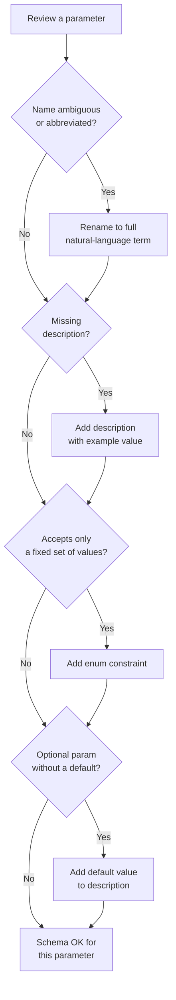

# Tool Schema Design: the Agent-Computer Interface

> A tool schema is a contract. Bad contracts produce bad calls.

**Type:** Build
**Languages:** Python
**Prerequisites:** 03-01 Function Calling Fundamentals
**Time:** ~60 min
**Learning Objectives:**
- Apply the 5 rules of good tool schema design
- Identify what makes a schema ambiguous and how to fix it
- Build a `validate_tool_call` function that catches errors before execution
- Generate production-quality schemas from Pydantic models with Field descriptions
- Write descriptions that guide the LLM to call correctly on the first try

---

## THE PROBLEM

An agent has one job: search a product catalog. It has a `search` tool. In testing, it works fine. In production, every third call fails.

The schema says `query` and `filters`. The LLM sends `q` and forgets `filters` entirely, or passes `filters` as a string instead of an object, or passes an integer where `limit` expects a string. Each failure wastes a full round-trip: the tool call goes out, the dispatch layer raises a TypeError, the error propagates back to the LLM, the LLM tries again. Three bad calls before a good one means 6 extra LLM API round-trips on a single user message.

The engineer who built the schema spent five minutes on it. They copied the parameter names from the internal Python function (`q` was the variable name in the legacy code) and wrote "search query" as the description for every field. The LLM never had enough signal to call it correctly.

This is the agent-computer interface problem. In human-facing APIs, a bad API name costs a developer time reading docs. In LLM-facing schemas, a bad name costs tokens, latency, and incorrect calls at runtime. The LLM has no out-of-band way to ask for clarification. It has only the schema.

---

## THE CONCEPT

### Tool Schemas Are the API Contract

When you expose a tool to an LLM, the schema is the entire specification. Unlike a human reading docs, the LLM cannot click a link, run a test call, or ask a colleague. It reads the schema and decides. Everything it needs to call your tool correctly must be in the schema itself.

The 5 rules of good tool schema design:

**Rule 1: One tool, one verb, one purpose.** A tool named `handle_request` that can search OR update OR delete is not a tool. It's a routing function. The LLM cannot reason about when to call it. Give each operation its own schema.

**Rule 2: Parameter names match natural language.** The LLM maps the user's words to your parameter names. If the user says "search for blue shoes" and your parameter is `q`, the LLM might infer the mapping, or it might not. `query` is unambiguous. `customer_id` is better than `cid`. `max_results` is better than `n`.

**Rule 3: Required vs. optional with sensible defaults.** Every required parameter the LLM gets wrong triggers a failure. Keep required parameters minimal. Add defaults for everything optional. State the default in the description.

**Rule 4: Enum constraints for categorical values.** If a parameter only accepts `"asc"` or `"desc"`, say so. An unconstrained string parameter invites creative values like `"ascending"`, `"DESCENDING"`, `"newest-first"`. An enum makes the contract explicit.

**Rule 5: Descriptions give examples, not just type names.** `"type": "string"` tells the LLM the type. It does not tell the LLM what format, what range, or what values are typical. `"description": "Search query string, e.g. 'blue running shoes under $100'"` gives the LLM a working mental model.

### Schema Quality Decision Tree



### Bad Schema vs. Good Schema

```
BAD SCHEMA                          GOOD SCHEMA
────────────────────────────────    ────────────────────────────────────────────
name: "search"                      name: "search_products"
description: "search"               description: "Search the product catalog.
                                      Use when user asks to find, browse, or
                                      look up products."

parameters:                         parameters:
  q: string                           query: string
  description: "query"                description: "Natural-language search
                                        query, e.g. 'blue running shoes
  n: integer                            under $100'"
  description: "number"
                                      max_results: integer
  sort: string                        description: "Max items to return.
  description: "sort order"            Default 10. Range 1-50."
                                      default: 10

  filters: string                     sort_by: string (enum)
  description: "filters"              description: "Sort order."
                                      enum: ["relevance", "price_asc",
                                             "price_desc", "newest"]
                                      default: "relevance"

                                      filters: object (optional)
                                      description: "Optional filter object.
                                        e.g. {min_price: 20, max_price: 100,
                                        category: 'footwear'}"
```

The bad schema produces calls like `{"q": "shoes", "n": 10, "sort": "new"}`.
The good schema produces calls like `{"query": "blue running shoes", "max_results": 10, "sort_by": "newest", "filters": {"max_price": 100}}`.

---

## BUILD IT

### Three Versions of the Same Schema

The clearest way to see what makes a schema bad is to compare three versions of the same tool and observe what the LLM does with each one.

```python
# Version 1: Bad
SCHEMA_V1 = {
    "name": "search",
    "description": "search products",
    "input_schema": {
        "type": "object",
        "properties": {
            "q":      {"type": "string"},
            "n":      {"type": "integer"},
            "sort":   {"type": "string"},
            "f":      {"type": "string"},
        },
        "required": ["q", "n", "sort", "f"],  # all required, no defaults
    },
}

# Version 2: Better (names fixed, descriptions added, required narrowed)
SCHEMA_V2 = {
    "name": "search_products",
    "description": "Search the product catalog.",
    "input_schema": {
        "type": "object",
        "properties": {
            "query": {
                "type": "string",
                "description": "The search query.",
            },
            "max_results": {
                "type": "integer",
                "description": "Maximum number of results. Default 10.",
            },
            "sort_by": {
                "type": "string",
                "description": "Sort order. Options: relevance, price_asc, price_desc, newest.",
            },
            "filters": {
                "type": "object",
                "description": "Optional filters.",
            },
        },
        "required": ["query"],
    },
}

# Version 3: Good (enum constraints, full descriptions with examples, clear defaults)
SCHEMA_V3 = {
    "name": "search_products",
    "description": (
        "Search the product catalog by keyword. "
        "Use this when the user wants to find, browse, or look up products. "
        "Do not use for order lookups or account information."
    ),
    "input_schema": {
        "type": "object",
        "properties": {
            "query": {
                "type": "string",
                "description": (
                    "Natural-language search query. "
                    "Examples: 'blue running shoes', 'waterproof jacket under $200', 'size 10 boots'."
                ),
            },
            "max_results": {
                "type": "integer",
                "description": "Maximum items to return. Default: 10. Range: 1 to 50.",
            },
            "sort_by": {
                "type": "string",
                "enum": ["relevance", "price_asc", "price_desc", "newest"],
                "description": (
                    "Sort order. Default: 'relevance'. "
                    "Use 'price_asc' for cheapest-first, 'price_desc' for most-expensive-first, "
                    "'newest' for recently added items."
                ),
            },
            "filters": {
                "type": "object",
                "description": (
                    "Optional filter criteria. All keys are optional. "
                    "Example: {\"min_price\": 20, \"max_price\": 150, \"category\": \"footwear\", \"in_stock\": true}."
                ),
                "properties": {
                    "min_price":  {"type": "number",  "description": "Minimum price in USD."},
                    "max_price":  {"type": "number",  "description": "Maximum price in USD."},
                    "category":   {"type": "string",  "description": "Product category, e.g. 'footwear', 'outerwear'."},
                    "in_stock":   {"type": "boolean", "description": "If true, return only in-stock items."},
                },
            },
        },
        "required": ["query"],
    },
}
```

### Tool Call Validator

A validator catches malformed calls before they hit your dispatch layer. It's a pre-flight check that keeps TypeErrors and KeyErrors out of your logs.

```python
import json
from typing import Any


def validate_tool_call(tool_input: dict, schema: dict) -> list[str]:
    """
    Validates a tool_input dict against the input_schema from a tool definition.
    Returns a list of error strings. Empty list means the call is valid.
    """
    errors: list[str] = []
    input_schema = schema.get("input_schema", {})
    properties = input_schema.get("properties", {})
    required_fields = input_schema.get("required", [])

    # Check required fields
    for field in required_fields:
        if field not in tool_input:
            errors.append(f"Missing required field: '{field}'")

    # Check each provided field
    for field, value in tool_input.items():
        if field not in properties:
            errors.append(f"Unknown field: '{field}'")
            continue

        prop_schema = properties[field]
        expected_type = prop_schema.get("type")

        # Type check
        type_map = {
            "string":  str,
            "integer": int,
            "number":  (int, float),
            "boolean": bool,
            "object":  dict,
            "array":   list,
        }
        if expected_type in type_map:
            expected_python_type = type_map[expected_type]
            if not isinstance(value, expected_python_type):
                errors.append(
                    f"Field '{field}': expected {expected_type}, "
                    f"got {type(value).__name__} ({value!r})"
                )

        # Enum check
        if "enum" in prop_schema and value not in prop_schema["enum"]:
            errors.append(
                f"Field '{field}': value {value!r} not in allowed values {prop_schema['enum']}"
            )

    return errors


def safe_dispatch(tool_name: str, tool_input: dict, schema: dict, fn: callable) -> str:
    """Validate first, then execute. Returns JSON string in both success and error cases."""
    errors = validate_tool_call(tool_input, schema)
    if errors:
        return json.dumps({
            "error": "Invalid tool call",
            "validation_errors": errors,
            "hint": "Check parameter names and types against the tool schema.",
        })
    try:
        result = fn(**tool_input)
        return json.dumps(result)
    except Exception as e:
        return json.dumps({"error": str(e), "type": type(e).__name__})
```

Running the validator on the bad-schema call from V1:

```python
bad_call = {"q": "blue shoes", "n": 10, "sort": "newest", "f": "{}"}
errors = validate_tool_call(bad_call, SCHEMA_V3)
# errors = ["Unknown field: 'q'", "Unknown field: 'n'", "Unknown field: 'sort'", "Unknown field: 'f'",
#            "Missing required field: 'query'"]

good_call = {"query": "blue running shoes", "sort_by": "price_asc", "max_results": 10}
errors = validate_tool_call(good_call, SCHEMA_V3)
# errors = []  # valid
```

> **Real-world check:** Your agent calls `search_products` with `sort_by="ascending"` instead of `sort_by="price_asc"`. The validator catches it. But if you hadn't added the enum constraint, what would have happened to that value when it reached your production search API?

Without the enum, your dispatch layer passes `"ascending"` to the search API. If the API doesn't recognize it, it either silently uses a default sort order (the LLM sees results but in wrong order, the user gets a subtly wrong answer) or raises an HTTP 400 (the error propagates back to the LLM, which retries with another guess). Either way you burn at least one extra round-trip. The enum makes the contract explicit so the LLM cannot generate an out-of-range value.

---

## USE IT

### Pydantic Models as the Single Source of Truth

Pydantic's `BaseModel` with `Field(description=...)` gives you the full benefit of V3 schema quality while writing idiomatic Python. The schema and the validation live in the same place.

```python
from pydantic import BaseModel, Field
from typing import Optional


class ProductFilters(BaseModel):
    min_price: Optional[float] = Field(None, description="Minimum price in USD.")
    max_price: Optional[float] = Field(None, description="Maximum price in USD.")
    category:  Optional[str]   = Field(None, description="Product category, e.g. 'footwear', 'outerwear'.")
    in_stock:  Optional[bool]  = Field(None, description="If true, return only in-stock items.")


class SearchProductsInput(BaseModel):
    query: str = Field(
        description=(
            "Natural-language search query. "
            "Examples: 'blue running shoes', 'waterproof jacket under $200'."
        )
    )
    max_results: int = Field(
        default=10,
        ge=1,
        le=50,
        description="Maximum items to return. Default: 10. Range: 1 to 50."
    )
    sort_by: str = Field(
        default="relevance",
        description="Sort order. One of: relevance, price_asc, price_desc, newest. Default: relevance."
    )
    filters: Optional[ProductFilters] = Field(
        None,
        description=(
            "Optional filter criteria. All subfields optional. "
            "Example: {min_price: 20, max_price: 150, category: 'footwear', in_stock: true}."
        )
    )


def make_tool_schema(name: str, description: str, input_model: type[BaseModel]) -> dict:
    """Generate a Claude-compatible tool schema from a Pydantic model."""
    schema = input_model.model_json_schema()
    schema.pop("title", None)
    # Move nested $defs inline if present (Pydantic v2 behavior for nested models)
    return {"name": name, "description": description, "input_schema": schema}


SEARCH_TOOL_SCHEMA = make_tool_schema(
    name="search_products",
    description=(
        "Search the product catalog by keyword. "
        "Use this when the user wants to find, browse, or look up products. "
        "Do not use for order lookups or account information."
    ),
    input_model=SearchProductsInput,
)
```

Lines of code comparison:

```
Raw dict schema (V3):   ~60 lines
Pydantic approach:      ~35 lines, with built-in validation via .model_validate()
```

Pydantic also gives you free input validation in your dispatch layer:

```python
def search_products_dispatch(raw_input: dict) -> str:
    try:
        # This validates types, required fields, and ge/le constraints in one call.
        validated = SearchProductsInput.model_validate(raw_input)
    except Exception as e:
        return json.dumps({"error": "Validation failed", "detail": str(e)})

    # Now call your real search function with the validated, typed input.
    return json.dumps(search_products_stub(validated))
```

> **Perspective shift:** A new engineer says "we can just let the dispatch layer raise TypeErrors and catch them. We don't need a validator or Pydantic." Under what conditions is that engineer right, and when does it break down?

For a one-tool prototype, catching TypeError and returning an error message is fine. It breaks down at three points: (1) when you have 10+ tools and need to know which schema rule is being violated without reading a stack trace; (2) when a silent wrong value (like `sort="ascending"` reaching the search API) produces bad results instead of an exception; and (3) when you want to log a structured error to Langfuse or Phoenix that shows which field was wrong and why, not just that an exception occurred.

---

## SHIP IT

The artifact this lesson produces is a prompt that reviews a tool schema and suggests improvements. See `outputs/prompt-tool-schema-review.md`.

Feed this prompt to Claude or GPT-4 along with any tool schema JSON. It returns a structured review covering all 5 rules, with specific rewrites for each problem it finds. Use it in code review before merging new tool schemas to production.

---

## EVALUATE IT

How do you know your tool schemas are production-quality?

**First-call success rate.** Log every tool call made by the LLM. Count how many succeed on the first call vs. require a retry because the LLM passed wrong arguments. A well-designed schema should achieve 95%+ first-call success on your most common user intents. Anything below 85% means the schema has an ambiguity problem.

**Parameter coverage.** For optional parameters with defaults, track how often the LLM provides them vs. relies on the default. If an important optional parameter (like `filters`) is never used even when the user's message clearly implies it, the description isn't clear enough about when to use it.

**Enum violation rate.** Track calls where a string parameter received a value that isn't in the enum (caught by your validator). High violation rate for a specific field means the enum values don't match the language the LLM naturally generates. Rename the enum values to match the LLM's natural language, not your internal naming convention.

**Schema review coverage.** Before shipping any new tool to production, run the `prompt-tool-schema-review.md` prompt on it and fix every HIGH severity finding. Make this a checklist item in your PR template.
