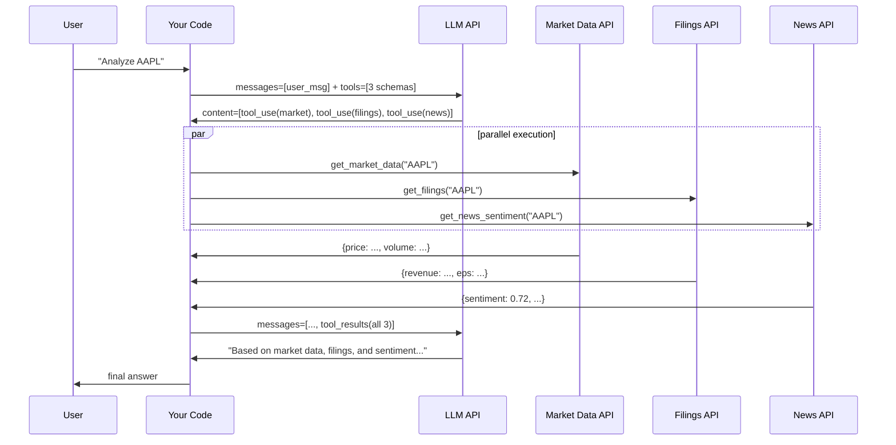

# استدعاءات الأدوات المتوازية والمتدفّقة (Parallel and Streaming Tool Calls)

> عندما تكون الاستدعاءات مستقلّة، شغّلها في الوقت نفسه.

**النوع:** بناء
**اللغات:** Python
**المتطلبات:** 03-01 أساسيات استدعاء الدوال
**الوقت:** ~45 دقيقة
**أهداف التعلّم:**
- اكتشاف متى يُرجع الـ LLM كتل tool_use متعددة في استجابة واحدة
- تنفيذ استدعاءات الأدوات المتوازية بالتزامن باستخدام asyncio.gather
- استخدام concurrent.futures.ThreadPoolExecutor للحالة المتزامنة (synchronous)
- التعامل مع استدعاءات الأدوات المتدفّقة (streaming) عبر حدث input_json_delta
- قياس فارق زمن الاستجابة بين التنفيذ التسلسلي والمتوازي

---

## المشكلة

وكيل بحثي يجيب عن أسئلة المحلّلين. يتطلّب كل استعلام بيانات من ثلاث واجهات API: بيانات السوق (1.2 ثانية)، وإفصاحات الشركة (0.9 ثانية)، وتحليل مشاعر الأخبار (1.4 ثانية). المهندس الذي بنى الوكيل لم يكن يعرف أن الـ LLM يستطيع طلب أدوات متعددة دفعة واحدة. لذا فإن حلقة التوزيع تستدعيها واحدة تلو الأخرى.

استعلام محلّل واحد يستغرق: 1.2ث + 0.9ث + 1.4ث = 3.5 ثوانٍ، إضافة إلى رحلتي LLM ذهابًا وإيابًا. يقدّم المحلّل 10 استعلامات في الجلسة. إجمالي الانتظار: أكثر من 35 ثانية.

استدعاءات الـ API الثلاثة كلها مستقلّة تمامًا. لا تعتمد على نتائج بعضها. لا يوجد سبب يمنعها من العمل في الوقت نفسه. العمل ذاته منفّذًا بالتوازي سيستغرق 1.4 ثانية (الأبطأ من الثلاثة)، لا 3.5 ثوانٍ. هذا تسريع بمعامل 2.5 من تغيير معماري واحد.

الـ LLM يدعم هذا بالفعل. عندما يحدّد أن استدعاءات أدوات متعددة مستقلّة، يستطيع إرجاعها جميعًا في استجابة واحدة على هيئة كتل tool_use منفصلة. إن كانت حلقة التوزيع لديك تعالج كتلة tool_use واحدة فقط في كل مرة، فأنت تترك ذلك التسريع على الأرض.

---

## المفهوم

### ميزتان، درس واحد

يغطّي هذا الدرس ميزتين منفصلتين تتعلّقان كلتاهما باستخلاص المزيد من استدعاءات الأدوات:

**استدعاءات الأدوات المتوازية:** يُرجع الـ LLM كتل tool_use متعددة في استجابة واحدة. منفّذك يشغّلها كلها بالتزامن. تجمع كل النتائج. ترسلها مرة أخرى في رسالة مستخدم واحدة.

**استدعاءات الأدوات المتدفّقة:** بدلًا من انتظار الاستجابة الكاملة قبل التصرّف، يدفّق الـ LLM مُخرجاته رمزًا برمز. تستقبل شفرتك أحداثًا تدريجية ويمكنها بدء معالجة مدخلات الأدوات قبل وصول الاستدعاء الكامل.

هاتان الميزتان مستقلّتان. يمكنك استخدام التنفيذ المتوازي دون تدفّق، أو التدفّق دون تنفيذ متوازٍ. في الوكلاء الإنتاجيين تريد عادةً كليهما.

### تدفّق استدعاء الأدوات المتوازي



### الخط الزمني: تسلسلي مقابل متوازٍ

```
SEQUENTIAL (3 tools, ~3.5s total API time)
─────────────────────────────────────────
Time:  0s      1.2s   2.1s       3.5s
       │        │      │          │
       ├──────────────►│          │
       │  market_data  │          │
       │               ├─────────►│
       │               │ filings  │
       │               │          ├──────────────►│
       │               │          │   news        │
       │               │          │              4.9s
                                                (3.5 + 2 LLM calls)

PARALLEL (3 tools, ~1.4s total API time)
─────────────────────────────────────────
Time:  0s                        1.4s
       │                          │
       ├──────────────►│          │  market_data (1.2s)
       ├─────────────────────►│   │  filings (0.9s)
       ├──────────────────────────►│  news (1.4s) <- slowest, sets the total
                                  │
                                 All 3 done. Send combined results.
```

الفكرة المحورية: زمن التنفيذ المتوازي الكلي يساوي أبطأ استدعاء منفرد، لا مجموعها.

---

## البناء

### الخطوة 1: استدعاءات الأدوات المتوازية مع asyncio

الموزّع غير المتزامن (async dispatcher) يشغّل كل كتل tool_use بالتزامن وينتظر اكتمالها جميعًا.

```python
import asyncio
import anthropic
import json
import time

client = anthropic.Anthropic()

# Tool schemas
TOOLS = [
    {
        "name": "get_market_data",
        "description": "Fetch current market data for a stock ticker. Returns price, volume, and change.",
        "input_schema": {
            "type": "object",
            "properties": {
                "ticker": {"type": "string", "description": "Stock ticker symbol, e.g. 'AAPL', 'MSFT'."}
            },
            "required": ["ticker"]
        }
    },
    {
        "name": "get_company_filings",
        "description": "Retrieve recent financial filings for a company. Returns revenue, EPS, and guidance.",
        "input_schema": {
            "type": "object",
            "properties": {
                "ticker": {"type": "string", "description": "Stock ticker symbol."}
            },
            "required": ["ticker"]
        }
    },
    {
        "name": "get_news_sentiment",
        "description": "Get news sentiment score for a company over the past 7 days. Returns score from -1.0 to 1.0.",
        "input_schema": {
            "type": "object",
            "properties": {
                "ticker": {"type": "string", "description": "Stock ticker symbol."}
            },
            "required": ["ticker"]
        }
    }
]


# Stub functions with artificial delays (simulates real API latency)
async def get_market_data(ticker: str) -> dict:
    await asyncio.sleep(1.2)  # Simulate 1.2s API call
    return {
        "ticker": ticker,
        "price": 189.30,
        "change_pct": -0.8,
        "volume": 54_210_000,
        "market_cap_b": 2_890,
    }


async def get_company_filings(ticker: str) -> dict:
    await asyncio.sleep(0.9)  # Simulate 0.9s API call
    return {
        "ticker": ticker,
        "quarter": "Q1 2026",
        "revenue_b": 124.3,
        "eps": 2.18,
        "yoy_revenue_growth_pct": 8.2,
        "guidance": "Q2 revenue $128-132B",
    }


async def get_news_sentiment(ticker: str) -> dict:
    await asyncio.sleep(1.4)  # Simulate 1.4s API call
    return {
        "ticker": ticker,
        "sentiment_score": 0.72,
        "sentiment_label": "positive",
        "article_count": 47,
        "top_topics": ["earnings beat", "AI features", "market share"],
    }


ASYNC_FUNCTION_MAP = {
    "get_market_data": get_market_data,
    "get_company_filings": get_company_filings,
    "get_news_sentiment": get_news_sentiment,
}


async def dispatch_parallel(tool_uses: list) -> list[dict]:
    """
    Execute all tool_use blocks concurrently.
    Returns a list of tool_result dicts ready to send to the LLM.
    """
    async def execute_one(tool_use) -> dict:
        fn = ASYNC_FUNCTION_MAP.get(tool_use.name)
        if fn is None:
            result = {"error": f"Unknown tool: {tool_use.name!r}"}
        else:
            result = await fn(**tool_use.input)
        return {
            "type": "tool_result",
            "tool_use_id": tool_use.id,
            "content": json.dumps(result),
        }

    # asyncio.gather runs all coroutines concurrently.
    results = await asyncio.gather(*[execute_one(tu) for tu in tool_uses])
    return list(results)


async def run_parallel_tools(user_message: str) -> str:
    """Full dispatch loop with parallel tool execution."""
    messages = [{"role": "user", "content": user_message}]

    t0 = time.perf_counter()

    response = client.messages.create(
        model="claude-3-5-haiku-20241022",
        max_tokens=1024,
        tools=TOOLS,
        messages=messages,
    )

    if response.stop_reason == "end_turn":
        return response.content[0].text

    tool_uses = [b for b in response.content if b.type == "tool_use"]
    print(f"  [parallel] LLM requested {len(tool_uses)} tool call(s)")

    messages.append({"role": "assistant", "content": response.content})

    t1 = time.perf_counter()
    tool_results = await dispatch_parallel(tool_uses)
    t2 = time.perf_counter()

    print(f"  [parallel] Executed {len(tool_uses)} tools in {t2 - t1:.2f}s (parallel)")

    messages.append({"role": "user", "content": tool_results})

    final_response = client.messages.create(
        model="claude-3-5-haiku-20241022",
        max_tokens=1024,
        tools=TOOLS,
        messages=messages,
    )

    total = time.perf_counter() - t0
    print(f"  [parallel] Total round-trip: {total:.2f}s")

    return next((b.text for b in final_response.content if hasattr(b, "text")), "")
```

> **اختبار من الواقع:** في هذا الإعداد، يكون زمن التنفيذ المتوازي محدودًا بالأداة الأبطأ (1.4 ثانية). إن كانت أداة واحدة تستغرق باستمرار 10 ثوانٍ بينما تستغرق الأخريات ثانية واحدة، فما الذي ستفكّر فيه قبل إبقائها في الدفعة المتوازية نفسها؟

إن هيمنت أداة واحدة على زمن الاستجابة، فستفكّر في: (1) ما إذا كانت الأداة البطيئة ضرورية دائمًا أم يمكن استدعاؤها فقط عندما يحتاج المستخدم تلك البيانات تحديدًا؛ (2) ما إذا كان للأداة البطيئة نسخة تقريبية أسرع يمكن استخدامها أولًا، مع استدعاء النسخة الكاملة فقط عند الحاجة؛ (3) ما إذا كان بالإمكان تخزين نتائج الأداة البطيئة مؤقتًا (cache) كي لا تنتظر الاستدعاءات اللاحقة إطلاقًا. التنفيذ المتوازي هو الخيار الافتراضي الصحيح، لكن تحليل زمن الاستجابة على مستوى الأداة هو ما يجد لك التحسين التالي.

---

### الخطوة 2: التنفيذ المتوازي المتزامن مع ThreadPoolExecutor

للشفرة غير المعتمدة على async، يمنحك `concurrent.futures.ThreadPoolExecutor` توازيًا قائمًا على الخيوط (thread-based) بواجهة متزامنة.

```python
import concurrent.futures
import time
import json


# Sync versions of the stub functions (for the ThreadPoolExecutor demo)
def get_market_data_sync(ticker: str) -> dict:
    time.sleep(1.2)
    return {"ticker": ticker, "price": 189.30, "change_pct": -0.8, "volume": 54_210_000}


def get_company_filings_sync(ticker: str) -> dict:
    time.sleep(0.9)
    return {"ticker": ticker, "quarter": "Q1 2026", "revenue_b": 124.3, "eps": 2.18}


def get_news_sentiment_sync(ticker: str) -> dict:
    time.sleep(1.4)
    return {"ticker": ticker, "sentiment_score": 0.72, "sentiment_label": "positive"}


SYNC_FUNCTION_MAP = {
    "get_market_data":      get_market_data_sync,
    "get_company_filings":  get_company_filings_sync,
    "get_news_sentiment":   get_news_sentiment_sync,
}


def dispatch_parallel_sync(tool_uses: list) -> list[dict]:
    """
    Execute tool calls concurrently using a thread pool.
    Returns tool_result dicts ready to send to the LLM.
    """
    def execute_one(tool_use) -> dict:
        fn = SYNC_FUNCTION_MAP.get(tool_use.name)
        result = fn(**tool_use.input) if fn else {"error": f"Unknown tool: {tool_use.name!r}"}
        return {
            "type": "tool_result",
            "tool_use_id": tool_use.id,
            "content": json.dumps(result),
        }

    # max_workers = number of tool calls (one thread per call)
    with concurrent.futures.ThreadPoolExecutor(max_workers=len(tool_uses)) as executor:
        futures = [executor.submit(execute_one, tu) for tu in tool_uses]
        results = [f.result() for f in concurrent.futures.as_completed(futures)]

    return results
```

### الخطوة 3: استدعاءات الأدوات المتدفّقة (Streaming Tool Calls)

تسلّم واجهة التدفّق (streaming API) JSON الخاص باستدعاء الأداة تدريجيًا عبر أحداث `input_json_delta`. يتيح لك هذا رؤية الاستدعاء وهو يتشكّل قبل اكتماله.

```python
def run_streaming_tools(user_message: str) -> str:
    """
    Demonstrate streaming tool call detection.
    Accumulates tool_input JSON from input_json_delta events.
    Returns the complete tool calls once the stream ends.
    """
    tool_calls_in_progress: dict[str, dict] = {}  # id -> {name, accumulated_input_json}
    completed_tool_uses = []

    print(f"\n[stream] Streaming response for: {user_message!r}")

    with client.messages.stream(
        model="claude-3-5-haiku-20241022",
        max_tokens=1024,
        tools=TOOLS,
        messages=[{"role": "user", "content": user_message}],
    ) as stream:
        for event in stream:
            event_type = type(event).__name__

            # A new tool call block is starting
            if event_type == "ContentBlockStart":
                block = event.content_block
                if hasattr(block, "type") and block.type == "tool_use":
                    tool_calls_in_progress[block.id] = {
                        "id":   block.id,
                        "name": block.name,
                        "accumulated_json": "",
                    }
                    print(f"  [stream] Tool call starting: {block.name} (id={block.id[:12]}...)")

            # Incremental JSON for a tool call input
            elif event_type == "InputJsonEvent":
                for tool_id, call_data in tool_calls_in_progress.items():
                    # InputJsonEvent carries a partial_json string
                    if hasattr(event, "partial_json"):
                        call_data["accumulated_json"] += event.partial_json

            # A content block has finished
            elif event_type == "ContentBlockStop":
                # Check if any in-progress tool call is now complete
                for tool_id, call_data in list(tool_calls_in_progress.items()):
                    if call_data["accumulated_json"]:
                        try:
                            parsed_input = json.loads(call_data["accumulated_json"])
                            print(f"  [stream] Tool call complete: {call_data['name']}({parsed_input})")
                            completed_tool_uses.append({
                                "id":    call_data["id"],
                                "name":  call_data["name"],
                                "input": parsed_input,
                            })
                        except json.JSONDecodeError:
                            pass  # Block wasn't a tool call

    # Get the final message (includes all content blocks)
    final_message = stream.get_final_message()
    tool_use_blocks = [b for b in final_message.content if b.type == "tool_use"]

    print(f"  [stream] {len(tool_use_blocks)} tool call(s) detected via streaming")
    return tool_use_blocks
```

---

## الاستخدام

### ThreadPoolExecutor مقابل asyncio: متى تستخدم كلًّا منهما

تحقّق مقاربة `ThreadPoolExecutor` المتزامنة ومقاربة `asyncio.gather` غير المتزامنة كلتاهما التوازي. يعتمد الخيار على شفرتك البرمجية، لا على فروق الأداء للأدوات المقيّدة بالإدخال/الإخراج (I/O-bound).

```python
# Use asyncio.gather when:
# - Your codebase is already async (FastAPI, aiohttp, etc.)
# - Your tool functions make async HTTP calls (aiohttp, httpx with async)
# - You want fine-grained control over timeouts and cancellation

# asyncio with timeout per tool
async def dispatch_parallel_with_timeout(tool_uses: list, timeout_secs: float = 5.0) -> list[dict]:
    async def execute_with_timeout(tool_use) -> dict:
        try:
            fn = ASYNC_FUNCTION_MAP[tool_use.name]
            result = await asyncio.wait_for(fn(**tool_use.input), timeout=timeout_secs)
        except asyncio.TimeoutError:
            result = {"error": f"Tool {tool_use.name!r} timed out after {timeout_secs}s",
                      "hint": "Try again or request less data."}
        except Exception as e:
            result = {"error": str(e), "type": type(e).__name__}
        return {
            "type": "tool_result",
            "tool_use_id": tool_use.id,
            "content": json.dumps(result),
        }

    return list(await asyncio.gather(*[execute_with_timeout(tu) for tu in tool_uses]))


# Use ThreadPoolExecutor when:
# - Your codebase is synchronous (standard Flask, script, CLI tool)
# - Your tool functions use requests, boto3, or other sync I/O libraries
# - You're adding parallelism to an existing sync agent without async refactor

# ThreadPoolExecutor with timeout
def dispatch_parallel_sync_timeout(tool_uses: list, timeout_secs: float = 5.0) -> list[dict]:
    def execute_one(tool_use) -> dict:
        fn = SYNC_FUNCTION_MAP.get(tool_use.name)
        if fn is None:
            return {"type": "tool_result", "tool_use_id": tool_use.id,
                    "content": json.dumps({"error": f"Unknown tool: {tool_use.name!r}"})}
        try:
            result = fn(**tool_use.input)
            return {"type": "tool_result", "tool_use_id": tool_use.id,
                    "content": json.dumps(result)}
        except Exception as e:
            return {"type": "tool_result", "tool_use_id": tool_use.id,
                    "content": json.dumps({"error": str(e)})}

    results = []
    with concurrent.futures.ThreadPoolExecutor(max_workers=len(tool_uses)) as executor:
        future_to_tu = {executor.submit(execute_one, tu): tu for tu in tool_uses}
        for future in concurrent.futures.as_completed(future_to_tu, timeout=timeout_secs):
            results.append(future.result())

    return results
```

> **نقلة في المنظور:** يقول مهندس أقدم: "استدعاءات الأدوات المتوازية تحسين سابق لأوانه (premature optimization) لمعظم الوكلاء." في أي شروط توافقه، ومتى يصبح التنفيذ المتوازي الخيار الافتراضي؟

توافقه عندما: يقوم الوكيل باستدعاء أداة واحد على الأكثر في كل دور، وتكتمل الأدوات في أقل من 0.5 ثانية. في تلك الحالة، لا يستحقّ تعقيد التوزيع غير المتزامن العناء. وتختلف معه (التوازي هو الافتراضي) عندما: يطلب الوكيل بانتظام أداتين مستقلّتين فأكثر في كل دور، أو يكون للأدوات زمن استجابة غير متوقّع (واجهات API خارجية)، أو تُقاس اتفاقية مستوى الخدمة (SLA) لديك بالثواني. لوكلاء البحث، أو مولّدات التقارير، أو أي وكيل يجمّع بيانات من مصادر متعددة، التنفيذ المتوازي ليس سابقًا لأوانه، بل هو الحدّ الأدنى المطلوب.

---

## التسليم

المنتَج (artifact) الذي ينتجه هذا الدرس هو قالب لمنفّذ أدوات متوازٍ. انظر `outputs/skill-parallel-tool-calls.md`.

يغطّي القالب كلا النمطين، غير المتزامن (asyncio.gather) والمتزامن (ThreadPoolExecutor)، مع معالجة المهلة الزمنية (timeout) ومُخرج خطأ منظّم لكل استدعاء فاشل. أسقطه في أي حلقة توزيع وكيل قد تُطلب فيها أدوات متعددة في كل دور.

---

## التقييم

كيف تعرف أن تنفيذك المتوازي يعمل فعليًا؟

**سجلّات زمن التنفيذ.** أضف `time.perf_counter()` قبل وبعد `asyncio.gather` أو `ThreadPoolExecutor`. لدفعة من 3 أدوات بأزمنة استجابة 1.2ث و0.9ث و1.4ث، ينبغي أن يكتمل التنفيذ المتوازي في نحو 1.4-1.6 ثانية. التسلسلي سيكون 3.5 ثوانٍ. إن تجاوز زمنك المتوازي الأداة الأبطأ بأكثر من 200ms، فهناك شيء يُنفَّذ تسلسليًا.

**أثر التزامن (Concurrency trace).** سجّل طوابع زمن البدء والانتهاء لكل استدعاء أداة. ارسمها على خط زمني. ينبغي أن تتداخل الاستدعاءات الثلاثة كلها. إن كانت متراصّة (كل واحد يبدأ بعد انتهاء السابق)، فالمنفّذ تسلسلي رغم استخدام تجمّع (pool).

**معدّل الاستدعاء المتوازي.** تتبّع ما نسبة استجابات الـ LLM التي تحتوي على كتلتي tool_use فأكثر. لوكيل بحثي بثلاثة مصادر بيانات، ينبغي أن تقترب هذه النسبة من 100% عندما يسأل المستخدم سؤالًا شاملًا. إن كان الـ LLM يقوم باستدعاء أداة واحد في كل استجابة (تسلسلي بتصميم الـ LLM)، فأعد النظر في system prompt: أخبر النموذج صراحةً أنه ينبغي أن يطلب كل مصادر البيانات المستقلّة في استجابة واحدة كلما أمكن.

**تغطية المهلة الزمنية (Timeout coverage).** احقن تأخيرًا متعمّدًا بمقدار 10 ثوانٍ في إحدى الدوال البديلة. تحقّق من أن المهلة تنطلق عند الحدّ الذي ضبطته (مثلًا 5 ثوانٍ) وأن الخطأ المنظّم ينتشر عائدًا إلى الـ LLM بوصفه tool_result، لا بوصفه استثناءً غير ملتقَط.
