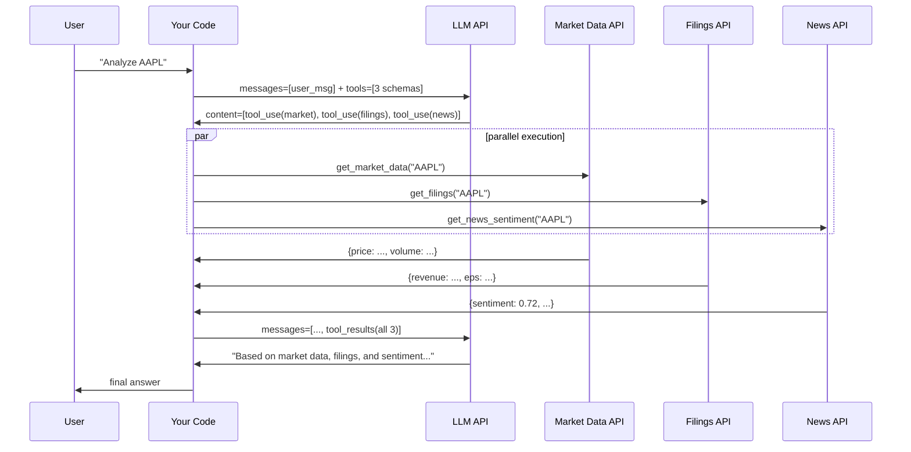

# Parallel and Streaming Tool Calls

> When the calls are independent, run them at the same time.

**Type:** Build
**Languages:** Python
**Prerequisites:** 03-01 Function Calling Fundamentals
**Time:** ~45 min
**Learning Objectives:**
- Detect when the LLM returns multiple tool_use blocks in one response
- Execute parallel tool calls concurrently using asyncio.gather
- Use concurrent.futures.ThreadPoolExecutor for the synchronous case
- Handle streaming tool calls with the input_json_delta event
- Measure the latency difference between sequential and parallel execution

---

## THE PROBLEM

A research agent answers analyst questions. Each query requires data from three APIs: market data (1.2 seconds), company filings (0.9 seconds), and news sentiment (1.4 seconds). The engineer who built the agent didn't know that the LLM can request multiple tools at once. So the dispatch loop calls them one at a time.

One analyst query takes: 1.2s + 0.9s + 1.4s = 3.5 seconds, plus two LLM round-trips. The analyst submits 10 queries in a session. Total wait: 35+ seconds.

All three API calls are completely independent. They don't depend on each other's results. There is no reason they can't run at the same time. The same work done in parallel would take 1.4 seconds (the slowest of the three), not 3.5 seconds. That's a 2.5x speedup from one architectural change.

The LLM already supports this. When it determines that multiple tool calls are independent, it can return all of them in a single response as separate tool_use blocks. If your dispatch loop only handles one tool_use block at a time, you're leaving that speedup on the floor.

---

## THE CONCEPT

### Two Features, One Lesson

This lesson covers two separate features that both involve getting more out of tool calls:

**Parallel tool calls:** The LLM returns multiple tool_use blocks in one response. Your executor runs all of them concurrently. You collect all results. You send them back in one user message.

**Streaming tool calls:** Instead of waiting for the full response before acting, the LLM streams its output token by token. Your code receives incremental events and can begin processing tool inputs before the full call arrives.

These features are independent. You can use parallel execution without streaming, or stream without parallel execution. In production agents you typically want both.

### Parallel Tool Call Flow



### Sequential vs. Parallel Timeline

```
SEQUENTIAL (3 tools, ~3.5s total API time)
─────────────────────────────────────────
Time:  0s      1.2s   2.1s       3.5s
       │        │      │          │
       ├──────────────►│          │
       │  market_data  │          │
       │               ├─────────►│
       │               │ filings  │
       │               │          ├──────────────►│
       │               │          │   news        │
       │               │          │              4.9s
                                                (3.5 + 2 LLM calls)

PARALLEL (3 tools, ~1.4s total API time)
─────────────────────────────────────────
Time:  0s                        1.4s
       │                          │
       ├──────────────►│          │  market_data (1.2s)
       ├─────────────────────►│   │  filings (0.9s)
       ├──────────────────────────►│  news (1.4s) <- slowest, sets the total
                                  │
                                 All 3 done. Send combined results.
```

The key insight: parallel total time equals the slowest individual call, not the sum.

---

## BUILD IT

### Step 1: Parallel Tool Calls with asyncio

The async dispatcher runs all tool_use blocks concurrently and waits for all of them to complete.

```python
import asyncio
import anthropic
import json
import time

client = anthropic.Anthropic()

# Tool schemas
TOOLS = [
    {
        "name": "get_market_data",
        "description": "Fetch current market data for a stock ticker. Returns price, volume, and change.",
        "input_schema": {
            "type": "object",
            "properties": {
                "ticker": {"type": "string", "description": "Stock ticker symbol, e.g. 'AAPL', 'MSFT'."}
            },
            "required": ["ticker"]
        }
    },
    {
        "name": "get_company_filings",
        "description": "Retrieve recent financial filings for a company. Returns revenue, EPS, and guidance.",
        "input_schema": {
            "type": "object",
            "properties": {
                "ticker": {"type": "string", "description": "Stock ticker symbol."}
            },
            "required": ["ticker"]
        }
    },
    {
        "name": "get_news_sentiment",
        "description": "Get news sentiment score for a company over the past 7 days. Returns score from -1.0 to 1.0.",
        "input_schema": {
            "type": "object",
            "properties": {
                "ticker": {"type": "string", "description": "Stock ticker symbol."}
            },
            "required": ["ticker"]
        }
    }
]


# Stub functions with artificial delays (simulates real API latency)
async def get_market_data(ticker: str) -> dict:
    await asyncio.sleep(1.2)  # Simulate 1.2s API call
    return {
        "ticker": ticker,
        "price": 189.30,
        "change_pct": -0.8,
        "volume": 54_210_000,
        "market_cap_b": 2_890,
    }


async def get_company_filings(ticker: str) -> dict:
    await asyncio.sleep(0.9)  # Simulate 0.9s API call
    return {
        "ticker": ticker,
        "quarter": "Q1 2026",
        "revenue_b": 124.3,
        "eps": 2.18,
        "yoy_revenue_growth_pct": 8.2,
        "guidance": "Q2 revenue $128-132B",
    }


async def get_news_sentiment(ticker: str) -> dict:
    await asyncio.sleep(1.4)  # Simulate 1.4s API call
    return {
        "ticker": ticker,
        "sentiment_score": 0.72,
        "sentiment_label": "positive",
        "article_count": 47,
        "top_topics": ["earnings beat", "AI features", "market share"],
    }


ASYNC_FUNCTION_MAP = {
    "get_market_data": get_market_data,
    "get_company_filings": get_company_filings,
    "get_news_sentiment": get_news_sentiment,
}


async def dispatch_parallel(tool_uses: list) -> list[dict]:
    """
    Execute all tool_use blocks concurrently.
    Returns a list of tool_result dicts ready to send to the LLM.
    """
    async def execute_one(tool_use) -> dict:
        fn = ASYNC_FUNCTION_MAP.get(tool_use.name)
        if fn is None:
            result = {"error": f"Unknown tool: {tool_use.name!r}"}
        else:
            result = await fn(**tool_use.input)
        return {
            "type": "tool_result",
            "tool_use_id": tool_use.id,
            "content": json.dumps(result),
        }

    # asyncio.gather runs all coroutines concurrently.
    results = await asyncio.gather(*[execute_one(tu) for tu in tool_uses])
    return list(results)


async def run_parallel_tools(user_message: str) -> str:
    """Full dispatch loop with parallel tool execution."""
    messages = [{"role": "user", "content": user_message}]

    t0 = time.perf_counter()

    response = client.messages.create(
        model="claude-3-5-haiku-20241022",
        max_tokens=1024,
        tools=TOOLS,
        messages=messages,
    )

    if response.stop_reason == "end_turn":
        return response.content[0].text

    tool_uses = [b for b in response.content if b.type == "tool_use"]
    print(f"  [parallel] LLM requested {len(tool_uses)} tool call(s)")

    messages.append({"role": "assistant", "content": response.content})

    t1 = time.perf_counter()
    tool_results = await dispatch_parallel(tool_uses)
    t2 = time.perf_counter()

    print(f"  [parallel] Executed {len(tool_uses)} tools in {t2 - t1:.2f}s (parallel)")

    messages.append({"role": "user", "content": tool_results})

    final_response = client.messages.create(
        model="claude-3-5-haiku-20241022",
        max_tokens=1024,
        tools=TOOLS,
        messages=messages,
    )

    total = time.perf_counter() - t0
    print(f"  [parallel] Total round-trip: {total:.2f}s")

    return next((b.text for b in final_response.content if hasattr(b, "text")), "")
```

> **Real-world check:** In this setup, the parallel execution time is bounded by the slowest tool (1.4 seconds). If one tool consistently takes 10 seconds while the others take 1 second, what would you consider before keeping them in the same parallel batch?

If one tool dominates the latency, you'd consider: (1) whether the slow tool is always necessary or can be called only when the user specifically needs that data; (2) whether the slow tool has a faster approximate version that could be used first, with the full version called only if needed; (3) whether the slow tool's results can be cached so subsequent calls don't wait at all. Parallel execution is the right default, but tool-level latency profiling is how you find the next optimization.

---

### Step 2: Synchronous Parallel Execution with ThreadPoolExecutor

For code that isn't async, `concurrent.futures.ThreadPoolExecutor` gives you thread-based parallelism with a synchronous API.

```python
import concurrent.futures
import time
import json


# Sync versions of the stub functions (for the ThreadPoolExecutor demo)
def get_market_data_sync(ticker: str) -> dict:
    time.sleep(1.2)
    return {"ticker": ticker, "price": 189.30, "change_pct": -0.8, "volume": 54_210_000}


def get_company_filings_sync(ticker: str) -> dict:
    time.sleep(0.9)
    return {"ticker": ticker, "quarter": "Q1 2026", "revenue_b": 124.3, "eps": 2.18}


def get_news_sentiment_sync(ticker: str) -> dict:
    time.sleep(1.4)
    return {"ticker": ticker, "sentiment_score": 0.72, "sentiment_label": "positive"}


SYNC_FUNCTION_MAP = {
    "get_market_data":      get_market_data_sync,
    "get_company_filings":  get_company_filings_sync,
    "get_news_sentiment":   get_news_sentiment_sync,
}


def dispatch_parallel_sync(tool_uses: list) -> list[dict]:
    """
    Execute tool calls concurrently using a thread pool.
    Returns tool_result dicts ready to send to the LLM.
    """
    def execute_one(tool_use) -> dict:
        fn = SYNC_FUNCTION_MAP.get(tool_use.name)
        result = fn(**tool_use.input) if fn else {"error": f"Unknown tool: {tool_use.name!r}"}
        return {
            "type": "tool_result",
            "tool_use_id": tool_use.id,
            "content": json.dumps(result),
        }

    # max_workers = number of tool calls (one thread per call)
    with concurrent.futures.ThreadPoolExecutor(max_workers=len(tool_uses)) as executor:
        futures = [executor.submit(execute_one, tu) for tu in tool_uses]
        results = [f.result() for f in concurrent.futures.as_completed(futures)]

    return results
```

### Step 3: Streaming Tool Calls

The streaming API delivers tool call JSON incrementally via `input_json_delta` events. This lets you see the call forming before it's complete.

```python
def run_streaming_tools(user_message: str) -> str:
    """
    Demonstrate streaming tool call detection.
    Accumulates tool_input JSON from input_json_delta events.
    Returns the complete tool calls once the stream ends.
    """
    tool_calls_in_progress: dict[str, dict] = {}  # id -> {name, accumulated_input_json}
    completed_tool_uses = []

    print(f"\n[stream] Streaming response for: {user_message!r}")

    with client.messages.stream(
        model="claude-3-5-haiku-20241022",
        max_tokens=1024,
        tools=TOOLS,
        messages=[{"role": "user", "content": user_message}],
    ) as stream:
        for event in stream:
            event_type = type(event).__name__

            # A new tool call block is starting
            if event_type == "ContentBlockStart":
                block = event.content_block
                if hasattr(block, "type") and block.type == "tool_use":
                    tool_calls_in_progress[block.id] = {
                        "id":   block.id,
                        "name": block.name,
                        "accumulated_json": "",
                    }
                    print(f"  [stream] Tool call starting: {block.name} (id={block.id[:12]}...)")

            # Incremental JSON for a tool call input
            elif event_type == "InputJsonEvent":
                for tool_id, call_data in tool_calls_in_progress.items():
                    # InputJsonEvent carries a partial_json string
                    if hasattr(event, "partial_json"):
                        call_data["accumulated_json"] += event.partial_json

            # A content block has finished
            elif event_type == "ContentBlockStop":
                # Check if any in-progress tool call is now complete
                for tool_id, call_data in list(tool_calls_in_progress.items()):
                    if call_data["accumulated_json"]:
                        try:
                            parsed_input = json.loads(call_data["accumulated_json"])
                            print(f"  [stream] Tool call complete: {call_data['name']}({parsed_input})")
                            completed_tool_uses.append({
                                "id":    call_data["id"],
                                "name":  call_data["name"],
                                "input": parsed_input,
                            })
                        except json.JSONDecodeError:
                            pass  # Block wasn't a tool call

    # Get the final message (includes all content blocks)
    final_message = stream.get_final_message()
    tool_use_blocks = [b for b in final_message.content if b.type == "tool_use"]

    print(f"  [stream] {len(tool_use_blocks)} tool call(s) detected via streaming")
    return tool_use_blocks
```

---

## USE IT

### ThreadPoolExecutor vs asyncio: When to Use Each

The synchronous `ThreadPoolExecutor` approach and the async `asyncio.gather` approach both achieve parallelism. The choice depends on your codebase, not on performance differences for I/O-bound tools.

```python
# Use asyncio.gather when:
# - Your codebase is already async (FastAPI, aiohttp, etc.)
# - Your tool functions make async HTTP calls (aiohttp, httpx with async)
# - You want fine-grained control over timeouts and cancellation

# asyncio with timeout per tool
async def dispatch_parallel_with_timeout(tool_uses: list, timeout_secs: float = 5.0) -> list[dict]:
    async def execute_with_timeout(tool_use) -> dict:
        try:
            fn = ASYNC_FUNCTION_MAP[tool_use.name]
            result = await asyncio.wait_for(fn(**tool_use.input), timeout=timeout_secs)
        except asyncio.TimeoutError:
            result = {"error": f"Tool {tool_use.name!r} timed out after {timeout_secs}s",
                      "hint": "Try again or request less data."}
        except Exception as e:
            result = {"error": str(e), "type": type(e).__name__}
        return {
            "type": "tool_result",
            "tool_use_id": tool_use.id,
            "content": json.dumps(result),
        }

    return list(await asyncio.gather(*[execute_with_timeout(tu) for tu in tool_uses]))


# Use ThreadPoolExecutor when:
# - Your codebase is synchronous (standard Flask, script, CLI tool)
# - Your tool functions use requests, boto3, or other sync I/O libraries
# - You're adding parallelism to an existing sync agent without async refactor

# ThreadPoolExecutor with timeout
def dispatch_parallel_sync_timeout(tool_uses: list, timeout_secs: float = 5.0) -> list[dict]:
    def execute_one(tool_use) -> dict:
        fn = SYNC_FUNCTION_MAP.get(tool_use.name)
        if fn is None:
            return {"type": "tool_result", "tool_use_id": tool_use.id,
                    "content": json.dumps({"error": f"Unknown tool: {tool_use.name!r}"})}
        try:
            result = fn(**tool_use.input)
            return {"type": "tool_result", "tool_use_id": tool_use.id,
                    "content": json.dumps(result)}
        except Exception as e:
            return {"type": "tool_result", "tool_use_id": tool_use.id,
                    "content": json.dumps({"error": str(e)})}

    results = []
    with concurrent.futures.ThreadPoolExecutor(max_workers=len(tool_uses)) as executor:
        future_to_tu = {executor.submit(execute_one, tu): tu for tu in tool_uses}
        for future in concurrent.futures.as_completed(future_to_tu, timeout=timeout_secs):
            results.append(future.result())

    return results
```

> **Perspective shift:** A senior engineer says "parallel tool calls are a premature optimization for most agents." Under what conditions would you agree, and when would parallel execution become the default choice?

Agree when: the agent makes at most one tool call per turn and the tools complete in under 0.5 seconds. In that case, the complexity of async dispatch is not worth it. Disagree (parallel is the default) when: the agent regularly requests 2+ independent tools per turn, tools have unpredictable latency (external APIs), or your SLA is measured in seconds. For research agents, report generators, or any agent that aggregates data from multiple sources, parallel execution is not premature, it's table stakes.

---

## SHIP IT

The artifact this lesson produces is a parallel tool executor template. See `outputs/skill-parallel-tool-calls.md`.

The template covers both the async (asyncio.gather) and sync (ThreadPoolExecutor) patterns, with timeout handling and structured error output for each failed call. Drop it into any agent dispatch loop where multiple tools may be requested per turn.

---

## EVALUATE IT

How do you know your parallel execution is actually working?

**Execution time logs.** Add `time.perf_counter()` before and after `asyncio.gather` or `ThreadPoolExecutor`. For a 3-tool batch with 1.2s, 0.9s, 1.4s latencies, parallel execution should complete in approximately 1.4-1.6 seconds. Sequential would be 3.5 seconds. If your parallel time exceeds the slowest tool by more than 200ms, something is executing sequentially.

**Concurrency trace.** Log start and end timestamps per tool call. Plot them on a timeline. All three calls should overlap. If they're stacked (each starts after the previous ends), the executor is sequential despite using a pool.

**Parallel call rate.** Track what fraction of LLM responses contain 2+ tool_use blocks. For a research agent with 3 data sources, this should be near 100% when the user asks a comprehensive question. If the LLM is making one tool call per response (sequential by LLM design), revisit your system prompt: explicitly tell the model it should request all independent data sources in a single response when possible.

**Timeout coverage.** Inject a deliberate 10-second delay into one stub function. Verify that the timeout fires at your configured limit (e.g., 5 seconds) and that the structured error propagates back to the LLM as a tool_result, not as an uncaught exception.
