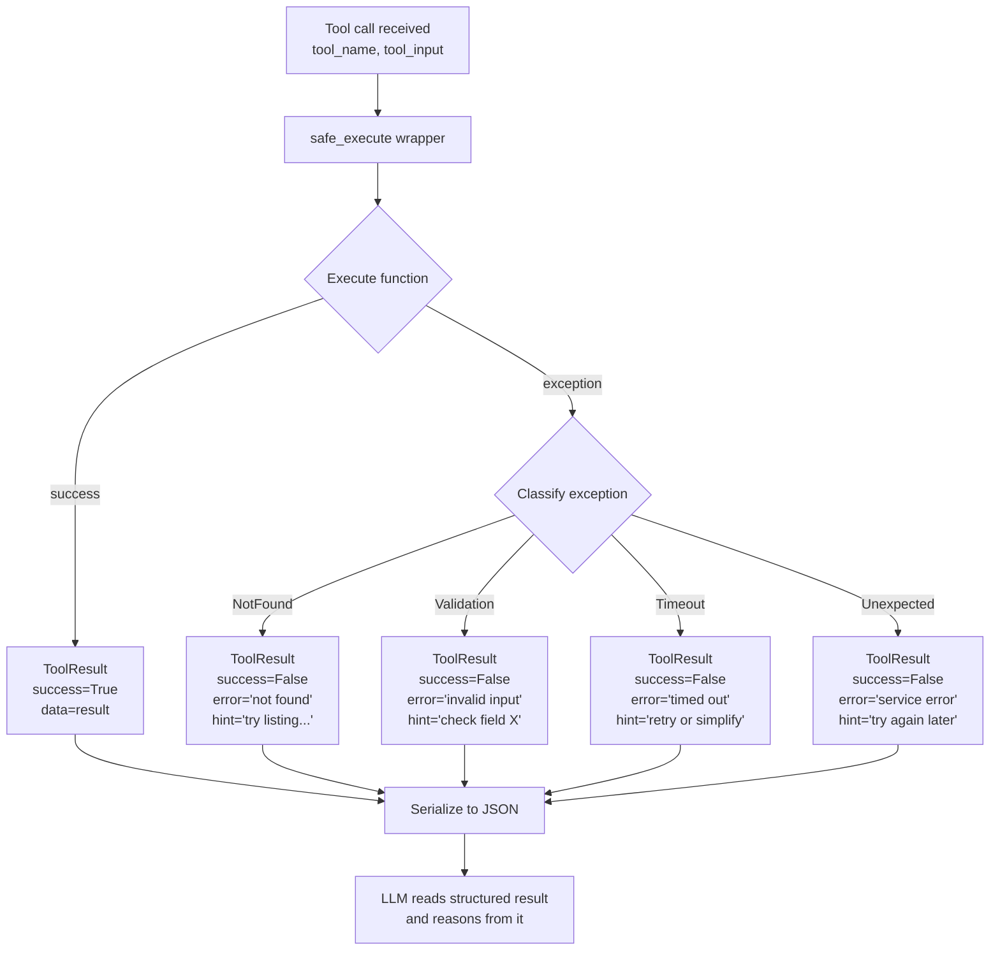

# مخرجات الأدوات المنظّمة ومعالجة الأخطاء (Structured Tool Outputs and Error Handling)

> الـ LLM يقرأ نتيجة أداتك كما يقرأ الإنسان استجابة API. نسّقها وفقًا لذلك.

**النوع:** بناء
**اللغات:** Python
**المتطلبات:** 03-01 أساسيات استدعاء الدوال
**الوقت:** ~45 دقيقة
**أهداف التعلّم:**
- تعريف dataclass باسم `ToolResult` بحقول success و data و error و hint
- بناء مُغلِّف (wrapper) باسم `safe_execute` يحوّل كل الاستثناءات إلى نتائج منظّمة
- تصنيف الأخطاء إلى أربعة أنواع وتقديم تلميح (hint) قابل للتنفيذ لكل منها
- استخدام Pydantic لتسلسل (serialization) `ToolResult` مع أمان الأنواع (type safety)
- التحقّق من أن الـ LLM يستجيب بشكل مختلف للمخرَج المنظّم مقابل مخرَج الاستثناء الخام

---

## المشكلة

وكيل فوترة يستدعي `get_invoice(invoice_id="INV-8834")`. الفاتورة غير موجودة في قاعدة البيانات. ترفع الدالة `ValueError`. ويصل أثر المكدّس الخام (raw traceback) إلى الـ LLM بوصفه محتوى الـ tool_result:

```
ValueError: 'NoneType' object has no attribute 'balance'
Traceback (most recent call last):
  File "billing.py", line 47, in get_invoice
    return record.balance
AttributeError: 'NoneType' object has no attribute 'balance'
```

يقرأ الـ LLM هذا ويفعل أحد ثلاثة أمور: يهلوس فاتورة بمبالغ مختلقة، أو يخبر المستخدم "حدث خطأ في النظام" دون اقتراح ماذا يفعل بعد ذلك، أو يقوم باستدعاء أداة آخر بمعرّف فاتورة مختلف قليلًا وهو أيضًا غير موجود. لا أيّ من هذه النتائج يفيد المستخدم.

أثر المكدّس مصمّم لتصحيح أخطاء المطوّر (debugging)، لا لاستدلال الـ LLM. هو يسمّي دالة داخلية (`billing.py`، السطر 47) لا يستطيع الـ LLM التصرّف بناءً عليها. ويكشف تفاصيل تنفيذ (كون `balance` خاصية على سجلّ قاعدة بيانات) لا ينبغي أن تغادر طبقة الخدمة (service layer) أبدًا. ولا يعطي الـ LLM أي إشارة عمّا يجرّبه تاليًا.

هذا انتهاك للعقد. مخرَج أداتك جزء من الواجهة التي يستخدمها الـ LLM للاستدلال. عندما تترك الاستثناءات الخام تمرّ، فأنت تسلّم الـ LLM استجابة API مشوّهة وتتوقّع منه أن يعالجها بسلاسة. الأدوات المصمّمة جيدًا تُرجع مخرجات منظّمة في حالتي النجاح والفشل، حتى يكون لدى الـ LLM دائمًا شيء مفيد يستدلّ منه.

---

## المفهوم

### مخرَج الأداة كعقد API

فكّر في أداتك كخدمة مصغّرة (micro-service). الـ LLM هو العميل (client). كل استجابة، نجاحًا كانت أو فشلًا، هي استجابة API. ينطبق تصميم الـ API الجيّد:

- استجابات النجاح لها مخطّط ثابت يحوي الحقول التي يحتاجها العميل.
- استجابات الخطأ لها رمز أو نوع، ورسالة مقروءة بشريًا، ومن المثالي تلميح "ماذا تفعل بعد ذلك".
- لا استجابات النجاح ولا الخطأ تسرّب تفاصيل التنفيذ الداخلية.

عميل الـ LLM يحتاج شيئين إضافيين لا يحتاجهما المطوّر البشري: يحتاج أن يكون الخطأ بلغة طبيعية (لا بأسماء فئات الاستثناءات)، ويحتاج أن يكون التلميح تعليمة يستطيع التصرّف بناءً عليها (لا أثر مكدّس).

### عقد ToolResult

```
ToolResult fields:
  success  bool     - Was the call successful?
  data     any      - The result data (only meaningful when success=True)
  error    str|None - Human-readable error message (only when success=False)
  hint     str|None - What the LLM should try next (only when success=False)
```

حقل `hint` هو الفكرة المحورية. ليس لدى الـ LLM وسيلة خارج النطاق (out-of-band) للتعافي من خطأ. عليك أن تخبره ماذا يفعل بعد ذلك. "Invoice not found" خطأ. أما "Invoice not found. Try calling `list_recent_invoices(customer_id='C-884')` to find the correct invoice ID." فهو تلميح يستطيع الـ LLM التصرّف بناءً عليه.

### تدفّق منفّذ الأداة (Tool Executor Flow)



### استثناء خام مقابل نتيجة منظّمة

```
ERROR TYPE       RAW (what LLM sees now)         STRUCTURED (what LLM should see)
───────────────  ──────────────────────────────  ──────────────────────────────────────
Not found        AttributeError: 'NoneType'      {"success": false,
                 object has no attribute          "error": "Invoice INV-8834 not found.",
                 'balance'                        "hint": "Call list_recent_invoices(
                                                    customer_id='C-884') to find the
                                                    correct invoice ID."}

Validation       ValueError: invalid literal     {"success": false,
                 for int() with base 10:          "error": "Invalid invoice ID format.
                 'INV-8834abc'                     Expected format: INV-NNNN.",
                                                  "hint": "Use the invoice ID from
                                                    the customer's email receipt."}

Timeout          requests.exceptions.            {"success": false,
                 ReadTimeout: HTTPSConnectionPool "error": "Invoice service timed out.",
                 (host='billing.internal',        "hint": "Try again. If the problem
                 port=443): Read timed out.        persists, use get_invoice_summary()
                 (read timeout=5)                  for basic information."}

Success          {"id": "INV-8834",              {"success": true,
(for comparison) "balance": 142.0}               "data": {"id": "INV-8834",
                                                            "balance": 142.0,
                                                            "currency": "USD"}}
```

---

## البناء

### الخطوة 1: dataclass باسم ToolResult

```python
import json
from dataclasses import dataclass, field, asdict
from typing import Any, Optional


@dataclass
class ToolResult:
    """
    Structured output contract for all tool calls.
    The LLM reads this as the tool_result content.
    """
    success: bool
    data:    Any             = None   # populated on success
    error:   Optional[str]  = None   # human-readable error, populated on failure
    hint:    Optional[str]  = None   # what the LLM should try next, populated on failure

    def to_json(self) -> str:
        """Serialize to JSON string for use as tool_result content."""
        return json.dumps(asdict(self))

    @classmethod
    def ok(cls, data: Any) -> "ToolResult":
        """Convenience constructor for success results."""
        return cls(success=True, data=data)

    @classmethod
    def fail(cls, error: str, hint: Optional[str] = None) -> "ToolResult":
        """Convenience constructor for failure results."""
        return cls(success=False, error=error, hint=hint)
```

### الخطوة 2: تصنيف الأخطاء والمُغلِّف safe_execute

عرّف أنواع استثناءات مخصّصة تحمل معنى دلاليًا. المصنّف يربط أنواع الاستثناءات بحالات فشل ToolResult المنظّمة.

```python
class NotFoundError(Exception):
    """Raised when a requested resource does not exist."""
    pass

class ValidationError(Exception):
    """Raised when the tool input is invalid."""
    pass

class ServiceTimeoutError(Exception):
    """Raised when an external service call times out."""
    pass


def safe_execute(fn: callable, tool_name: str, **kwargs) -> ToolResult:
    """
    Execute a tool function and convert all exceptions to ToolResult.
    Never lets a raw exception reach the LLM.

    Args:
        fn:        The tool function to call.
        tool_name: Used in error messages (e.g. "get_invoice").
        **kwargs:  Arguments forwarded to fn.
    """
    try:
        result = fn(**kwargs)
        return ToolResult.ok(result)

    except NotFoundError as e:
        return ToolResult.fail(
            error=str(e),
            hint=f"The resource was not found. Try listing available resources first.",
        )

    except ValidationError as e:
        return ToolResult.fail(
            error=str(e),
            hint="Check that all required fields are in the correct format.",
        )

    except ServiceTimeoutError as e:
        return ToolResult.fail(
            error=f"{tool_name} timed out: {e}",
            hint=f"The service is slow right now. Retry in a moment, or try a simpler variant of {tool_name}.",
        )

    except Exception as e:
        # Catch-all: log the real exception internally, return a safe message externally.
        # In production: logger.exception(f"Unexpected error in {tool_name}")
        return ToolResult.fail(
            error=f"An unexpected error occurred in {tool_name}.",
            hint="This is a system error. Try again. If it persists, try a different approach.",
        )
```

### الخطوة 3: أربع حالات خطأ في الممارسة

أربع دوال بديلة (stubs) تعرض كل نوع خطأ، وما يراه الـ LLM في كل حالة.

```python
# Stub functions that raise the right exception types

def get_invoice(invoice_id: str) -> dict:
    """Look up an invoice by ID."""
    if not invoice_id.startswith("INV-"):
        raise ValidationError(
            f"Invalid invoice ID format: {invoice_id!r}. Expected format: INV-NNNN."
        )
    if invoice_id == "INV-0000":
        raise NotFoundError(
            f"Invoice {invoice_id!r} not found. "
            "Use list_invoices(customer_id=...) to find valid invoice IDs."
        )
    if invoice_id == "INV-SLOW":
        raise ServiceTimeoutError("billing service did not respond within 5s")
    # Success case
    return {
        "invoice_id": invoice_id,
        "amount": 142.00,
        "currency": "USD",
        "status": "unpaid",
        "due_date": "2026-06-01",
    }


def demo_four_cases() -> None:
    """Show what the LLM receives for each error type."""
    cases = [
        {"label": "Success",          "args": {"invoice_id": "INV-8834"}},
        {"label": "Not found",        "args": {"invoice_id": "INV-0000"}},
        {"label": "Validation error", "args": {"invoice_id": "bad-format"}},
        {"label": "Timeout",          "args": {"invoice_id": "INV-SLOW"}},
    ]

    for case in cases:
        result = safe_execute(get_invoice, "get_invoice", **case["args"])
        print(f"\n{case['label']}:")
        print(f"  Input:  {case['args']}")
        print(f"  Output: {result.to_json()}")
```

تشغيل هذا ينتج:

```
Success:
  Input:  {'invoice_id': 'INV-8834'}
  Output: {"success": true, "data": {"invoice_id": "INV-8834", "amount": 142.0, ...}, "error": null, "hint": null}

Not found:
  Input:  {'invoice_id': 'INV-0000'}
  Output: {"success": false, "data": null, "error": "Invoice 'INV-0000' not found. Use list_invoices...", "hint": "The resource was not found. Try listing available resources first."}

Validation error:
  Input:  {'invoice_id': 'bad-format'}
  Output: {"success": false, "data": null, "error": "Invalid invoice ID format: 'bad-format'. Expected format: INV-NNNN.", "hint": "Check that all required fields are in the correct format."}

Timeout:
  Input:  {'invoice_id': 'INV-SLOW'}
  Output: {"success": false, "data": null, "error": "get_invoice timed out: billing service did not respond within 5s", "hint": "The service is slow right now. Retry in a moment..."}
```

> **اختبار من الواقع:** يستقبل الـ LLM نتيجة أداة (tool_result) بـ `{"success": false, "error": "not found", "hint": null}`. ماذا سيفعل الـ LLM على الأرجح، وكيف سيغيّر تلميح غير فارغ (non-null hint) سلوكه؟

مع `hint: null`، يعرف الـ LLM أن شيئًا ما فشل لكن من دون مسار للأمام. سيخبر المستخدم عادةً "لم أستطع إيجاد تلك المعلومة" ويتوقّف، أو يهلوس خطوة تعافٍ. أما مع `hint: "Call list_invoices(customer_id='C-884') to find valid invoice IDs"`، فلدى الـ LLM إجراء تالٍ ملموس. سيستدعي على الأرجح `list_invoices` ويتابع المهمة. التلميح يحوّل الطريق المسدود إلى نقطة قرار.

---

## الاستخدام

### ToolResult مع Pydantic

يضيف Pydantic التسلسل (serialization)، والتحقّق (validation)، والوصول إلى الحقول بأمان الأنواع. هو الترقية الصحيحة عندما تستهلك خدمات أو فرق متعددة تنسيق مخرَج أداتك.

```python
from pydantic import BaseModel, Field
from typing import Any, Optional
import json


class ToolResult(BaseModel):
    """
    Structured output contract for all tool calls.
    Pydantic version: validated serialization + retry_hints by error type.
    """
    success: bool
    data:    Optional[Any] = None
    error:   Optional[str] = None
    hint:    Optional[str] = None

    def to_json(self) -> str:
        """Serialize to JSON string, excluding None fields for compact output."""
        return self.model_dump_json(exclude_none=True)

    @classmethod
    def ok(cls, data: Any) -> "ToolResult":
        return cls(success=True, data=data)

    @classmethod
    def fail(cls, error: str, hint: Optional[str] = None) -> "ToolResult":
        return cls(success=False, error=error, hint=hint)


# Error type to hint mapping (can be loaded from config)
ERROR_HINTS = {
    NotFoundError:      "Try listing available resources to find the correct identifier.",
    ValidationError:    "Check that input values match the expected format from the tool description.",
    ServiceTimeoutError: "Retry the call. If timeouts persist, use a simpler or scoped version of the tool.",
}

def safe_execute_pydantic(fn: callable, tool_name: str, **kwargs) -> ToolResult:
    """Pydantic version of safe_execute with configurable hint map."""
    try:
        result = fn(**kwargs)
        return ToolResult.ok(result)
    except tuple(ERROR_HINTS.keys()) as e:
        hint = ERROR_HINTS.get(type(e), "Try a different approach.")
        return ToolResult.fail(error=str(e), hint=hint)
    except Exception:
        return ToolResult.fail(
            error=f"Unexpected error in {tool_name}.",
            hint="This is a system error. Try again or use a different tool.",
        )
```

استخدام `exclude_none=True` في `model_dump_json` لدى Pydantic يُبقي JSON مدمجًا في مسارات النجاح:

```python
# Success: compact
ToolResult.ok({"id": "INV-8834", "amount": 142.0}).to_json()
# '{"success":true,"data":{"id":"INV-8834","amount":142.0}}'

# Failure: includes error and hint
ToolResult.fail("Invoice not found.", "Try list_invoices(customer_id='C-884').").to_json()
# '{"success":false,"error":"Invoice not found.","hint":"Try list_invoices..."}'
```

> **نقلة في المنظور:** يقول زميل: "فقط أضِف try/except إلى حلقة التوزيع وأرجِع 'error: true' إن فشل أي شيء. لماذا نبني فئة ToolResult كاملة؟" ما الحالتان اللتان تجعلان بنية ToolResult تستحقّ عناءها؟

أولًا، حقل hint. `"error: true"` العام لا يعطي الـ LLM شيئًا يتصرّف بناءً عليه. التلميح هو ما يحوّل الطريق المسدود إلى فشل قابل للتعافي. تحتاج حقلًا له، ويلزم أن يكون مُحدَّد النوع ومطلوبًا لحالات الفشل، لا مضافًا كفكرة لاحقة. ثانيًا، تصنيف الأخطاء. عندما تلتقط كل الاستثناءات وتُرجع الرسالة ذاتها، تفقد القدرة على معالجة "غير موجود" بشكل يختلف عن "مهلة زمنية" يختلف عن "فشل تحقّق". كل نوع خطأ يُربط بتلميح مختلف وباستراتيجية تعافٍ مختلفة لدى الـ LLM. الفئة هي العقد الذي يفرض هذا التمييز.

---

## التسليم

المنتَج (artifact) الذي ينتجه هذا الدرس هو مخطّط `ToolResult` والمُغلِّف `safe_execute`. انظر `outputs/skill-tool-output-contract.md`.

أسقطه في أي طبقة توزيع أدوات. يتضمّن القالب نسخة dataclass للتبعيات الدنيا، ونسخة Pydantic للتسلسل بأمان الأنواع، وأنواع الاستثناءات الأربعة، والمُغلِّف `safe_execute` مع تصنيف الأخطاء.

---

## التقييم

كيف تعرف أن عقد مخرَج أدواتك يعمل في الإنتاج؟

**معدّل تعافي الـ LLM (LLM recovery rate).** عندما تُرجع أداة `success: false`، تتبّع كم مرة يتعافى الـ LLM بنجاح (يقوم باستدعاء متابعة، يجرّب التلميح، يصل إلى الإجابة الصحيحة) مقابل الاستسلام أو الهلوسة. حقل تلميح جيّد ينبغي أن ينتج تعافيًا بنسبة 60%+ على أخطاء "غير موجود" والتحقّق. إن كان التعافي دون 30%، فتلميحاتك ليست قابلة للتنفيذ بما يكفي.

**معدّل تسرّب الاستثناءات (Exception leak rate).** أعدّ تنبيه سجلّ لمحتوى tool_result الذي يحتوي على `Traceback` أو `Error:` أو أسماء فئات استثناءات Python الشائعة. هذه تشير إلى استثناءات خام تهرب من المُغلِّف `safe_execute`. في الإنتاج، ينبغي أن يكون هذا المعدّل صفرًا.

**توزيع أنواع الأخطاء (Error type distribution).** سجّل نوع الاستثناء لكل استدعاء أداة فاشل. إن كان 80% من حالات الفشل `ValidationError` للحقل ذاته، فإن tool schema يعاني لبسًا (إصلاح الدرس 02). إن كان 40% منها `ServiceTimeoutError`، فإن التبعية الخارجية لديها مشكلة موثوقية تستدعي محادثة حول اتفاقية مستوى الخدمة (SLA).

**تدقيق جودة التلميحات (Hint quality audit).** شهريًا: اسحب كل سجلّات tool_result حيث `success: false` وراجِع يدويًا 20 حالة. لكل حالة اسأل: هل تصرّف الـ LLM بناءً على التلميح؟ هل كان التلميح دقيقًا؟ إن كان الـ LLM يتجاهل تلميحًا باستمرار أو يجرّب شيئًا لا يقترحه التلميح، فأعد صياغة ذلك التلميح ليكون أكثر صراحة.
