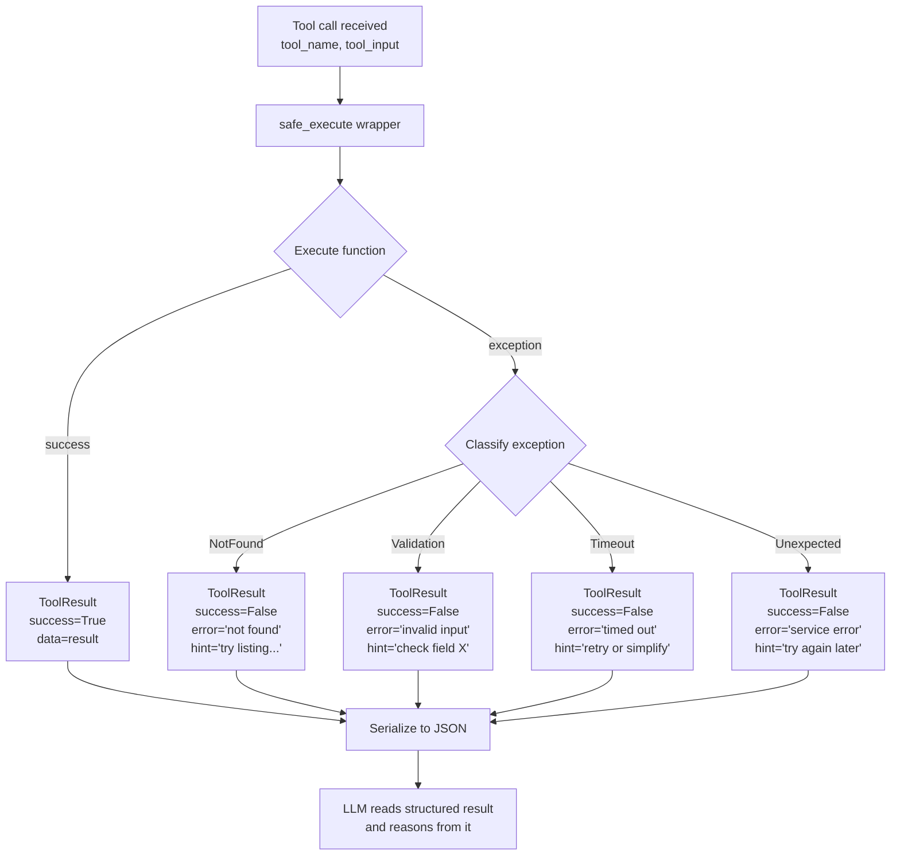

# Structured Tool Outputs and Error Handling

> The LLM reads your tool result the way a human reads an API response. Format it accordingly.

**Type:** Build
**Languages:** Python
**Prerequisites:** 03-01 Function Calling Fundamentals
**Time:** ~45 min
**Learning Objectives:**
- Define a `ToolResult` dataclass with success, data, error, and hint fields
- Build a `safe_execute` wrapper that converts all exceptions to structured results
- Classify errors into four types and provide actionable hints for each
- Use Pydantic for `ToolResult` serialization with type safety
- Verify that the LLM responds differently to structured vs. raw exception output

---

## THE PROBLEM

A billing agent calls `get_invoice(invoice_id="INV-8834")`. The invoice doesn't exist in the database. The function raises a `ValueError`. The raw traceback reaches the LLM as the tool_result content:

```
ValueError: 'NoneType' object has no attribute 'balance'
Traceback (most recent call last):
  File "billing.py", line 47, in get_invoice
    return record.balance
AttributeError: 'NoneType' object has no attribute 'balance'
```

The LLM reads this and does one of three things: hallucinates an invoice with made-up amounts, tells the user "there was a system error" without suggesting what to do next, or makes another tool call with a slightly different invoice ID that also doesn't exist. None of these outcomes helps the user.

The traceback is designed for developer debugging, not for LLM reasoning. It names an internal function (`billing.py`, line 47) that the LLM cannot act on. It exposes implementation details (the fact that `balance` is an attribute on a database record) that should never leave the service layer. And it gives the LLM no signal about what to try next.

This is a contract violation. Your tool's output is part of the interface the LLM uses to reason. When you let raw exceptions through, you're handing the LLM a malformed API response and expecting it to handle it gracefully. Well-designed tools return structured outputs in both success and failure cases, so the LLM always has something useful to reason from.

---

## THE CONCEPT

### Tool Output as an API Contract

Think of your tool as a micro-service. The LLM is the client. Every response, success or failure, is an API response. Good API design applies:

- Success responses have a consistent schema with the fields the client needs.
- Error responses have a code or type, a human-readable message, and ideally a "what to do next" hint.
- Neither success nor error responses leak internal implementation details.

The LLM client needs two extra things a human developer doesn't: it needs the error to be in natural language (not exception class names), and it needs the hint to be an instruction it can act on (not a stack trace).

### The ToolResult Contract

```
ToolResult fields:
  success  bool     - Was the call successful?
  data     any      - The result data (only meaningful when success=True)
  error    str|None - Human-readable error message (only when success=False)
  hint     str|None - What the LLM should try next (only when success=False)
```

The `hint` field is the key insight. The LLM has no out-of-band way to recover from an error. You have to tell it what to do next. "Invoice not found" is an error. "Invoice not found. Try calling `list_recent_invoices(customer_id='C-884')` to find the correct invoice ID." is a hint the LLM can act on.

### Tool Executor Flow



### Raw Exception vs Structured Result

```
ERROR TYPE       RAW (what LLM sees now)         STRUCTURED (what LLM should see)
───────────────  ──────────────────────────────  ──────────────────────────────────────
Not found        AttributeError: 'NoneType'      {"success": false,
                 object has no attribute          "error": "Invoice INV-8834 not found.",
                 'balance'                        "hint": "Call list_recent_invoices(
                                                    customer_id='C-884') to find the
                                                    correct invoice ID."}

Validation       ValueError: invalid literal     {"success": false,
                 for int() with base 10:          "error": "Invalid invoice ID format.
                 'INV-8834abc'                     Expected format: INV-NNNN.",
                                                  "hint": "Use the invoice ID from
                                                    the customer's email receipt."}

Timeout          requests.exceptions.            {"success": false,
                 ReadTimeout: HTTPSConnectionPool "error": "Invoice service timed out.",
                 (host='billing.internal',        "hint": "Try again. If the problem
                 port=443): Read timed out.        persists, use get_invoice_summary()
                 (read timeout=5)                  for basic information."}

Success          {"id": "INV-8834",              {"success": true,
(for comparison) "balance": 142.0}               "data": {"id": "INV-8834",
                                                            "balance": 142.0,
                                                            "currency": "USD"}}
```

---

## BUILD IT

### Step 1: The ToolResult Dataclass

```python
import json
from dataclasses import dataclass, field, asdict
from typing import Any, Optional


@dataclass
class ToolResult:
    """
    Structured output contract for all tool calls.
    The LLM reads this as the tool_result content.
    """
    success: bool
    data:    Any             = None   # populated on success
    error:   Optional[str]  = None   # human-readable error, populated on failure
    hint:    Optional[str]  = None   # what the LLM should try next, populated on failure

    def to_json(self) -> str:
        """Serialize to JSON string for use as tool_result content."""
        return json.dumps(asdict(self))

    @classmethod
    def ok(cls, data: Any) -> "ToolResult":
        """Convenience constructor for success results."""
        return cls(success=True, data=data)

    @classmethod
    def fail(cls, error: str, hint: Optional[str] = None) -> "ToolResult":
        """Convenience constructor for failure results."""
        return cls(success=False, error=error, hint=hint)
```

### Step 2: Error Classification and the safe_execute Wrapper

Define custom exception types that carry semantic meaning. The classifier maps exception types to structured ToolResult failures.

```python
class NotFoundError(Exception):
    """Raised when a requested resource does not exist."""
    pass

class ValidationError(Exception):
    """Raised when the tool input is invalid."""
    pass

class ServiceTimeoutError(Exception):
    """Raised when an external service call times out."""
    pass


def safe_execute(fn: callable, tool_name: str, **kwargs) -> ToolResult:
    """
    Execute a tool function and convert all exceptions to ToolResult.
    Never lets a raw exception reach the LLM.

    Args:
        fn:        The tool function to call.
        tool_name: Used in error messages (e.g. "get_invoice").
        **kwargs:  Arguments forwarded to fn.
    """
    try:
        result = fn(**kwargs)
        return ToolResult.ok(result)

    except NotFoundError as e:
        return ToolResult.fail(
            error=str(e),
            hint=f"The resource was not found. Try listing available resources first.",
        )

    except ValidationError as e:
        return ToolResult.fail(
            error=str(e),
            hint="Check that all required fields are in the correct format.",
        )

    except ServiceTimeoutError as e:
        return ToolResult.fail(
            error=f"{tool_name} timed out: {e}",
            hint=f"The service is slow right now. Retry in a moment, or try a simpler variant of {tool_name}.",
        )

    except Exception as e:
        # Catch-all: log the real exception internally, return a safe message externally.
        # In production: logger.exception(f"Unexpected error in {tool_name}")
        return ToolResult.fail(
            error=f"An unexpected error occurred in {tool_name}.",
            hint="This is a system error. Try again. If it persists, try a different approach.",
        )
```

### Step 3: Four Error Cases in Practice

Four stub functions that demonstrate each error type, and what the LLM sees in each case.

```python
# Stub functions that raise the right exception types

def get_invoice(invoice_id: str) -> dict:
    """Look up an invoice by ID."""
    if not invoice_id.startswith("INV-"):
        raise ValidationError(
            f"Invalid invoice ID format: {invoice_id!r}. Expected format: INV-NNNN."
        )
    if invoice_id == "INV-0000":
        raise NotFoundError(
            f"Invoice {invoice_id!r} not found. "
            "Use list_invoices(customer_id=...) to find valid invoice IDs."
        )
    if invoice_id == "INV-SLOW":
        raise ServiceTimeoutError("billing service did not respond within 5s")
    # Success case
    return {
        "invoice_id": invoice_id,
        "amount": 142.00,
        "currency": "USD",
        "status": "unpaid",
        "due_date": "2026-06-01",
    }


def demo_four_cases() -> None:
    """Show what the LLM receives for each error type."""
    cases = [
        {"label": "Success",          "args": {"invoice_id": "INV-8834"}},
        {"label": "Not found",        "args": {"invoice_id": "INV-0000"}},
        {"label": "Validation error", "args": {"invoice_id": "bad-format"}},
        {"label": "Timeout",          "args": {"invoice_id": "INV-SLOW"}},
    ]

    for case in cases:
        result = safe_execute(get_invoice, "get_invoice", **case["args"])
        print(f"\n{case['label']}:")
        print(f"  Input:  {case['args']}")
        print(f"  Output: {result.to_json()}")
```

Running this produces:

```
Success:
  Input:  {'invoice_id': 'INV-8834'}
  Output: {"success": true, "data": {"invoice_id": "INV-8834", "amount": 142.0, ...}, "error": null, "hint": null}

Not found:
  Input:  {'invoice_id': 'INV-0000'}
  Output: {"success": false, "data": null, "error": "Invoice 'INV-0000' not found. Use list_invoices...", "hint": "The resource was not found. Try listing available resources first."}

Validation error:
  Input:  {'invoice_id': 'bad-format'}
  Output: {"success": false, "data": null, "error": "Invalid invoice ID format: 'bad-format'. Expected format: INV-NNNN.", "hint": "Check that all required fields are in the correct format."}

Timeout:
  Input:  {'invoice_id': 'INV-SLOW'}
  Output: {"success": false, "data": null, "error": "get_invoice timed out: billing service did not respond within 5s", "hint": "The service is slow right now. Retry in a moment..."}
```

> **Real-world check:** The LLM receives a tool_result with `{"success": false, "error": "not found", "hint": null}`. What will the LLM most likely do, and how would a non-null hint change its behavior?

With `hint: null`, the LLM knows something failed but has no path forward. It will typically tell the user "I couldn't find that information" and stop, or hallucinate a recovery step. With `hint: "Call list_invoices(customer_id='C-884') to find valid invoice IDs"`, the LLM has a concrete next action. It will likely call `list_invoices` and continue the task. The hint turns a dead end into a decision point.

---

## USE IT

### ToolResult with Pydantic

Pydantic adds serialization, validation, and type-safe field access. It's the right upgrade when multiple services or teams will consume your tool output format.

```python
from pydantic import BaseModel, Field
from typing import Any, Optional
import json


class ToolResult(BaseModel):
    """
    Structured output contract for all tool calls.
    Pydantic version: validated serialization + retry_hints by error type.
    """
    success: bool
    data:    Optional[Any] = None
    error:   Optional[str] = None
    hint:    Optional[str] = None

    def to_json(self) -> str:
        """Serialize to JSON string, excluding None fields for compact output."""
        return self.model_dump_json(exclude_none=True)

    @classmethod
    def ok(cls, data: Any) -> "ToolResult":
        return cls(success=True, data=data)

    @classmethod
    def fail(cls, error: str, hint: Optional[str] = None) -> "ToolResult":
        return cls(success=False, error=error, hint=hint)


# Error type to hint mapping (can be loaded from config)
ERROR_HINTS = {
    NotFoundError:      "Try listing available resources to find the correct identifier.",
    ValidationError:    "Check that input values match the expected format from the tool description.",
    ServiceTimeoutError: "Retry the call. If timeouts persist, use a simpler or scoped version of the tool.",
}

def safe_execute_pydantic(fn: callable, tool_name: str, **kwargs) -> ToolResult:
    """Pydantic version of safe_execute with configurable hint map."""
    try:
        result = fn(**kwargs)
        return ToolResult.ok(result)
    except tuple(ERROR_HINTS.keys()) as e:
        hint = ERROR_HINTS.get(type(e), "Try a different approach.")
        return ToolResult.fail(error=str(e), hint=hint)
    except Exception:
        return ToolResult.fail(
            error=f"Unexpected error in {tool_name}.",
            hint="This is a system error. Try again or use a different tool.",
        )
```

Pydantic's `exclude_none=True` in `model_dump_json` keeps the JSON compact on success paths:

```python
# Success: compact
ToolResult.ok({"id": "INV-8834", "amount": 142.0}).to_json()
# '{"success":true,"data":{"id":"INV-8834","amount":142.0}}'

# Failure: includes error and hint
ToolResult.fail("Invoice not found.", "Try list_invoices(customer_id='C-884').").to_json()
# '{"success":false,"error":"Invoice not found.","hint":"Try list_invoices..."}'
```

> **Perspective shift:** A colleague says "just add a try/except to the dispatch loop and return 'error: true' if anything fails. Why build a whole ToolResult class?" What are the two cases where the ToolResult structure pays for itself?

First, the hint field. A generic `"error: true"` gives the LLM nothing to act on. The hint is what turns a dead end into a recoverable failure. You need a field for it, and it needs to be typed and required for failures, not added as an afterthought. Second, error classification. When you catch all exceptions and return the same message, you lose the ability to handle not-found differently from timeout differently from validation failure. Each error type maps to a different hint and a different LLM recovery strategy. The class is the contract that enforces this distinction.

---

## SHIP IT

The artifact this lesson produces is the `ToolResult` schema and `safe_execute` wrapper. See `outputs/skill-tool-output-contract.md`.

Drop it into any tool dispatch layer. The template includes the dataclass version for minimal dependencies, the Pydantic version for type-safe serialization, the four exception types, and the `safe_execute` wrapper with error classification.

---

## EVALUATE IT

How do you know your tool output contract is working in production?

**LLM recovery rate.** When a tool returns `success: false`, track how often the LLM successfully recovers (makes a follow-up call, tries the hint, arrives at the right answer) vs. gives up or hallucinates. A good hint field should produce 60%+ recovery on not-found and validation errors. If recovery is below 30%, your hints are not actionable enough.

**Exception leak rate.** Set up a log alert for tool_result content that contains `Traceback`, `Error:`, or common Python exception class names. These indicate raw exceptions escaping the `safe_execute` wrapper. In production, this rate should be zero.

**Error type distribution.** Log the exception type for every failed tool call. If 80% of failures are `ValidationError` for the same field, the tool schema has an ambiguity (Lesson 02 fix). If 40% are `ServiceTimeoutError`, the external dependency has a reliability problem that needs an SLA conversation.

**Hint quality audit.** Monthly: pull all tool_result records where `success: false` and manually review 20 cases. For each case, ask: did the LLM act on the hint? Was the hint accurate? If the LLM consistently ignores a hint or tries something the hint doesn't suggest, rewrite that hint to be more explicit.
