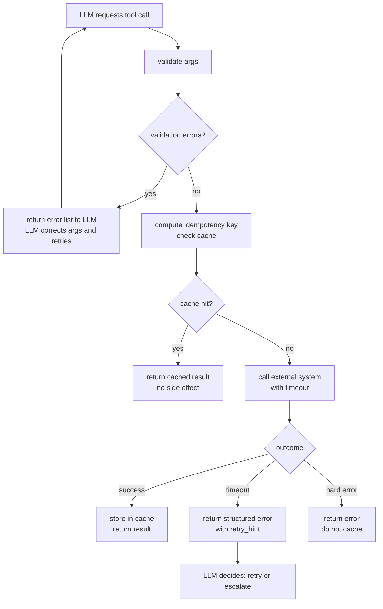

# أدوات صلبة (Robust Tools): الـ Idempotency، والمهلات الزمنية، والتحقّق

> أداة يستطيع الوكيل إعادة محاولتها بأمان تساوي عشر أدوات لا يستطيع استدعاءها إلا مرة واحدة.

**النوع:** بناء
**اللغات:** Python
**المتطلبات:** 03-01 أساسيات استدعاء الدوال، 03-02 تصميم مخططات الأدوات
**الوقت:** ~60 دقيقة
**أهداف التعلّم:**
- توضيح لماذا يهمّ الـ idempotency عندما يستطيع الوكلاء إعادة محاولة استدعاءات الأدوات
- تنفيذ ذاكرة تخزين مؤقت لمفتاح idempotency تمنع الآثار الجانبية المكرّرة
- تغليف الاستدعاءات الخارجية بمهلات زمنية (timeouts) قابلة للضبط وأخطاء مهلة منظّمة
- كتابة تحقّق قبل الاستدعاء يُرجع أخطاءً قابلة للتنفيذ إلى الـ LLM
- تركيب الخصائص الثلاث في فئة أساس واحدة باسم `RobustTool`

---

## المشكلة

يرسل وكيل بريدًا إلكترونيًا عبر أداة `send_email`. تنتهي مهلة الـ API بعد 5 ثوانٍ. يصنّف الوكيل هذا فشلًا ويعيد المحاولة. لكن البريد كان قد أُدرج بالفعل في طابور الانتظار في الخلفية (backend). فيستقبله العميل مرتين.

أداة `create_order` تستغرق 10 ثوانٍ. تنطلق مهلة الوكيل عند 8 ثوانٍ. لكن الطلب أُدرج فعليًا في قاعدة البيانات عند الثانية 6. يعيد الوكيل المحاولة، فينشئ طلبًا ثانيًا بمعرّف جديد. يُفوتر العميل مرتين، ويشحن التنفيذ صندوقين، وتهبط تذكرة الدعم في صندوق وارد شخص لم يعد يعمل هناك.

هذه ليست حالات هامشية. أي وكيل يعمل في الإنتاج سيعيد المحاولة. الشبكات غير موثوقة. خدمات الخلفية بطيئة. حدود المعدّل (rate limits) موجودة. إعادة المحاولة ليست العلّة. العلّة هي أداة لا تأخذ بالحسبان أنها قد تُستدعى أكثر من مرة.

هناك ثلاث خصائص يحتاجها كل أداة إنتاجية:

1. **الـ Idempotency:** الاستدعاء ذاته بالوسائط ذاتها ينتج النتيجة ذاتها، مهما تكرّر تنفيذه.
2. **المهلات الزمنية (Timeouts):** لكل استدعاء خارجي موعد نهائي صارم، والخطأ الذي يُرجعه يخبر الـ LLM ما إذا كان عليه إعادة المحاولة أو الاستسلام.
3. **التحقّق من المدخلات (Input validation):** تُفحص المعاملات قبل انطلاق الاستدعاء الخارجي. أخطاء التحقّق تعود إلى الـ LLM كتغذية راجعة واضحة قابلة للتصحيح، لا كاستثناءات غير معالَجة.

---

## المفهوم

### الـ Idempotency

العملية الـ idempotent يمكن تطبيقها مرات متعددة دون تغيير النتيجة بعد التطبيق الأول. طلبات GET هي idempotent بطبيعتها. أما طلبات POST إلى `create_order` فليست كذلك.

الإصلاح الإنتاجي المعياري هو مفتاح idempotency: رمز فريد يسافر مع الطلب. تخزّن الخلفية المفتاح والنتيجة. عند إعادة المحاولة، ترى الخلفية المفتاح ذاته وتُرجع النتيجة المخزّنة بدلًا من إعادة التنفيذ.

في طبقة الوكيل، تنفّذ النمط ذاته كذاكرة تخزين مؤقت محلية (local cache) مفتاحها هو تجزئة (hash) توقيع الاستدعاء.

```
Idempotency Cache

Same args → same key → cache HIT → return cached result (no side effect)
  ┌─────────────────────────────────────────────┐
  │  key = hash("send_email:alice@x.com:Hello") │
  │  cache = {"abc123": {"status": "sent"}}      │
  │  result = cache["abc123"]  ← no API call     │
  └─────────────────────────────────────────────┘

New args → new key → cache MISS → call external system → store result
  ┌─────────────────────────────────────────────┐
  │  key = hash("send_email:bob@x.com:Hi")      │
  │  cache = {}  (miss)                          │
  │  result = api.send(...)  ← real call fires   │
  │  cache["def456"] = result                    │
  └─────────────────────────────────────────────┘
```

### المهلات الزمنية (Timeouts)

المهلة الزمنية من دون خطأ منظّم عديمة الفائدة تقريبًا. يحتاج الـ LLM معرفة أمرين عند انتهاء مهلة الاستدعاء:

- هل من المرجّح أن العملية اكتملت قبل انتهاء المهلة؟ (إن نعم: لا تُعد المحاولة، تحقّق من الحالة بدلًا من ذلك.)
- هل الخطأ عابر (transient)؟ (إن نعم: أعد المحاولة مع تراجع تدريجي (backoff). إن لا: صعّد المسألة.)

نظِّم خطأ المهلة لديك على هيئة قاموس (dict)، لا سلسلة استثناء عادية. أعطِه حقل `retry_hint` يستطيع الـ LLM قراءته.

### التحقّق من المدخلات (Input Validation)

تحقّق قبل استدعاء النظام الخارجي. هذا رخيص. كلفة استدعاء غير صالح ليست مجرّد رحلة HTTP المهدورة: بل هي رسالة خطأ النظام الخارجي، التي قد تكون 500 غامضًا أو أثر مكدّس، ولا أيٌّ منهما يساعد الـ LLM على التعافي.

أرجِع قائمة بأخطاء التحقّق. إن كانت القائمة غير فارغة، أرجِعها إلى الـ LLM. يستطيع الـ LLM تصحيح الوسائط وإعادة محاولة استدعاء الأداة بمدخلات صالحة.

### دورة حياة استدعاء الأداة (Tool Call Lifecycle)



---

## البناء

### فئة الأساس RobustTool

التنفيذ الكامل في `code/main.py`. إليك البنية:

```python
import hashlib
import json
import concurrent.futures
from abc import ABC, abstractmethod
from typing import Any

class RobustTool(ABC):
    """Base class for tools that agents can retry safely."""

    def __init__(self, timeout_seconds: float = 10.0):
        self.timeout_seconds = timeout_seconds
        self._cache: dict[str, Any] = {}

    # --- Idempotency ---

    def idempotency_key(self, args: dict) -> str:
        """Hash the tool name + sorted args to produce a stable cache key."""
        payload = json.dumps(
            {"tool": self.__class__.__name__, "args": args},
            sort_keys=True,
        )
        return hashlib.sha256(payload.encode()).hexdigest()[:16]

    # --- Validation ---

    @abstractmethod
    def validate(self, args: dict) -> list[str]:
        """Return a list of validation error strings. Empty list means valid."""
        ...

    # --- Implementation ---

    @abstractmethod
    def _execute(self, args: dict) -> dict:
        """The actual external call. Implement in subclasses."""
        ...

    # --- Orchestrator ---

    def run(self, args: dict) -> dict:
        errors = self.validate(args)
        if errors:
            return {"ok": False, "error": "validation_failed", "details": errors}

        key = self.idempotency_key(args)
        if key in self._cache:
            return {**self._cache[key], "idempotent_replay": True}

        with concurrent.futures.ThreadPoolExecutor(max_workers=1) as ex:
            future = ex.submit(self._execute, args)
            try:
                result = future.result(timeout=self.timeout_seconds)
                self._cache[key] = result
                return result
            except concurrent.futures.TimeoutError:
                return {
                    "ok": False,
                    "error": "timeout",
                    "timeout_seconds": self.timeout_seconds,
                    "retry_hint": (
                        "The external system did not respond in time. "
                        "The operation may have succeeded on the backend. "
                        "Check status before retrying to avoid duplicates."
                    ),
                }
```

### أداة ChargeCustomer

أداة محسوسة تعرض الخصائص الثلاث كلها:

```python
import time
import random

class ChargeCustomer(RobustTool):
    def validate(self, args: dict) -> list[str]:
        errors = []
        if "customer_id" not in args:
            errors.append("customer_id is required")
        if "amount_cents" not in args:
            errors.append("amount_cents is required")
        elif not isinstance(args["amount_cents"], int):
            errors.append("amount_cents must be an integer (e.g. 1999 for $19.99)")
        elif args["amount_cents"] <= 0:
            errors.append("amount_cents must be positive")
        if "currency" not in args:
            errors.append("currency is required (e.g. 'usd')")
        return errors

    def _execute(self, args: dict) -> dict:
        # Simulate a slow payment API
        time.sleep(random.uniform(0.1, 0.5))
        return {
            "ok": True,
            "charge_id": f"ch_{args['customer_id']}_001",
            "amount_cents": args["amount_cents"],
            "status": "succeeded",
        }
```

### العرض التوضيحي

```python
tool = ChargeCustomer(timeout_seconds=5.0)

# Call 1: invalid args
result = tool.run({"customer_id": "cust_42", "amount_cents": "twenty dollars"})
# {"ok": False, "error": "validation_failed",
#  "details": ["amount_cents must be an integer..."]}

# Call 2: valid, first execution
result = tool.run({"customer_id": "cust_42", "amount_cents": 1999, "currency": "usd"})
# {"ok": True, "charge_id": "ch_cust_42_001", "status": "succeeded"}

# Call 3: same args again (agent retry simulation)
result = tool.run({"customer_id": "cust_42", "amount_cents": 1999, "currency": "usd"})
# {"ok": True, "charge_id": "ch_cust_42_001", "status": "succeeded",
#  "idempotent_replay": True}  ← no second charge fired
```

> **اختبار من الواقع:** يوفّر مزوّد الدفع لديك مفاتيح idempotency على مستوى الـ API. لماذا ما زلت تريد ذاكرة تخزين idempotency المؤقتة في طبقة أداتك، قبل أن يغادر الطلب عمليتك أصلًا؟

المفتاح على مستوى الـ API يحمي مزوّد الدفع من معالجة الرسم مرتين. لكن أداتك قد تفشل بعد أن يقبل المزوّد الرسم وقبل أن تستقبل الاستجابة. إن اعتمدت فقط على مفتاح المزوّد، فعليك تمرير المفتاح ذاته عبر كل إعادة محاولة. ذاكرة التخزين على مستوى الأداة أبسط: تقطع الطريق قبل القيام بالاستدعاء الشبكي إطلاقًا، ما يوفّر أيضًا زمن الاستجابة وكلفة الـ API في عمليات الإعادة (replays).

---

## الاستخدام

### التركيب مع Tenacity

`tenacity` هو المعيار الإنتاجي لمنطق إعادة المحاولة في Python. يتولّى التراجع الأسّي (exponential backoff)، والتشويش (jitter)، وشروط إعادة المحاولة بشكل تصريحي (declaratively). يتركّب بنظافة مع ذاكرة idempotency المؤقتة: tenacity يتولّى متى تُعاد المحاولة، والذاكرة تتولّى ما يحدث إن وصلت إعادة المحاولة إلى الأداة.

التثبيت: `pip install tenacity`

```python
from tenacity import (
    retry,
    stop_after_attempt,
    wait_exponential,
    retry_if_result,
)

class ChargeCustomerWithRetry(ChargeCustomer):
    """ChargeCustomer with automatic retry on transient errors."""

    @retry(
        stop=stop_after_attempt(3),
        wait=wait_exponential(multiplier=1, min=1, max=10),
        retry=retry_if_result(
            lambda r: r.get("error") == "timeout"
        ),
        reraise=False,
    )
    def run(self, args: dict) -> dict:
        return super().run(args)
```

ذاكرة idempotency المؤقتة تعني أن عمليات الإعادة آمنة: إن نجحت المحاولة الأولى وخُزّنت، فإن المحاولة الثانية تُرجع النتيجة المخزّنة فورًا. وإن انتهت مهلة المحاولة الأولى (لا مدخل في الذاكرة)، فإن المحاولة الثانية تُطلق الاستدعاء الحقيقي.

```python
tool = ChargeCustomerWithRetry(timeout_seconds=5.0)
result = tool.run({"customer_id": "cust_99", "amount_cents": 500, "currency": "usd"})
# On timeout: tenacity retries up to 3 times with exponential backoff.
# On success: result is cached; any further retries return cache hit.
```

> **نقلة في المنظور:** يقول زميل في الفريق: "يمكننا تخطّي الـ idempotency لأن tenacity سيتولّى عمليات الإعادة بشكل صحيح." ما السيناريو الوحيد الذي يعيد فيه tenacity المحاولة بشكل صحيح ومع ذلك تحصل على رسم مكرّر؟

السيناريو: ينطلق استدعاء الأداة، يعالج مزوّد الدفع الرسم، تعود الاستجابة، فتُسقط الشبكة الاستجابة قبل أن تستقبلها عمليتك. يرى tenacity خطأ شبكة فيعيد المحاولة. لكن الرسم حدث بالفعل. لا يعرف tenacity أن العملية نجحت لأنه لم يرَ استجابة النجاح إطلاقًا. الـ idempotency هو الدفاع الوحيد.

---

## التسليم

المنتَج (artifact) الذي ينتجه هذا الدرس هو قالب وقائمة تحقّق قابلان لإعادة الاستخدام لتصميم الأدوات. انظر `outputs/skill-robust-tool-design.md`.

يتضمّن القالب فئة الأساس `RobustTool` الكاملة، وقائمة تحقّق على مستوى كل أداة (التحقّق، مفتاح idempotency، معالجة المهلة، تصنيف الأخطاء)، ودليل قرار لاختيار قيم المهلة الزمنية.

---

## التقييم

**اختبر الـ idempotency مباشرة.** استدعِ الأداة بالوسائط ذاتها 10 مرات متتالية. احسب عدد مرات استدعاء `_execute` فعليًا. ينبغي أن يكون 1 بالضبط. إن كان النظام الخارجي مزوّدًا بأدوات قياس، تحقّق من أنه استقبل طلبًا واحدًا بالضبط.

**اختبر تصنيف المهلة.** زيّف (mock) `_execute` لينام مدة أطول من `timeout_seconds`. تحقّق من أن القاموس المُرجَع يحوي `"error": "timeout"` وحقل `retry_hint`. تحقّق من أنه لم يُكتب مدخل في الذاكرة (الاستدعاء المنتهية مهلته يجب ألّا يُعاد بوصفه نجاحًا).

**اختبر بوّابات التحقّق.** لكل حقل مطلوب، احذفه من الوسائط وتحقّق من أن الأداة تُرجع `"error": "validation_failed"` دون لمس النظام الخارجي. استخدم mock لـ `_execute` وتأكّد من أنه لم يُستدعَ إطلاقًا.

**قِس تضخيم إعادة المحاولة في بيئة التجهيز (staging).** شغّل الوكيل مقابل بيئة تجهيز يُرجع فيها 20% من استدعاءات الأدوات خطأً عابرًا. احسب إجمالي استدعاءات الأدوات مقابل العمليات الفريدة المكتملة. ينبغي أن تبقى النسبة قريبة من 1.0 إن كان الـ idempotency يعمل. نسبة فوق 1.5 تعني أن عمليات الإعادة تنتج آثارًا جانبية مكرّرة.
