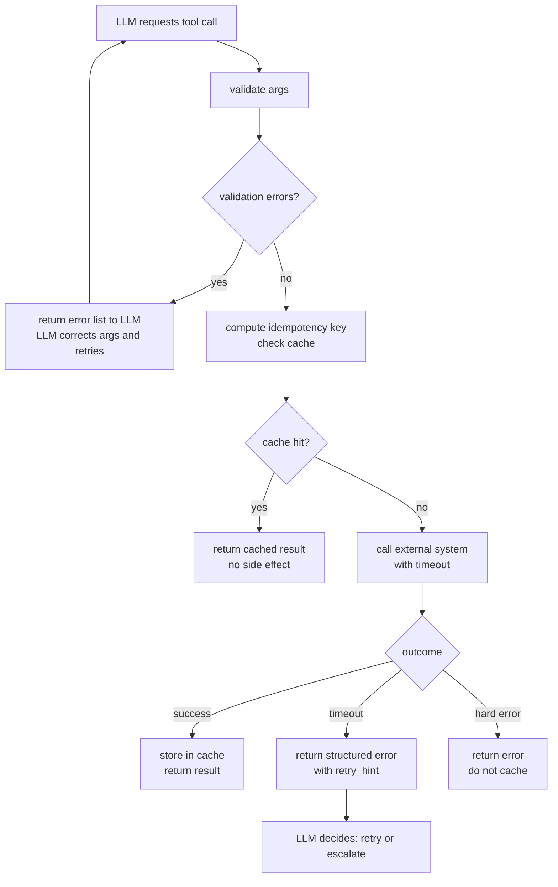

# Robust Tools: Idempotency, Timeouts, Validation

> A tool the agent can retry safely is worth ten tools the agent can only call once.

**Type:** Build
**Languages:** Python
**Prerequisites:** 03-01 function calling fundamentals, 03-02 tool schema design
**Time:** ~60 min
**Learning Objectives:**
- Explain why idempotency matters when agents can retry tool calls
- Implement an idempotency key cache that prevents duplicate side effects
- Wrap external calls with configurable timeouts and structured timeout errors
- Write pre-call validation that returns actionable errors to the LLM
- Compose all three properties in a single `RobustTool` base class

---

## THE PROBLEM

An agent sends an email via a `send_email` tool. The API times out after 5 seconds. The agent classifies this as a failure and retries. The email was already queued on the backend. The customer receives it twice.

A `create_order` tool takes 10 seconds. The agent's timeout fires at 8 seconds. The order was actually inserted into the database at second 6. The agent retries, creates a second order with a new ID. The customer is charged twice, fulfillment ships two boxes, and the support ticket lands in the inbox of someone who no longer works there.

These are not edge cases. Any agent running in production will retry. Networks are unreliable. Backend services are slow. Rate limits exist. The retry is not the bug. The bug is a tool that does not account for being called more than once.

There are three properties every production tool needs:

1. **Idempotency:** The same call with the same arguments produces the same result, no matter how many times it executes.
2. **Timeouts:** Every external call has a hard deadline, and the error it returns tells the LLM whether to retry or give up.
3. **Input validation:** Parameters are checked before the external call fires. Validation errors go back to the LLM as clear, correctable feedback, not as unhandled exceptions.

---

## THE CONCEPT

### Idempotency

An idempotent operation can be applied multiple times without changing the result beyond the first application. GET requests are naturally idempotent. POST requests to `create_order` are not.

The standard production fix is an idempotency key: a unique token that travels with the request. The backend stores the key and the result. On retry, the backend sees the same key and returns the cached result instead of re-executing.

For the agent layer, you implement the same pattern as a local cache keyed on the hash of the call signature.

```
Idempotency Cache

Same args → same key → cache HIT → return cached result (no side effect)
  ┌─────────────────────────────────────────────┐
  │  key = hash("send_email:alice@x.com:Hello") │
  │  cache = {"abc123": {"status": "sent"}}      │
  │  result = cache["abc123"]  ← no API call     │
  └─────────────────────────────────────────────┘

New args → new key → cache MISS → call external system → store result
  ┌─────────────────────────────────────────────┐
  │  key = hash("send_email:bob@x.com:Hi")      │
  │  cache = {}  (miss)                          │
  │  result = api.send(...)  ← real call fires   │
  │  cache["def456"] = result                    │
  └─────────────────────────────────────────────┘
```

### Timeouts

A timeout without a structured error is almost useless. The LLM needs to know two things when a call times out:

- Was the operation likely completed before the timeout? (If yes: do not retry, check status instead.)
- Is the error transient? (If yes: retry with backoff. If no: escalate.)

Structure your timeout error as a dict, not a plain exception string. Give it a `retry_hint` field the LLM can read.

### Input Validation

Validate before calling the external system. This is cheap. The cost of an invalid call is not just the wasted HTTP round trip: it is the external system's error message, which may be a cryptic 500 or a stack trace, neither of which helps the LLM recover.

Return a list of validation errors. If the list is non-empty, return it to the LLM. The LLM can correct the arguments and retry the tool call with valid inputs.

### Tool Call Lifecycle



---

## BUILD IT

### The RobustTool Base Class

The full implementation is in `code/main.py`. Here is the structure:

```python
import hashlib
import json
import concurrent.futures
from abc import ABC, abstractmethod
from typing import Any

class RobustTool(ABC):
    """Base class for tools that agents can retry safely."""

    def __init__(self, timeout_seconds: float = 10.0):
        self.timeout_seconds = timeout_seconds
        self._cache: dict[str, Any] = {}

    # --- Idempotency ---

    def idempotency_key(self, args: dict) -> str:
        """Hash the tool name + sorted args to produce a stable cache key."""
        payload = json.dumps(
            {"tool": self.__class__.__name__, "args": args},
            sort_keys=True,
        )
        return hashlib.sha256(payload.encode()).hexdigest()[:16]

    # --- Validation ---

    @abstractmethod
    def validate(self, args: dict) -> list[str]:
        """Return a list of validation error strings. Empty list means valid."""
        ...

    # --- Implementation ---

    @abstractmethod
    def _execute(self, args: dict) -> dict:
        """The actual external call. Implement in subclasses."""
        ...

    # --- Orchestrator ---

    def run(self, args: dict) -> dict:
        errors = self.validate(args)
        if errors:
            return {"ok": False, "error": "validation_failed", "details": errors}

        key = self.idempotency_key(args)
        if key in self._cache:
            return {**self._cache[key], "idempotent_replay": True}

        with concurrent.futures.ThreadPoolExecutor(max_workers=1) as ex:
            future = ex.submit(self._execute, args)
            try:
                result = future.result(timeout=self.timeout_seconds)
                self._cache[key] = result
                return result
            except concurrent.futures.TimeoutError:
                return {
                    "ok": False,
                    "error": "timeout",
                    "timeout_seconds": self.timeout_seconds,
                    "retry_hint": (
                        "The external system did not respond in time. "
                        "The operation may have succeeded on the backend. "
                        "Check status before retrying to avoid duplicates."
                    ),
                }
```

### The ChargeCustomer Tool

A concrete tool that demonstrates all three properties:

```python
import time
import random

class ChargeCustomer(RobustTool):
    def validate(self, args: dict) -> list[str]:
        errors = []
        if "customer_id" not in args:
            errors.append("customer_id is required")
        if "amount_cents" not in args:
            errors.append("amount_cents is required")
        elif not isinstance(args["amount_cents"], int):
            errors.append("amount_cents must be an integer (e.g. 1999 for $19.99)")
        elif args["amount_cents"] <= 0:
            errors.append("amount_cents must be positive")
        if "currency" not in args:
            errors.append("currency is required (e.g. 'usd')")
        return errors

    def _execute(self, args: dict) -> dict:
        # Simulate a slow payment API
        time.sleep(random.uniform(0.1, 0.5))
        return {
            "ok": True,
            "charge_id": f"ch_{args['customer_id']}_001",
            "amount_cents": args["amount_cents"],
            "status": "succeeded",
        }
```

### Demonstration

```python
tool = ChargeCustomer(timeout_seconds=5.0)

# Call 1: invalid args
result = tool.run({"customer_id": "cust_42", "amount_cents": "twenty dollars"})
# {"ok": False, "error": "validation_failed",
#  "details": ["amount_cents must be an integer..."]}

# Call 2: valid, first execution
result = tool.run({"customer_id": "cust_42", "amount_cents": 1999, "currency": "usd"})
# {"ok": True, "charge_id": "ch_cust_42_001", "status": "succeeded"}

# Call 3: same args again (agent retry simulation)
result = tool.run({"customer_id": "cust_42", "amount_cents": 1999, "currency": "usd"})
# {"ok": True, "charge_id": "ch_cust_42_001", "status": "succeeded",
#  "idempotent_replay": True}  ← no second charge fired
```

> **Real-world check:** Your payment provider offers idempotency keys at the API level. Why do you still want the idempotency cache in your tool layer, before the request even leaves your process?

The API-level key protects the payment provider from processing the charge twice. But your tool may fail AFTER the provider accepted the charge and BEFORE you receive the response. If you only rely on the provider's key, you need to propagate the same key through every retry. The tool-layer cache is simpler: it short-circuits before making the network call at all, which also saves latency and API costs on replays.

---

## USE IT

### Composing with Tenacity

`tenacity` is the production standard for retry logic in Python. It handles exponential backoff, jitter, and retry conditions declaratively. It composes cleanly with the idempotency cache: tenacity handles when to retry, the cache handles what happens if the retry reaches the tool.

Install: `pip install tenacity`

```python
from tenacity import (
    retry,
    stop_after_attempt,
    wait_exponential,
    retry_if_result,
)

class ChargeCustomerWithRetry(ChargeCustomer):
    """ChargeCustomer with automatic retry on transient errors."""

    @retry(
        stop=stop_after_attempt(3),
        wait=wait_exponential(multiplier=1, min=1, max=10),
        retry=retry_if_result(
            lambda r: r.get("error") == "timeout"
        ),
        reraise=False,
    )
    def run(self, args: dict) -> dict:
        return super().run(args)
```

The idempotency cache means retries are safe: if the first attempt succeeded and was cached, the second attempt returns the cached result immediately. If the first attempt timed out (no cache entry), the second attempt fires the real call.

```python
tool = ChargeCustomerWithRetry(timeout_seconds=5.0)
result = tool.run({"customer_id": "cust_99", "amount_cents": 500, "currency": "usd"})
# On timeout: tenacity retries up to 3 times with exponential backoff.
# On success: result is cached; any further retries return cache hit.
```

> **Perspective shift:** A teammate says "we can skip idempotency because tenacity will handle retries correctly." What is the one scenario where tenacity retries correctly but you still get a duplicate charge?

The scenario: the tool call fires, the payment provider processes the charge, the response travels back, and the network drops the response before your process receives it. Tenacity sees a network error and retries. The charge already happened. Tenacity does not know the operation succeeded because it never saw the success response. Idempotency is the only defense.

---

## SHIP IT

The artifact this lesson produces is a reusable tool design template and checklist. See `outputs/skill-robust-tool-design.md`.

The template includes the full `RobustTool` base class, a per-tool implementation checklist (validate, idempotency key, timeout handling, error classification), and a decision guide for choosing timeout values.

---

## EVALUATE IT

**Test idempotency directly.** Call the tool with the same args 10 times in a row. Count the number of times `_execute` is actually called. It should be exactly 1. If the external system is instrumented, verify it received exactly 1 request.

**Test timeout classification.** Mock `_execute` to sleep for longer than `timeout_seconds`. Verify the returned dict has `"error": "timeout"` and a `retry_hint` field. Verify no cache entry was written (the timed-out call should not be replayed as a success).

**Test validation gates.** For each required field, remove it from the args and verify the tool returns `"error": "validation_failed"` without touching the external system. Use a mock for `_execute` and assert it was never called.

**Measure retry amplification in staging.** Run the agent against a staging environment where 20% of tool calls return a transient error. Count total tool calls vs. unique operations completed. The ratio should stay close to 1.0 if idempotency is working. A ratio above 1.5 means retries are producing duplicate side effects.
