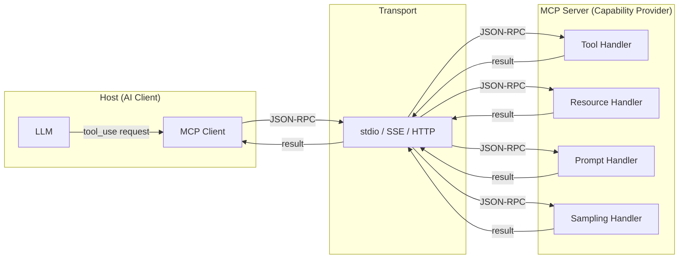

# أساسيات MCP: الأدوات، والموارد، والـ Prompts، والـ Sampling

> MCP هو منفذ USB-C لتكاملات الذكاء الاصطناعي: منفذ معياري واحد، وأي قدرة.

**النوع:** تعلّم
**اللغات:** Python
**المتطلبات:** 03-01 أساسيات استدعاء الدوال، إلمام أساسي بـ JSON-RPC
**الوقت:** ~60 دقيقة
**أهداف التعلّم:**
- توضيح مشكلة التكامل O(N*M) التي يحلّها MCP
- وصف بدائيات MCP الأربع (primitives) ومتى تُستخدم كل واحدة
- قراءة وكتابة رسائل MCP JSON-RPC صالحة يدويًا
- بناء تعريف خادم MCP بسيط باستخدام قواميس Python خام
- تنفيذ الخادم ذاته باستخدام `mcp` Python SDK الرسمي

---

## المشكلة

ثلاثة فرق ذكاء اصطناعي في الشركة ذاتها، كل منها يحتاج إلى منح الـ LLM وصولًا إلى قاعدة المعرفة الداخلية. الفريق A يبني غلاف REST. الفريق B يبني جسر gRPC. الفريق C يكتب محوّل JSON-RPC. كل واحد يعمل مع عميل ذكاء اصطناعي واحد بالضبط (عميلهم هم)، ولا أيٌّ منها يعمل مع أي أداة ذكاء اصطناعي من طرف ثالث.

فريق رابع يريد استخدام مساعد برمجة ذكاء اصطناعي جاهز. يحتاجون إلى ربطه بقاعدة المعرفة ذاتها. لا أيٌّ من التكاملات الثلاثة القائمة متوافق. فيبنون محوّلًا رابعًا.

هذه هي مشكلة التكامل N*M: N من عملاء الذكاء الاصطناعي ضرب M من مزوّدي القدرات، كل منها يتطلّب تكاملًا مفصّلًا على المقاس. خمسة عملاء ذكاء اصطناعي وعشرة مصادر بيانات يعني خمسين محوّلًا لمرة واحدة لبنائها واختبارها وصيانتها.

حلّت صناعة البرمجيات نسخة من هذه المشكلة لقواعد البيانات بـ ODBC، ولخدمات الويب باصطلاحات REST، وللأجهزة بـ USB. وصناعة الذكاء الاصطناعي احتاجت الشيء ذاته: بروتوكول معياري يستطيع أي عميل ذكاء اصطناعي التحدّث به وأي مزوّد قدرات تنفيذه. هذا هو MCP.

---

## المفهوم

### معمارية MCP

يعرّف MCP (Model Context Protocol) بروتوكول سلك (wire protocol) من نوع JSON-RPC 2.0 بين دورين:

- **المضيف (Host):** تطبيق الذكاء الاصطناعي الذي يتحكّم بالـ LLM والمحادثة (Claude Desktop، وكيل مخصّص، إضافة لبيئة تطوير IDE)
- **خادم MCP (MCP Server):** عملية توفّر قدرات (أدوات، بيانات، prompts) للمضيف

يتصل المضيف بخادم واحد أو أكثر. كل خادم يعلن عمّا يقدّمه. يتفاوض المضيف على القدرات عند بدء التشغيل ويوجّه الطلبات وقت التشغيل.



### البدائيات الأربع (The Four Primitives)

يعرّف MCP أربعة أنواع بدائية بالضبط. كل قدرة يقدّمها الخادم هي واحدة من هذه الأربع:

**1. الأدوات (Tools)** - دوال قابلة للاستدعاء يستطيع الـ LLM استحضارها لاتخاذ إجراءات أو استرجاع بيانات عند الطلب. مكافئة لـ function calling، لكنها معيارية. الـ LLM يطلب التنفيذ؛ المضيف يستدعي الأداة ويُرجع النتيجة.

مثال: `create_issue(title, body, labels)`، `search_files(query)`، `send_email(to, subject, body)`

**2. الموارد (Resources)** - بيانات قابلة للقراءة معروضة كـ URIs. يستطيع المضيف أو الـ LLM جلب مورد عبر الـ URI. الموارد مخصّصة للبيانات التي ينبغي للـ LLM قراءتها لا تعديلها. فكّر فيها كنظام ملفات منظّم للقراءة فقط فوق بياناتك.

مثال: `repo://owner/repo/README.md`، `db://customers/cust_42`، `config://app/settings.json`

**3. الـ Prompts** - قوالب prompt قابلة لإعادة الاستخدام يقدّمها الخادم. الـ prompt هو قالب مسمّى ذو معاملات؛ يملأ الخادم القالب ويُرجع الرسائل الناتجة. هذا يتيح للخوادم تغليف معرفة الـ prompting الخاصة بمجال معين جنبًا إلى جنب مع قدراتها.

مثال: `summarize_pr(pr_number)`، `explain_error(stack_trace)`، `write_commit_message(diff)`

**4. الـ Sampling** - استدلال LLM يبادر به الخادم. يطلب الخادم من المضيف تشغيل الـ LLM نيابة عنه. هذه هي البدائية الوحيدة التي تتدفّق من الخادم إلى المضيف بدلًا من المضيف إلى الخادم. استخدمها عندما يحتاج الخادم إلى توليد نص كجزء من تلبية طلب.

مثال: خادم تحليل شفرة يستدعي الـ sampling لتلخيص ملف قبل إرجاعه كمورد.

```
The Four Primitives at a Glance

Primitive   Direction       Who initiates     Primary use
----------  --------------  ----------------  ----------------------------------
Tools       Host → Server   LLM / agent       Action execution, on-demand lookup
Resources   Host → Server   Host or LLM       Read structured data by URI
Prompts     Host → Server   Host or LLM       Load reusable prompt templates
Sampling    Server → Host   MCP Server        Server-side LLM inference

Tools       = "do this thing"
Resources   = "give me this data"
Prompts     = "give me a prompt template"
Sampling    = "please run the LLM for me"
```

### تنسيق سلك JSON-RPC (JSON-RPC Wire Format)

يستخدم MCP الـ JSON-RPC 2.0. كل رسالة كائن JSON بحقل إصدار `jsonrpc`، واسم method، وparams، وid. إليك كيف يبدو استدعاء أداة على السلك، مقارنًا باستجابته:

```
Request                                 Response
--------------------------------------  --------------------------------------
{                                       {
  "jsonrpc": "2.0",                       "jsonrpc": "2.0",
  "id": 1,                                "id": 1,
  "method": "tools/call",                 "result": {
  "params": {                               "content": [
    "name": "search_products",               {
    "arguments": {                             "type": "text",
      "query": "wireless keyboard",            "text": "[{\"id\": \"P42\", ..."
      "limit": 5                             }
    }                                      ],
  }                                        "isError": false
}                                        }
                                        }
```

### تسلسل تهيئة MCP (MCP Initialization Sequence)

قبل أي استدعاءات أدوات أو قراءات موارد، يتبادل المضيف والخادم القدرات:

```
Host                          Server
  |                             |
  |-- initialize request ------>|
  |   (protocol version,        |
  |    client capabilities)     |
  |                             |
  |<-- initialize response -----|
  |   (server name, version,    |
  |    capabilities: tools,     |
  |    resources, prompts)      |
  |                             |
  |-- initialized notify ------>|
  |   (handshake complete)      |
  |                             |
  |-- tools/list request ------>|
  |<-- tools/list response -----|
  |   (list of tool schemas)    |
  |                             |
  |   (now ready to call tools) |
```

---

## البناء

### تعريف خادم MCP خام

يخفي `mcp` SDK آليّة JSON-RPC خلف مُزخرِفات (decorators). قبل استخدامه، اقرأ تنسيق السلك يدويًا. هذا هو التمثيل البسيط بلغة Python لخادم MCP يعرّف البدائيات الأربع كلها:

```python
# Raw MCP protocol representation - no SDK, pure Python dicts
# This is what the SDK generates under the hood.

MCP_SERVER_DEFINITION = {
    # Sent in initialize response
    "serverInfo": {
        "name": "github-mcp-server",
        "version": "1.0.0",
    },
    "capabilities": {
        "tools": {"listChanged": False},
        "resources": {"subscribe": False, "listChanged": False},
        "prompts": {"listChanged": False},
        "sampling": {},
    },

    # tools/list response
    "tools": [
        {
            "name": "create_issue",
            "description": "Create a GitHub issue in a repository",
            "inputSchema": {
                "type": "object",
                "properties": {
                    "owner": {"type": "string", "description": "Repo owner"},
                    "repo": {"type": "string", "description": "Repo name"},
                    "title": {"type": "string", "description": "Issue title"},
                    "body": {"type": "string", "description": "Issue body (markdown)"},
                },
                "required": ["owner", "repo", "title"],
            },
        }
    ],

    # resources/list response
    "resources": [
        {
            "uri": "repo://owner/repo/README.md",
            "name": "Repository README",
            "description": "The root README for a repository",
            "mimeType": "text/markdown",
        }
    ],

    # prompts/list response
    "prompts": [
        {
            "name": "summarize_pr",
            "description": "Generate a summary of a pull request",
            "arguments": [
                {"name": "pr_number", "description": "PR number to summarize", "required": True},
                {"name": "include_diff", "description": "Include diff in summary", "required": False},
            ],
        }
    ],
}
```

رسائل السلك هي كائنات JSON-RPC 2.0. تدفّق التهيئة الكامل + استدعاء الأداة بلغة Python خام:

```python
import json

def make_request(method: str, params: dict, id: int) -> str:
    return json.dumps({"jsonrpc": "2.0", "id": id, "method": method, "params": params})

def make_response(result: dict, id: int) -> str:
    return json.dumps({"jsonrpc": "2.0", "id": id, "result": result})

def make_notification(method: str, params: dict) -> str:
    # Notifications have no id (no response expected)
    return json.dumps({"jsonrpc": "2.0", "method": method, "params": params})

# Step 1: Host sends initialize
init_request = make_request("initialize", {
    "protocolVersion": "2024-11-05",
    "capabilities": {"sampling": {}},
    "clientInfo": {"name": "my-host", "version": "1.0"},
}, id=1)

# Step 2: Server responds with capabilities
init_response = make_response({
    "protocolVersion": "2024-11-05",
    "capabilities": MCP_SERVER_DEFINITION["capabilities"],
    "serverInfo": MCP_SERVER_DEFINITION["serverInfo"],
}, id=1)

# Step 3: Host sends initialized notification (no response)
initialized_notify = make_notification("notifications/initialized", {})

# Step 4: Host requests tool list
tools_list_request = make_request("tools/list", {}, id=2)

# Step 5: Server responds with tools
tools_list_response = make_response(
    {"tools": MCP_SERVER_DEFINITION["tools"]}, id=2
)

# Step 6: Host calls a tool
tool_call_request = make_request("tools/call", {
    "name": "create_issue",
    "arguments": {
        "owner": "acme",
        "repo": "backend",
        "title": "Fix auth token expiry",
        "body": "The token expiry is hardcoded to 1 hour. Make it configurable.",
    },
}, id=3)
```

انظر `code/main.py` للعرض التوضيحي الكامل القابل للتشغيل مع تبادل رسائل محاكى.

> **اختبار من الواقع:** يقول زميل في الفريق: "لدينا function calling بالفعل، فلماذا نحتاج MCP؟" ما السيناريو الوحيد الذي لا يستطيع فيه function calling وحده حلّ المشكلة؟

function calling هو بروتوكول بين عميل LLM واحد وتعريفات أدواته الخاصة. لا يمكن اكتشافه من تطبيق ذكاء اصطناعي مختلف لا يتحكّم به فريقك. MCP هو الطبقة التي تتيح لأي مضيف متوافق اكتشاف قدراتك واستخدامها: Claude Desktop، إضافة بيئة تطوير IDE، وكيل منافس. من دون MCP، يحتاج كل عميل ذكاء اصطناعي جديد تكاملًا مخصّصًا مع أدوات فريقك.

---

## الاستخدام

### الخادم ذاته باستخدام `mcp` SDK

التثبيت: `pip install mcp`

يتولّى الـ SDK تأطير رسائل JSON-RPC، والنقل (transport)، ومصافحة التهيئة (handshake)، والتوجيه (routing). أنت تكتب فقط تعريفات القدرات والمعالِجات (handlers):

```python
from mcp.server.fastmcp import FastMCP

mcp = FastMCP("github-mcp-server")

# --- Tools ---

@mcp.tool()
def create_issue(owner: str, repo: str, title: str, body: str = "") -> dict:
    """Create a GitHub issue in a repository."""
    # Real implementation would call the GitHub API here
    return {
        "issue_number": 42,
        "url": f"https://github.com/{owner}/{repo}/issues/42",
        "title": title,
        "state": "open",
    }

# --- Resources ---

@mcp.resource("repo://{owner}/{repo}/README.md")
def get_readme(owner: str, repo: str) -> str:
    """Read a repository's README."""
    return f"# {repo}\n\nThis is the README for {owner}/{repo}."

# --- Prompts ---

@mcp.prompt()
def summarize_pr(pr_number: str, include_diff: bool = False) -> str:
    """Generate a prompt to summarize a pull request."""
    base = f"Summarize pull request #{pr_number}. Focus on what changed and why."
    if include_diff:
        base += " Include a section on the specific code changes."
    return base

# Run on stdio transport (standard for Claude Desktop)
if __name__ == "__main__":
    mcp.run(transport="stdio")
```

قارن ذلك بالتعريف الخام أعلاه. الـ SDK يزيل:
- البناء اليدوي لرسائل JSON-RPC
- التفاوض على القدرات والمصافحة
- توجيه الطلبات وتوزيعها
- تسلسل الأنواع (type serialization)

ما يُبقيه: منطق أداتك، وURIs الموارد، وقوالب الـ prompt لديك.

> **نقلة في المنظور:** يسأل زميل لماذا يعرّف MCP أربعة أنواع بدائية متميّزة بدلًا من مجرّد "أدوات". ما الشيء الوحيد الذي لا تستطيعه الأدوات وتفعله الموارد بشكل أفضل؟

الأداة تُرجع بيانات كنتيجة تنفيذ. أما المورد فهو قطعة بيانات مسمّاة وقابلة للعنونة (addressable) يستطيع المضيف الاشتراك فيها، أو جلبها مسبقًا، أو إدراجها دون استحضار أي منطق. للموارد URIs ثابتة يستطيع المضيف تخزينها مؤقتًا، وإدراجها استباقيًا في نوافذ السياق، وعرضها للمستخدمين ككتالوج قابل للتصفّح. أداة تُرجع بيانات فقط تعمل، لكنها غير قابلة للإدراج، وغير قابلة للاشتراك، ولا يمكن تمييزها عن إجراء يعدّل البيانات. الموارد تعطي المضيف إشارة دلالية عمّا هو آمن لجلبه مسبقًا.

---

## التسليم

المنتَج (artifact) الذي ينتجه هذا الدرس هو ورقة مرجعية للنموذج الذهني لـ MCP وجدول قرارات معماري. انظر `outputs/skill-mcp-mental-model.md`.

تغطّي الورقة المرجعية البدائيات الأربع مع معايير القرار، وملخّص تنسيق سلك JSON-RPC، وجدولًا لاختيار أي بدائية تُستخدم لنوع قدرة معيّن.

---

## التقييم

**اختبر النموذج الذهني.** لكل ممّا يلي، سمِّ البدائية الصحيحة واشرح لماذا: (1) "جلب سعر السهم الحالي،" (2) "إدراج كل تذاكر الدعم المفتوحة،" (3) "كتابة رسالة commit لهذا الـ diff،" (4) "خادم تلخيص يحتاج إلى استدعاء الـ LLM قبل إرجاع نتيجة."

الإجابات المتوقّعة: (1) Tool (إجراء عند الطلب بنتيجة متغيّرة)، (2) Resource (ثابت، قابل للعنونة، قابل للإدراج)، (3) Prompt (قالب قابل لإعادة الاستخدام يملكه الخادم)، (4) Sampling (استدلال LLM يبادر به الخادم).

**اختبر تنسيق السلك.** دون النظر إلى التوثيق، اكتب JSON لطلب `initialize` واستجابة `tools/list`. تحقّق من حقول JSON-RPC لديك: `jsonrpc`، `id`، `method`، `params` للطلبات؛ `jsonrpc`، `id`، `result` للاستجابات. الإشعارات (Notifications) تحذف حقل `id`.

**اختبر الـ SDK.** شغّل خادم الـ SDK من قسم الاستخدام، اتصل به بـ `mcp dev`، وتحقّق من: قائمة الأدوات تُظهر `create_issue`، وقائمة الموارد تُظهر URI الخاص بـ README، وقائمة الـ prompts تُظهر `summarize_pr`. استدعِ كلًّا منها وتأكّد من أن بنية الاستجابة تطابق التنسيق المتوقّع.

**تحقّق من حساب N*M.** عُدّ تكاملات الذكاء الاصطناعي الحالية لفريقك: كم عميل ذكاء اصطناعي، وكم مزوّد قدرات. إن كانت الإجابة أكثر من عميلين أو 3 مزوّدين، فإن MCP يعطي مكسبًا ملموسًا في تقليل صيانة المحوّلات.
