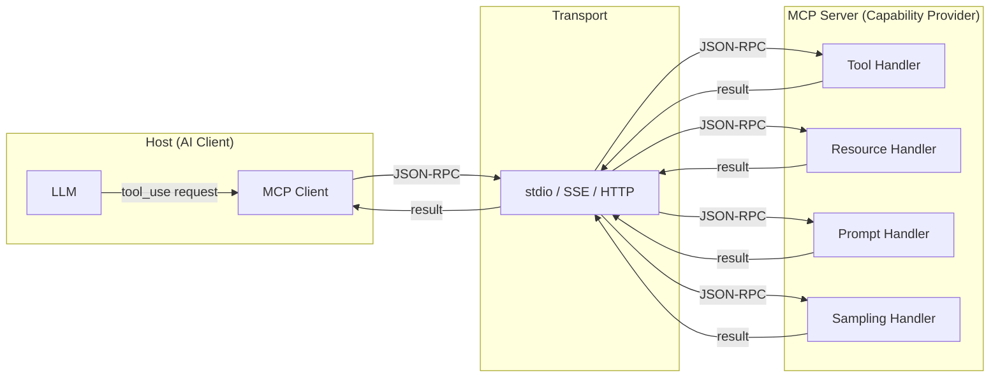

# MCP Fundamentals: Tools, Resources, Prompts, Sampling

> MCP is the USB-C of AI integrations: one standard port, any capability.

**Type:** Learn
**Languages:** Python
**Prerequisites:** 03-01 function calling fundamentals, basic familiarity with JSON-RPC
**Time:** ~60 min
**Learning Objectives:**
- Explain the O(N*M) integration problem that MCP solves
- Describe the four MCP primitives and when to use each one
- Read and write valid MCP JSON-RPC messages by hand
- Build a minimal MCP server definition using raw Python dicts
- Implement the same server using the official `mcp` Python SDK

---

## THE PROBLEM

Three AI teams at the same company each need to give their LLM access to the internal knowledge base. Team A builds a REST wrapper. Team B builds a gRPC bridge. Team C writes a JSON-RPC adapter. Each one works with exactly one AI client (their own) and none of them work with any third-party AI tool.

A fourth team wants to use an off-the-shelf AI coding assistant. They need to connect it to the same knowledge base. None of the three existing integrations is compatible. They build a fourth adapter.

This is the N*M integration problem: N AI clients times M capability providers, each requiring a bespoke integration. Five AI clients and ten data sources is fifty one-off adapters to build, test, and maintain.

The software industry solved a version of this problem for databases with ODBC, for web services with REST conventions, and for devices with USB. The AI industry needed the same thing: a standard protocol that any AI client can speak and any capability provider can implement. That is MCP.

---

## THE CONCEPT

### MCP Architecture

MCP (Model Context Protocol) defines a JSON-RPC 2.0 wire protocol between two roles:

- **Host:** the AI application that controls the LLM and the conversation (Claude Desktop, a custom agent, an IDE plugin)
- **MCP Server:** a process that provides capabilities (tools, data, prompts) to the host

The host connects to one or more servers. Each server declares what it offers. The host negotiates capabilities on startup and routes requests at runtime.



### The Four Primitives

MCP defines exactly four primitive types. Every capability a server offers is one of these four:

**1. Tools** - Callable functions the LLM can invoke to take actions or retrieve data on demand. Equivalent to function calling, but standardized. The LLM requests execution; the host calls the tool and returns the result.

Example: `create_issue(title, body, labels)`, `search_files(query)`, `send_email(to, subject, body)`

**2. Resources** - Readable data exposed as URIs. The host or LLM can fetch a resource by URI. Resources are for data the LLM should read but not mutate. Think of them as a structured read-only file system over your data.

Example: `repo://owner/repo/README.md`, `db://customers/cust_42`, `config://app/settings.json`

**3. Prompts** - Reusable prompt templates the server offers. A prompt is a named template with parameters; the server fills in the template and returns the resulting messages. This lets servers package domain-specific prompting knowledge alongside their capabilities.

Example: `summarize_pr(pr_number)`, `explain_error(stack_trace)`, `write_commit_message(diff)`

**4. Sampling** - Server-initiated LLM inference. The server asks the host to run the LLM on its behalf. This is the only primitive that flows from server to host rather than host to server. Use it when the server needs to generate text as part of fulfilling a request.

Example: A code analysis server calls sampling to summarize a file before returning it as a resource.

```
The Four Primitives at a Glance

Primitive   Direction       Who initiates     Primary use
----------  --------------  ----------------  ----------------------------------
Tools       Host → Server   LLM / agent       Action execution, on-demand lookup
Resources   Host → Server   Host or LLM       Read structured data by URI
Prompts     Host → Server   Host or LLM       Load reusable prompt templates
Sampling    Server → Host   MCP Server        Server-side LLM inference

Tools       = "do this thing"
Resources   = "give me this data"
Prompts     = "give me a prompt template"
Sampling    = "please run the LLM for me"
```

### JSON-RPC Wire Format

MCP uses JSON-RPC 2.0. Every message is a JSON object with a `jsonrpc` version field, a method name, params, and an id. Here is what a tool call looks like on the wire, compared to its response:

```
Request                                 Response
--------------------------------------  --------------------------------------
{                                       {
  "jsonrpc": "2.0",                       "jsonrpc": "2.0",
  "id": 1,                                "id": 1,
  "method": "tools/call",                 "result": {
  "params": {                               "content": [
    "name": "search_products",               {
    "arguments": {                             "type": "text",
      "query": "wireless keyboard",            "text": "[{\"id\": \"P42\", ..."
      "limit": 5                             }
    }                                      ],
  }                                        "isError": false
}                                        }
                                        }
```

### MCP Initialization Sequence

Before any tool calls or resource reads, host and server exchange capabilities:

```
Host                          Server
  |                             |
  |-- initialize request ------>|
  |   (protocol version,        |
  |    client capabilities)     |
  |                             |
  |<-- initialize response -----|
  |   (server name, version,    |
  |    capabilities: tools,     |
  |    resources, prompts)      |
  |                             |
  |-- initialized notify ------>|
  |   (handshake complete)      |
  |                             |
  |-- tools/list request ------>|
  |<-- tools/list response -----|
  |   (list of tool schemas)    |
  |                             |
  |   (now ready to call tools) |
```

---

## BUILD IT

### A Raw MCP Server Definition

The `mcp` SDK hides the JSON-RPC machinery behind decorators. Before using it, read the wire format by hand. This is the minimal Python representation of an MCP server that defines all four primitives:

```python
# Raw MCP protocol representation - no SDK, pure Python dicts
# This is what the SDK generates under the hood.

MCP_SERVER_DEFINITION = {
    # Sent in initialize response
    "serverInfo": {
        "name": "github-mcp-server",
        "version": "1.0.0",
    },
    "capabilities": {
        "tools": {"listChanged": False},
        "resources": {"subscribe": False, "listChanged": False},
        "prompts": {"listChanged": False},
        "sampling": {},
    },

    # tools/list response
    "tools": [
        {
            "name": "create_issue",
            "description": "Create a GitHub issue in a repository",
            "inputSchema": {
                "type": "object",
                "properties": {
                    "owner": {"type": "string", "description": "Repo owner"},
                    "repo": {"type": "string", "description": "Repo name"},
                    "title": {"type": "string", "description": "Issue title"},
                    "body": {"type": "string", "description": "Issue body (markdown)"},
                },
                "required": ["owner", "repo", "title"],
            },
        }
    ],

    # resources/list response
    "resources": [
        {
            "uri": "repo://owner/repo/README.md",
            "name": "Repository README",
            "description": "The root README for a repository",
            "mimeType": "text/markdown",
        }
    ],

    # prompts/list response
    "prompts": [
        {
            "name": "summarize_pr",
            "description": "Generate a summary of a pull request",
            "arguments": [
                {"name": "pr_number", "description": "PR number to summarize", "required": True},
                {"name": "include_diff", "description": "Include diff in summary", "required": False},
            ],
        }
    ],
}
```

The wire messages are JSON-RPC 2.0 objects. The full initialization + tool call flow in raw Python:

```python
import json

def make_request(method: str, params: dict, id: int) -> str:
    return json.dumps({"jsonrpc": "2.0", "id": id, "method": method, "params": params})

def make_response(result: dict, id: int) -> str:
    return json.dumps({"jsonrpc": "2.0", "id": id, "result": result})

def make_notification(method: str, params: dict) -> str:
    # Notifications have no id (no response expected)
    return json.dumps({"jsonrpc": "2.0", "method": method, "params": params})

# Step 1: Host sends initialize
init_request = make_request("initialize", {
    "protocolVersion": "2024-11-05",
    "capabilities": {"sampling": {}},
    "clientInfo": {"name": "my-host", "version": "1.0"},
}, id=1)

# Step 2: Server responds with capabilities
init_response = make_response({
    "protocolVersion": "2024-11-05",
    "capabilities": MCP_SERVER_DEFINITION["capabilities"],
    "serverInfo": MCP_SERVER_DEFINITION["serverInfo"],
}, id=1)

# Step 3: Host sends initialized notification (no response)
initialized_notify = make_notification("notifications/initialized", {})

# Step 4: Host requests tool list
tools_list_request = make_request("tools/list", {}, id=2)

# Step 5: Server responds with tools
tools_list_response = make_response(
    {"tools": MCP_SERVER_DEFINITION["tools"]}, id=2
)

# Step 6: Host calls a tool
tool_call_request = make_request("tools/call", {
    "name": "create_issue",
    "arguments": {
        "owner": "acme",
        "repo": "backend",
        "title": "Fix auth token expiry",
        "body": "The token expiry is hardcoded to 1 hour. Make it configurable.",
    },
}, id=3)
```

See `code/main.py` for the full runnable demonstration with simulated message exchange.

> **Real-world check:** A teammate says "we already have function calling, why do we need MCP?" What is the one scenario where function calling alone cannot solve the problem?

Function calling is a protocol between a single LLM client and its own tool definitions. It cannot be discovered by a different AI application that your team does not control. MCP is the layer that lets any compliant host discover and use your capabilities: Claude Desktop, an IDE plugin, a competitor's agent. Without MCP, each new AI client needs a custom integration with your team's tools.

---

## USE IT

### The Same Server with the `mcp` SDK

Install: `pip install mcp`

The SDK handles the JSON-RPC message framing, transport, initialization handshake, and routing. You write only the capability definitions and handlers:

```python
from mcp.server.fastmcp import FastMCP

mcp = FastMCP("github-mcp-server")

# --- Tools ---

@mcp.tool()
def create_issue(owner: str, repo: str, title: str, body: str = "") -> dict:
    """Create a GitHub issue in a repository."""
    # Real implementation would call the GitHub API here
    return {
        "issue_number": 42,
        "url": f"https://github.com/{owner}/{repo}/issues/42",
        "title": title,
        "state": "open",
    }

# --- Resources ---

@mcp.resource("repo://{owner}/{repo}/README.md")
def get_readme(owner: str, repo: str) -> str:
    """Read a repository's README."""
    return f"# {repo}\n\nThis is the README for {owner}/{repo}."

# --- Prompts ---

@mcp.prompt()
def summarize_pr(pr_number: str, include_diff: bool = False) -> str:
    """Generate a prompt to summarize a pull request."""
    base = f"Summarize pull request #{pr_number}. Focus on what changed and why."
    if include_diff:
        base += " Include a section on the specific code changes."
    return base

# Run on stdio transport (standard for Claude Desktop)
if __name__ == "__main__":
    mcp.run(transport="stdio")
```

Compare that to the raw definition above. The SDK eliminates:
- Manual JSON-RPC message construction
- Capability negotiation and handshake
- Request routing and dispatch
- Type serialization

What it keeps: your tool logic, your resource URIs, your prompt templates.

> **Perspective shift:** A colleague asks why MCP defines four distinct primitive types instead of just "tools." What is the one thing Tools cannot do that Resources do better?

A Tool returns data as the result of an execution. A Resource is a named, addressable piece of data that the host can subscribe to, pre-fetch, or list without invoking any logic. Resources have stable URIs the host can cache, include in context windows proactively, and list to users as a browsable catalog. A Tool that just returns data works, but it is un-listable, un-subscribable, and indistinguishable from a data-mutating action. Resources give the host semantic signal about what is safe to pre-fetch.

---

## SHIP IT

The artifact this lesson produces is the MCP mental model cheat sheet and architecture decision table. See `outputs/skill-mcp-mental-model.md`.

The cheat sheet covers the four primitives with decision criteria, the JSON-RPC wire format summary, and a table for deciding which primitive to use for a given capability type.

---

## EVALUATE IT

**Test the mental model.** For each of the following, name the correct primitive and explain why: (1) "fetch the current stock price," (2) "list all open support tickets," (3) "write a commit message for this diff," (4) "a summarization server needs to call the LLM before returning a result."

Expected answers: (1) Tool (on-demand action with variable result), (2) Resource (stable, addressable, listable), (3) Prompt (reusable template the server owns), (4) Sampling (server-initiated LLM inference).

**Test the wire format.** Without looking at docs, write the JSON for an `initialize` request and a `tools/list` response. Verify your JSON-RPC fields: `jsonrpc`, `id`, `method`, `params` for requests; `jsonrpc`, `id`, `result` for responses. Notifications omit the `id` field.

**Test the SDK.** Run the SDK server from USE IT, connect to it with `mcp dev`, and verify: tools list shows `create_issue`, resources list shows the README URI, prompts list shows `summarize_pr`. Call each one and confirm the response structure matches the expected format.

**Check the N*M math.** Count your team's current AI integrations: how many AI clients, how many capability providers. If the answer is more than 2 clients or 3 providers, MCP gives a concrete payoff in reduced adapter maintenance.
