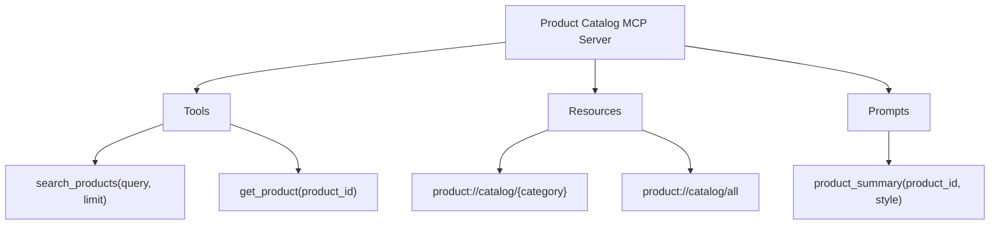

# بناء خادم MCP: Python + TypeScript

> خادم واحد، ثلاث بدائيات، أي عميل ذكاء اصطناعي.

**النوع:** بناء
**اللغات:** كلاهما (Python + TypeScript)
**المتطلبات:** 03-06 أساسيات MCP
**الوقت:** ~75 دقيقة
**أهداف التعلّم:**
- بناء خادم MCP كامل في Python باستخدام `FastMCP` مع أدوات، وموارد، وprompts
- تنفيذ حماية من حقن SQL (SQL injection) في معالِج أداة MCP
- بناء الخادم ذاته في TypeScript باستخدام `@modelcontextprotocol/sdk`
- ضبط Claude Desktop للاتصال بكلا متغيّري الخادم
- توضيح تدفّق رسائل نقل stdio بين العميل والخادم

---

## المشكلة

يحافظ فريقك على قاعدة بيانات PostgreSQL بها 50,000 سجلّ منتج. ثلاثة تطبيقات ذكاء اصطناعي مختلفة تحتاج إلى الاستعلام منها: روبوت دردشة موجّه للعملاء، ومساعد منتجات داخلي (copilot)، وميزة بحث في بوّابة العملاء.

حاليًا، لكل تطبيق طبقة اتصال قاعدة بيانات خاصة به. لكل منها باني استعلامات SQL خاص. لكل منها حمايات مختلفة من حقن SQL. حماية روبوت الدردشة رُقّعت قبل ثلاثة أشهر بعد مراجعة أمنية. حماية البوّابة لم تُحدَّث قطّ. مساعد المنتجات (copilot) يستخدم استيفاء السلاسل النصية (string interpolation) مباشرة.

كل تغيير في المخطّط (schema) يتطلّب تحديث ثلاث قواعد شفرة منفصلة. كل إصلاح أمني عليه أن يُطبَّق ثلاث مرات، من ثلاثة فرق مختلفة، وفق ثلاثة جداول زمنية مختلفة.

يحلّ خادم MCP هذا بمركزة واجهة قاعدة البيانات. تتصل تطبيقات الذكاء الاصطناعي الثلاثة كلها بخادم واحد. الخادم يملك منطق الاستعلام، والتعقيم (sanitization)، ومعرفة المخطّط. تغيير المخطّط أو الإصلاح الأمني يحدث مرة واحدة.

---

## المفهوم

### ماذا يبني هذا الدرس

خادم MCP لكتالوج منتجات بثلاث بدائيات:

- **أداة (Tool):** `search_products(query, limit)` - بحث بالنص الكامل مع حماية من حقن SQL
- **مورد (Resource):** `product://catalog/{category}` - قائمة منتجات منظّمة حسب الفئة
- **prompt:** `product_summary` - قالب prompt لتوليد ملخّصات المنتجات

يستخدم الخادم SQLite في الذاكرة (in-memory) للعرض التوضيحي. في الإنتاج، استبدل اتصال SQLite بـ psycopg2 أو asyncpg بالواجهة ذاتها.

### خريطة بدائيات الخادم



### تدفّق رسائل نقل Stdio

يطلق Claude Desktop الخادم كعملية ابنة (child process) ويتواصل عبر stdin/stdout. يقرأ الخادم رسائل JSON-RPC من stdin ويكتب الاستجابات إلى stdout. أما stderr فهو للسجلّات فقط.

```
Claude Desktop Process          MCP Server Process
        |                              |
        |-- spawn(python server.py) -->|
        |                              | (server starts, prints nothing to stdout yet)
        |-- stdin: initialize -------->|
        |<- stdout: init response -----|
        |-- stdin: initialized ------->|  (notification, no response)
        |-- stdin: tools/list -------->|
        |<- stdout: tools response ----|
        |                              |
        | (user asks product question) |
        |-- stdin: tools/call -------->|
        |<- stdout: tool result -------|
        |                              |
        | (user asks for category)     |
        |-- stdin: resources/read ---->|
        |<- stdout: resource result ---|
```

كل رسالة كائن JSON مفصول بسطر جديد (newline-delimited). يجب على الخادم ألّا يطبع أي شيء إلى stdout قبل أول رسالة JSON-RPC، وإلا فسيفشل المضيف في تحليل المُخرَج.

---

## البناء

### خادم MCP بلغة Python

التنفيذ الكامل في `code/main.py`. إليك الخادم كاملًا:

```python
import json
import sqlite3
from mcp.server.fastmcp import FastMCP

mcp = FastMCP("product-catalog")

# --- Database setup ---

def get_db() -> sqlite3.Connection:
    conn = sqlite3.connect(":memory:")
    conn.row_factory = sqlite3.Row
    conn.execute("""
        CREATE TABLE IF NOT EXISTS products (
            id TEXT PRIMARY KEY,
            name TEXT NOT NULL,
            category TEXT NOT NULL,
            price_cents INTEGER NOT NULL,
            description TEXT,
            in_stock INTEGER DEFAULT 1
        )
    """)
    # Seed with demo data
    products = [
        ("P001", "Mechanical Keyboard", "electronics", 12999, "TKL, Cherry MX Brown", 1),
        ("P002", "USB-C Hub 7-port", "electronics", 4999, "4K HDMI, 100W PD", 1),
        ("P003", "Standing Desk Mat", "office", 3499, "Anti-fatigue, 36x24 inches", 1),
        ("P004", "Monitor Arm", "office", 8999, "Gas spring, dual monitor", 1),
        ("P005", "Wireless Headphones", "electronics", 19999, "ANC, 30hr battery", 0),
        ("P006", "Laptop Stand", "office", 5999, "Aluminum, adjustable height", 1),
        ("P007", "Webcam 4K", "electronics", 14999, "Auto-focus, low light", 1),
        ("P008", "Cable Management Kit", "office", 1299, "Velcro + clips + tray", 1),
    ]
    conn.executemany(
        "INSERT OR IGNORE INTO products VALUES (?,?,?,?,?,?)", products
    )
    conn.commit()
    return conn

# Module-level connection (reused across calls in the same server process)
_db: sqlite3.Connection | None = None

def db() -> sqlite3.Connection:
    global _db
    if _db is None:
        _db = get_db()
    return _db

# --- Tool: search_products ---

@mcp.tool()
def search_products(query: str, limit: int = 10) -> list[dict]:
    """
    Search products by name or description.

    Uses parameterized queries (no string interpolation) to prevent
    SQL injection. Limit is clamped to 1-50.
    """
    if not query or not query.strip():
        return []

    safe_limit = max(1, min(50, limit))
    search_term = f"%{query.strip()}%"

    cursor = db().execute(
        """
        SELECT id, name, category, price_cents, description, in_stock
        FROM products
        WHERE (name LIKE ? OR description LIKE ?)
        AND in_stock = 1
        ORDER BY name
        LIMIT ?
        """,
        (search_term, search_term, safe_limit),
    )
    return [dict(row) for row in cursor.fetchall()]

@mcp.tool()
def get_product(product_id: str) -> dict | None:
    """Get a single product by its ID."""
    cursor = db().execute(
        "SELECT id, name, category, price_cents, description, in_stock "
        "FROM products WHERE id = ?",
        (product_id,),
    )
    row = cursor.fetchone()
    return dict(row) if row else None

# --- Resource: product://catalog/{category} ---

@mcp.resource("product://catalog/{category}")
def get_catalog_by_category(category: str) -> str:
    """
    Return all in-stock products in a category as JSON.
    Use 'all' as category to get the full catalog.
    """
    if category == "all":
        cursor = db().execute(
            "SELECT id, name, category, price_cents, description "
            "FROM products WHERE in_stock = 1 ORDER BY category, name"
        )
    else:
        cursor = db().execute(
            "SELECT id, name, category, price_cents, description "
            "FROM products WHERE category = ? AND in_stock = 1 ORDER BY name",
            (category,),
        )
    rows = [dict(r) for r in cursor.fetchall()]
    return json.dumps(rows, indent=2)

# --- Prompt: product_summary ---

@mcp.prompt()
def product_summary(product_id: str, style: str = "brief") -> str:
    """
    Generate a prompt to write a product summary.
    style: 'brief' (1-2 sentences) or 'detailed' (full description with specs)
    """
    product = get_product(product_id)
    if not product:
        return f"No product found with ID {product_id}."

    price = f"${product['price_cents'] / 100:.2f}"
    base = (
        f"Product: {product['name']} (ID: {product['id']})\n"
        f"Category: {product['category']}\n"
        f"Price: {price}\n"
        f"Description: {product['description']}\n\n"
    )

    if style == "brief":
        return base + "Write a 1-2 sentence product summary suitable for a search result snippet."
    else:
        return (
            base
            + "Write a detailed product description covering: key features, ideal use case, "
            "and why a customer would choose this over alternatives. "
            "Format with a headline, bullet features, and a closing sentence."
        )

if __name__ == "__main__":
    mcp.run(transport="stdio")
```

> **اختبار من الواقع:** تنتقل من SQLite إلى PostgreSQL. التغيير الوحيد المطلوب يكون داخل `get_db()`. لماذا لا تحتاج طبقة MCP إلى أي تغيير إطلاقًا؟

البدائيات الثلاث (`search_products`، و`get_catalog_by_category`، و`product_summary`) معرّفة مقابل واجهة `db()`، لا مقابل أي مشغّل (driver) قاعدة بيانات بعينه. معالِجات الأداة والمورد لا تعرف ولا تكترث ما إذا كان الاتصال SQLite، أو PostgreSQL، أو محاكاة (mock). MCP يفصل عميل الذكاء الاصطناعي عن طبقة البيانات، وواجهة الدالة تفصل الوصول إلى البيانات عن محرّك التخزين.

---

## البناء (TypeScript)

التنفيذ الكامل في `code/main.ts`. الخادم ذاته، البدائيات الثلاث ذاتها، في TypeScript:

```typescript
import { McpServer, ResourceTemplate } from "@modelcontextprotocol/sdk/server/mcp.js";
import { StdioServerTransport } from "@modelcontextprotocol/sdk/server/stdio.js";
import { z } from "zod";
import Database from "better-sqlite3";

// --- Database setup ---

function createDb(): Database.Database {
  const db = new Database(":memory:");
  db.exec(`
    CREATE TABLE IF NOT EXISTS products (
      id TEXT PRIMARY KEY,
      name TEXT NOT NULL,
      category TEXT NOT NULL,
      price_cents INTEGER NOT NULL,
      description TEXT,
      in_stock INTEGER DEFAULT 1
    )
  `);
  const insert = db.prepare(
    "INSERT OR IGNORE INTO products VALUES (?,?,?,?,?,?)"
  );
  const seed = db.transaction(() => {
    insert.run("P001", "Mechanical Keyboard", "electronics", 12999, "TKL, Cherry MX Brown", 1);
    insert.run("P002", "USB-C Hub 7-port", "electronics", 4999, "4K HDMI, 100W PD", 1);
    insert.run("P003", "Standing Desk Mat", "office", 3499, "Anti-fatigue, 36x24 inches", 1);
    insert.run("P004", "Monitor Arm", "office", 8999, "Gas spring, dual monitor", 1);
    insert.run("P005", "Wireless Headphones", "electronics", 19999, "ANC, 30hr battery", 0);
    insert.run("P006", "Laptop Stand", "office", 5999, "Aluminum, adjustable height", 1);
    insert.run("P007", "Webcam 4K", "electronics", 14999, "Auto-focus, low light", 1);
    insert.run("P008", "Cable Management Kit", "office", 1299, "Velcro + clips + tray", 1);
  });
  seed();
  return db;
}

const dbInstance = createDb();

// --- Server definition ---

const server = new McpServer({
  name: "product-catalog",
  version: "1.0.0",
});

// --- Tool: search_products ---

server.tool(
  "search_products",
  "Search products by name or description. Returns in-stock items only.",
  {
    query: z.string().describe("Search query"),
    limit: z.number().int().min(1).max(50).default(10).describe("Max results"),
  },
  async ({ query, limit }) => {
    if (!query.trim()) return { content: [{ type: "text", text: "[]" }] };
    const searchTerm = `%${query.trim()}%`;
    const rows = dbInstance
      .prepare(
        `SELECT id, name, category, price_cents, description, in_stock
         FROM products
         WHERE (name LIKE ? OR description LIKE ?) AND in_stock = 1
         ORDER BY name LIMIT ?`
      )
      .all(searchTerm, searchTerm, limit);
    return { content: [{ type: "text", text: JSON.stringify(rows, null, 2) }] };
  }
);

server.tool(
  "get_product",
  "Get a single product by its ID.",
  { product_id: z.string().describe("Product ID (e.g. P001)") },
  async ({ product_id }) => {
    const row = dbInstance
      .prepare("SELECT * FROM products WHERE id = ?")
      .get(product_id);
    const text = row ? JSON.stringify(row, null, 2) : "null";
    return { content: [{ type: "text", text }] };
  }
);

// --- Resource: product://catalog/{category} ---

server.resource(
  "product-catalog",
  new ResourceTemplate("product://catalog/{category}", { list: undefined }),
  async (uri, { category }) => {
    const cat = Array.isArray(category) ? category[0] : category;
    const rows =
      cat === "all"
        ? dbInstance
            .prepare(
              "SELECT id, name, category, price_cents, description FROM products WHERE in_stock = 1 ORDER BY category, name"
            )
            .all()
        : dbInstance
            .prepare(
              "SELECT id, name, category, price_cents, description FROM products WHERE category = ? AND in_stock = 1 ORDER BY name"
            )
            .all(cat);
    return {
      contents: [
        {
          uri: uri.href,
          mimeType: "application/json",
          text: JSON.stringify(rows, null, 2),
        },
      ],
    };
  }
);

// --- Prompt: product_summary ---

server.prompt(
  "product_summary",
  "Generate a prompt to write a product summary.",
  {
    product_id: z.string().describe("Product ID to summarize"),
    style: z.enum(["brief", "detailed"]).default("brief").describe("Summary style"),
  },
  async ({ product_id, style }) => {
    const product = dbInstance
      .prepare("SELECT * FROM products WHERE id = ?")
      .get(product_id) as Record<string, unknown> | undefined;
    if (!product) {
      return {
        messages: [
          {
            role: "user",
            content: { type: "text", text: `No product found with ID ${product_id}.` },
          },
        ],
      };
    }
    const price = `$${(Number(product.price_cents) / 100).toFixed(2)}`;
    const base = `Product: ${product.name} (ID: ${product.id})\nCategory: ${product.category}\nPrice: ${price}\nDescription: ${product.description}\n\n`;
    const instruction =
      style === "brief"
        ? "Write a 1-2 sentence product summary suitable for a search result snippet."
        : "Write a detailed product description covering key features, ideal use case, and why a customer would choose this over alternatives.";
    return {
      messages: [
        { role: "user", content: { type: "text", text: base + instruction } },
      ],
    };
  }
);

// --- Start ---

async function main() {
  const transport = new StdioServerTransport();
  await server.connect(transport);
  // Note: do not console.log here - stdout is reserved for JSON-RPC
  process.stderr.write("Product Catalog MCP Server started\n");
}

main().catch((err) => {
  process.stderr.write(`Fatal: ${err}\n`);
  process.exit(1);
});
```

---

## الاستخدام

### الاتصال بـ Claude Desktop

يقرأ Claude Desktop إعدادات الخادم من `claude_desktop_config.json`. على macOS: `~/Library/Application Support/Claude/claude_desktop_config.json`. على Windows: `%APPDATA%\Claude\claude_desktop_config.json`.

**خادم Python:**

```json
{
  "mcpServers": {
    "product-catalog-python": {
      "command": "uv",
      "args": [
        "run",
        "--project",
        "/path/to/phases/03-tools-and-mcp/07-build-mcp-server/code",
        "python",
        "main.py"
      ],
      "env": {}
    }
  }
}
```

أو إن كنت تستخدم بيئة `python` عادية مثبَّت فيها `mcp`:

```json
{
  "mcpServers": {
    "product-catalog-python": {
      "command": "python",
      "args": ["/path/to/phases/03-tools-and-mcp/07-build-mcp-server/code/main.py"]
    }
  }
}
```

**خادم TypeScript** (بعد `npm install && npx tsc`):

```json
{
  "mcpServers": {
    "product-catalog-ts": {
      "command": "node",
      "args": ["/path/to/phases/03-tools-and-mcp/07-build-mcp-server/code/dist/main.js"]
    }
  }
}
```

بعد تحرير الإعداد، أعد تشغيل Claude Desktop. ينبغي أن تُظهر أيقونة الأداة الخادم متصلًا. اكتب رسالة مثل "What wireless products do you have?" وسيستخدم Claude الأداة `search_products`.

> **نقلة في المنظور:** خادما Python و TypeScript متطابقان في القدرة. يسأل زميل: "لماذا قد يبني أحد نسخة TypeScript؟" ما السبب الوحيد المتعلّق بالنشر (deployment) الذي يرجّح TypeScript هنا؟

خادم TypeScript يعمل على Node.js، وهو مطلوب أصلًا لمعظم سلاسل أدوات واجهات الويب الأمامية ومتاح في بيئات نشر أكثر دون بيئة تشغيل Python. إن كان تطبيق الذكاء الاصطناعي المستهلِك للخادم تطبيق Next.js، أو تطبيق سطح مكتب Electron، أو امتداد VS Code، فإن شحن عملية Node.js أبسط من إضافة عملية Python إلى كومة التبعيات (dependency stack).

---

## التسليم

المنتَج (artifact) الذي ينتجه هذا الدرس هو قالب خادم MCP بلغتي Python + TypeScript بالبدائيات الثلاث كلها. انظر `outputs/skill-mcp-server-template.md`.

يتضمّن القالب السقالة (scaffolding) الكاملة للخادم، وملاحظات حول الحماية من حقن SQL، ومقتطفات إعداد Claude Desktop لكلتا اللغتين، وقائمة تحقّق لنقل عرض SQLite التوضيحي إلى قاعدة بيانات حقيقية في الإنتاج.

---

## التقييم

**تحقّق من اكتشاف الأدوات.** شغّل خادم Python بـ `mcp dev code/main.py`. في مفتّش (inspector) `mcp dev`، استدعِ `tools/list`. تأكّد من ظهور كلٍّ من `search_products` و`get_product` بمخططات مدخلاتهما الصحيحة.

**اختبر الحماية من حقن SQL.** استدعِ `search_products` بـ `query = "' OR 1=1 --"`. ينبغي أن يُرجع الاستعلام المُعَلَّم (parameterized query) صفر نتائج (لا منتجات تطابق تلك السلسلة الحرفية)، لا جدول المنتجات بأكمله. تحقّق بفحص الـ SQL المُولَّد: ينبغي ألّا يلمس أي استيفاء سلاسل نصية معامل الاستعلام.

**اختبر URI المورد.** استدعِ `resources/read` بالـ URI `product://catalog/electronics`. تأكّد من أن الاستجابة JSON صالح يحوي منتجات الإلكترونيات فقط، وكلها بـ `in_stock: 1`.

**اختبر الـ prompt.** استدعِ `prompts/get` بـ `name = "product_summary"`، و`product_id = "P001"`، و`style = "detailed"`. تأكّد من أن مصفوفة الرسائل المُرجَعة تحوي رسالة مستخدم بتفاصيل المنتج والتعليمة المفصّلة. مرّر الـ prompt المُرجَع إلى Claude وتحقّق من أن المُخرَج وصف منتج منسّق.

**قارن اللغتين.** شغّل كلا خادمي Python و TypeScript تحت `mcp dev`. استدعِ `search_products("keyboard")` ذاتها على كلٍّ منهما. تأكّد من أن النتائج متطابقة. هذا يتحقّق من أن التنفيذين متكافئان وظيفيًا.
