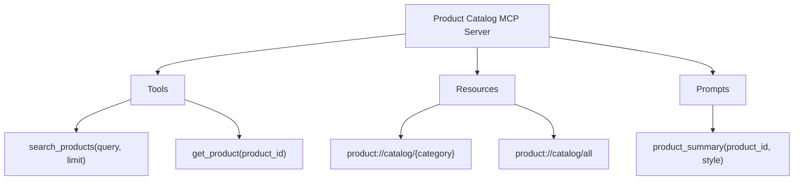

# Build an MCP Server: Python + TypeScript

> One server, three primitives, any AI client.

**Type:** Build
**Languages:** Both
**Prerequisites:** 03-06 MCP fundamentals
**Time:** ~75 min
**Learning Objectives:**
- Build a complete MCP server in Python using `FastMCP` with tools, resources, and prompts
- Implement SQL injection protection in an MCP tool handler
- Build the same server in TypeScript using `@modelcontextprotocol/sdk`
- Configure Claude Desktop to connect to both server variants
- Explain the stdio transport message flow between client and server

---

## THE PROBLEM

Your team maintains a PostgreSQL database with 50,000 product records. Three different AI applications need to query it: a customer-facing chatbot, an internal product copilot, and a customer portal search feature.

Currently, each application has its own database connection layer. Each has its own SQL query builder. Each has different SQL injection protections. The chatbot's protection was patched three months ago after a security review. The portal's protection was never updated. The copilot uses string interpolation directly.

Every schema change requires updating three separate codebases. Every security fix has to be applied three times, by three different teams, on three different schedules.

An MCP server solves this by centralizing the database interface. All three AI applications connect to one server. The server owns the query logic, the sanitization, and the schema knowledge. A schema change or security fix happens once.

---

## THE CONCEPT

### What This Lesson Builds

A product catalog MCP server with three primitives:

- **Tool:** `search_products(query, limit)` - full-text search with SQL injection protection
- **Resource:** `product://catalog/{category}` - structured product list by category
- **Prompt:** `product_summary` - a prompt template for generating product summaries

The server uses SQLite in-memory for the demo. In production, swap the SQLite connection for psycopg2 or asyncpg with the same interface.

### Server Primitive Map



### Stdio Transport Message Flow

Claude Desktop launches the server as a child process and communicates over stdin/stdout. The server reads JSON-RPC messages from stdin and writes responses to stdout. stderr is for logs only.

```
Claude Desktop Process          MCP Server Process
        |                              |
        |-- spawn(python server.py) -->|
        |                              | (server starts, prints nothing to stdout yet)
        |-- stdin: initialize -------->|
        |<- stdout: init response -----|
        |-- stdin: initialized ------->|  (notification, no response)
        |-- stdin: tools/list -------->|
        |<- stdout: tools response ----|
        |                              |
        | (user asks product question) |
        |-- stdin: tools/call -------->|
        |<- stdout: tool result -------|
        |                              |
        | (user asks for category)     |
        |-- stdin: resources/read ---->|
        |<- stdout: resource result ---|
```

Each message is a newline-delimited JSON object. The server MUST NOT print anything to stdout before the first JSON-RPC message, or the host will fail to parse the output.

---

## BUILD IT

### Python MCP Server

Full implementation in `code/main.py`. Here is the complete server:

```python
import json
import sqlite3
from mcp.server.fastmcp import FastMCP

mcp = FastMCP("product-catalog")

# --- Database setup ---

def get_db() -> sqlite3.Connection:
    conn = sqlite3.connect(":memory:")
    conn.row_factory = sqlite3.Row
    conn.execute("""
        CREATE TABLE IF NOT EXISTS products (
            id TEXT PRIMARY KEY,
            name TEXT NOT NULL,
            category TEXT NOT NULL,
            price_cents INTEGER NOT NULL,
            description TEXT,
            in_stock INTEGER DEFAULT 1
        )
    """)
    # Seed with demo data
    products = [
        ("P001", "Mechanical Keyboard", "electronics", 12999, "TKL, Cherry MX Brown", 1),
        ("P002", "USB-C Hub 7-port", "electronics", 4999, "4K HDMI, 100W PD", 1),
        ("P003", "Standing Desk Mat", "office", 3499, "Anti-fatigue, 36x24 inches", 1),
        ("P004", "Monitor Arm", "office", 8999, "Gas spring, dual monitor", 1),
        ("P005", "Wireless Headphones", "electronics", 19999, "ANC, 30hr battery", 0),
        ("P006", "Laptop Stand", "office", 5999, "Aluminum, adjustable height", 1),
        ("P007", "Webcam 4K", "electronics", 14999, "Auto-focus, low light", 1),
        ("P008", "Cable Management Kit", "office", 1299, "Velcro + clips + tray", 1),
    ]
    conn.executemany(
        "INSERT OR IGNORE INTO products VALUES (?,?,?,?,?,?)", products
    )
    conn.commit()
    return conn

# Module-level connection (reused across calls in the same server process)
_db: sqlite3.Connection | None = None

def db() -> sqlite3.Connection:
    global _db
    if _db is None:
        _db = get_db()
    return _db

# --- Tool: search_products ---

@mcp.tool()
def search_products(query: str, limit: int = 10) -> list[dict]:
    """
    Search products by name or description.

    Uses parameterized queries (no string interpolation) to prevent
    SQL injection. Limit is clamped to 1-50.
    """
    if not query or not query.strip():
        return []

    safe_limit = max(1, min(50, limit))
    search_term = f"%{query.strip()}%"

    cursor = db().execute(
        """
        SELECT id, name, category, price_cents, description, in_stock
        FROM products
        WHERE (name LIKE ? OR description LIKE ?)
        AND in_stock = 1
        ORDER BY name
        LIMIT ?
        """,
        (search_term, search_term, safe_limit),
    )
    return [dict(row) for row in cursor.fetchall()]

@mcp.tool()
def get_product(product_id: str) -> dict | None:
    """Get a single product by its ID."""
    cursor = db().execute(
        "SELECT id, name, category, price_cents, description, in_stock "
        "FROM products WHERE id = ?",
        (product_id,),
    )
    row = cursor.fetchone()
    return dict(row) if row else None

# --- Resource: product://catalog/{category} ---

@mcp.resource("product://catalog/{category}")
def get_catalog_by_category(category: str) -> str:
    """
    Return all in-stock products in a category as JSON.
    Use 'all' as category to get the full catalog.
    """
    if category == "all":
        cursor = db().execute(
            "SELECT id, name, category, price_cents, description "
            "FROM products WHERE in_stock = 1 ORDER BY category, name"
        )
    else:
        cursor = db().execute(
            "SELECT id, name, category, price_cents, description "
            "FROM products WHERE category = ? AND in_stock = 1 ORDER BY name",
            (category,),
        )
    rows = [dict(r) for r in cursor.fetchall()]
    return json.dumps(rows, indent=2)

# --- Prompt: product_summary ---

@mcp.prompt()
def product_summary(product_id: str, style: str = "brief") -> str:
    """
    Generate a prompt to write a product summary.
    style: 'brief' (1-2 sentences) or 'detailed' (full description with specs)
    """
    product = get_product(product_id)
    if not product:
        return f"No product found with ID {product_id}."

    price = f"${product['price_cents'] / 100:.2f}"
    base = (
        f"Product: {product['name']} (ID: {product['id']})\n"
        f"Category: {product['category']}\n"
        f"Price: {price}\n"
        f"Description: {product['description']}\n\n"
    )

    if style == "brief":
        return base + "Write a 1-2 sentence product summary suitable for a search result snippet."
    else:
        return (
            base
            + "Write a detailed product description covering: key features, ideal use case, "
            "and why a customer would choose this over alternatives. "
            "Format with a headline, bullet features, and a closing sentence."
        )

if __name__ == "__main__":
    mcp.run(transport="stdio")
```

> **Real-world check:** You switch from SQLite to PostgreSQL. The only change needed is inside `get_db()`. Why does the MCP layer not need to change at all?

The three primitives (`search_products`, `get_catalog_by_category`, `product_summary`) are defined against the `db()` interface, not against any specific database driver. The tool and resource handlers do not know or care whether the connection is SQLite, PostgreSQL, or a mock. MCP decouples the AI client from the data layer, and the function interface decouples the data access from the storage engine.

---

## BUILD IT (TypeScript)

Full implementation in `code/main.ts`. The same server, same three primitives, in TypeScript:

```typescript
import { McpServer, ResourceTemplate } from "@modelcontextprotocol/sdk/server/mcp.js";
import { StdioServerTransport } from "@modelcontextprotocol/sdk/server/stdio.js";
import { z } from "zod";
import Database from "better-sqlite3";

// --- Database setup ---

function createDb(): Database.Database {
  const db = new Database(":memory:");
  db.exec(`
    CREATE TABLE IF NOT EXISTS products (
      id TEXT PRIMARY KEY,
      name TEXT NOT NULL,
      category TEXT NOT NULL,
      price_cents INTEGER NOT NULL,
      description TEXT,
      in_stock INTEGER DEFAULT 1
    )
  `);
  const insert = db.prepare(
    "INSERT OR IGNORE INTO products VALUES (?,?,?,?,?,?)"
  );
  const seed = db.transaction(() => {
    insert.run("P001", "Mechanical Keyboard", "electronics", 12999, "TKL, Cherry MX Brown", 1);
    insert.run("P002", "USB-C Hub 7-port", "electronics", 4999, "4K HDMI, 100W PD", 1);
    insert.run("P003", "Standing Desk Mat", "office", 3499, "Anti-fatigue, 36x24 inches", 1);
    insert.run("P004", "Monitor Arm", "office", 8999, "Gas spring, dual monitor", 1);
    insert.run("P005", "Wireless Headphones", "electronics", 19999, "ANC, 30hr battery", 0);
    insert.run("P006", "Laptop Stand", "office", 5999, "Aluminum, adjustable height", 1);
    insert.run("P007", "Webcam 4K", "electronics", 14999, "Auto-focus, low light", 1);
    insert.run("P008", "Cable Management Kit", "office", 1299, "Velcro + clips + tray", 1);
  });
  seed();
  return db;
}

const dbInstance = createDb();

// --- Server definition ---

const server = new McpServer({
  name: "product-catalog",
  version: "1.0.0",
});

// --- Tool: search_products ---

server.tool(
  "search_products",
  "Search products by name or description. Returns in-stock items only.",
  {
    query: z.string().describe("Search query"),
    limit: z.number().int().min(1).max(50).default(10).describe("Max results"),
  },
  async ({ query, limit }) => {
    if (!query.trim()) return { content: [{ type: "text", text: "[]" }] };
    const searchTerm = `%${query.trim()}%`;
    const rows = dbInstance
      .prepare(
        `SELECT id, name, category, price_cents, description, in_stock
         FROM products
         WHERE (name LIKE ? OR description LIKE ?) AND in_stock = 1
         ORDER BY name LIMIT ?`
      )
      .all(searchTerm, searchTerm, limit);
    return { content: [{ type: "text", text: JSON.stringify(rows, null, 2) }] };
  }
);

server.tool(
  "get_product",
  "Get a single product by its ID.",
  { product_id: z.string().describe("Product ID (e.g. P001)") },
  async ({ product_id }) => {
    const row = dbInstance
      .prepare("SELECT * FROM products WHERE id = ?")
      .get(product_id);
    const text = row ? JSON.stringify(row, null, 2) : "null";
    return { content: [{ type: "text", text }] };
  }
);

// --- Resource: product://catalog/{category} ---

server.resource(
  "product-catalog",
  new ResourceTemplate("product://catalog/{category}", { list: undefined }),
  async (uri, { category }) => {
    const cat = Array.isArray(category) ? category[0] : category;
    const rows =
      cat === "all"
        ? dbInstance
            .prepare(
              "SELECT id, name, category, price_cents, description FROM products WHERE in_stock = 1 ORDER BY category, name"
            )
            .all()
        : dbInstance
            .prepare(
              "SELECT id, name, category, price_cents, description FROM products WHERE category = ? AND in_stock = 1 ORDER BY name"
            )
            .all(cat);
    return {
      contents: [
        {
          uri: uri.href,
          mimeType: "application/json",
          text: JSON.stringify(rows, null, 2),
        },
      ],
    };
  }
);

// --- Prompt: product_summary ---

server.prompt(
  "product_summary",
  "Generate a prompt to write a product summary.",
  {
    product_id: z.string().describe("Product ID to summarize"),
    style: z.enum(["brief", "detailed"]).default("brief").describe("Summary style"),
  },
  async ({ product_id, style }) => {
    const product = dbInstance
      .prepare("SELECT * FROM products WHERE id = ?")
      .get(product_id) as Record<string, unknown> | undefined;
    if (!product) {
      return {
        messages: [
          {
            role: "user",
            content: { type: "text", text: `No product found with ID ${product_id}.` },
          },
        ],
      };
    }
    const price = `$${(Number(product.price_cents) / 100).toFixed(2)}`;
    const base = `Product: ${product.name} (ID: ${product.id})\nCategory: ${product.category}\nPrice: ${price}\nDescription: ${product.description}\n\n`;
    const instruction =
      style === "brief"
        ? "Write a 1-2 sentence product summary suitable for a search result snippet."
        : "Write a detailed product description covering key features, ideal use case, and why a customer would choose this over alternatives.";
    return {
      messages: [
        { role: "user", content: { type: "text", text: base + instruction } },
      ],
    };
  }
);

// --- Start ---

async function main() {
  const transport = new StdioServerTransport();
  await server.connect(transport);
  // Note: do not console.log here - stdout is reserved for JSON-RPC
  process.stderr.write("Product Catalog MCP Server started\n");
}

main().catch((err) => {
  process.stderr.write(`Fatal: ${err}\n`);
  process.exit(1);
});
```

---

## USE IT

### Connecting to Claude Desktop

Claude Desktop reads server configurations from `claude_desktop_config.json`. On macOS: `~/Library/Application Support/Claude/claude_desktop_config.json`. On Windows: `%APPDATA%\Claude\claude_desktop_config.json`.

**Python server:**

```json
{
  "mcpServers": {
    "product-catalog-python": {
      "command": "uv",
      "args": [
        "run",
        "--project",
        "/path/to/phases/03-tools-and-mcp/07-build-mcp-server/code",
        "python",
        "main.py"
      ],
      "env": {}
    }
  }
}
```

Or if using a plain `python` environment with `mcp` installed:

```json
{
  "mcpServers": {
    "product-catalog-python": {
      "command": "python",
      "args": ["/path/to/phases/03-tools-and-mcp/07-build-mcp-server/code/main.py"]
    }
  }
}
```

**TypeScript server** (after `npm install && npx tsc`):

```json
{
  "mcpServers": {
    "product-catalog-ts": {
      "command": "node",
      "args": ["/path/to/phases/03-tools-and-mcp/07-build-mcp-server/code/dist/main.js"]
    }
  }
}
```

After editing the config, restart Claude Desktop. The tool icon should show the server connected. Type a message like "What wireless products do you have?" and Claude will use `search_products`.

> **Perspective shift:** The Python and TypeScript servers are identical in capability. A colleague asks "why would anyone build the TypeScript version?" What is the one deployment reason that favors TypeScript here?

The TypeScript server runs on Node.js, which is already required for most web front-end toolchains and is available in more deployment environments without a Python runtime. If the AI application consuming the server is a Next.js app, an Electron desktop app, or a VS Code extension, shipping a Node.js process is simpler than adding a Python process to the dependency stack.

---

## SHIP IT

The artifact this lesson produces is a Python + TypeScript MCP server template with all three primitives. See `outputs/skill-mcp-server-template.md`.

The template includes the full server scaffolding, SQL injection protection notes, Claude Desktop config snippets for both languages, and a checklist for productionizing the SQLite demo to a real database.

---

## EVALUATE IT

**Verify tool discovery.** Run the Python server with `mcp dev code/main.py`. In the `mcp dev` inspector, call `tools/list`. Confirm both `search_products` and `get_product` appear with their correct input schemas.

**Test SQL injection protection.** Call `search_products` with `query = "' OR 1=1 --"`. The parameterized query should return zero results (no products match that literal string), not the full product table. Verify by checking the SQL generated: no string interpolation should touch the query parameter.

**Test the resource URI.** Call `resources/read` with URI `product://catalog/electronics`. Confirm the response is valid JSON containing only electronics products, all with `in_stock: 1`.

**Test the prompt.** Call `prompts/get` with `name = "product_summary"`, `product_id = "P001"`, `style = "detailed"`. Confirm the returned messages array contains a user message with product details and the detailed instruction. Pass the returned prompt to Claude and verify the output is a formatted product description.

**Compare languages.** Run both the Python and TypeScript servers under `mcp dev`. Call the same `search_products("keyboard")` on each. Confirm the results are identical. This validates that the two implementations are functionally equivalent.
