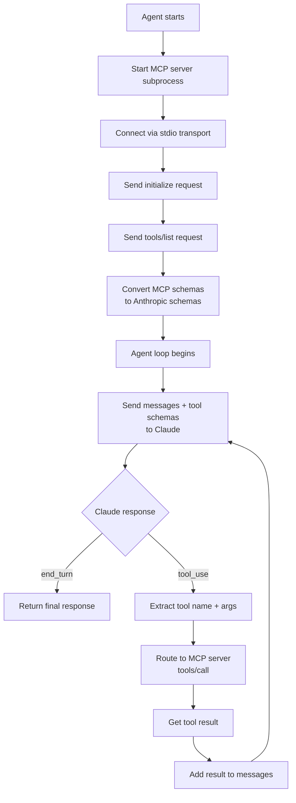

# بناء عميل MCP

> الوكيل الذي يكتشف أدواته أثناء التشغيل لا يحتاج أبداً إلى إعادة نشر ليكتسب قدرات جديدة.

**النوع:** بناء
**اللغات:** Python
**المتطلبات:** 03-07 بناء خادم MCP
**الوقت:** ~60 دقيقة
**أهداف التعلّم:**
- شرح مسار اكتشاف الأدوات: التهيئة، tools/list، وتحويل المخطط (schema)
- بناء عميل MCP خام يشغّل الخادم كعملية فرعية (subprocess) ويستدعي الأدوات من خلاله
- تحويل تعريفات أدوات MCP إلى مخططات أدوات Anthropic برمجياً
- تنفيذ حلقة وكيل (agent loop) توجّه استدعاءات الأدوات عبر عميل MCP
- إعادة الهيكلة لاستخدام واجهة `ClientSession` الأعلى مستوى في الـ `mcp` SDK من أجل كود أنظف

---

## المشكلة

وكيلك يحتوي على ثماني أدوات مثبّتة بشكل صلب (hardcoded) داخل البرومبت وقائمة مخطط الأدوات. تضيف أداة تاسعة: الآن تعيد نشر الوكيل. تضيف أداة عاشرة: إعادة نشر أخرى. خادم كتالوج المنتجات (MCP) من الدرس L07 يحصل على ثلاث أدوات جديدة: تحدّث قائمة الوكيل المثبّتة يدوياً، تختبر، تعيد النشر.

هذا اقتران (coupling) خاطئ. لا ينبغي أن يحتاج الوكيل لمعرفة الأدوات الموجودة وقت النشر. ينبغي أن يتصل بالخادم، ويسأل عن الأدوات الموجودة، ثم يستخدمها. عندما يضيف الخادم أداة جديدة، يلتقطها الوكيل في الاتصال التالي دون أي تغيير في الكود.

هذا هو اكتشاف الأدوات الديناميكي في MCP. يستدعي الوكيل `tools/list` عند الإقلاع، ويبني مخططات أدوات Anthropic من تعريفات الخادم، ويمرّرها إلى الـ LLM. وعندما يطلب الـ LLM استدعاء أداة، يوجّهه الوكيل إلى `tools/call` على الخادم الصحيح. كود الوكيل لا يتغير ولو مرة واحدة عندما يكتسب الخادم قدرات جديدة.

---

## المفهوم

### مسار اكتشاف الأدوات وتوجيهها



### مخطط أداة MCP مقابل مخطط أداة Anthropic

يستخدم الـ MCP SDK والـ Anthropic SDK بُنى مخطط مختلفة قليلاً. يجب على العميل التحويل بينهما:

```
MCP Tool Definition (from tools/list)     Anthropic Tool Schema (for Claude)
---------------------------------------   ----------------------------------------
{                                         {
  "name": "search_products",                "name": "search_products",
  "description": "Search products...",      "description": "Search products...",
  "inputSchema": {                          "input_schema": {
    "type": "object",                         "type": "object",
    "properties": {                           "properties": {
      "query": {                                "query": {
        "type": "string",                         "type": "string",
        "description": "Search term"              "description": "Search term"
      },                                        },
      "limit": {                                "limit": {
        "type": "integer",                        "type": "integer",
        "default": 10                             "default": 10
      }                                         }
    },                                        },
    "required": ["query"]                     "required": ["query"]
  }                                         }
}                                         }

Key difference: MCP uses "inputSchema" (camelCase)
                Anthropic uses "input_schema" (snake_case)
```

التحويل هو إعادة تسمية أساسية: `inputSchema` تصبح `input_schema`. وجميع الحقول الأخرى متطابقة.

---

## البناء

### عميل MCP خام

التنفيذ الكامل في `code/main.py`. يستخدم العميل الخام طبقة النقل (transport) منخفضة المستوى في الـ `mcp` SDK.

```python
import asyncio
import json
import anthropic
from mcp import ClientSession, StdioServerParameters
from mcp.client.stdio import stdio_client


async def discover_tools(session: ClientSession) -> list[dict]:
    """Call tools/list and convert MCP schemas to Anthropic schemas."""
    result = await session.list_tools()
    anthropic_tools = []
    for tool in result.tools:
        anthropic_tools.append({
            "name": tool.name,
            "description": tool.description or "",
            "input_schema": tool.inputSchema,  # MCP inputSchema -> Anthropic input_schema
        })
    return anthropic_tools


async def call_tool(session: ClientSession, name: str, args: dict) -> str:
    """Route a tool call through the MCP server and return the result as a string."""
    result = await session.call_tool(name, args)
    # result.content is a list of content blocks
    parts = []
    for block in result.content:
        if hasattr(block, "text"):
            parts.append(block.text)
    return "\n".join(parts) if parts else ""


async def run_agent(user_message: str, server_script: str) -> str:
    """
    Run an agent that auto-discovers tools from an MCP server.

    server_script: path to the MCP server Python file
    """
    client = anthropic.Anthropic()

    server_params = StdioServerParameters(
        command="python",
        args=[server_script],
    )

    async with stdio_client(server_params) as (read, write):
        async with ClientSession(read, write) as session:
            # 1. Initialize the connection
            await session.initialize()

            # 2. Discover tools (the key step: no hardcoded schemas)
            tools = await discover_tools(session)
            print(f"Discovered {len(tools)} tools: {[t['name'] for t in tools]}")

            # 3. Agent loop
            messages = [{"role": "user", "content": user_message}]

            for turn in range(10):  # safety limit
                response = client.messages.create(
                    model="claude-3-5-haiku-20241022",
                    max_tokens=1024,
                    tools=tools,
                    messages=messages,
                )

                print(f"Turn {turn + 1} | stop_reason: {response.stop_reason}")

                if response.stop_reason == "end_turn":
                    for block in response.content:
                        if hasattr(block, "text"):
                            return block.text
                    return ""

                if response.stop_reason == "tool_use":
                    messages.append(
                        {"role": "assistant", "content": response.content}
                    )
                    tool_results = []
                    for block in response.content:
                        if block.type == "tool_use":
                            print(f"  Tool: {block.name}({json.dumps(block.input)})")
                            result_text = await call_tool(session, block.name, block.input)
                            print(f"  Result: {result_text[:100]}...")
                            tool_results.append({
                                "type": "tool_result",
                                "tool_use_id": block.id,
                                "content": result_text,
                            })
                    messages.append({"role": "user", "content": tool_results})

    return ""
```

الأسطر الأساسية موجودة في `run_agent`:
1. `await session.initialize()` - تنشئ الاتصال
2. `await discover_tools(session)` - تستدعي `tools/list` وتبني مخططات Anthropic
3. `tools=tools` في `messages.create()` - تمرّر المخططات المكتشفة إلى Claude
4. `await call_tool(session, block.name, block.input)` - توجّه الاستدعاء عائداً إلى الخادم

> **اختبار من الواقع:** خادم كتالوج المنتجات يضيف أداة `create_product` بينما الوكيل قيد النشر. متى يكتسب الوكيل الوصول إلى الأداة الجديدة؟

يكتسب الوكيل الوصول عند تهيئة الاتصال التالية. في كل مرة يستدعي فيها الوكيل `session.initialize()` ثم `tools/list`، يحصل على قائمة الأدوات الحالية من الخادم. وإذا كان الوكيل طويل العمر ويحافظ على اتصال دائم، فسيحتاج إلى استطلاع `tools/list` دورياً أو معالجة إشعار `tools/changed`. بالنسبة لمعظم الوكلاء، يكون إعادة الاتصال عند بدء كل محادثة أبسط وكافياً.

---

## الاستخدام

### ClientSession الأعلى مستوى

واجهة `ClientSession` المستخدمة أعلاه هي بالفعل واجهة الـ SDK عالية المستوى. للمقارنة، إليك نسخة مبسّطة تُظهر النمط نفسه بأسطر أقل:

```python
async def run_agent_compact(user_message: str, server_script: str) -> str:
    """Same agent, fewer lines using ClientSession directly."""
    client = anthropic.Anthropic()
    server_params = StdioServerParameters(command="python", args=[server_script])

    async with stdio_client(server_params) as (read, write):
        async with ClientSession(read, write) as session:
            await session.initialize()

            # Discover and convert in one comprehension
            tools_result = await session.list_tools()
            tools = [
                {
                    "name": t.name,
                    "description": t.description or "",
                    "input_schema": t.inputSchema,
                }
                for t in tools_result.tools
            ]

            messages = [{"role": "user", "content": user_message}]

            while True:
                resp = client.messages.create(
                    model="claude-3-5-haiku-20241022",
                    max_tokens=1024,
                    tools=tools,
                    messages=messages,
                )

                if resp.stop_reason == "end_turn":
                    return next(
                        (b.text for b in resp.content if hasattr(b, "text")), ""
                    )

                messages.append({"role": "assistant", "content": resp.content})
                results = []
                for b in resp.content:
                    if b.type == "tool_use":
                        r = await session.call_tool(b.name, b.input)
                        text = "\n".join(
                            c.text for c in r.content if hasattr(c, "text")
                        )
                        results.append({
                            "type": "tool_result",
                            "tool_use_id": b.id,
                            "content": text,
                        })
                messages.append({"role": "user", "content": results})
```

النسخة المختصرة 35 سطراً مقابل 60 سطراً في النسخة المشروحة. كلتاهما صحيحة. استخدم النسخة المشروحة عندما تحتاج إلى إضافة تسجيل (logging) أو معالجة أخطاء أو منطق توجيه لكل أداة. واستخدم النسخة المختصرة في السكربتات السريعة.

> **نقلة في المنظور:** يقول زميل: "لدينا بالفعل وكيل Claude بمخططات أدوات مثبّتة بشكل صلب، لماذا نضيف تعقيد عميل MCP؟" عند أي نقطة يؤتي نهج الاكتشاف الديناميكي ثماره؟

يؤتي الاكتشاف الديناميكي ثماره في اللحظة التي يكون لديك فيها أكثر من تطبيق ذكاء اصطناعي واحد متصل بالأدوات نفسها. مع وكيل واحد ومخططات مثبّتة بشكل صلب، يضيف MCP عبئاً إضافياً. ومع وكيلين (لنقل، روبوت محادثة ومساعد داخلي)، كلاهما يستخدم خادم كتالوج المنتجات نفسه، يعني MCP أن تعريف أداة واحداً يُشارك، لا اثنين. ومع ثلاثة تطبيقات، تصبح المعادلة تعريف خادم واحد مقابل 3 قوائم مخططات مثبّتة تتم صيانتها بالتوازي. نقطة التعادل تقريباً عند مستهلكين اثنين للقدرة نفسها.

---

## التسليم

المخرَج الذي ينتجه هذا الدرس هو عميل MCP عام يكتشف الأدوات تلقائياً ويربطها بحلقة وكيل Anthropic. انظر `outputs/skill-mcp-client.md`.

يتضمن القالب نمط الاكتشاف والتوجيه الكامل، وسطر تحويل المخطط الواحد، ومعالجة الأخطاء للأدوات المفقودة وأعطال النقل، وملاحظات حول التوجيه متعدد الخوادم.

---

## التقييم

**اختبار صحة الاكتشاف.** اربط العميل بخادم كتالوج منتجات L07. تحقق من أن `discover_tools()` تُعيد بالضبط الأدوات المعرّفة في ذلك الخادم، بالأسماء الصحيحة وحقول `input_schema`. تأكد من أن `inputSchema` قد أُعيدت تسميتها بشكل صحيح إلى `input_schema`.

**اختبار التوجيه.** اسأل الوكيل "what keyboards do you have?" وتحقق من أن `search_products` تُستدعى بـ query يحتوي على "keyboard". ينبغي أن تتضمن النتيجة على الأقل لوحة المفاتيح الميكانيكية (Mechanical Keyboard) من مجموعة بيانات العرض التوضيحي.

**اختبار التقاط أداة جديدة.** أضف أداة جديدة إلى الخادم دون تغيير العميل. أعد تشغيل الوكيل وتحقق من ظهور الأداة الجديدة في القائمة المكتشفة. اطرح سؤالاً سيستدعيها وتأكد من أنها تُستدعى.

**اختبار معالجة خطأ النقل.** وجّه العميل إلى مسار سكربت خادم غير موجود. تحقق من أن الوكيل يُعيد خطأً واضحاً بدلاً من التعليق أو الانهيار بصمت.

**قياس عبء الاكتشاف.** قِس زمن `session.initialize()` + `session.list_tools()` عبر 10 تشغيلات. بالنسبة لخادم stdio محلي ينبغي أن يكون هذا أقل من 100ms. وإذا كان أبطأ، فإن كتلة `__main__` في الخادم تقوم بعمل ما قبل الاستجابة لطلب التهيئة.
