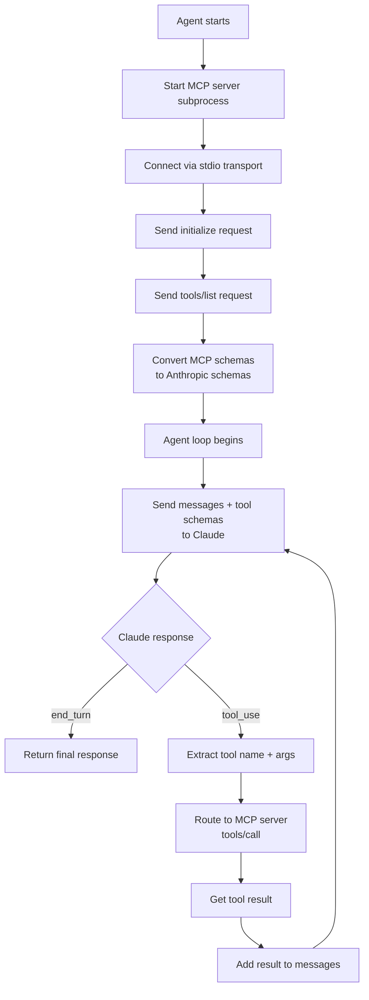

# Build an MCP Client

> An agent that discovers its tools at runtime never needs a redeployment to gain new capabilities.

**Type:** Build
**Languages:** Python
**Prerequisites:** 03-07 build an MCP server
**Time:** ~60 min
**Learning Objectives:**
- Explain the tool discovery flow: initialize, tools/list, schema conversion
- Build a raw MCP client that starts a server as a subprocess and calls tools through it
- Convert MCP tool definitions to Anthropic tool schemas programmatically
- Implement an agent loop that routes tool calls through the MCP client
- Refactor to the `mcp` SDK's higher-level `ClientSession` for cleaner code

---

## THE PROBLEM

Your agent has eight tools hardcoded into its prompt and tool schema list. You add a ninth tool: now you redeploy the agent. You add a tenth: another redeploy. The product catalog MCP server from L07 gets three new tools: you update the agent's hardcoded list manually, test, redeploy.

This is the wrong coupling. The agent should not need to know what tools exist at deploy time. It should connect to a server, ask what tools exist, and use them. When the server adds a new tool, the agent picks it up at the next connection with no code changes.

This is MCP dynamic tool discovery. The agent calls `tools/list` on startup, builds the Anthropic tool schemas from the server's definitions, and passes them to the LLM. When the LLM requests a tool call, the agent routes it to `tools/call` on the right server. The agent code changes zero times when the server gains new capabilities.

---

## THE CONCEPT

### The Tool Discovery and Routing Flow



### MCP Tool Schema vs Anthropic Tool Schema

The MCP SDK and Anthropic SDK use slightly different schema structures. The client must convert between them:

```
MCP Tool Definition (from tools/list)     Anthropic Tool Schema (for Claude)
---------------------------------------   ----------------------------------------
{                                         {
  "name": "search_products",                "name": "search_products",
  "description": "Search products...",      "description": "Search products...",
  "inputSchema": {                          "input_schema": {
    "type": "object",                         "type": "object",
    "properties": {                           "properties": {
      "query": {                                "query": {
        "type": "string",                         "type": "string",
        "description": "Search term"              "description": "Search term"
      },                                        },
      "limit": {                                "limit": {
        "type": "integer",                        "type": "integer",
        "default": 10                             "default": 10
      }                                         }
    },                                        },
    "required": ["query"]                     "required": ["query"]
  }                                         }
}                                         }

Key difference: MCP uses "inputSchema" (camelCase)
                Anthropic uses "input_schema" (snake_case)
```

The conversion is a key rename: `inputSchema` becomes `input_schema`. All other fields are identical.

---

## BUILD IT

### Raw MCP Client

Full implementation in `code/main.py`. The raw client uses the `mcp` SDK's low-level transport layer.

```python
import asyncio
import json
import anthropic
from mcp import ClientSession, StdioServerParameters
from mcp.client.stdio import stdio_client


async def discover_tools(session: ClientSession) -> list[dict]:
    """Call tools/list and convert MCP schemas to Anthropic schemas."""
    result = await session.list_tools()
    anthropic_tools = []
    for tool in result.tools:
        anthropic_tools.append({
            "name": tool.name,
            "description": tool.description or "",
            "input_schema": tool.inputSchema,  # MCP inputSchema -> Anthropic input_schema
        })
    return anthropic_tools


async def call_tool(session: ClientSession, name: str, args: dict) -> str:
    """Route a tool call through the MCP server and return the result as a string."""
    result = await session.call_tool(name, args)
    # result.content is a list of content blocks
    parts = []
    for block in result.content:
        if hasattr(block, "text"):
            parts.append(block.text)
    return "\n".join(parts) if parts else ""


async def run_agent(user_message: str, server_script: str) -> str:
    """
    Run an agent that auto-discovers tools from an MCP server.

    server_script: path to the MCP server Python file
    """
    client = anthropic.Anthropic()

    server_params = StdioServerParameters(
        command="python",
        args=[server_script],
    )

    async with stdio_client(server_params) as (read, write):
        async with ClientSession(read, write) as session:
            # 1. Initialize the connection
            await session.initialize()

            # 2. Discover tools (the key step: no hardcoded schemas)
            tools = await discover_tools(session)
            print(f"Discovered {len(tools)} tools: {[t['name'] for t in tools]}")

            # 3. Agent loop
            messages = [{"role": "user", "content": user_message}]

            for turn in range(10):  # safety limit
                response = client.messages.create(
                    model="claude-3-5-haiku-20241022",
                    max_tokens=1024,
                    tools=tools,
                    messages=messages,
                )

                print(f"Turn {turn + 1} | stop_reason: {response.stop_reason}")

                if response.stop_reason == "end_turn":
                    for block in response.content:
                        if hasattr(block, "text"):
                            return block.text
                    return ""

                if response.stop_reason == "tool_use":
                    messages.append(
                        {"role": "assistant", "content": response.content}
                    )
                    tool_results = []
                    for block in response.content:
                        if block.type == "tool_use":
                            print(f"  Tool: {block.name}({json.dumps(block.input)})")
                            result_text = await call_tool(session, block.name, block.input)
                            print(f"  Result: {result_text[:100]}...")
                            tool_results.append({
                                "type": "tool_result",
                                "tool_use_id": block.id,
                                "content": result_text,
                            })
                    messages.append({"role": "user", "content": tool_results})

    return ""
```

The key lines are in `run_agent`:
1. `await session.initialize()` - establishes the connection
2. `await discover_tools(session)` - calls `tools/list` and builds Anthropic schemas
3. `tools=tools` in `messages.create()` - passes discovered schemas to Claude
4. `await call_tool(session, block.name, block.input)` - routes the call back to the server

> **Real-world check:** The product catalog server adds a `create_product` tool while the agent is deployed. When does the agent gain access to the new tool?

The agent gains access at the next connection initialization. Each time the agent calls `session.initialize()` and then `tools/list`, it gets the current tool list from the server. If the agent is long-running and maintains a persistent connection, it would need to poll `tools/list` periodically or handle a `tools/changed` notification. For most agents, re-connecting on each conversation start is simpler and sufficient.

---

## USE IT

### Higher-Level ClientSession

The `ClientSession` API used above is already the high-level SDK interface. For comparison, here is a minimal version that shows the same pattern with fewer lines:

```python
async def run_agent_compact(user_message: str, server_script: str) -> str:
    """Same agent, fewer lines using ClientSession directly."""
    client = anthropic.Anthropic()
    server_params = StdioServerParameters(command="python", args=[server_script])

    async with stdio_client(server_params) as (read, write):
        async with ClientSession(read, write) as session:
            await session.initialize()

            # Discover and convert in one comprehension
            tools_result = await session.list_tools()
            tools = [
                {
                    "name": t.name,
                    "description": t.description or "",
                    "input_schema": t.inputSchema,
                }
                for t in tools_result.tools
            ]

            messages = [{"role": "user", "content": user_message}]

            while True:
                resp = client.messages.create(
                    model="claude-3-5-haiku-20241022",
                    max_tokens=1024,
                    tools=tools,
                    messages=messages,
                )

                if resp.stop_reason == "end_turn":
                    return next(
                        (b.text for b in resp.content if hasattr(b, "text")), ""
                    )

                messages.append({"role": "assistant", "content": resp.content})
                results = []
                for b in resp.content:
                    if b.type == "tool_use":
                        r = await session.call_tool(b.name, b.input)
                        text = "\n".join(
                            c.text for c in r.content if hasattr(c, "text")
                        )
                        results.append({
                            "type": "tool_result",
                            "tool_use_id": b.id,
                            "content": text,
                        })
                messages.append({"role": "user", "content": results})
```

The compact version is 35 lines vs the annotated version's 60. Both are correct. Use the annotated version when you need to add logging, error handling, or per-tool routing logic. Use the compact version for quick scripts.

> **Perspective shift:** A colleague says "we already have a Claude agent with hardcoded tool schemas, why add MCP client complexity?" At what point does the dynamic discovery approach pay off?

Dynamic discovery pays off the moment you have more than one AI application connecting to the same tools. With one agent and hardcoded schemas, MCP adds overhead. With two agents (say, a chatbot and an internal copilot), both using the same product catalog server, MCP means one tool definition is shared, not two. With three applications, the math is 1 server definition vs. 3 hardcoded schema lists maintained in parallel. The break-even is roughly two consumers of the same capability.

---

## SHIP IT

The artifact this lesson produces is a generic MCP client that auto-discovers tools and wires them into the Anthropic agent loop. See `outputs/skill-mcp-client.md`.

The template includes the full discovery and routing pattern, the schema conversion one-liner, error handling for missing tools and transport failures, and notes on multi-server routing.

---

## EVALUATE IT

**Test discovery correctness.** Connect the client to the L07 product catalog server. Assert that `discover_tools()` returns exactly the tools defined in that server, with the correct names and `input_schema` fields. Verify `inputSchema` has been correctly renamed to `input_schema`.

**Test routing.** Ask the agent "what keyboards do you have?" and assert that `search_products` is called with a query containing "keyboard." The result should include at least the Mechanical Keyboard from the demo dataset.

**Test new tool pickup.** Add a new tool to the server without changing the client. Restart the agent and verify the new tool appears in the discovered list. Ask a question that would invoke it and confirm it is called.

**Test transport error handling.** Point the client at a non-existent server script path. Verify the agent returns a clear error rather than hanging or crashing silently.

**Measure discovery overhead.** Time `session.initialize()` + `session.list_tools()` across 10 runs. For a local stdio server this should be under 100ms. If it is slower, the server's `__main__` block is doing work before responding to the initialize request.
