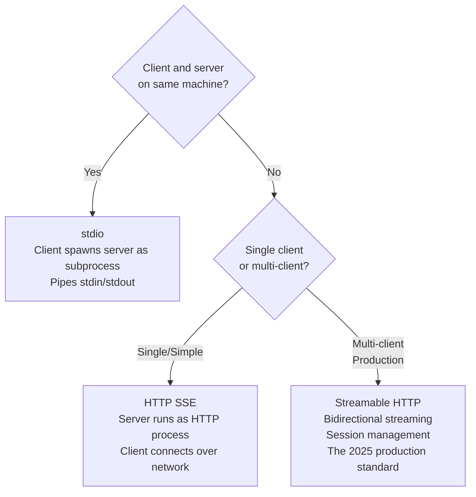

# وسائط نقل MCP: stdio و HTTP و Streamable

> وسيط النقل (transport) الصحيح ليس الأسرع. بل هو الذي يطابق المكان الذي يعيش فيه خادمك.

**النوع:** تعلّم
**اللغات:** Python
**المتطلبات:** 06-mcp-fundamentals، 07-build-mcp-server
**الوقت:** ~45 دقيقة
**أهداف التعلّم:**
- شرح سبب تعطّل وسيط نقل stdio عندما ينتقل الخادم إلى مضيف بعيد
- وصف خيارات نقل MCP الثلاثة وما يتطلبه كل منها من البيئة
- تهيئة خادم MCP لجميع وسائط النقل الثلاثة باستخدام الـ Python MCP SDK
- كتابة كود اتصال العميل لكل وسيط نقل
- تطبيق إطار قرار لاختيار وسيط النقل الصحيح لنشر معيّن

---

## المشكلة

يبني فريق خادم MCP داخلياً يكشف بيانات الشركة لـ Claude Desktop. يستخدمون وسيط نقل stdio لأنه الافتراضي وأسرع طريق إلى عرض توضيحي عامل. يبدأ الخادم، تظهر الأدوات في Claude Desktop، ويسير العرض على ما يرام.

بعد ثلاثة أسابيع، يرغب فريق البنية التحتية في استضافة خادم MCP على جهاز افتراضي (VM) مشترك ليتمكن أكثر من فريق من استخدامه. ينقلون الخادم إلى صندوق بعيد، يحدّثون إعدادات Claude Desktop بمسار SSH، فيفشل الاتصال. لا شيء مفيد في السجلات.

المشكلة الجذرية: يتطلب وسيط نقل stdio أن يشغّل العميل الخادم كعملية فرعية (subprocess) على الجهاز نفسه. العميل حرفياً يفرع (forks) العملية ويوصل stdin/stdout بينهما. لا يوجد مفهوم لمضيف بعيد. إعدادات المضيف في Claude Desktop ليست عنوان شبكة. بل هي مسار إلى ملف تنفيذي سيشغّله العميل محلياً.

الانتقال إلى خادم بعيد ليس تغييراً في الإعدادات. بل يتطلب تبديل وسائط النقل. لكن الفريق بنى خادمه بافتراضات stdio مدمجة، والآن يكافحون لفهم ما يعنيه ذلك، وما هي خياراتهم، وما الذي يتعطّل عندما يغيّرونه.

---

## المفهوم

### وسائط نقل MCP الثلاثة

يفصل MCP البروتوكول (كيفية بناء الرسائل) عن وسيط النقل (كيفية انتقال البايتات بين العميل والخادم). تعمل تعريفات الأدوات نفسها عبر وسائط النقل الثلاثة جميعها. يتغير فقط إعداد الاتصال.



**stdio:** يستدعي العميل `subprocess.Popen` على ثنائي الخادم (binary)، ثم يغلّف stdin و stdout للعملية كقناة ثنائية الاتجاه. يقرأ الخادم رسائل JSON-RPC من stdin ويكتب الاستجابات إلى stdout. الاتصال سريع لعدم وجود طبقة شبكة، لكنه محلي تماماً. وإذا لم يستطع العميل فرع عملية الخادم، فلا يمكن لـ stdio أن يعمل.

**HTTP مع SSE (Server-Sent Events):** يعمل الخادم كعملية HTTP طويلة العمر. يفتح العميل اتصال HTTP إلى `/sse` ويُبقيه الخادم مفتوحاً، دافعاً الأحداث فور وصولها. تنتقل استدعاءات الأدوات من العميل إلى الخادم عبر HTTP POST، وتعود النتائج عبر تيار SSE. هذا يعمل عبر شبكة، ويدعم عدة عملاء متتاليين، لكن له قيد: SSE أحادي الاتجاه. يستطيع الخادم الدفع إلى العميل، لكن العميل لا يستطيع الدفع عائداً على الاتصال نفسه.

**Streamable HTTP:** ترقية 2025 لـ SSE التي تزيل قيد أحادية الاتجاه. كل طلب يفتح جلسة (session)، ويستطيع كل من العميل والخادم تدفيق البيانات عبر تلك الجلسة. يستطيع الخادم دفع نتائج الأدوات، وتحديثات التقدّم، وأسطر السجلات تدريجياً. يعيد العملاء الاتصال بالجلسة نفسها إذا انقطع الاتصال. هذا هو الخيار الصحيح لأي خادم MCP سيخدم عدة عملاء، أو سيعمل في الإنتاج، أو يحتاج إلى دفع نتائج جزئية.

### مقارنة وسائط النقل

```
                  stdio           HTTP SSE        Streamable HTTP
                  ─────────────   ─────────────   ───────────────
Deployment        Same machine    Remote OK       Remote OK
Clients           One at a time   Multiple        Multiple + concurrent
Session state     Process = session   Stateless      Session ID + reconnect
Setup overhead    None            HTTP server     HTTP server + session layer
Streaming         Pipe            Server-to-client  Bidirectional
Use case          Local tools,    Simple remote   Production hosted
                  Claude Desktop  single client   MCP servers
```

---

## البناء

### الخادم نفسه، ثلاثة وسائط نقل

ابدأ بخادم بحث منتجات بسيط. منطق الأداة متطابق عبر التهيئات الثلاث جميعها. يتغير فقط استدعاء `run()`.

```python
# code/main.py (shared tool logic)
from mcp.server import FastMCP

mcp = FastMCP("product-lookup")

PRODUCTS = {
    "p001": {"name": "Widget A", "price": 9.99, "stock": 142},
    "p002": {"name": "Widget B", "price": 24.99, "stock": 8},
    "p003": {"name": "Gadget X", "price": 149.00, "stock": 0},
}

@mcp.tool()
def get_product(product_id: str) -> dict:
    """Look up a product by ID."""
    if product_id not in PRODUCTS:
        return {"error": f"Product {product_id} not found"}
    return PRODUCTS[product_id]

@mcp.tool()
def list_products() -> list[dict]:
    """List all available products."""
    return [{"id": k, **v} for k, v in PRODUCTS.items()]
```

**وسيط النقل 1: stdio**

```python
# Run the server over stdio (client forks this process)
if __name__ == "__main__":
    mcp.run(transport="stdio")
```

إعدادات Claude Desktop لـ stdio:

```json
{
  "mcpServers": {
    "product-lookup": {
      "command": "python",
      "args": ["/absolute/path/to/code/main.py"],
      "env": {}
    }
  }
}
```

سيفرع Claude Desktop العملية `python /absolute/path/to/code/main.py` ويتواصل معها عبر stdin/stdout. يجب على الخادم ألا يطبع أي شيء إلى stdout عدا رسائل بروتوكول MCP.

**وسيط النقل 2: HTTP مع SSE**

```python
# Run the server as an HTTP SSE server
if __name__ == "__main__":
    mcp.run(transport="sse", host="0.0.0.0", port=8080)
```

كود اتصال العميل لـ SSE:

```python
from mcp.client.session import ClientSession
from mcp.client.sse import sse_client

async def connect_via_sse():
    async with sse_client("http://localhost:8080/sse") as (read, write):
        async with ClientSession(read, write) as session:
            await session.initialize()
            tools = await session.list_tools()
            result = await session.call_tool("get_product", {"product_id": "p001"})
            print(result)
```

يتصل العميل بـ `/sse`، يُبقي الخادم الاتصال مفتوحاً، وتخرج استدعاءات الأدوات كطلبات HTTP POST إلى `/messages`.

**وسيط النقل 3: Streamable HTTP**

يتطلب Streamable HTTP إدارة جلسات. يخصص الخادم لكل عميل متصل معرّف جلسة (session ID) ويحتفظ بالحالة عبر إعادات الاتصال.

```python
# code/main_streamable.py
from mcp.server import FastMCP
from mcp.server.streamable_http import StreamableHTTPSessionManager

mcp = FastMCP("product-lookup-streamable")

# Register the same tools
@mcp.tool()
def get_product(product_id: str) -> dict:
    """Look up a product by ID."""
    if product_id not in PRODUCTS:
        return {"error": f"Product {product_id} not found"}
    return PRODUCTS[product_id]

# Session manager tracks active sessions and handles reconnects
session_manager = StreamableHTTPSessionManager(
    app=mcp,
    event_store=None,  # Use in-memory store; swap for Redis in production
)

if __name__ == "__main__":
    import uvicorn
    from starlette.applications import Starlette
    from starlette.routing import Mount

    app = Starlette(
        routes=[
            Mount("/mcp", app=session_manager.asgi_app()),
        ]
    )
    uvicorn.run(app, host="0.0.0.0", port=8080)
```

اتصال العميل لـ Streamable HTTP:

```python
from mcp.client.streamable_http import streamablehttp_client

async def connect_via_streamable():
    async with streamablehttp_client("http://localhost:8080/mcp") as (read, write, _):
        async with ClientSession(read, write) as session:
            await session.initialize()
            # Session ID is managed automatically
            # If connection drops, reconnect preserves session state
            result = await session.call_tool("list_products", {})
            print(result)
```

> **اختبار من الواقع:** خادم MCP لفريقك يعالج استدعاءات أدوات تستغرق 30-45 ثانية (يشغّل تقريراً دفعياً). مع وسيط نقل SSE، تنتهي مهلة العميل عند 30 ثانية. ما الذي يصلحه فعلياً التبديل إلى Streamable HTTP هنا، وما الذي لا يصلحه؟

يتيح Streamable HTTP للخادم دفع تحديثات تقدّم تدريجية عائدة إلى العميل خلال نافذة الـ 30-45 ثانية، فيعرف العميل أن العمل جارٍ ولا تنتهي مهلته من الخمول. لكن التقرير الأساسي لا يزال يستغرق 30-45 ثانية. لا يجعل Streamable HTTP الأداة أسرع. بل يجعل الانتظار مرئياً ويمنع انتهاء المهلات الصامت. ستظل تحتاج لمعالجة الحالة التي ينقطع فيها العميل فعلياً ويحتاج إلى الاستئناف.

---

## الاستخدام

### دالة قرار يمكنك تشغيلها فعلاً

```python
# choose_transport.py
from dataclasses import dataclass

@dataclass
class DeploymentContext:
    remote: bool          # Server is on a different machine than the client
    multi_client: bool    # More than one client connects concurrently
    needs_streaming: bool # Server pushes partial results or progress
    production: bool      # Deployed beyond local dev

def choose_transport(ctx: DeploymentContext) -> tuple[str, str]:
    """
    Returns (transport_name, reason).
    """
    if not ctx.remote:
        return "stdio", "Same-machine deployment. Client can fork the server process."

    if ctx.multi_client or ctx.production or ctx.needs_streaming:
        return "streamable_http", (
            "Remote + production or multi-client: use Streamable HTTP for "
            "session management, reconnect support, and bidirectional streaming."
        )

    return "sse", (
        "Remote but simple: HTTP SSE works for a single client or "
        "low-traffic remote deployment without streaming requirements."
    )


# Examples
local_dev = DeploymentContext(
    remote=False, multi_client=False, needs_streaming=False, production=False
)
simple_remote = DeploymentContext(
    remote=True, multi_client=False, needs_streaming=False, production=False
)
prod_hosted = DeploymentContext(
    remote=True, multi_client=True, needs_streaming=True, production=True
)

for ctx in [local_dev, simple_remote, prod_hosted]:
    transport, reason = choose_transport(ctx)
    print(f"{transport}: {reason}\n")
```

المخرَجات:

```
stdio: Same-machine deployment. Client can fork the server process.

sse: Remote but simple: HTTP SSE works for a single client or low-traffic remote deployment without streaming requirements.

streamable_http: Remote + production or multi-client: use Streamable HTTP for session management, reconnect support, and bidirectional streaming.
```

إعدادات Claude Desktop لخادم HTTP بعيد (لا يستخدم SSE أو Streamable HTTP حقل `command` لأن Claude Desktop لا يفرع الخادم):

```json
{
  "mcpServers": {
    "product-lookup-remote": {
      "url": "http://your-server.example.com:8080/sse"
    }
  }
}
```

لـ Streamable HTTP، استخدم نقطة النهاية `/mcp`:

```json
{
  "mcpServers": {
    "product-lookup-streamable": {
      "url": "http://your-server.example.com:8080/mcp"
    }
  }
}
```

> **نقلة في المنظور:** يقول زميل: "لنستخدم دائماً Streamable HTTP فحسب، عندها لن نضطر أبداً للتفكير في هذا." ما تكلفة هذا الافتراضي على إضافات Claude Desktop المحلية؟

يتطلب Streamable HTTP خادم HTTP قيد التشغيل، وهذا يعني أنك تحتاج إلى `uvicorn` أو ما شابه يعمل كعملية في الخلفية، ومنفذاً، وعلى الأرجح سكربت إقلاع أو تعريف خدمة. بالنسبة لإضافة Claude Desktop محلية، هذا عبء لا يشتري شيئاً: يستطيع Claude Desktop فرع السكربت مباشرة عبر stdio دون أي إعداد. الافتراضي الصحيح يعتمد على مكان تشغيل الخادم، لا على ما هو أكثر قدرة نظرياً.

---

## التسليم

المخرَج الذي ينتجه هذا الدرس هو دليل اختيار وسيط نقل مع مقتطفات إعدادات جاهزة للصق لجميع الخيارات الثلاثة. انظر `outputs/skill-mcp-transport-selector.md`.

يجيب الدليل عن أول سؤال يواجهه كل مؤلف خادم MCP عندما يحاول مشاركة خادمه مع شخص آخر: "لماذا لا يعمل على جهازهم؟"

---

## التقييم

**الاختبار 1: تحقق من عزل stdio.** شغّل خادم stdio الخاص بك من الطرفية مباشرة: `python main.py`. إذا طبع أي شيء إلى stdout عدا استجابات JSON-RPC صالحة، فسيعطّل كل عميل MCP يتصل به. stdout هو قناة البروتوكول. أسطر التصحيح (debug) تذهب إلى stderr فقط.

**الاختبار 2: تحقق من قابلية الوصول البعيد.** لـ SSE و Streamable HTTP، تأكد من إمكانية الوصول إلى الخادم قبل ربط عميل:

```bash
curl http://your-server.example.com:8080/sse
# Should see: event: endpoint\ndata: {"uri": "/messages/..."}
```

**الاختبار 3: تحقق من بقاء الجلسة.** لـ Streamable HTTP، اربط عميلاً، دوّن معرّف الجلسة، اقطع الاتصال (اقتل عملية العميل)، أعد الاتصال بمعرّف الجلسة نفسه، وتحقق من أن الخادم لا يزال يحتفظ بحالة الجلسة. إذا فُقدت الجلسة، فإن مخزن الأحداث (event store) لديك غير مهيأ للبقاء.

**الاختبار 4: اختبار حِمل متعدد العملاء.** أرسل 10 اتصالات عملاء متزامنة إلى خادم SSE أو Streamable HTTP الخاص بك. تحقق من أن العشرة جميعاً يحصلون على استجابات وأنه لا تتسرّب حالة جلسة بين العملاء. خلل شائع: وسيط افتراضي قابل للتغيير مشترك في دالة أداة يصبح مخزن حالة عابراً بين العملاء.
