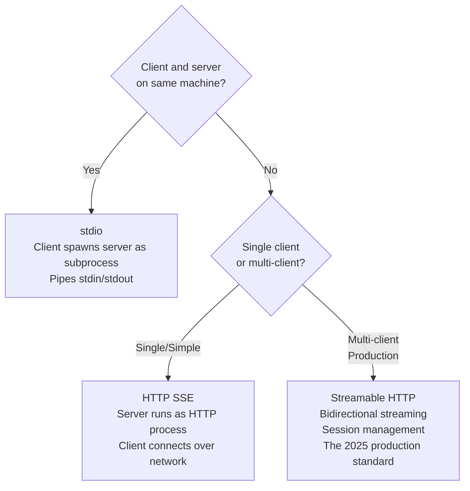

# MCP Transports: stdio, HTTP, Streamable

> The right transport is not the fastest one. It is the one that matches where your server lives.

**Type:** Learn
**Languages:** Python
**Prerequisites:** 06-mcp-fundamentals, 07-build-mcp-server
**Time:** ~45 min
**Learning Objectives:**
- Explain why stdio transport breaks when a server moves to a remote host
- Describe the three MCP transport options and what each one requires from the environment
- Configure an MCP server for all three transports using the Python MCP SDK
- Write the client connection code for each transport
- Apply a decision framework to choose the correct transport for a given deployment

---

## THE PROBLEM

A team builds an internal MCP server that exposes company data to Claude Desktop. They use stdio transport because it is the default and the quickest path to a working demo. The server starts, tools appear in Claude Desktop, and the demo goes well.

Three weeks later, the infrastructure team wants to host the MCP server on a shared VM so multiple teams can use it. They move the server to a remote box, update the Claude Desktop config with an SSH path, and the connection fails. Nothing helpful in the logs.

The root problem: stdio transport requires the client to launch the server as a subprocess on the same machine. The client literally forks the process and pipes stdin/stdout between them. There is no concept of a remote host. The host config in Claude Desktop is not a network address. It is a path to an executable the client will run locally.

Moving to a remote server is not a config change. It requires switching transports. But the team built their server with stdio assumptions baked in, and now they are scrambling to understand what that means, what their options are, and what breaks when they change it.

---

## THE CONCEPT

### The Three MCP Transports

MCP separates the protocol (how messages are structured) from the transport (how bytes move between client and server). The same tool definitions work across all three transports. Only the connection setup changes.



**stdio:** The client calls `subprocess.Popen` on the server binary, then wraps the process's stdin and stdout as a bidirectional channel. The server reads JSON-RPC messages from stdin and writes responses to stdout. Communication is fast because there is no network stack, but it is completely local. If the client cannot fork the server process, stdio cannot work.

**HTTP with SSE (Server-Sent Events):** The server runs as a long-lived HTTP process. The client opens an HTTP connection to `/sse` and the server keeps it open, pushing events as they arrive. Tool calls go from client to server via HTTP POST, and results come back via the SSE stream. This works across a network, supports multiple sequential clients, but has a limitation: SSE is unidirectional. The server can push to the client, but the client cannot push back on the same connection.

**Streamable HTTP:** The 2025 upgrade to SSE that removes the unidirectional constraint. Each request opens a session, and both client and server can stream data across that session. The server can push tool results, progress updates, and log lines incrementally. Clients reconnect to the same session if the connection drops. This is the correct choice for any MCP server that will serve multiple clients, run in production, or need to push partial results.

### Transport Comparison

```
                  stdio           HTTP SSE        Streamable HTTP
                  ─────────────   ─────────────   ───────────────
Deployment        Same machine    Remote OK       Remote OK
Clients           One at a time   Multiple        Multiple + concurrent
Session state     Process = session   Stateless      Session ID + reconnect
Setup overhead    None            HTTP server     HTTP server + session layer
Streaming         Pipe            Server-to-client  Bidirectional
Use case          Local tools,    Simple remote   Production hosted
                  Claude Desktop  single client   MCP servers
```

---

## BUILD IT

### The Same Server, Three Transports

Start with a minimal product lookup server. The tool logic is identical across all three configurations. Only the `run()` call changes.

```python
# code/main.py (shared tool logic)
from mcp.server import FastMCP

mcp = FastMCP("product-lookup")

PRODUCTS = {
    "p001": {"name": "Widget A", "price": 9.99, "stock": 142},
    "p002": {"name": "Widget B", "price": 24.99, "stock": 8},
    "p003": {"name": "Gadget X", "price": 149.00, "stock": 0},
}

@mcp.tool()
def get_product(product_id: str) -> dict:
    """Look up a product by ID."""
    if product_id not in PRODUCTS:
        return {"error": f"Product {product_id} not found"}
    return PRODUCTS[product_id]

@mcp.tool()
def list_products() -> list[dict]:
    """List all available products."""
    return [{"id": k, **v} for k, v in PRODUCTS.items()]
```

**Transport 1: stdio**

```python
# Run the server over stdio (client forks this process)
if __name__ == "__main__":
    mcp.run(transport="stdio")
```

The Claude Desktop config for stdio:

```json
{
  "mcpServers": {
    "product-lookup": {
      "command": "python",
      "args": ["/absolute/path/to/code/main.py"],
      "env": {}
    }
  }
}
```

Claude Desktop will fork `python /absolute/path/to/code/main.py` and communicate with it via stdin/stdout. The server must not print anything to stdout except MCP protocol messages.

**Transport 2: HTTP with SSE**

```python
# Run the server as an HTTP SSE server
if __name__ == "__main__":
    mcp.run(transport="sse", host="0.0.0.0", port=8080)
```

Client connection code for SSE:

```python
from mcp.client.session import ClientSession
from mcp.client.sse import sse_client

async def connect_via_sse():
    async with sse_client("http://localhost:8080/sse") as (read, write):
        async with ClientSession(read, write) as session:
            await session.initialize()
            tools = await session.list_tools()
            result = await session.call_tool("get_product", {"product_id": "p001"})
            print(result)
```

The client connects to `/sse`, the server keeps the connection open, and tool calls go out as HTTP POST requests to `/messages`.

**Transport 3: Streamable HTTP**

Streamable HTTP requires session management. The server assigns each connected client a session ID and maintains state across reconnects.

```python
# code/main_streamable.py
from mcp.server import FastMCP
from mcp.server.streamable_http import StreamableHTTPSessionManager

mcp = FastMCP("product-lookup-streamable")

# Register the same tools
@mcp.tool()
def get_product(product_id: str) -> dict:
    """Look up a product by ID."""
    if product_id not in PRODUCTS:
        return {"error": f"Product {product_id} not found"}
    return PRODUCTS[product_id]

# Session manager tracks active sessions and handles reconnects
session_manager = StreamableHTTPSessionManager(
    app=mcp,
    event_store=None,  # Use in-memory store; swap for Redis in production
)

if __name__ == "__main__":
    import uvicorn
    from starlette.applications import Starlette
    from starlette.routing import Mount

    app = Starlette(
        routes=[
            Mount("/mcp", app=session_manager.asgi_app()),
        ]
    )
    uvicorn.run(app, host="0.0.0.0", port=8080)
```

Client connection for Streamable HTTP:

```python
from mcp.client.streamable_http import streamablehttp_client

async def connect_via_streamable():
    async with streamablehttp_client("http://localhost:8080/mcp") as (read, write, _):
        async with ClientSession(read, write) as session:
            await session.initialize()
            # Session ID is managed automatically
            # If connection drops, reconnect preserves session state
            result = await session.call_tool("list_products", {})
            print(result)
```

> **Real-world check:** Your team's MCP server handles tool calls that take 30-45 seconds (it runs a batch report). With SSE transport, the client times out at 30 seconds. What does switching to Streamable HTTP actually fix here, and what does it not fix?

Streamable HTTP lets the server push incremental progress updates back to the client during the 30-45 second window, so the client knows work is happening and does not time out from inactivity. But the underlying report still takes 30-45 seconds. Streamable HTTP does not make the tool faster. It makes the wait visible and prevents silent timeouts. You still need to handle the case where the client genuinely disconnects and needs to resume.

---

## USE IT

### A Decision Function You Can Actually Run

```python
# choose_transport.py
from dataclasses import dataclass

@dataclass
class DeploymentContext:
    remote: bool          # Server is on a different machine than the client
    multi_client: bool    # More than one client connects concurrently
    needs_streaming: bool # Server pushes partial results or progress
    production: bool      # Deployed beyond local dev

def choose_transport(ctx: DeploymentContext) -> tuple[str, str]:
    """
    Returns (transport_name, reason).
    """
    if not ctx.remote:
        return "stdio", "Same-machine deployment. Client can fork the server process."

    if ctx.multi_client or ctx.production or ctx.needs_streaming:
        return "streamable_http", (
            "Remote + production or multi-client: use Streamable HTTP for "
            "session management, reconnect support, and bidirectional streaming."
        )

    return "sse", (
        "Remote but simple: HTTP SSE works for a single client or "
        "low-traffic remote deployment without streaming requirements."
    )


# Examples
local_dev = DeploymentContext(
    remote=False, multi_client=False, needs_streaming=False, production=False
)
simple_remote = DeploymentContext(
    remote=True, multi_client=False, needs_streaming=False, production=False
)
prod_hosted = DeploymentContext(
    remote=True, multi_client=True, needs_streaming=True, production=True
)

for ctx in [local_dev, simple_remote, prod_hosted]:
    transport, reason = choose_transport(ctx)
    print(f"{transport}: {reason}\n")
```

Output:

```
stdio: Same-machine deployment. Client can fork the server process.

sse: Remote but simple: HTTP SSE works for a single client or low-traffic remote deployment without streaming requirements.

streamable_http: Remote + production or multi-client: use Streamable HTTP for session management, reconnect support, and bidirectional streaming.
```

The Claude Desktop config for a remote HTTP server (SSE or Streamable HTTP does not use the `command` field because Claude Desktop is not forking the server):

```json
{
  "mcpServers": {
    "product-lookup-remote": {
      "url": "http://your-server.example.com:8080/sse"
    }
  }
}
```

For Streamable HTTP, use the `/mcp` endpoint:

```json
{
  "mcpServers": {
    "product-lookup-streamable": {
      "url": "http://your-server.example.com:8080/mcp"
    }
  }
}
```

> **Perspective shift:** A teammate says "let's just always use Streamable HTTP, then we never have to think about this." What is the cost of that default for local Claude Desktop plugins?

Streamable HTTP requires a running HTTP server, which means you need `uvicorn` or similar running as a background process, a port, and likely a startup script or service definition. For a local Claude Desktop plugin, that is overhead that does not buy anything: Claude Desktop can just fork the script directly via stdio with zero setup. The right default depends on where the server runs, not on what is theoretically more capable.

---

## SHIP IT

The artifact this lesson produces is a transport selection guide with ready-to-paste config snippets for all three options. See `outputs/skill-mcp-transport-selector.md`.

The guide answers the first question every MCP server author hits when they try to share their server with someone else: "why does it not work on their machine?"

---

## EVALUATE IT

**Test 1: Verify stdio isolation.** Run your stdio server from a terminal directly: `python main.py`. If it prints anything to stdout other than valid JSON-RPC responses, it will break every MCP client that connects to it. Stdout is the protocol channel. Debug prints go to stderr only.

**Test 2: Verify remote reachability.** For SSE and Streamable HTTP, confirm the server is reachable before wiring up a client:

```bash
curl http://your-server.example.com:8080/sse
# Should see: event: endpoint\ndata: {"uri": "/messages/..."}
```

**Test 3: Verify session persistence.** For Streamable HTTP, connect a client, note the session ID, disconnect (kill the client process), reconnect with the same session ID, and verify the server still has the session state. If the session is lost, your event store is not configured for persistence.

**Test 4: Load test multi-client.** Send 10 concurrent client connections to your SSE or Streamable HTTP server. Verify all 10 get responses and no session state leaks between clients. A common bug: a shared mutable default argument in a tool function that becomes a cross-client state store.
