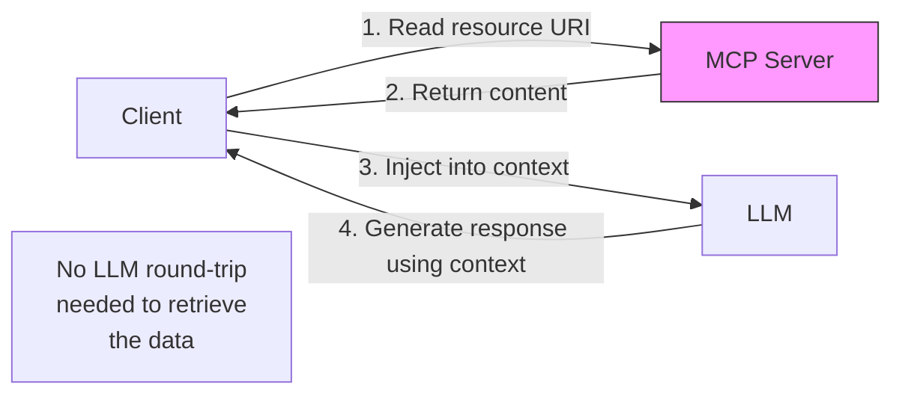

# موارد MCP والبرومبتات (Resources and Prompts)

> ليس كل شيء يحتاج إلى أداة. بعض البيانات ينبغي أن تكون قابلة للقراءة فقط. وبعض سير العمل ينبغي أن يكون قابلاً للمشاركة فقط.

**النوع:** بناء
**اللغات:** Python
**المتطلبات:** 07-build-mcp-server، 08-build-mcp-client
**الوقت:** ~45 دقيقة
**أهداف التعلّم:**
- التمييز بين موارد (resources) وأدوات (tools) وبرومبتات (prompts) MCP وشرح متى يكون كل منها مناسباً
- كشف موارد ثابتة وديناميكية من خادم MCP باستخدام قوالب URI
- تعريف قالب برومبت قابل لإعادة الاستخدام بمعطيات (arguments) مُحدّدة الأنواع على خادم MCP
- كتابة كود عميل لقراءة مورد وعرض (render) قالب برومبت
- تطبيق مصفوفة قرار المورد/الأداة/البرومبت على مشكلة تصميم خادم واقعية

---

## المشكلة

يبني فريق خادم MCP لقاعدة بيانات منتجات. كل شيء أداة: `get_schema()`، `read_product(id)`، `read_category(name)`، `get_config()`، `read_docs(section)`. اثنتا عشرة أداة إجمالاً.

تظهر مشكلتان في الإنتاج.

أولاً، تكلفة الذهاب والإياب (round-trip). في كل مرة يحتاج فيها عميل الذكاء الاصطناعي مخطط قاعدة البيانات لكتابة استعلام، عليه استدعاء `get_schema()`، وانتظار أن يقرر الـ LLM استخدامها، وانتظار التنفيذ، وانتظار دورة LLM أخرى لمعالجة النتيجة. المخطط نص ثابت لا يتغير أبداً. لا يحتاج إلى دورة LLM لجلبه. ينبغي أن يكون شيئاً يستطيع العميل قراءته مباشرة وحقنه في السياق عندما يحتاجه.

ثانياً، انحراف البرومبت (prompt drift). يستخدم الفريق خادم MCP هذا من ثلاثة عملاء مختلفين: تكامل Claude Desktop، وروبوت Slack داخلي، ونقطة نهاية API. الثلاثة جميعاً لديهم برومبت "summarize recent sales". نسخ كل فريق ولصق نسخته من رسالة Slack قبل ستة أشهر. نسخة روبوت Slack تستخدم "last 30 days" افتراضياً. نسخة API تستخدم "last 7 days". نسخة Claude Desktop فيها خلل في تنسيق التاريخ. لا أحد يعرف أي نسخة هي المعتمدة.

كلتا المشكلتين لهما حل مبني بالفعل داخل بروتوكول MCP. الموارد تحل مشكلة الذهاب والإياب. والبرومبتات تحل مشكلة الانحراف.

---

## المفهوم

### بُنى MCP الأساسية الثلاث: الأدوات، الموارد، البرومبتات

يمنح MCP العملاء ثلاث طرق للتفاعل مع الخادم. معظم الفرق تستخدم الأدوات فقط لأنها الأكثر وضوحاً، لكن للبُنى الثلاث جميعها أدوار متمايزة.

```
                  Tools               Resources           Prompts
                  ─────────────────   ─────────────────   ────────────────────
What it is        A function the      Data the client     A prompt template
                  LLM can call        can read directly   with typed arguments
When it runs      LLM decides to      Client decides      Client renders
                  invoke it           when to inject      and sends to LLM
LLM involvement   Required: LLM       Optional: client    Required: client
                  must request it     controls injection  sends result to LLM
Best for          Actions, queries,   Static/semi-static  Shared workflows,
                  writes, compute     data, docs, schemas standardized prompts
Example           search_products()   docs://schema       analyze_sales(period)
```

### الموارد: ملفات افتراضية بمعرّفات URI

المورد بيانات مُعرَّفة بمعرّف URI. يستطيع العميل سرد جميع الموارد المتاحة، وقراءة أي منها بمعرّف URI، والاشتراك في التغييرات. تعمل الموارد كنظام ملفات افتراضي مُركَّب على خادم MCP.

أنماط URI:
- `docs://api-reference` - وثائق ثابتة
- `config://current` - إعدادات الخادم الحالية
- `db://schema` - مخطط قاعدة البيانات
- `product://{product_id}` - مورد ديناميكي باستخدام قالب URI



الفرق الأساسي عن الأداة: العميل يقرر متى يضمّن مورداً في السياق. الـ LLM لا يرى أبداً خطوة جلب المورد. هذا يلغي استدعاء LLM API واحداً لكل عملية جلب بيانات للبيانات المخصصة للقراءة فقط.

### البرومبتات: قوالب يملكها الخادم

البرومبت قالب مُسمّى يعرّفه الخادم ويعرضه العميل بمعطيات. يُعيد الخادم قائمة رسائل - البرومبت المُشكَّل بالكامل الذي يرسله العميل إلى الـ LLM.

```
Server defines:
  name: "analyze_sales"
  arguments: [{ name: "time_period", type: "string", required: true }]

Client calls:
  get_prompt("analyze_sales", {"time_period": "last 30 days"})

Server returns:
  [{ role: "user", content: "Analyze sales for last 30 days. Focus on..." }]

Client sends the messages list directly to the LLM.
```

القوة: القالب يعيش على الخادم. جميع العملاء يشاركون القالب نفسه. عندما يحدّث فريق المنتج البرومبت، يحصل كل عميل على التحديث تلقائياً دون نشر.

---

## البناء

### وسّع خادم المنتجات بالموارد وبرومبت

ابدأ بخادم MCP لقاعدة بيانات المنتجات من L07. أضف ثلاث بُنى أساسية جديدة: مورد مخطط ثابت، ومورد منتج ديناميكي، وقالب برومبت لتحليل المبيعات.

```python
# code/main.py
from mcp.server import FastMCP
from mcp.server.models import ResourceTemplate
from typing import Annotated
import json

mcp = FastMCP("product-database")

# ---------------------------------------------------------------------------
# Existing tools (from L07, abbreviated)
# ---------------------------------------------------------------------------

PRODUCTS = {
    "p001": {"name": "Widget A", "price": 9.99, "stock": 142, "category": "hardware"},
    "p002": {"name": "Widget B", "price": 24.99, "stock": 8, "category": "hardware"},
    "p003": {"name": "Gadget X", "price": 149.00, "stock": 0, "category": "electronics"},
    "p004": {"name": "Gadget Y", "price": 89.00, "stock": 37, "category": "electronics"},
}

SALES = [
    {"product_id": "p001", "date": "2025-05-01", "units": 12, "revenue": 119.88},
    {"product_id": "p002", "date": "2025-05-01", "units": 3, "revenue": 74.97},
    {"product_id": "p001", "date": "2025-05-15", "units": 8, "revenue": 79.92},
    {"product_id": "p003", "date": "2025-05-20", "units": 1, "revenue": 149.00},
]

@mcp.tool()
def search_products(query: str) -> list[dict]:
    """Search products by name or category."""
    q = query.lower()
    return [
        {"id": k, **v}
        for k, v in PRODUCTS.items()
        if q in v["name"].lower() or q in v["category"].lower()
    ]

# ---------------------------------------------------------------------------
# Resource 1: Static schema resource
# The client reads this once and caches it. No LLM round-trip needed.
# ---------------------------------------------------------------------------

DB_SCHEMA = """
Products table:
  product_id  TEXT PRIMARY KEY
  name        TEXT NOT NULL
  price       REAL NOT NULL
  stock       INTEGER NOT NULL
  category    TEXT NOT NULL

Sales table:
  id          INTEGER PRIMARY KEY
  product_id  TEXT REFERENCES products(product_id)
  date        TEXT  -- ISO 8601: YYYY-MM-DD
  units       INTEGER
  revenue     REAL
"""

@mcp.resource("docs://products/schema")
def get_schema() -> str:
    """The database schema for the product and sales tables."""
    return DB_SCHEMA
```

يقرأ العميل `docs://products/schema` مباشرة. لا استدعاء أداة. لا دورة LLM. معرّف URI مستقر، والمحتوى ثابت، ويستطيع العميل تخزينه مؤقتاً (cache).

```python
# ---------------------------------------------------------------------------
# Resource 2: Dynamic resource using a URI template
# The URI pattern {product_id} maps to a parameter in the handler.
# ---------------------------------------------------------------------------

@mcp.resource("product://{product_id}")
def get_product_resource(product_id: str) -> str:
    """Product details as a formatted text block, readable by URI."""
    if product_id not in PRODUCTS:
        return f"Product {product_id} not found."
    p = PRODUCTS[product_id]
    return (
        f"Product: {p['name']}\n"
        f"ID: {product_id}\n"
        f"Price: ${p['price']:.2f}\n"
        f"Stock: {p['stock']} units\n"
        f"Category: {p['category']}\n"
        f"Status: {'In stock' if p['stock'] > 0 else 'Out of stock'}"
    )
```

قالب URI أي `product://{product_id}` يعني أن العميل يستطيع قراءة `product://p001`، `product://p002`، وهكذا. يُستخرج معطى `product_id` من معرّف URI ويُمرَّر إلى المعالج (handler).

```python
# ---------------------------------------------------------------------------
# Resource 3: A dynamic list resource
# Returns all products as a JSON blob - useful for context injection.
# ---------------------------------------------------------------------------

@mcp.resource("docs://products/catalog")
def get_catalog() -> str:
    """All products as JSON, suitable for injection into LLM context."""
    return json.dumps(
        [{"id": k, **v} for k, v in PRODUCTS.items()],
        indent=2
    )

# ---------------------------------------------------------------------------
# Prompt: Sales analysis template
# The server owns this template. All clients render the same prompt.
# ---------------------------------------------------------------------------

@mcp.prompt()
def analyze_sales(time_period: str) -> str:
    """
    Generate a sales analysis prompt for a given time period.
    Returns a fully-formed prompt the client sends to the LLM.
    """
    sales_data = json.dumps(SALES, indent=2)
    return (
        f"Analyze the following sales data for {time_period}.\n\n"
        f"Sales records:\n{sales_data}\n\n"
        "Your analysis should cover:\n"
        "1. Total revenue and unit volume\n"
        "2. Best-performing product by revenue\n"
        "3. Any products with concerning stock levels\n"
        "4. One actionable recommendation for the next period\n\n"
        "Be concise. Use bullet points for the findings."
    )
```

الآن أظهر العميل وهو يقرأ الموارد ويعرض البرومبت:

```python
import asyncio
from mcp import ClientSession, StdioServerParameters
from mcp.client.stdio import stdio_client

async def demo_client():
    server_params = StdioServerParameters(
        command="python",
        args=["code/main.py"],
    )

    async with stdio_client(server_params) as (read, write):
        async with ClientSession(read, write) as session:
            await session.initialize()

            # List all available resources
            resources = await session.list_resources()
            print("Available resources:")
            for r in resources.resources:
                print(f"  {r.uri} - {r.description}")

            # Read the static schema resource
            schema = await session.read_resource("docs://products/schema")
            print("\nDB Schema (via resource, no tool call):")
            print(schema.contents[0].text[:200])

            # Read a specific product via URI template
            product = await session.read_resource("product://p001")
            print("\nProduct p001 (via resource URI template):")
            print(product.contents[0].text)

            # List available prompts
            prompts = await session.list_prompts()
            print("\nAvailable prompts:")
            for p in prompts.prompts:
                print(f"  {p.name} - args: {[a.name for a in p.arguments]}")

            # Render the sales analysis prompt with an argument
            rendered = await session.get_prompt(
                "analyze_sales",
                {"time_period": "May 2025"}
            )
            print("\nRendered prompt (first 200 chars):")
            print(rendered.messages[0].content.text[:200])


if __name__ == "__main__":
    asyncio.run(demo_client())
```

> **اختبار من الواقع:** خادم منتجاتك فيه أداة `get_schema()` ومورد `docs://products/schema` يُعيدان البيانات نفسها. يسأل مطوّر: "لماذا نحتاج كليهما؟ ألا يمكننا استخدام الأداة فقط؟" متى يغيّر وجود المورد فعلاً السلوك في خط إنتاج ذكاء اصطناعي إنتاجي؟

عندما يكون المورد متاحاً، يستطيع العميل أن يقرر تضمين المخطط في برومبت النظام (system prompt) في كل طلب، دون إحراق استدعاء LLM API لجلبه. ومع أداة فقط، يجب على الـ LLM أن يقرر أولاً أنه يحتاج المخطط، ثم يطلبه، وينتظر الذهاب والإياب، ثم يتابع. بالنسبة للبيانات الثابتة كمخطط يحتاجه الـ LLM بشكل موثوق، مسار المورد أرخص وأسرع. تبقى الأداة مفيدة عندما يجب جلب المخطط ديناميكياً أو بشكل شرطي.

---

## الاستخدام

### مفتّش MCP (MCP Inspector)

مفتّش MCP هو أسرع طريقة للتحقق من أن مواردك وبرومبتاتك مربوطة بشكل صحيح قبل ربط عميل حقيقي.

```bash
# Install the inspector CLI
npx @modelcontextprotocol/inspector python code/main.py
```

يشغّل المفتّش الخادم ويفتح واجهة ويب محلية. من هناك يمكنك:

- تصفّح جميع الموارد والأدوات والبرومبتات
- النقر على أي معرّف URI لمورد وقراءة محتواه
- عرض أي برومبت بمعطيات اختبار ورؤية المخرَجات
- رؤية رسائل JSON-RPC الخام لكل تفاعل

لاختبار برمجي سريع دون الواجهة:

```python
# test_primitives.py
import asyncio
from mcp import ClientSession, StdioServerParameters
from mcp.client.stdio import stdio_client

async def smoke_test():
    server_params = StdioServerParameters(command="python", args=["code/main.py"])

    async with stdio_client(server_params) as (read, write):
        async with ClientSession(read, write) as session:
            await session.initialize()

            # Resources
            resources = await session.list_resources()
            resource_uris = [r.uri for r in resources.resources]
            assert "docs://products/schema" in resource_uris, "Schema resource missing"
            assert "docs://products/catalog" in resource_uris, "Catalog resource missing"

            schema_content = await session.read_resource("docs://products/schema")
            assert "Products table" in schema_content.contents[0].text

            product_content = await session.read_resource("product://p001")
            assert "Widget A" in product_content.contents[0].text

            # Prompts
            prompts = await session.list_prompts()
            prompt_names = [p.name for p in prompts.prompts]
            assert "analyze_sales" in prompt_names, "analyze_sales prompt missing"

            rendered = await session.get_prompt("analyze_sales", {"time_period": "Q2 2025"})
            assert "Q2 2025" in rendered.messages[0].content.text

            print("All smoke tests passed.")

asyncio.run(smoke_test())
```

> **نقلة في المنظور:** يقترح زميل وضع منطق برومبت `analyze_sales` مباشرة في برومبت نظام Claude Desktop بدلاً من تعريفه كبرومبت MCP. كلا النهجين ينتجان مخرَج LLM نفسه اليوم. ما الفرق العملي بعد ستة أشهر من الآن؟

بعد ستة أشهر يكون لديك ثلاثة عملاء تطوّر كل منهم بشكل مستقل. نسخة Claude Desktop فيها أحدث تعديلات مدير المنتج. نسخة روبوت Slack فيها خلل من آخر تعديل. نسخة API لا تزال على الأصل. عندما يحتاج البرومبت للتغيير (تنسيق بيانات جديد، متطلب تحليل جديد)، تقوم بثلاث عمليات نشر منفصلة وتأمل أن تبقى الثلاث متزامنة. ومع برومبت MCP، تغيّر الخادم مرة واحدة ويعرض كل عميل النسخة المحدّثة عند الاستدعاء التالي، دون إعادة نشر العميل.

---

## التسليم

المخرَج الذي ينتجه هذا الدرس هو دليل نمط لتصميم URI الموارد وبنية قالب البرومبت. انظر `outputs/skill-mcp-resources-prompts.md`.

يجيب هذا الدليل عن أكثر سؤالين تصميميين شيوعاً عند توسعة خادم MCP إلى ما بعد الأدوات: كيفية بناء معرّفات URI للموارد للبيانات الثابتة والديناميكية معاً، وكيفية تعريف قوالب برومبت تبقى قابلة للصيانة مع تطوّر الخادم.

---

## التقييم

**الاختبار 1: تغطية الموارد.** اسرد جميع الموارد من جانب العميل وتحقق من ظهور كل معرّف URI سجّلته. إذا كان مورد مفقوداً، فقد فشل تسجيل المعالج بصمت.

```python
resources = await session.list_resources()
assert len(resources.resources) >= 3
```

**الاختبار 2: تحليل قالب URI.** جرّب قراءة معرّف URI صالح ومعرّف URI غير صالح عبر مورد قالب URI الخاص بك. تحقق من أن الحالة الصالحة تُعيد بيانات وأن الحالة غير الصالحة تُعيد رسالة خطأ ذات معنى، لا انهياراً.

```python
valid = await session.read_resource("product://p001")
assert "Widget A" in valid.contents[0].text

invalid = await session.read_resource("product://does-not-exist")
assert "not found" in invalid.contents[0].text.lower()
```

**الاختبار 3: التحقق من معطيات البرومبت.** استدعِ `get_prompt` بمعطى مطلوب مفقود. ينبغي أن يُعيد الخادم خطأً، لا قالباً مَعروضاً جزئياً بقيم `None` مُستبدَلة فيه.

**الاختبار 4: قِدَم قالب البرومبت.** إذا كان قالب البرومبت لديك يضمّن بيانات من الخادم (كسجلات المبيعات في المثال)، تحقق من أن البرومبت المعروض يعكس البيانات الحالية، لا بيانات خُزّنت مؤقتاً عند إقلاع الخادم. يجب جلب البيانات الديناميكية في قالب البرومبت وقت العرض، لا وقت التعريف.

**الاختبار 5: زمن استجابة المورد مقابل الأداة.** قِس المسارين: قراءة المخطط عبر مورد (استدعاء عميل واحد) مقابل استدعاء أداة `get_schema()` (يتطلب أن يطلبها الـ LLM، ذهاباً وإياباً إلى كودك، وعودة إلى الـ LLM). بالنسبة للبيانات الثابتة، ينبغي أن يكون مسار المورد أسرع بشكل قابل للقياس في الزمن الكلي (end-to-end) لأنه يلغي خطوة قرار الـ LLM.
