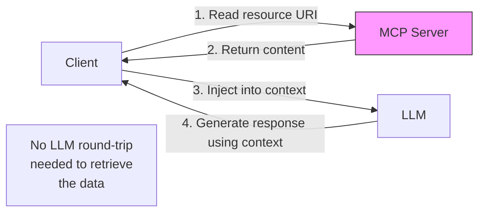

# MCP Resources and Prompts

> Not everything needs a tool. Some data should just be readable. Some workflows should just be shareable.

**Type:** Build
**Languages:** Python
**Prerequisites:** 07-build-mcp-server, 08-build-mcp-client
**Time:** ~45 min
**Learning Objectives:**
- Distinguish MCP resources, tools, and prompts and explain when each is appropriate
- Expose static and dynamic resources from an MCP server using URI templates
- Define a reusable prompt template with typed arguments on an MCP server
- Write client code to read a resource and render a prompt template
- Apply the resource/tool/prompt decision matrix to a real server design problem

---

## THE PROBLEM

A team builds a product database MCP server. Everything is a tool: `get_schema()`, `read_product(id)`, `read_category(name)`, `get_config()`, `read_docs(section)`. Twelve tools total.

Two problems emerge in production.

First, round-trip cost. Every time the AI client needs the database schema to write a query, it has to call `get_schema()`, wait for the LLM to decide to use it, wait for the execution, and wait for another LLM turn to process the result. The schema is static text that never changes. It does not need an LLM round-trip to retrieve. It should be something the client can read directly and inject into context when it needs it.

Second, prompt drift. The team uses this MCP server from three different clients: a Claude Desktop integration, an internal Slack bot, and an API endpoint. All three have a "summarize recent sales" prompt. Each team copy-pasted it from a Slack message six months ago. The Slack bot's version uses "last 30 days" by default. The API version uses "last 7 days." The Claude Desktop version has a bug in the date formatting. Nobody knows which version is canonical.

Both problems have a solution that is already built into the MCP protocol. Resources solve the round-trip problem. Prompts solve the drift problem.

---

## THE CONCEPT

### Three MCP Primitives: Tools, Resources, Prompts

MCP gives clients three ways to interact with a server. Most teams only use tools because they are the most visible, but all three primitives have distinct roles.

```
                  Tools               Resources           Prompts
                  ─────────────────   ─────────────────   ────────────────────
What it is        A function the      Data the client     A prompt template
                  LLM can call        can read directly   with typed arguments
When it runs      LLM decides to      Client decides      Client renders
                  invoke it           when to inject      and sends to LLM
LLM involvement   Required: LLM       Optional: client    Required: client
                  must request it     controls injection  sends result to LLM
Best for          Actions, queries,   Static/semi-static  Shared workflows,
                  writes, compute     data, docs, schemas standardized prompts
Example           search_products()   docs://schema       analyze_sales(period)
```

### Resources: Virtual Files With URIs

A resource is data identified by a URI. The client can list all available resources, read any of them by URI, and subscribe to changes. Resources work like a virtual filesystem mounted on the MCP server.

URI patterns:
- `docs://api-reference` - static documentation
- `config://current` - current server configuration
- `db://schema` - database schema
- `product://{product_id}` - dynamic resource using a URI template



The key difference from a tool: the client decides when to include a resource in context. The LLM never sees the resource retrieval step. This eliminates one LLM API call per data fetch for read-only data.

### Prompts: Server-Owned Templates

A prompt is a named template that the server defines and the client renders with arguments. The server returns a list of messages - the fully-formed prompt that the client sends to the LLM.

```
Server defines:
  name: "analyze_sales"
  arguments: [{ name: "time_period", type: "string", required: true }]

Client calls:
  get_prompt("analyze_sales", {"time_period": "last 30 days"})

Server returns:
  [{ role: "user", content: "Analyze sales for last 30 days. Focus on..." }]

Client sends the messages list directly to the LLM.
```

The power: the template lives on the server. All clients share the same template. When the product team updates the prompt, every client gets the update automatically without a deploy.

---

## BUILD IT

### Extend the Product Server with Resources and a Prompt

Start with the product database MCP server from L07. Add three new primitives: a static schema resource, a dynamic product resource, and a sales analysis prompt template.

```python
# code/main.py
from mcp.server import FastMCP
from mcp.server.models import ResourceTemplate
from typing import Annotated
import json

mcp = FastMCP("product-database")

# ---------------------------------------------------------------------------
# Existing tools (from L07, abbreviated)
# ---------------------------------------------------------------------------

PRODUCTS = {
    "p001": {"name": "Widget A", "price": 9.99, "stock": 142, "category": "hardware"},
    "p002": {"name": "Widget B", "price": 24.99, "stock": 8, "category": "hardware"},
    "p003": {"name": "Gadget X", "price": 149.00, "stock": 0, "category": "electronics"},
    "p004": {"name": "Gadget Y", "price": 89.00, "stock": 37, "category": "electronics"},
}

SALES = [
    {"product_id": "p001", "date": "2025-05-01", "units": 12, "revenue": 119.88},
    {"product_id": "p002", "date": "2025-05-01", "units": 3, "revenue": 74.97},
    {"product_id": "p001", "date": "2025-05-15", "units": 8, "revenue": 79.92},
    {"product_id": "p003", "date": "2025-05-20", "units": 1, "revenue": 149.00},
]

@mcp.tool()
def search_products(query: str) -> list[dict]:
    """Search products by name or category."""
    q = query.lower()
    return [
        {"id": k, **v}
        for k, v in PRODUCTS.items()
        if q in v["name"].lower() or q in v["category"].lower()
    ]

# ---------------------------------------------------------------------------
# Resource 1: Static schema resource
# The client reads this once and caches it. No LLM round-trip needed.
# ---------------------------------------------------------------------------

DB_SCHEMA = """
Products table:
  product_id  TEXT PRIMARY KEY
  name        TEXT NOT NULL
  price       REAL NOT NULL
  stock       INTEGER NOT NULL
  category    TEXT NOT NULL

Sales table:
  id          INTEGER PRIMARY KEY
  product_id  TEXT REFERENCES products(product_id)
  date        TEXT  -- ISO 8601: YYYY-MM-DD
  units       INTEGER
  revenue     REAL
"""

@mcp.resource("docs://products/schema")
def get_schema() -> str:
    """The database schema for the product and sales tables."""
    return DB_SCHEMA
```

The client reads `docs://products/schema` directly. No tool call. No LLM round-trip. The URI is stable, the content is static, and the client can cache it.

```python
# ---------------------------------------------------------------------------
# Resource 2: Dynamic resource using a URI template
# The URI pattern {product_id} maps to a parameter in the handler.
# ---------------------------------------------------------------------------

@mcp.resource("product://{product_id}")
def get_product_resource(product_id: str) -> str:
    """Product details as a formatted text block, readable by URI."""
    if product_id not in PRODUCTS:
        return f"Product {product_id} not found."
    p = PRODUCTS[product_id]
    return (
        f"Product: {p['name']}\n"
        f"ID: {product_id}\n"
        f"Price: ${p['price']:.2f}\n"
        f"Stock: {p['stock']} units\n"
        f"Category: {p['category']}\n"
        f"Status: {'In stock' if p['stock'] > 0 else 'Out of stock'}"
    )
```

The URI template `product://{product_id}` means the client can read `product://p001`, `product://p002`, etc. The `product_id` parameter is extracted from the URI and passed to the handler.

```python
# ---------------------------------------------------------------------------
# Resource 3: A dynamic list resource
# Returns all products as a JSON blob - useful for context injection.
# ---------------------------------------------------------------------------

@mcp.resource("docs://products/catalog")
def get_catalog() -> str:
    """All products as JSON, suitable for injection into LLM context."""
    return json.dumps(
        [{"id": k, **v} for k, v in PRODUCTS.items()],
        indent=2
    )

# ---------------------------------------------------------------------------
# Prompt: Sales analysis template
# The server owns this template. All clients render the same prompt.
# ---------------------------------------------------------------------------

@mcp.prompt()
def analyze_sales(time_period: str) -> str:
    """
    Generate a sales analysis prompt for a given time period.
    Returns a fully-formed prompt the client sends to the LLM.
    """
    sales_data = json.dumps(SALES, indent=2)
    return (
        f"Analyze the following sales data for {time_period}.\n\n"
        f"Sales records:\n{sales_data}\n\n"
        "Your analysis should cover:\n"
        "1. Total revenue and unit volume\n"
        "2. Best-performing product by revenue\n"
        "3. Any products with concerning stock levels\n"
        "4. One actionable recommendation for the next period\n\n"
        "Be concise. Use bullet points for the findings."
    )
```

Now show the client reading resources and rendering the prompt:

```python
import asyncio
from mcp import ClientSession, StdioServerParameters
from mcp.client.stdio import stdio_client

async def demo_client():
    server_params = StdioServerParameters(
        command="python",
        args=["code/main.py"],
    )

    async with stdio_client(server_params) as (read, write):
        async with ClientSession(read, write) as session:
            await session.initialize()

            # List all available resources
            resources = await session.list_resources()
            print("Available resources:")
            for r in resources.resources:
                print(f"  {r.uri} - {r.description}")

            # Read the static schema resource
            schema = await session.read_resource("docs://products/schema")
            print("\nDB Schema (via resource, no tool call):")
            print(schema.contents[0].text[:200])

            # Read a specific product via URI template
            product = await session.read_resource("product://p001")
            print("\nProduct p001 (via resource URI template):")
            print(product.contents[0].text)

            # List available prompts
            prompts = await session.list_prompts()
            print("\nAvailable prompts:")
            for p in prompts.prompts:
                print(f"  {p.name} - args: {[a.name for a in p.arguments]}")

            # Render the sales analysis prompt with an argument
            rendered = await session.get_prompt(
                "analyze_sales",
                {"time_period": "May 2025"}
            )
            print("\nRendered prompt (first 200 chars):")
            print(rendered.messages[0].content.text[:200])


if __name__ == "__main__":
    asyncio.run(demo_client())
```

> **Real-world check:** Your product server has a `get_schema()` tool and a `docs://products/schema` resource that return the same data. A developer asks: "Why do we need both? Can't we just use the tool?" When does having the resource actually change behavior in a production AI pipeline?

When a resource is available, the client can decide to include the schema in the system prompt on every request, without burning an LLM API call to retrieve it. With only a tool, the LLM must first decide it needs the schema, request it, wait for the round-trip, and then proceed. For static data like a schema that the LLM reliably needs, the resource path is cheaper and faster. The tool is still useful when the schema must be fetched dynamically or conditionally.

---

## USE IT

### The MCP Inspector

The MCP Inspector is the fastest way to verify your resources and prompts are wired correctly before connecting a real client.

```bash
# Install the inspector CLI
npx @modelcontextprotocol/inspector python code/main.py
```

The inspector launches the server and opens a local web UI. From there you can:

- Browse all resources, tools, and prompts
- Click any resource URI and read its content
- Render any prompt with test arguments and see the output
- See the raw JSON-RPC messages for every interaction

For a quick programmatic test without the UI:

```python
# test_primitives.py
import asyncio
from mcp import ClientSession, StdioServerParameters
from mcp.client.stdio import stdio_client

async def smoke_test():
    server_params = StdioServerParameters(command="python", args=["code/main.py"])

    async with stdio_client(server_params) as (read, write):
        async with ClientSession(read, write) as session:
            await session.initialize()

            # Resources
            resources = await session.list_resources()
            resource_uris = [r.uri for r in resources.resources]
            assert "docs://products/schema" in resource_uris, "Schema resource missing"
            assert "docs://products/catalog" in resource_uris, "Catalog resource missing"

            schema_content = await session.read_resource("docs://products/schema")
            assert "Products table" in schema_content.contents[0].text

            product_content = await session.read_resource("product://p001")
            assert "Widget A" in product_content.contents[0].text

            # Prompts
            prompts = await session.list_prompts()
            prompt_names = [p.name for p in prompts.prompts]
            assert "analyze_sales" in prompt_names, "analyze_sales prompt missing"

            rendered = await session.get_prompt("analyze_sales", {"time_period": "Q2 2025"})
            assert "Q2 2025" in rendered.messages[0].content.text

            print("All smoke tests passed.")

asyncio.run(smoke_test())
```

> **Perspective shift:** A teammate suggests putting the `analyze_sales` prompt logic directly in the Claude Desktop system prompt rather than defining it as an MCP prompt. Both approaches produce the same LLM output today. What is the practical difference six months from now?

In six months you have three clients that have each evolved independently. The Claude Desktop version has the PM's latest tweaks. The Slack bot version has a bug from the last edit. The API version is still on the original. When the prompt needs to change (new data format, new analysis requirement), you make three separate deploys and hope all three stay in sync. With an MCP prompt, you change the server once and every client renders the updated version on the next call, with no client redeploy.

---

## SHIP IT

The artifact this lesson produces is a pattern guide for resource URI design and prompt template structure. See `outputs/skill-mcp-resources-prompts.md`.

This guide answers the two most common design questions when extending an MCP server beyond tools: how to structure resource URIs for both static and dynamic data, and how to define prompt templates that stay maintainable as the server evolves.

---

## EVALUATE IT

**Test 1: Resource coverage.** List all resources from the client side and verify every URI you registered appears. If a resource is missing, the handler registration failed silently.

```python
resources = await session.list_resources()
assert len(resources.resources) >= 3
```

**Test 2: URI template resolution.** Try reading a valid URI and an invalid URI via your URI template resource. Verify the valid case returns data and the invalid case returns a meaningful error message, not a crash.

```python
valid = await session.read_resource("product://p001")
assert "Widget A" in valid.contents[0].text

invalid = await session.read_resource("product://does-not-exist")
assert "not found" in invalid.contents[0].text.lower()
```

**Test 3: Prompt argument validation.** Call `get_prompt` with a missing required argument. The server should return an error, not a partially-rendered template with `None` values substituted in.

**Test 4: Prompt template staleness.** If your prompt template embeds data from the server (like the sales records in the example), verify the rendered prompt reflects current data, not data that was cached at server startup. Dynamic data in a prompt template must be fetched at render time, not at definition time.

**Test 5: Resource vs tool latency.** Time the two paths: reading the schema via a resource (one client call) vs calling a `get_schema()` tool (requires LLM to request it, round-trip to your code, return to LLM). For static data, the resource path should be measurably faster in end-to-end wall time because it eliminates the LLM decision step.
