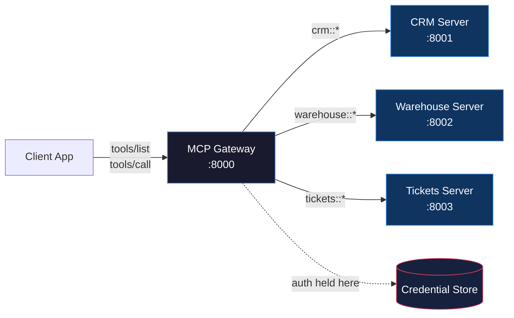

# بوابات MCP وسجلّاته (Gateways and Registries)

> نقطة دخول واحدة تحكم كل الأدوات.

**النوع:** تعلّم
**اللغات:** Python
**المتطلبات:** 06-mcp-fundamentals، 07-build-mcp-server، 08-build-mcp-client
**الوقت:** ~45 دقيقة
**أهداف التعلّم:**
- شرح كيف تحل البوابة (gateway) مشكلة تهيئة N-تطبيق-في-M-خادم
- وصف الوظائف الثلاث التي تؤديها البوابة: التوجيه (routing)، والمصادقة (auth)، والاكتشاف (discovery)
- بناء بوابة بسيطة بـ Python تجمّع الأدوات من عدة خوادم منبع (upstream)
- قراءة مدخلة في سجل (registry) وفهم ما يشير إليه كل حقل للعميل
- كتابة ملف إعدادات بوابة YAML يستطيع عميل حقيقي استهلاكه

---

## المشكلة

نمت شركتك إلى ثمانية خوادم MCP داخلية: واحد لنظام إدارة علاقات العملاء (CRM)، وواحد لمستودع البيانات، وواحد لنظام التذاكر، وواحد لخط نشر النشر (deployment pipeline)، وواحد لقاعدة المعرفة، وواحد لتقارير المالية، وواحد لسجلات الموارد البشرية، وواحد لمقاييس البنية التحتية.

كل تطبيق ذكاء اصطناعي يصدره فريقك عليه تهيئة الاتصال بالثمانية جميعاً بشكل منفصل. سلسلة اتصال خادم CRM تعيش في إعدادات روبوت دعم العملاء، ومساعد المبيعات، والمساعد الهندسي، ولوحة معلومات الإدارة. عندما يدوّر فريق CRM رمز API الخاص بهم، تتعطّل التطبيقات الأربعة جميعاً حتى يحدّث أحدهم كل إعدادات. وعندما يطلق فريق البيانات خادماً تاسعاً لتحليلات المنتج، على أحدهم تحديث كل تطبيق من جديد.

هذه مشكلة التهيئة الموزّعة (distributed configuration). تبدو قابلة للإدارة مع خادمين وتطبيق واحد. وتصبح ضريبة صيانة مع ثمانية خوادم واثني عشر تطبيقاً. مساحة سطح سوء التهيئة تنمو كحاصل ضرب الخوادم في التطبيقات.

الحل هو النمط نفسه الذي حل هذه المشكلة في الشبكات: وكيل (proxy). بدلاً من اتصال كل تطبيق بكل خادم، يتصل كل تطبيق ببوابة واحدة. تملك البوابة التوجيه، وبيانات الاعتماد، والكتالوج. تصبح التطبيقات عملاء نحيفين يسألون "ما الأدوات الموجودة؟" و"شغّل هذه الأداة" دون معرفة مكان أي شيء.

---

## المفهوم

### الوظائف الثلاث للبوابة

للبوابة بالضبط ثلاث مسؤوليات:

**التوجيه (Routing):** عندما يستدعي عميل `crm::get_contact`، تجرّد البوابة البادئة `crm::`، وتبحث عن خادم المنبع الذي يملك مساحة الأسماء (namespace) `crm`، وتعيد توجيه الاستدعاء. العميل لا يحتاج أبداً لمعرفة عنوان URL لخادم CRM.

**المصادقة (Auth):** تحمل البوابة بيانات الاعتماد لكل خادم منبع. يصادق العملاء على البوابة مرة واحدة (عبر مفتاح API، أو رمز OAuth، أو TLS متبادل). تصادق البوابة على كل خادم منبع نيابة عن العميل. عندما يدوّر CRM رمزه، تتغير إعدادات البوابة فقط.

**الاكتشاف (Discovery):** تكشف البوابة `tools/list` موحّداً يجمّع مخططات الأدوات من كل خادم منبع، مع منح كل أداة مساحة أسماء ببادئة خادمها. يرى العميل قائمة مسطّحة واحدة: `crm::get_contact`، `warehouse::run_query`، `tickets::create_ticket`. لا يحتاج لمعرفة أي خادم يملك أي أداة.



### كيف يعمل التوجيه

كل اسم أداة في البوابة يتبع النمط `{namespace}::{tool_name}`. تربط إعدادات البوابة كل مساحة أسماء بخادم منبع. التوجيه آلي: قسّم عند `::`، خذ الجانب الأيسر، ابحث عن الخادم، أعد التوجيه باسم الأداة الأصلي ناقصاً البادئة.

إذا لم يكن لاسم أداة `::`، ترفضه البوابة برسالة خطأ واضحة. هذا يفرض عقد التسمية عبر جميع العملاء.

### السجل: الكتالوج خلف البوابة

تحتاج البوابة لمعرفة الخوادم الموجودة وما تكشفه. تعيش تلك المعرفة في سجل (registry). في شركة صغيرة، يكون السجل ملف إعدادات YAML يصونه فريق المنصة. وعند التوسّع، يصبح خدمة بـ API: تسجّل الخوادم نفسها، وتستطلع البوابة التغييرات، وتتيح واجهة للمهندسين تصفّح الأدوات المتاحة.

السجلات العامة تظهر في منظومة 2026. فكّر بها كـ npm لخوادم MCP. مدخلة سجل عام لخادم تصف ما يكشفه، وكيفية المصادقة، والإصدار الحالي، ونقطة نهاية فحص الصحة (health check). تتصفح السجل، تجد خادماً يفعل ما تحتاجه، تنسخ إعداداته إلى بوابتك، وتكتسب تطبيقاتك فوراً الوصول إلى أدواته.

```
REGISTRY ENTRY FORMAT
=====================

┌─────────────────────────────────────────────────────────────────┐
│  name:         crm-server                                       │
│  description:  Salesforce CRM read/write via REST API           │
│  namespace:    crm                                              │
│  version:      2.1.0                                            │
│  url:          http://crm-mcp.internal:8001                     │
│  health:       http://crm-mcp.internal:8001/health              │
│  auth_type:    bearer_token                                     │
│  tools:                                                         │
│    - get_contact(id)                                            │
│    - search_contacts(query, limit)                              │
│    - create_contact(name, email, company)                       │
│    - update_contact(id, fields)                                 │
│  resources:                                                     │
│    - crm://contacts/recent                                      │
│  prompts:                                                       │
│    - draft_outreach(contact_id)                                 │
│  owner:        crm-platform-team@company.com                    │
│  sla:          99.5% uptime, p95 < 200ms                        │
└─────────────────────────────────────────────────────────────────┘
```

حقل `namespace` هو ما تستخدمه البوابة للتوجيه. حقل `auth_type` يخبر البوابة كيف تصادق. نقطة نهاية `health` تتيح للبوابة اكتشاف توقّف خادم قبل توجيه استدعاءات إليه.

### السجلات العامة مقابل الخاصة

تستضيف السجلات العامة خوادم تصونها المجتمعات: واجهات API للطقس، ومجموعات بيانات عامة، وتكاملات SaaS شائعة. وتستضيف السجلات المؤسسية الخاصة خوادم داخلية، مع تحكم بالوصول حسب الفريق أو حساب الخدمة. تشير إعدادات البوابة إلى خوادم من النوعين، وتعاملها بشكل متطابق وقت التوجيه.

---

## البناء

### بوابة MCP بسيطة بـ Python

الهدف بوابة عاملة تجمّع الأدوات من ثلاثة خوادم منبع. في هذا الدرس، تكون "خوادم المنبع" كائنات وهمية (mock) داخل العملية. منطق التوجيه هو ما يهم، لا طبقة النقل.

انظر `code/main.py` للتنفيذ الكامل. إليك البنية المعمارية:

**1. وهمي خادم المنبع:** قاموس (dict) من مخططات الأدوات ومعالج قابل للاستدعاء. يحل هذا محل خادم MCP حقيقي يعمل على منفذ آخر.

```python
from dataclasses import dataclass
from typing import Any, Callable

@dataclass
class MockServer:
    """Represents a remote MCP server with a known set of tools."""
    name: str
    namespace: str
    tools: list[dict]  # MCP tool schemas
    handler: Callable[[str, dict], Any]  # tool_name -> result
```

**2. محمّل إعدادات البوابة:** يقرأ ملف YAML يصف خوادم المنبع ويهيئ اتصالات وهمية.

```python
import yaml

def load_gateway_config(path: str) -> dict:
    with open(path) as f:
        return yaml.safe_load(f)
```

تبدو إعدادات YAML هكذا:

```yaml
gateway:
  name: "Engineering Gateway"
  port: 8000

servers:
  - name: crm-server
    namespace: crm
    url: http://crm-mcp.internal:8001
    auth:
      type: bearer_token
      token_env: CRM_MCP_TOKEN
    tools:
      - get_contact
      - search_contacts
      - create_contact

  - name: warehouse-server
    namespace: warehouse
    url: http://warehouse-mcp.internal:8002
    auth:
      type: api_key
      key_env: WAREHOUSE_MCP_KEY
    tools:
      - run_query
      - list_tables
      - describe_table

  - name: tickets-server
    namespace: tickets
    url: http://tickets-mcp.internal:8003
    auth:
      type: bearer_token
      token_env: TICKETS_MCP_TOKEN
    tools:
      - create_ticket
      - get_ticket
      - list_tickets
      - add_comment
```

**3. `tools/list` المجمّع:** يمرّ على كل خوادم المنبع، يضع بادئة لكل اسم أداة، ويُعيد قائمة مسطّحة.

```python
def aggregate_tools(servers: list[MockServer]) -> list[dict]:
    """
    Combine tool schemas from all servers.
    Prefixes each tool name with its server's namespace.
    """
    all_tools = []
    for server in servers:
        for tool in server.tools:
            prefixed = dict(tool)
            prefixed["name"] = f"{server.namespace}::{tool['name']}"
            prefixed["description"] = (
                f"[{server.name}] {tool.get('description', '')}"
            )
            all_tools.append(prefixed)
    return all_tools
```

**4. الموجّه (router):** يقسّم اسم الأداة المُبدَّأ ويرسله إلى الخادم الصحيح.

```python
def route_tool_call(
    tool_name: str,
    arguments: dict,
    servers: dict[str, MockServer],
) -> Any:
    """
    Route a prefixed tool call to the correct upstream server.

    Raises ValueError if the namespace is unknown or the format is wrong.
    """
    if "::" not in tool_name:
        raise ValueError(
            f"Tool name '{tool_name}' is missing namespace prefix. "
            f"Expected format: 'namespace::tool_name'"
        )

    namespace, raw_name = tool_name.split("::", 1)

    if namespace not in servers:
        available = ", ".join(servers.keys())
        raise ValueError(
            f"Unknown namespace '{namespace}'. Available: {available}"
        )

    server = servers[namespace]
    return server.handler(raw_name, arguments)
```

> **اختبار من الواقع:** توجّه بوابتك الاستدعاءات إلى 8 خوادم منبع. خادم CRM متوقّف للصيانة. يستدعي عميل `crm::get_contact`. ماذا ينبغي أن تُعيد البوابة، وما الذي ينبغي ألا تفعله؟

ينبغي أن تُعيد البوابة خطأً واضحاً ومُهيكلاً يخبر العميل أن خادم CRM غير متاح، لا انتهاء مهلة خاماً أو خطأ 500 بلا سياق. وينبغي ألا تعيد توجيه الاستدعاء وتتركه معلّقاً 30 ثانية. نقطة نهاية فحص الصحة في مدخلة السجل موجودة تحديداً ليتمكن البوابة من اكتشاف هذا قبل محاولة الاستدعاء. تفحص البوابة حسنة التصرّف حالة الصحة عند الإقلاع وعلى فترة استطلاع، وتُعيد فوراً `{"error": "server_unavailable", "server": "crm-server", "retry_after": 60}` بدلاً من انتظار انتهاء المهلة.

---

## الاستخدام

### منظور العميل: عنوان URL واحد، كل الأدوات

من منظور العميل، البوابة هي الخادم الوحيد. يحتاج العميل بالضبط إلى عنوان URL واحد وبيانات اعتماد واحدة. إليك الإعداد من جانب العميل باستخدام الـ `mcp` SDK:

```python
from mcp import ClientSession, StdioServerParameters
from mcp.client.stdio import stdio_client

# The client knows only the gateway URL.
# It has no knowledge of CRM, warehouse, or tickets servers.
async def run_client():
    async with stdio_client(
        StdioServerParameters(
            command="python",
            args=["gateway_server.py", "--config", "gateway.yaml"],
        )
    ) as (read, write):
        async with ClientSession(read, write) as session:
            await session.initialize()

            # Discover all tools from all upstream servers in one call
            tools = await session.list_tools()
            print(f"Available tools ({len(tools.tools)}):")
            for tool in tools.tools:
                print(f"  {tool.name}")
            # Output:
            #   crm::get_contact
            #   crm::search_contacts
            #   crm::create_contact
            #   warehouse::run_query
            #   warehouse::list_tables
            #   warehouse::describe_table
            #   tickets::create_ticket
            #   tickets::get_ticket
            #   tickets::list_tickets
            #   tickets::add_comment

            # Call a tool without knowing which server handles it
            result = await session.call_tool(
                "crm::get_contact",
                {"id": "contact_001"}
            )
            print(result.content)
```

إعدادات Claude Desktop لهذا الإعداد بسيطة بالقدر نفسه. مدخلة واحدة للبوابة تحل محل ثماني مدخلات للخوادم الفردية:

```json
{
  "mcpServers": {
    "engineering-gateway": {
      "command": "python",
      "args": ["/path/to/gateway_server.py", "--config", "/path/to/gateway.yaml"],
      "env": {
        "GATEWAY_API_KEY": "your-gateway-key"
      }
    }
  }
}
```

عندما يدوّر فريق CRM رمزه، يحدّث فريق المنصة حقلاً واحداً في `gateway.yaml`. لا تتغير أي إعدادات تطبيق. وعندما يُضاف خادم عاشر، يضيف فريق المنصة كتلة واحدة إلى `gateway.yaml`. لا تتغير أي إعدادات تطبيق.

> **نقلة في المنظور:** يقول زميل: "هذا مجرد إضافة طبقة أخرى من التوجيه غير المباشر، والآن إذا توقّفت البوابة، يتوقّف كل شيء." كيف ترد؟

هم محقّون في أن البوابة نقطة فشل وحيدة، ولهذا تنشرها بتوقعات الموثوقية نفسها لأي خدمة حرجة: فحوص صحة، ونسخ متماثلة (replicas)، وقاطع دائرة (circuit breaker). لكن البديل ليس "لا نقطة فشل وحيدة". البديل مشكلة تهيئة موزّعة حيث تكون رموز المصادقة مبعثرة عبر كل تطبيق وكل تطبيق هو نقطة فشله الخاصة. تستبدل البوابة الهشاشة الموزّعة بنظام مركزي تستطيع مراقبته، وتحديد معدّله (rate-limit)، وترقيته في مكان واحد. مخاوف الموثوقية حقيقية، لكنها تُحَل بتشغيل البوابة بشكل جيد، لا بتجنّب النمط.

---

## التسليم

المخرَج الذي ينتجه هذا الدرس هو مخطط إعدادات بوابة إضافةً إلى نمط التوجيه وتنسيق مدخلة السجل الذي يستطيع أي فريق تبنّيه. انظر `outputs/skill-mcp-gateway.md`.

يعرّف مخطط الإعدادات طريقة متكررة ومُتحكَّماً بإصدارها (version-controlled) لوصف طوبولوجيا بوابتك. نمط التوجيه (بادئة مساحة الأسماء + القسمة والإرسال) هو النواة الآلية التي يتبعها أي تنفيذ بوابة. تنسيق مدخلة السجل هو العقد بين مالكي الخوادم وفريق المنصة: عندما تنشر خادم MCP جديداً، تملأ مدخلة سجل وتقدّمها إلى فريق المنصة. يضيفونها إلى إعدادات البوابة. تصبح أدوات خادمك متاحة لجميع العملاء المفوّضين خلال دورة نشر واحدة.

---

## التقييم

**صحة التوجيه:** لكل مساحة أسماء في إعدادات البوابة، أرسل `tools/call` واحداً باسم أداة صالح وتحقق من أنك تستعيد استجابة غير خطأ من الخادم الصحيح. سجّل أي خادم عالج كل استدعاء. استدعاء سيئ التوجيه خلل صامت، لا فشل صاخب.

**اكتمال الاكتشاف:** استدعِ `tools/list` وتحقق من أن العدد يساوي مجموع الأدوات عبر كل خوادم المنبع. تحقق من أن كل اسم أداة يتبع نمط `namespace::tool_name`. تحقق من ألا تشترك أداتان في الاسم المُبدَّأ نفسه (تصادمات مساحات الأسماء ممكنة إذا اختار فريقان البادئة نفسها).

**عزل المصادقة:** استدعِ أداة من الخادم A. تحقق من أن الطلب الذي يستقبله الخادم A يحمل بيانات اعتماد الخادم A، لا الخادم B. تسرّب بيانات الاعتماد عبر الخوادم مشكلة أمنية سهلة الإدخال في بوابة وصعبة الاكتشاف دون اختبار صريح.

**التدهور اللطيف (Graceful degradation):** حاكِ توقّف خادم منبع واحد (بإزالته من الوهمي أو توجيهه إلى منفذ ميت). تحقق من أن `tools/list` لا يزال يُعيد الأدوات من الخوادم السليمة، مع حذف أدوات الخادم غير المتاح أو وسمها بحقل حالة صحة. تحقق من أن استدعاء أداة من الخادم غير المتاح يُعيد خطأً مُهيكلاً ضمن مهلة قابلة للتهيئة.

**جولة كاملة للسجل (Registry round-trip):** حلّل مدخلة سجل YAML، أضفها إلى إعدادات البوابة، وتحقق من أنه بعد إعادة تحميل الإعدادات، تظهر أدوات الخادم الجديد في `tools/list` ببادئة مساحة الأسماء الصحيحة.
