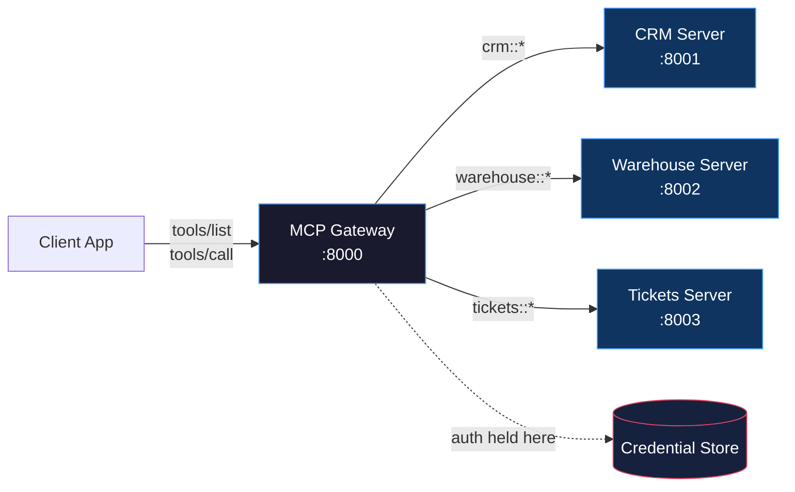

# MCP Gateways and Registries

> One entry point to rule all tools.

**Type:** Learn
**Languages:** Python
**Prerequisites:** 06-mcp-fundamentals, 07-build-mcp-server, 08-build-mcp-client
**Time:** ~45 min
**Learning Objectives:**
- Explain why a gateway solves the N-app-times-M-server configuration problem
- Describe the three jobs a gateway does: routing, auth, and discovery
- Build a minimal gateway in Python that aggregates tools from multiple upstream servers
- Read a registry entry and understand what each field signals to a client
- Write a gateway config YAML that a real client can consume

---

## THE PROBLEM

Your company has grown to eight internal MCP servers: one for the CRM, one for the data warehouse, one for the ticketing system, one for the deployment pipeline, one for the knowledge base, one for finance reporting, one for HR records, and one for infrastructure metrics.

Every AI application your team ships has to configure and connect to all eight separately. The connection string for the CRM server lives in the config of the customer support bot, the sales assistant, the engineering assistant, and the executive dashboard. When the CRM team rotates their API token, all four apps break until someone updates each config. When the data team launches a ninth server for product analytics, someone has to update every app again.

This is the distributed configuration problem. It looks manageable with two servers and one app. It becomes a maintenance tax with eight servers and a dozen apps. The surface area for misconfiguration grows as the product of servers times apps.

The fix is the same pattern that solved this problem in networking: a proxy. Instead of each app connecting to each server, each app connects to one gateway. The gateway owns the routing, the credentials, and the catalog. Apps become thin clients that ask "what tools exist?" and "run this tool" without knowing where anything lives.

---

## THE CONCEPT

### The Three Jobs of a Gateway

A gateway has exactly three responsibilities:

**Routing:** When a client calls `crm::get_contact`, the gateway strips the prefix `crm::`, looks up which upstream server owns the `crm` namespace, and forwards the call. The client never needs to know the CRM server's URL.

**Auth:** The gateway holds credentials for every upstream server. Clients authenticate to the gateway once (via an API key, OAuth token, or mutual TLS). The gateway authenticates to each upstream server on the client's behalf. When the CRM rotates its token, only the gateway config changes.

**Discovery:** The gateway exposes a unified `tools/list` that aggregates tool schemas from every upstream server, namespacing each tool with its server prefix. A client sees one flat list: `crm::get_contact`, `warehouse::run_query`, `tickets::create_ticket`. It does not need to know which server owns which tool.



### How Routing Works

Every tool name in the gateway follows the pattern `{namespace}::{tool_name}`. The gateway config maps each namespace to an upstream server. Routing is mechanical: split on `::`, take the left side, look up the server, forward with the original tool name minus the prefix.

If a tool name has no `::`, the gateway rejects it with a clear error message. This enforces the naming contract across all clients.

### The Registry: The Catalog Behind the Gateway

A gateway needs to know which servers exist and what they expose. That knowledge lives in a registry. At a small company, the registry is a YAML config file the platform team maintains. At scale, it becomes a service with an API: servers register themselves, the gateway polls for changes, and a UI lets engineers browse available tools.

Public registries are emerging in the 2026 ecosystem. Think of them as npm for MCP servers. A public registry entry for a server describes what it exposes, how to authenticate, the current version, and a health check endpoint. You browse the registry, find a server that does what you need, copy its config into your gateway, and your apps immediately gain access to its tools.

```
REGISTRY ENTRY FORMAT
=====================

┌─────────────────────────────────────────────────────────────────┐
│  name:         crm-server                                       │
│  description:  Salesforce CRM read/write via REST API           │
│  namespace:    crm                                              │
│  version:      2.1.0                                            │
│  url:          http://crm-mcp.internal:8001                     │
│  health:       http://crm-mcp.internal:8001/health              │
│  auth_type:    bearer_token                                     │
│  tools:                                                         │
│    - get_contact(id)                                            │
│    - search_contacts(query, limit)                              │
│    - create_contact(name, email, company)                       │
│    - update_contact(id, fields)                                 │
│  resources:                                                     │
│    - crm://contacts/recent                                      │
│  prompts:                                                       │
│    - draft_outreach(contact_id)                                 │
│  owner:        crm-platform-team@company.com                    │
│  sla:          99.5% uptime, p95 < 200ms                        │
└─────────────────────────────────────────────────────────────────┘
```

The `namespace` field is what the gateway uses for routing. The `auth_type` field tells the gateway how to authenticate. The `health` endpoint lets the gateway detect when a server is down before routing calls to it.

### Public vs Private Registries

Public registries host community-maintained servers: weather APIs, public datasets, common SaaS integrations. Private enterprise registries host internal servers, with access control by team or service account. The gateway config references servers from both, treating them identically at routing time.

---

## BUILD IT

### A Minimal MCP Gateway in Python

The goal is a working gateway that aggregates tools from three upstream servers. For this lesson, the "upstream servers" are in-process mock objects. The routing logic is what matters, not the transport layer.

See `code/main.py` for the full implementation. Here is the architecture:

**1. The upstream server mock:** a dict of tool schemas and a callable handler. This stands in for a real MCP server running on another port.

```python
from dataclasses import dataclass
from typing import Any, Callable

@dataclass
class MockServer:
    """Represents a remote MCP server with a known set of tools."""
    name: str
    namespace: str
    tools: list[dict]  # MCP tool schemas
    handler: Callable[[str, dict], Any]  # tool_name -> result
```

**2. The gateway config loader:** reads a YAML file describing upstream servers and initializes mock connections.

```python
import yaml

def load_gateway_config(path: str) -> dict:
    with open(path) as f:
        return yaml.safe_load(f)
```

The YAML config looks like this:

```yaml
gateway:
  name: "Engineering Gateway"
  port: 8000

servers:
  - name: crm-server
    namespace: crm
    url: http://crm-mcp.internal:8001
    auth:
      type: bearer_token
      token_env: CRM_MCP_TOKEN
    tools:
      - get_contact
      - search_contacts
      - create_contact

  - name: warehouse-server
    namespace: warehouse
    url: http://warehouse-mcp.internal:8002
    auth:
      type: api_key
      key_env: WAREHOUSE_MCP_KEY
    tools:
      - run_query
      - list_tables
      - describe_table

  - name: tickets-server
    namespace: tickets
    url: http://tickets-mcp.internal:8003
    auth:
      type: bearer_token
      token_env: TICKETS_MCP_TOKEN
    tools:
      - create_ticket
      - get_ticket
      - list_tickets
      - add_comment
```

**3. The aggregated `tools/list`:** iterates all upstream servers, prefixes each tool name, and returns a flat list.

```python
def aggregate_tools(servers: list[MockServer]) -> list[dict]:
    """
    Combine tool schemas from all servers.
    Prefixes each tool name with its server's namespace.
    """
    all_tools = []
    for server in servers:
        for tool in server.tools:
            prefixed = dict(tool)
            prefixed["name"] = f"{server.namespace}::{tool['name']}"
            prefixed["description"] = (
                f"[{server.name}] {tool.get('description', '')}"
            )
            all_tools.append(prefixed)
    return all_tools
```

**4. The router:** splits the prefixed tool name and dispatches to the right server.

```python
def route_tool_call(
    tool_name: str,
    arguments: dict,
    servers: dict[str, MockServer],
) -> Any:
    """
    Route a prefixed tool call to the correct upstream server.

    Raises ValueError if the namespace is unknown or the format is wrong.
    """
    if "::" not in tool_name:
        raise ValueError(
            f"Tool name '{tool_name}' is missing namespace prefix. "
            f"Expected format: 'namespace::tool_name'"
        )

    namespace, raw_name = tool_name.split("::", 1)

    if namespace not in servers:
        available = ", ".join(servers.keys())
        raise ValueError(
            f"Unknown namespace '{namespace}'. Available: {available}"
        )

    server = servers[namespace]
    return server.handler(raw_name, arguments)
```

> **Real-world check:** Your gateway routes calls to 8 upstream servers. The CRM server is down for maintenance. A client calls `crm::get_contact`. What should the gateway return, and what should it NOT do?

The gateway should return a clear, structured error that tells the client the CRM server is unavailable, not a raw timeout or a 500 with no context. It should not forward the call and let it hang for 30 seconds. The health check endpoint in the registry entry exists precisely so the gateway can detect this before attempting the call. A well-behaved gateway checks health status on startup and on a polling interval, and returns `{"error": "server_unavailable", "server": "crm-server", "retry_after": 60}` immediately instead of waiting for the timeout.

---

## USE IT

### The Client View: One URL, All Tools

From the client's perspective, the gateway is the only server. The client needs exactly one URL and one credential. Here is the client-side setup using the `mcp` SDK:

```python
from mcp import ClientSession, StdioServerParameters
from mcp.client.stdio import stdio_client

# The client knows only the gateway URL.
# It has no knowledge of CRM, warehouse, or tickets servers.
async def run_client():
    async with stdio_client(
        StdioServerParameters(
            command="python",
            args=["gateway_server.py", "--config", "gateway.yaml"],
        )
    ) as (read, write):
        async with ClientSession(read, write) as session:
            await session.initialize()

            # Discover all tools from all upstream servers in one call
            tools = await session.list_tools()
            print(f"Available tools ({len(tools.tools)}):")
            for tool in tools.tools:
                print(f"  {tool.name}")
            # Output:
            #   crm::get_contact
            #   crm::search_contacts
            #   crm::create_contact
            #   warehouse::run_query
            #   warehouse::list_tables
            #   warehouse::describe_table
            #   tickets::create_ticket
            #   tickets::get_ticket
            #   tickets::list_tickets
            #   tickets::add_comment

            # Call a tool without knowing which server handles it
            result = await session.call_tool(
                "crm::get_contact",
                {"id": "contact_001"}
            )
            print(result.content)
```

The Claude Desktop config for this setup is equally simple. One entry for the gateway replaces eight entries for individual servers:

```json
{
  "mcpServers": {
    "engineering-gateway": {
      "command": "python",
      "args": ["/path/to/gateway_server.py", "--config", "/path/to/gateway.yaml"],
      "env": {
        "GATEWAY_API_KEY": "your-gateway-key"
      }
    }
  }
}
```

When the CRM team rotates their token, the platform team updates one field in `gateway.yaml`. No app configs change. When a tenth server is added, the platform team adds one block to `gateway.yaml`. No app configs change.

> **Perspective shift:** A colleague says "this is just adding another layer of indirection, and now if the gateway goes down, everything goes down." How do you respond?

They are right that the gateway is a single point of failure, which is why you deploy it with the same reliability expectations as any critical service: health checks, replicas, and a circuit breaker. But the alternative is not "no single point of failure." The alternative is a distributed configuration problem where auth tokens are scattered across every app and every app is its own point of failure. A gateway trades distributed fragility for a centralized system you can monitor, rate-limit, and upgrade in one place. The reliability concern is real, but it is solved by operating the gateway well, not by avoiding the pattern.

---

## SHIP IT

The artifact this lesson produces is a gateway config schema plus the routing pattern and registry entry format that any team can adopt. See `outputs/skill-mcp-gateway.md`.

The config schema defines a repeatable, version-controlled way to describe your gateway topology. The routing pattern (namespace prefix + split-and-dispatch) is the mechanical core that any gateway implementation follows. The registry entry format is the contract between server owners and the platform team: when you deploy a new MCP server, you fill out a registry entry and submit it to the platform team. They add it to the gateway config. Your server's tools become available to all authorized clients within one deploy cycle.

---

## EVALUATE IT

**Routing correctness:** For each namespace in the gateway config, send one `tools/call` with a valid tool name and assert you get back a non-error response from the right server. Log which server handled each call. A mis-routed call is a silent bug, not a loud failure.

**Discovery completeness:** Call `tools/list` and assert the count equals the sum of tools across all upstream servers. Assert every tool name follows the `namespace::tool_name` pattern. Assert no two tools share the same prefixed name (namespace collisions are possible if two teams pick the same prefix).

**Auth isolation:** Call a tool from server A. Assert that the request received by server A carries server A's credential, not server B's. Credential leakage across servers is a security issue that is easy to introduce in a gateway and hard to detect without an explicit test.

**Graceful degradation:** Simulate one upstream server being unavailable (by removing it from the mock or pointing to a dead port). Assert that `tools/list` still returns tools from the healthy servers, with the unavailable server's tools either omitted or marked with a health status field. Assert that calling a tool from the unavailable server returns a structured error within a configurable timeout.

**Registry round-trip:** Parse a registry entry YAML, add it to the gateway config, and assert that after a config reload, the new server's tools appear in `tools/list` with the correct namespace prefix.
