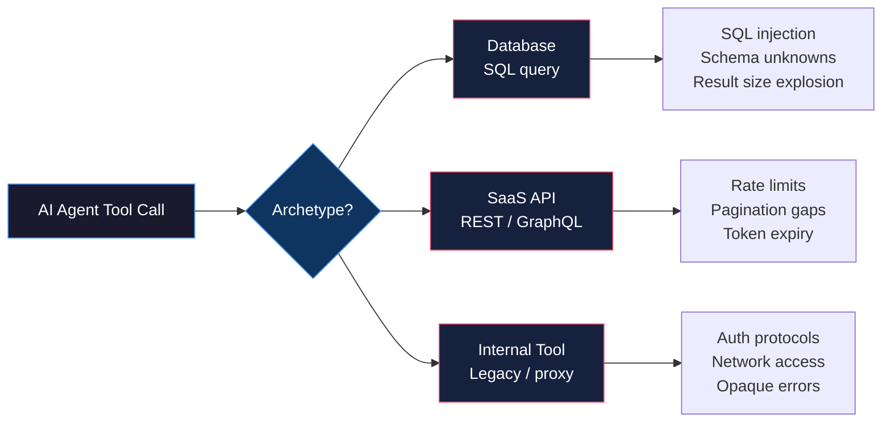

# دمج الأنظمة الحقيقية: قواعد البيانات، وواجهات SaaS API، والأدوات الداخلية

> العرض التوضيحي نجح لأنه كان عرضاً توضيحياً.

**النوع:** بناء
**اللغات:** Python
**المتطلبات:** 07-build-mcp-server، 05-robust-tools
**الوقت:** ~75 دقيقة
**أهداف التعلّم:**
- التعرّف على أنماط الدمج الثلاثة الأصلية (archetypes) وأنماط فشلها المتمايزة
- بناء أداة قاعدة بيانات مُصلَّبة (hardened) باستعلامات ذات معطيات (parameterized)، وحدود للصفوف، وفرض القراءة فقط
- بناء أداة SaaS API مُصلَّبة بترقيم الصفحات (pagination)، وتحليل حد المعدّل (rate limit)، وتجديد رمز 401
- بناء أداة داخلية مُصلَّبة بمهلة، وإعادة محاولة بتراجع أسّي (exponential backoff)، وتطبيع الأخطاء
- تغليف الثلاثة جميعاً كأدوات MCP باستخدام الـ `mcp` SDK

---

## المشكلة

يقدّم مهندس عرضاً توضيحياً لأداة ذكاء اصطناعي تستعلم من CRM وتلخّص نشاط العملاء. تعمل ببراعة. بيانات نظيفة، وواجهة REST API موثّقة جيداً، وبيئة تجهيز (staging) لا يكون فيها شيء بطيئاً أبداً.

بعد أربعة أسابيع، تذهب الأداة إلى الإنتاج. الحوادث الثلاثة الأولى:

1. استعلام قاعدة البيانات يُعيد 80,000 صف. تمتلئ نافذة سياق الذكاء الاصطناعي وتُقتَطَع الاستجابة. الأداة بلا حد للصفوف.
2. واجهة SaaS API تُعيد `429 Too Many Requests` بترويسة `Retry-After: 15`. تتجاهل الأداة الترويسة، وتعيد المحاولة فوراً، فتحصل على 429 آخر، وتدور في حلقة حتى يستسلم المستخدم.
3. أداة التقارير الداخلية تتطلب مصادقة NTLM عبر وكيل الشركة (proxy). بُنيت الأداة بمصادقة HTTP الأساسية. تعلّق 30 ثانية وتُعيد 500 بالرسالة: `java.lang.NullPointerException: null`. يسمّيه الذكاء الاصطناعي خطأ شبكة. والخطأ الحقيقي هو إعدادات المصادقة.

لا شيء من هذه الإخفاقات غريب. إنها أول ثلاثة أشياء تحدث لكل عملية دمج في الإنتاج. نجح العرض التوضيحي لأنه بُني مقابل واجهة API نظيفة في بيئة مُتحكَّم بها لا يوجد فيها أي من هذه الظروف.

الفرق بين دمج عرض توضيحي ودمج إنتاجي ليس مزيداً من الميزات. بل هو معالجة أنماط الفشل هذه قبل أن تجد مستخدميك.

---

## المفهوم

### أنماط الدمج الأصلية الثلاثة

كل أداة تبنيها لوكيل ذكاء اصطناعي تقع ضمن أحد ثلاثة أنماط أصلية. لكل منها مجموعة متمايزة من الأشياء التي تسوء دائماً.



### النمط الأصلي 1: دمج قاعدة البيانات

يولّد النموذج SQL. يعمل ذلك الـ SQL مقابل قاعدة بياناتك. ثلاثة أشياء تسوء دائماً:

**حقن SQL (SQL injection).** قد يولّد النموذج SQL يتضمن قيماً يقدّمها المستخدم مضمّنة: `WHERE name = 'Alice'`. إذا أتت تلك القيم من إدخال المستخدم (وهي كذلك غالباً)، فلديك ناقل حقن. الاستعلامات ذات المعطيات تلغي هذا الصنف من الأخطاء بالكامل. غير قابلة للتفاوض.

**مجاهيل المخطط (Schema unknowns).** النموذج لا يعرف مخططك ما لم تخبره. يخترع أسماء جداول وأعمدة غير موجودة، مولّداً استعلامات تفشل بـ `relation "customers" does not exist` بينما الجدول الحقيقي `customer_accounts`. اكتشاف المخطط عند إقلاع الأداة، أو أداة `describe_schema` منفصلة، يسدّ هذه الفجوة.

**انفجار حجم النتيجة (Result size explosion).** استعلام SQL بلا جملة LIMIT مقابل جدول إنتاجي فيه 40 مليون صف سيُعيد 40 مليون صف. ستحاول الأداة تسلسلها (serialize) جميعاً. ستغرق سياق الذكاء الاصطناعي أول 50. افرض دائماً حد صفوف في الأداة، لا في البرومبت.

```
DATABASE HARDENING CHECKLIST
=============================
[ ] Parameterized queries only -- no string formatting of user values into SQL
[ ] Read-only connection -- separate DB user with SELECT only, no INSERT/UPDATE/DELETE
[ ] Row limit enforced in code -- max 1000 rows, default 100, configurable but capped
[ ] Query validation -- reject DDL statements (DROP, CREATE, ALTER, TRUNCATE) at the tool layer
[ ] Schema exposure -- provide a describe_schema tool so the model knows what exists
```

### النمط الأصلي 2: دمج SaaS API

تكشف واجهات REST API المستخدمة في الإنتاج ثلاثة أنماط فشل تخفيها بيئات التجهيز النظيفة:

**حدود المعدّل (Rate limits).** كل واجهة SaaS API جدّية لها حدود معدّل. تُفرَض في الإنتاج ولا تُفرَض في التجهيز. الاستجابة `429` بترويسة `Retry-After` تخبرك بالضبط كم تنتظر. الأدوات التي تتجاهل هذه الترويسة وتعيد المحاولة فوراً ستحصل على 429 آخر وآخر حتى يُحظَر العميل لساعة.

**ترقيم الصفحات (Pagination).** معظم الواجهات تُعيد نتائج مُرقَّمة افتراضياً: 20 سجلاً لكل صفحة. أداة تجلب الصفحة الأولى فقط وتُعيدها كـ "كل النتائج" تقتطع بصمت. يصدّق النموذج أنه يملك كل البيانات. وهو لا يملكها. يجب بناء معالجة ترقيم الصفحات بالداخل، مع حد أقصى قابل للتهيئة لعدد الصفحات لمنع الحلقات الجامحة.

**انتهاء صلاحية الرمز (Token expiry).** رموز وصول OAuth تنتهي صلاحيتها. `401 Unauthorized` في منتصف الجلسة يعني انتهاء صلاحية الرمز، لا أن بيانات الاعتماد خاطئة. أداة متينة تلتقط 401، وتجدّد الرمز باستخدام رمز التجديد (refresh token)، وتعيد محاولة الطلب الأصلي مرة واحدة. عند 401 ثانٍ، تُظهر الخطأ بدلاً من الدوران في حلقة.

```
SAAS API HARDENING CHECKLIST
==============================
[ ] Rate limit handling -- parse Retry-After header on 429, sleep, then retry once
[ ] Pagination -- follow next_page cursors up to a configured max page count
[ ] Token refresh -- catch 401, refresh token, retry once; fail loudly on second 401
[ ] Timeout -- set connection timeout (5s) and read timeout (30s); never let requests hang
[ ] Error normalization -- map HTTP status codes to structured errors the model can understand
```

### النمط الأصلي 3: دمج الأداة الداخلية

الأدوات الداخلية هي الأصعب في الدمج لأنها لم تُصمَّم لتُستدعى بواسطة وكيل ذكاء اصطناعي. صُمِّمت لتُستدعى بواسطة خدمة داخلية محدّدة، من داخل شبكة الشركة، بواسطة مستخدم مُصادَق عليه بالفعل في النطاق (domain).

**بروتوكولات المصادقة (Auth protocols).** NTLM، Kerberos، SAML SSO، قوائم سماح IP. هذه ليست في أي درس تعليمي. تتطلب تهيئة خاصة بالبيئة. اختبر دائماً مصادقة الأداة الداخلية في بيئة الشبكة الفعلية (VPN، شبكة فرعية داخلية) قبل افتراض أنها تعمل.

**الوصول للشبكة (Network access).** الأدوات الداخلية غالباً لا يمكن الوصول إليها إلا من داخل شبكة الشركة. وكيل ذكاء اصطناعي يعمل في بيئة سحابية قد لا يملك الوصول. الحل وكيل جانبي (sidecar proxy) أو بوابة تعمل داخل محيط الشبكة وتكشف واجهة موحّدة.

**الأخطاء الغامضة (Opaque errors).** الأدوات الداخلية غالباً تُعيد أخطاء بتنسيقات لا معنى لها خارج سياقها الأصلي: تتبّعات تكدّس Java (stack traces)، ورموز أخطاء SAP، ومغلّفات أخطاء XML مخصصة، أو مجرد 500 بلا متن. تطبيع الأخطاء يعني التقاط هذه وترجمتها إلى تنسيق يستطيع النموذج التفكير فيه.

```
INTERNAL TOOL HARDENING CHECKLIST
===================================
[ ] Timeout enforcement -- set a hard timeout (15-30s) so hung requests do not block the agent
[ ] Exponential backoff retry -- wait 1s, 2s, 4s between retries; max 3 retries
[ ] Error normalization -- catch raw errors, return {"error": "type", "message": "..."}
[ ] Network check -- fail fast with a clear message if the endpoint is unreachable
[ ] Auth protocol testing -- test auth in the real network environment before integration
```

---

## البناء

### ثلاثة تنفيذات أدوات مُصلَّبة

التنفيذات الكاملة في `code/main.py`. كل واحد يُظهر أنماط التصليب من قسم المفهوم.

**الأداة 1: `query_database` -- ذات معطيات، للقراءة فقط، محدودة الصفوف**

```python
import sqlite3
from typing import Any

# Disallowed SQL statement prefixes (DDL and write operations)
_BLOCKED_PREFIXES = ("INSERT", "UPDATE", "DELETE", "DROP", "CREATE", "ALTER",
                     "TRUNCATE", "GRANT", "REVOKE")

def query_database(sql: str, params: list[Any] | None = None,
                   limit: int = 100) -> dict:
    """
    Execute a read-only SQL query.
    - Validates the query is not DDL or DML
    - Enforces row limit in code, not in prompt
    - Uses parameterized queries for all user values
    """
    # Validate: no write operations
    sql_upper = sql.strip().upper()
    for prefix in _BLOCKED_PREFIXES:
        if sql_upper.startswith(prefix):
            return {
                "error": "query_blocked",
                "message": f"Statements starting with {prefix} are not allowed.",
                "allowed": "SELECT queries only",
            }

    # Enforce row limit -- inject LIMIT if the query doesn't have one
    capped_limit = min(limit, 1000)
    if "LIMIT" not in sql_upper:
        sql = f"{sql.rstrip('; ')} LIMIT {capped_limit}"

    try:
        # Read-only connection: uri=True with mode=ro enforces no writes at DB level
        conn = sqlite3.connect("file:demo.db?mode=memory&cache=shared", uri=True)
        conn.row_factory = sqlite3.Row
        cursor = conn.cursor()
        cursor.execute(sql, params or [])
        rows = cursor.fetchall()
        columns = [desc[0] for desc in cursor.description] if cursor.description else []
        conn.close()
        return {
            "columns": columns,
            "rows": [list(row) for row in rows],
            "row_count": len(rows),
            "truncated": len(rows) == capped_limit,
        }
    except sqlite3.Error as e:
        return {"error": "query_failed", "message": str(e)}
```

**الأداة 2: `search_crm` -- ترقيم صفحات، معالجة حد المعدّل، تجديد رمز**

```python
import time
import requests
from requests.auth import HTTPBearerAuth

_TOKEN_STORE = {"access_token": "demo-token-abc", "refresh_token": "demo-refresh-xyz"}

def _refresh_token() -> bool:
    """Simulate token refresh. Returns True on success."""
    # In production: POST to the OAuth token endpoint with the refresh token
    _TOKEN_STORE["access_token"] = "demo-token-refreshed-001"
    return True

def search_crm(query: str, page: int = 1, max_pages: int = 3) -> dict:
    """
    Search the CRM API with pagination and rate limit handling.
    - Follows pagination cursors up to max_pages
    - Parses Retry-After on 429 and waits
    - Refreshes token on 401 and retries once
    """
    base_url = "https://api.mock-crm.internal/v2/contacts/search"
    all_results = []
    current_page = page
    token_refreshed = False

    while current_page <= page + max_pages - 1:
        try:
            resp = _make_crm_request(base_url, query, current_page)
        except requests.Timeout:
            return {"error": "timeout", "message": "CRM API did not respond within 30s"}
        except requests.ConnectionError as e:
            return {"error": "connection_failed", "message": str(e)}

        if resp.status_code == 429:
            retry_after = int(resp.headers.get("Retry-After", 5))
            time.sleep(retry_after)
            # One retry after rate limit wait
            resp = _make_crm_request(base_url, query, current_page)

        if resp.status_code == 401 and not token_refreshed:
            if _refresh_token():
                token_refreshed = True
                resp = _make_crm_request(base_url, query, current_page)
            else:
                return {"error": "auth_failed", "message": "Token refresh failed"}

        if resp.status_code == 401:
            return {"error": "auth_failed", "message": "Token invalid after refresh"}

        if not resp.ok:
            return {
                "error": "api_error",
                "status_code": resp.status_code,
                "message": resp.text[:500],
            }

        data = resp.json()
        all_results.extend(data.get("results", []))

        next_page = data.get("pagination", {}).get("next_page")
        if not next_page:
            break
        current_page = next_page

    return {"results": all_results, "total_fetched": len(all_results)}


def _make_crm_request(url: str, query: str, page: int) -> requests.Response:
    """Internal helper to make a single paginated CRM request."""
    return requests.get(
        url,
        params={"q": query, "page": page, "per_page": 20},
        auth=HTTPBearerAuth(_TOKEN_STORE["access_token"]),
        timeout=(5, 30),  # (connect timeout, read timeout)
    )
```

**الأداة 3: `run_internal_report` -- مهلة، إعادة محاولة بتراجع، تطبيع الأخطاء**

```python
import time
import requests

def run_internal_report(report_id: str) -> dict:
    """
    Run an internal reporting tool with:
    - Hard timeout to prevent blocking the agent
    - Exponential backoff retry (1s, 2s, 4s)
    - Error normalization: opaque errors become structured dicts
    """
    url = f"http://reporting.internal:8080/api/reports/{report_id}/run"
    max_retries = 3
    base_delay = 1.0

    for attempt in range(max_retries):
        try:
            resp = requests.post(
                url,
                json={"format": "json", "max_rows": 500},
                headers={"Authorization": f"Bearer {_get_service_token()}"},
                timeout=15,  # hard timeout: 15 seconds
            )
            return _normalize_response(resp)

        except requests.Timeout:
            if attempt < max_retries - 1:
                time.sleep(base_delay * (2 ** attempt))
                continue
            return {
                "error": "timeout",
                "message": f"Report {report_id} did not complete within 15 seconds",
                "suggestion": "Try a smaller date range or check if the report server is healthy",
            }

        except requests.ConnectionError:
            if attempt < max_retries - 1:
                time.sleep(base_delay * (2 ** attempt))
                continue
            return {
                "error": "unreachable",
                "message": "Cannot reach reporting server. Check VPN or network access.",
                "endpoint": url,
            }

    return {"error": "max_retries_exceeded", "attempts": max_retries}


def _normalize_response(resp: requests.Response) -> dict:
    """Translate raw HTTP responses into structured, model-readable dicts."""
    if resp.status_code == 200:
        try:
            return {"status": "success", "data": resp.json()}
        except Exception:
            return {"status": "success", "data": resp.text[:2000]}

    # Known error codes for the internal reporting system
    error_map = {
        400: "invalid_report_id",
        401: "auth_required",
        403: "permission_denied",
        404: "report_not_found",
        500: "server_error",
        503: "server_unavailable",
    }
    error_type = error_map.get(resp.status_code, f"http_{resp.status_code}")

    # Attempt to extract a useful message from opaque error bodies
    message = f"HTTP {resp.status_code}"
    try:
        body = resp.json()
        message = body.get("message") or body.get("error") or str(body)[:200]
    except Exception:
        message = resp.text[:200] if resp.text else message

    return {
        "error": error_type,
        "status_code": resp.status_code,
        "message": message,
    }
```

> **اختبار من الواقع:** تنشر أداة `query_database` ويولّد النموذج: `SELECT * FROM users WHERE email = 'alice@company.com'`. جدول users لديك فيه مليونا صف. هل سيحميك حد الصفوف هنا؟

نعم -- يحميك حد الصفوف هنا لأن جملة WHERE ستصفّي إلى صف واحد. لكن تأمّل استعلاماً قد يولّده النموذج في يوم بطيء: `SELECT * FROM orders WHERE status = 'pending'` مقابل جدول فيه 600,000 طلب معلّق. جملة WHERE لا تنقذك. فرض `LIMIT` في الأداة هو الذي ينقذ. بدون حد الصفوف البرمجي، يرسل هذا الاستعلام 600,000 صف إلى سياق الذكاء الاصطناعي، مستهلكاً النافذة بأكملها وعلى الأرجح مسبباً انتهاء مهلة. الحد ليس ميزة مستحبة. بل متطلب صلب لأدوات قواعد البيانات.

---

## الاستخدام

### تغليف الثلاثة جميعاً كأدوات MCP

تصبح الدوال المُصلَّبة من القسم السابق أدوات MCP بتغليفها في تعريف خادم. هذا يمدّد نمط الخادم من الدرس 07. منطق الأداة يبقى في الدوال أعلاه؛ وطبقة MCP هي عقد الواجهة.

```python
from mcp.server import Server
from mcp.server.stdio import stdio_server
from mcp.types import Tool, TextContent
import json

app = Server("real-systems-server")

@app.list_tools()
async def list_tools() -> list[Tool]:
    return [
        Tool(
            name="query_database",
            description=(
                "Execute a read-only SQL SELECT query against the analytics database. "
                "Row limit enforced at 1000. DDL and DML statements are rejected."
            ),
            inputSchema={
                "type": "object",
                "properties": {
                    "sql": {
                        "type": "string",
                        "description": "A SQL SELECT statement. Do not include LIMIT -- it is enforced automatically.",
                    },
                    "limit": {
                        "type": "integer",
                        "description": "Max rows to return (default: 100, max: 1000).",
                        "default": 100,
                    },
                },
                "required": ["sql"],
            },
        ),
        Tool(
            name="search_crm",
            description=(
                "Search CRM contacts by name, email, or company. "
                "Handles pagination automatically. Returns up to 3 pages of results."
            ),
            inputSchema={
                "type": "object",
                "properties": {
                    "query": {"type": "string", "description": "Search term"},
                    "page": {"type": "integer", "default": 1, "description": "Start page"},
                },
                "required": ["query"],
            },
        ),
        Tool(
            name="run_internal_report",
            description=(
                "Run a named internal report by ID. "
                "Retries on transient failures. Returns structured data or a structured error."
            ),
            inputSchema={
                "type": "object",
                "properties": {
                    "report_id": {
                        "type": "string",
                        "description": "The report identifier (e.g., 'monthly-revenue', 'active-users')",
                    }
                },
                "required": ["report_id"],
            },
        ),
    ]


@app.call_tool()
async def call_tool(name: str, arguments: dict) -> list[TextContent]:
    if name == "query_database":
        result = query_database(
            sql=arguments["sql"],
            limit=arguments.get("limit", 100),
        )
    elif name == "search_crm":
        result = search_crm(
            query=arguments["query"],
            page=arguments.get("page", 1),
        )
    elif name == "run_internal_report":
        result = run_internal_report(report_id=arguments["report_id"])
    else:
        result = {"error": "unknown_tool", "name": name}

    return [TextContent(type="text", text=json.dumps(result, indent=2))]


async def run_server():
    async with stdio_server() as (read_stream, write_stream):
        await app.run(read_stream, write_stream, app.create_initialization_options())
```

إضافة هذه إلى الخادم من الدرس 07 خطوة واحدة: استورد قائمة الأدوات ودوال المعالج، أضفها إلى دوال `list_tools()` و `call_tool()` الموجودة، وأعد تشغيل الخادم. لا حاجة لعملية خادم جديدة.

> **نقلة في المنظور:** يقول زميل: "ينبغي أن نمنح النموذج وصولاً مباشراً لقاعدة البيانات عبر SQL بدلاً من بناء أدوات الغلاف هذه." ما نمط الفشل الواحد الذي يجعل هذا غير مقبول في الإنتاج؟

الجواب هو اجتماع نمطي فشل لا تستطيع منعهما على مستوى النموذج: عمليات الكتابة وحجم النتيجة. نموذج بوصول مباشر لقاعدة البيانات يستطيع توليد `DELETE FROM users WHERE active = false` في يوم سيئ أو تعليمة أُسيء فهمها. أداة غلاف تقبل عبارات SELECT فقط وتفرض حد صفوف تمنع كليهما بسطرين من الكود. طبقة الأداة ليست بيروقراطية. بل هي حدود الفرض بين ما يُسمح للنموذج بفعله وما يستطيع النظام الأساسي قبوله.

---

## التسليم

المخرَج الذي ينتجه هذا الدرس هو ثلاثة أنماط دمج بقوالب تصليب وقائمة تحقق بأنماط الفشل لكل نمط أصلي. انظر `outputs/skill-real-system-integration.md`.

كل نمط هو نقطة بداية للنسخ واللصق لعملية دمج جديدة. قوالب التصليب هي قوائم تحقق تشغّلها قبل اعتبار الدمج "منجزاً". قائمة تحقق أنماط الفشل هي ما تعطيه للمهندس الذي يراجع عملية دمجك قبل ذهابها إلى الإنتاج.

---

## التقييم

**اختبار حقن SQL:** استدعِ `query_database` بـ SQL يتضمن قيمة مدموجة كنص: `"SELECT * FROM users WHERE name = '" + user_input + "'"`. تحقق من أن الأداة إما ترفضه (لأنها تكتشف قيم مستخدم غير ذات معطيات) أو تستخدم ربطاً ذا معطيات. ينجح الاختبار فقط إذا لم تظهر قيم المستخدم أبداً حرفياً في الـ SQL المنفَّذ.

**اختبار حد الصفوف:** استدعِ `query_database` بـ SELECT يطابق كل صف في جدول الاختبار (بلا جملة WHERE). تحقق من أن النتيجة تحتوي على `limit` صفاً كحد أقصى و `truncated: true` في الاستجابة.

**اختبار رفض DDL:** استدعِ `query_database` بـ `DROP TABLE users` وتحقق من أن الاستجابة تحتوي على `error: "query_blocked"`. اختبر المجموعة الكاملة من البادئات المحظورة.

**اختبار معالجة حد المعدّل:** حاكِ واجهة CRM API لتُعيد 429 بـ `Retry-After: 1` في الاستدعاء الأول، ثم 200 في الثاني. تحقق من أن `search_crm` تنام ثانية واحدة على الأقل بين الاستدعاءات وتُعيد نتائج ناجحة من الاستدعاء الثاني.

**اختبار تجديد الرمز:** حاكِ واجهة CRM API لتُعيد 401 في الاستدعاء الأول، ثم 200 بعد تجديد الرمز. تحقق من أن `search_crm` تستدعي نقطة نهاية التجديد وتعيد المحاولة مرة واحدة بالضبط. تحقق من أن استجابتي 401 متتاليتين ينتج عنهما `error: "auth_failed"`، لا حلقة لانهائية.

**اختبار المهلة:** حاكِ نقطة نهاية التقارير الداخلية لعدم الاستجابة لمدة 20 ثانية. تحقق من أن `run_internal_report` تُعيد ضمن 16 ثانية (المهلة + عبء صغير) بـ `error: "timeout"`.

**اختبار التراجع:** زوّد حلقة إعادة المحاولة في `run_internal_report` بتسجيل طوابع زمنية لكل محاولة. حاكِ الخادم ليفشل 3 مرات. تحقق من أن التأخيرات بين المحاولات تقارب 1s و 2s و 4s (ضمن هامش 500ms لضوضاء توقيت الاختبار).

**اختبار تطبيع الأخطاء:** حاكِ الخادم الداخلي ليُعيد 500 بتتبّع تكدّس Java خام كمتن. تحقق من أن `run_internal_report` تُعيد قاموساً مُهيكلاً بـ `error: "server_error"` وحقل `message` ليس تتبّع التكدّس الخام.
