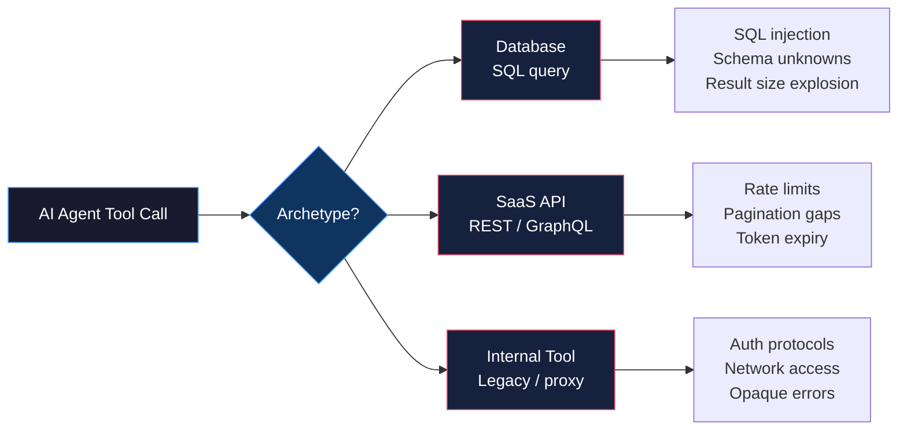

# Integrating Real Systems: DBs, SaaS APIs, Internal Tools

> The demo worked because it was a demo.

**Type:** Build
**Languages:** Python
**Prerequisites:** 07-build-mcp-server, 05-robust-tools
**Time:** ~75 min
**Learning Objectives:**
- Identify the three integration archetypes and their distinct failure modes
- Build a hardened database tool with parameterized queries, row limits, and read-only enforcement
- Build a hardened SaaS API tool with pagination, rate limit parsing, and 401 token refresh
- Build a hardened internal tool with timeout, exponential backoff retry, and error normalization
- Wrap all three as MCP tools using the `mcp` SDK

---

## THE PROBLEM

An engineer demos an AI tool that queries the CRM and summarizes customer activity. It works beautifully. Clean data, a well-documented REST API, and a staging environment where nothing is ever slow.

Four weeks later, the tool goes to production. The first three incidents:

1. The database query returns 80,000 rows. The AI context window fills up and the response is truncated. The tool has no row limit.
2. The SaaS API returns a `429 Too Many Requests` with a `Retry-After: 15` header. The tool ignores the header, immediately retries, gets another 429, and loops until the user gives up.
3. The internal reporting tool requires NTLM authentication through the corporate proxy. The tool was built with basic HTTP auth. It hangs for 30 seconds and returns a 500 with the message: `java.lang.NullPointerException: null`. The AI calls it a network error. The real error is auth config.

None of these failures are exotic. They are the first three things that happen to every integration in production. The demo worked because it was built against a clean API in a controlled environment where none of these conditions exist.

The difference between a demo integration and a production integration is not more features. It is handling these failure modes before they find your users.

---

## THE CONCEPT

### Three Integration Archetypes

Every tool you build for an AI agent falls into one of three archetypes. Each has a distinct set of things that always go wrong.



### Archetype 1: Database Integration

The model generates SQL. That SQL runs against your database. Three things always go wrong:

**SQL injection.** The model may generate SQL that includes user-provided values inline: `WHERE name = 'Alice'`. If those values come from user input (and they often do), you have an injection vector. Parameterized queries eliminate this class of bug entirely. Non-negotiable.

**Schema unknowns.** The model does not know your schema unless you tell it. It invents table and column names that do not exist, generating queries that fail with `relation "customers" does not exist` when the real table is `customer_accounts`. Schema discovery at tool startup, or a separate `describe_schema` tool, closes this gap.

**Result size explosion.** A SQL query with no LIMIT clause against a production table with 40 million rows will return 40 million rows. The tool will try to serialize all of them. The AI context will be overwhelmed by the first 50. Always enforce a row limit in the tool, not in the prompt.

```
DATABASE HARDENING CHECKLIST
=============================
[ ] Parameterized queries only -- no string formatting of user values into SQL
[ ] Read-only connection -- separate DB user with SELECT only, no INSERT/UPDATE/DELETE
[ ] Row limit enforced in code -- max 1000 rows, default 100, configurable but capped
[ ] Query validation -- reject DDL statements (DROP, CREATE, ALTER, TRUNCATE) at the tool layer
[ ] Schema exposure -- provide a describe_schema tool so the model knows what exists
```

### Archetype 2: SaaS API Integration

REST APIs used in production expose three failure modes that clean staging environments hide:

**Rate limits.** Every serious SaaS API has rate limits. They are enforced in production and not enforced in staging. The response is a `429` with a `Retry-After` header telling you exactly how long to wait. Tools that ignore this header and retry immediately will get another 429 and another until the client is blocked for an hour.

**Pagination.** Most APIs return paginated results by default: 20 records per page. A tool that fetches only the first page and returns it as "all results" silently truncates. The model believes it has all the data. It does not. Pagination handling must be built in, with a configurable max page limit to prevent runaway loops.

**Token expiry.** OAuth access tokens expire. A `401 Unauthorized` mid-session means the token expired, not that the credentials are wrong. A robust tool catches 401, refreshes the token using the refresh token, and retries the original request once. On a second 401, it surfaces the error rather than looping.

```
SAAS API HARDENING CHECKLIST
==============================
[ ] Rate limit handling -- parse Retry-After header on 429, sleep, then retry once
[ ] Pagination -- follow next_page cursors up to a configured max page count
[ ] Token refresh -- catch 401, refresh token, retry once; fail loudly on second 401
[ ] Timeout -- set connection timeout (5s) and read timeout (30s); never let requests hang
[ ] Error normalization -- map HTTP status codes to structured errors the model can understand
```

### Archetype 3: Internal Tool Integration

Internal tools are the hardest to integrate because they were not designed to be called by an AI agent. They were designed to be called by a specific internal service, from inside the corporate network, by a user already authenticated to the domain.

**Auth protocols.** NTLM, Kerberos, SAML SSO, IP allowlists. These are not in any tutorial. They require environment-specific configuration. Always test internal tool auth in the actual network environment (VPN, internal subnet) before assuming it works.

**Network access.** Internal tools are often only reachable from inside the corporate network. An AI agent running in a cloud environment may not have access. The fix is a sidecar proxy or a gateway that runs inside the network perimeter and exposes a standardized interface.

**Opaque errors.** Internal tools often return errors in formats that make no sense outside their original context: Java stack traces, SAP error codes, custom XML error envelopes, or just a 500 with no body. Error normalization means catching these and translating them into a format the model can reason about.

```
INTERNAL TOOL HARDENING CHECKLIST
===================================
[ ] Timeout enforcement -- set a hard timeout (15-30s) so hung requests do not block the agent
[ ] Exponential backoff retry -- wait 1s, 2s, 4s between retries; max 3 retries
[ ] Error normalization -- catch raw errors, return {"error": "type", "message": "..."}
[ ] Network check -- fail fast with a clear message if the endpoint is unreachable
[ ] Auth protocol testing -- test auth in the real network environment before integration
```

---

## BUILD IT

### Three Hardened Tool Implementations

The full implementations are in `code/main.py`. Each one demonstrates the hardening patterns from the concept section.

**Tool 1: `query_database` -- parameterized, read-only, row-limited**

```python
import sqlite3
from typing import Any

# Disallowed SQL statement prefixes (DDL and write operations)
_BLOCKED_PREFIXES = ("INSERT", "UPDATE", "DELETE", "DROP", "CREATE", "ALTER",
                     "TRUNCATE", "GRANT", "REVOKE")

def query_database(sql: str, params: list[Any] | None = None,
                   limit: int = 100) -> dict:
    """
    Execute a read-only SQL query.
    - Validates the query is not DDL or DML
    - Enforces row limit in code, not in prompt
    - Uses parameterized queries for all user values
    """
    # Validate: no write operations
    sql_upper = sql.strip().upper()
    for prefix in _BLOCKED_PREFIXES:
        if sql_upper.startswith(prefix):
            return {
                "error": "query_blocked",
                "message": f"Statements starting with {prefix} are not allowed.",
                "allowed": "SELECT queries only",
            }

    # Enforce row limit -- inject LIMIT if the query doesn't have one
    capped_limit = min(limit, 1000)
    if "LIMIT" not in sql_upper:
        sql = f"{sql.rstrip('; ')} LIMIT {capped_limit}"

    try:
        # Read-only connection: uri=True with mode=ro enforces no writes at DB level
        conn = sqlite3.connect("file:demo.db?mode=memory&cache=shared", uri=True)
        conn.row_factory = sqlite3.Row
        cursor = conn.cursor()
        cursor.execute(sql, params or [])
        rows = cursor.fetchall()
        columns = [desc[0] for desc in cursor.description] if cursor.description else []
        conn.close()
        return {
            "columns": columns,
            "rows": [list(row) for row in rows],
            "row_count": len(rows),
            "truncated": len(rows) == capped_limit,
        }
    except sqlite3.Error as e:
        return {"error": "query_failed", "message": str(e)}
```

**Tool 2: `search_crm` -- pagination, rate limit handling, token refresh**

```python
import time
import requests
from requests.auth import HTTPBearerAuth

_TOKEN_STORE = {"access_token": "demo-token-abc", "refresh_token": "demo-refresh-xyz"}

def _refresh_token() -> bool:
    """Simulate token refresh. Returns True on success."""
    # In production: POST to the OAuth token endpoint with the refresh token
    _TOKEN_STORE["access_token"] = "demo-token-refreshed-001"
    return True

def search_crm(query: str, page: int = 1, max_pages: int = 3) -> dict:
    """
    Search the CRM API with pagination and rate limit handling.
    - Follows pagination cursors up to max_pages
    - Parses Retry-After on 429 and waits
    - Refreshes token on 401 and retries once
    """
    base_url = "https://api.mock-crm.internal/v2/contacts/search"
    all_results = []
    current_page = page
    token_refreshed = False

    while current_page <= page + max_pages - 1:
        try:
            resp = _make_crm_request(base_url, query, current_page)
        except requests.Timeout:
            return {"error": "timeout", "message": "CRM API did not respond within 30s"}
        except requests.ConnectionError as e:
            return {"error": "connection_failed", "message": str(e)}

        if resp.status_code == 429:
            retry_after = int(resp.headers.get("Retry-After", 5))
            time.sleep(retry_after)
            # One retry after rate limit wait
            resp = _make_crm_request(base_url, query, current_page)

        if resp.status_code == 401 and not token_refreshed:
            if _refresh_token():
                token_refreshed = True
                resp = _make_crm_request(base_url, query, current_page)
            else:
                return {"error": "auth_failed", "message": "Token refresh failed"}

        if resp.status_code == 401:
            return {"error": "auth_failed", "message": "Token invalid after refresh"}

        if not resp.ok:
            return {
                "error": "api_error",
                "status_code": resp.status_code,
                "message": resp.text[:500],
            }

        data = resp.json()
        all_results.extend(data.get("results", []))

        next_page = data.get("pagination", {}).get("next_page")
        if not next_page:
            break
        current_page = next_page

    return {"results": all_results, "total_fetched": len(all_results)}


def _make_crm_request(url: str, query: str, page: int) -> requests.Response:
    """Internal helper to make a single paginated CRM request."""
    return requests.get(
        url,
        params={"q": query, "page": page, "per_page": 20},
        auth=HTTPBearerAuth(_TOKEN_STORE["access_token"]),
        timeout=(5, 30),  # (connect timeout, read timeout)
    )
```

**Tool 3: `run_internal_report` -- timeout, retry with backoff, error normalization**

```python
import time
import requests

def run_internal_report(report_id: str) -> dict:
    """
    Run an internal reporting tool with:
    - Hard timeout to prevent blocking the agent
    - Exponential backoff retry (1s, 2s, 4s)
    - Error normalization: opaque errors become structured dicts
    """
    url = f"http://reporting.internal:8080/api/reports/{report_id}/run"
    max_retries = 3
    base_delay = 1.0

    for attempt in range(max_retries):
        try:
            resp = requests.post(
                url,
                json={"format": "json", "max_rows": 500},
                headers={"Authorization": f"Bearer {_get_service_token()}"},
                timeout=15,  # hard timeout: 15 seconds
            )
            return _normalize_response(resp)

        except requests.Timeout:
            if attempt < max_retries - 1:
                time.sleep(base_delay * (2 ** attempt))
                continue
            return {
                "error": "timeout",
                "message": f"Report {report_id} did not complete within 15 seconds",
                "suggestion": "Try a smaller date range or check if the report server is healthy",
            }

        except requests.ConnectionError:
            if attempt < max_retries - 1:
                time.sleep(base_delay * (2 ** attempt))
                continue
            return {
                "error": "unreachable",
                "message": "Cannot reach reporting server. Check VPN or network access.",
                "endpoint": url,
            }

    return {"error": "max_retries_exceeded", "attempts": max_retries}


def _normalize_response(resp: requests.Response) -> dict:
    """Translate raw HTTP responses into structured, model-readable dicts."""
    if resp.status_code == 200:
        try:
            return {"status": "success", "data": resp.json()}
        except Exception:
            return {"status": "success", "data": resp.text[:2000]}

    # Known error codes for the internal reporting system
    error_map = {
        400: "invalid_report_id",
        401: "auth_required",
        403: "permission_denied",
        404: "report_not_found",
        500: "server_error",
        503: "server_unavailable",
    }
    error_type = error_map.get(resp.status_code, f"http_{resp.status_code}")

    # Attempt to extract a useful message from opaque error bodies
    message = f"HTTP {resp.status_code}"
    try:
        body = resp.json()
        message = body.get("message") or body.get("error") or str(body)[:200]
    except Exception:
        message = resp.text[:200] if resp.text else message

    return {
        "error": error_type,
        "status_code": resp.status_code,
        "message": message,
    }
```

> **Real-world check:** You deploy the `query_database` tool and the model generates: `SELECT * FROM users WHERE email = 'alice@company.com'`. Your users table has 2 million rows. Will the row limit protect you here?

Yes -- the row limit protects you here because the WHERE clause will filter to one row. But consider a query the model might generate on a slow day: `SELECT * FROM orders WHERE status = 'pending'` against a table where 600,000 orders are pending. The WHERE clause does not save you. The `LIMIT` enforcement in the tool does. Without the programmatic row limit, this query sends 600,000 rows to the AI context, consuming the entire window and likely causing a timeout. The limit is not a nice-to-have. It is a hard requirement for database tools.

---

## USE IT

### Wrapping All Three as MCP Tools

The hardened functions from the previous section become MCP tools by wrapping them in a server definition. This extends the server pattern from Lesson 07. The tool logic stays in the functions above; the MCP layer is the interface contract.

```python
from mcp.server import Server
from mcp.server.stdio import stdio_server
from mcp.types import Tool, TextContent
import json

app = Server("real-systems-server")

@app.list_tools()
async def list_tools() -> list[Tool]:
    return [
        Tool(
            name="query_database",
            description=(
                "Execute a read-only SQL SELECT query against the analytics database. "
                "Row limit enforced at 1000. DDL and DML statements are rejected."
            ),
            inputSchema={
                "type": "object",
                "properties": {
                    "sql": {
                        "type": "string",
                        "description": "A SQL SELECT statement. Do not include LIMIT -- it is enforced automatically.",
                    },
                    "limit": {
                        "type": "integer",
                        "description": "Max rows to return (default: 100, max: 1000).",
                        "default": 100,
                    },
                },
                "required": ["sql"],
            },
        ),
        Tool(
            name="search_crm",
            description=(
                "Search CRM contacts by name, email, or company. "
                "Handles pagination automatically. Returns up to 3 pages of results."
            ),
            inputSchema={
                "type": "object",
                "properties": {
                    "query": {"type": "string", "description": "Search term"},
                    "page": {"type": "integer", "default": 1, "description": "Start page"},
                },
                "required": ["query"],
            },
        ),
        Tool(
            name="run_internal_report",
            description=(
                "Run a named internal report by ID. "
                "Retries on transient failures. Returns structured data or a structured error."
            ),
            inputSchema={
                "type": "object",
                "properties": {
                    "report_id": {
                        "type": "string",
                        "description": "The report identifier (e.g., 'monthly-revenue', 'active-users')",
                    }
                },
                "required": ["report_id"],
            },
        ),
    ]


@app.call_tool()
async def call_tool(name: str, arguments: dict) -> list[TextContent]:
    if name == "query_database":
        result = query_database(
            sql=arguments["sql"],
            limit=arguments.get("limit", 100),
        )
    elif name == "search_crm":
        result = search_crm(
            query=arguments["query"],
            page=arguments.get("page", 1),
        )
    elif name == "run_internal_report":
        result = run_internal_report(report_id=arguments["report_id"])
    else:
        result = {"error": "unknown_tool", "name": name}

    return [TextContent(type="text", text=json.dumps(result, indent=2))]


async def run_server():
    async with stdio_server() as (read_stream, write_stream):
        await app.run(read_stream, write_stream, app.create_initialization_options())
```

Adding these to the server from Lesson 07 is a single step: import the tool list and handler functions, add them to the existing `list_tools()` and `call_tool()` functions, and restart the server. No new server process required.

> **Perspective shift:** A colleague says "we should just give the model direct database access via SQL instead of building these wrapper tools." What is the one failure mode that makes this unacceptable in production?

The answer is the combination of two failure modes you cannot prevent at the model layer: write operations and result size. A model with direct database access can generate `DELETE FROM users WHERE active = false` on a bad day or a misunderstood instruction. A wrapper tool that accepts only SELECT statements and enforces a row limit prevents both with two lines of code. The tool layer is not bureaucracy. It is the enforcement boundary between what the model is allowed to do and what the underlying system can accept.

---

## SHIP IT

The artifact this lesson produces is three integration patterns with hardening templates and a failure mode checklist for each archetype. See `outputs/skill-real-system-integration.md`.

Each pattern is a copy-paste starting point for a new integration. The hardening templates are checklists you run before considering an integration "done." The failure mode checklist is what you give to the engineer who reviews your integration before it goes to production.

---

## EVALUATE IT

**SQL injection test:** Call `query_database` with SQL that includes a string-concatenated value: `"SELECT * FROM users WHERE name = '" + user_input + "'"`. Verify the tool either rejects it (because it detects non-parameterized user values) or uses parameterized binding. The test passes only if user values never appear verbatim in executed SQL.

**Row limit test:** Call `query_database` with a SELECT that matches every row in the test table (no WHERE clause). Assert the result contains at most `limit` rows and `truncated: true` in the response.

**DDL rejection test:** Call `query_database` with `DROP TABLE users` and assert the response contains `error: "query_blocked"`. Test the full set of blocked prefixes.

**Rate limit handling test:** Mock the CRM API to return a 429 with `Retry-After: 1` on the first call, then 200 on the second. Assert `search_crm` sleeps at least 1 second between calls and returns successful results from the second call.

**Token refresh test:** Mock the CRM API to return 401 on the first call, then 200 after token refresh. Assert `search_crm` calls the refresh endpoint and retries exactly once. Assert that two consecutive 401 responses result in `error: "auth_failed"`, not an infinite loop.

**Timeout test:** Mock the internal reporting endpoint to not respond for 20 seconds. Assert `run_internal_report` returns within 16 seconds (timeout + small overhead) with `error: "timeout"`.

**Backoff test:** Instrument the retry loop in `run_internal_report` to record timestamps of each attempt. Mock the server to fail 3 times. Assert the delays between attempts are approximately 1s, 2s, 4s (within 500ms tolerance for test timing noise).

**Error normalization test:** Mock the internal server to return a 500 with a raw Java stack trace as the body. Assert `run_internal_report` returns a structured dict with `error: "server_error"` and a `message` field that is not the raw stack trace.
