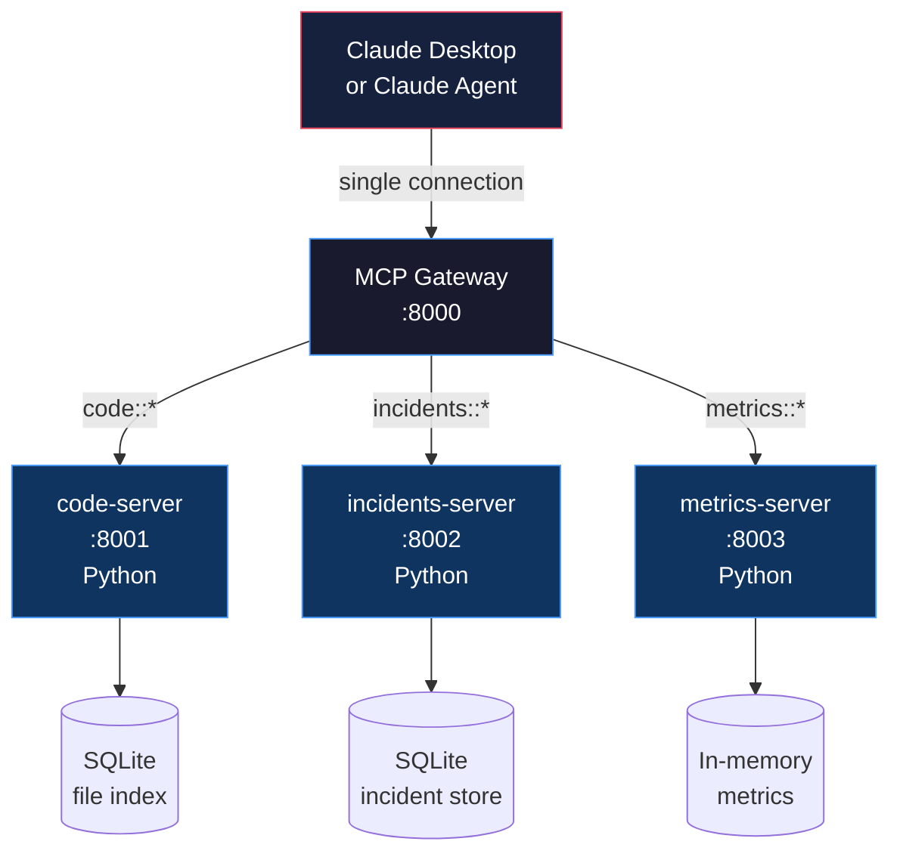

# المشروع الختامي: منظومة أدوات MCP لمجال (Domain)

> الفجوة بين "ابنِ خادم MCP" و"ابنِ منظومة MCP" هي كل ما تفعله بعد أن تعمل الأداة الأولى.

**النوع:** بناء
**اللغات:** كلاهما (Python + TypeScript)
**المتطلبات:** 07-build-mcp-server، 08-build-mcp-client، 12-mcp-gateways-and-registries، 13-integrating-real-systems
**الوقت:** ~90 دقيقة
**أهداف التعلّم:**
- بناء ثلاثة خوادم MCP مترابطة تشترك في مجال واحد (العمليات الهندسية / Engineering Operations)
- تهيئة بوابة (gateway) توجّه الثلاثة جميعاً خلف نقطة دخول واحدة
- ربط المنظومة بـ Claude Desktop باستخدام `claude_desktop_config.json`
- كتابة كتيّب تشغيل إنتاجي (runbook) يغطي إعداد خادم جديد، وتدوير الرموز، ومراقبة الصحة، وتصحيح أعطال الاستدعاءات

---

## المشكلة

"ابنِ لي خادم MCP" و"ابنِ لي منظومة أدوات MCP إنتاجية" نطاقان مختلفان بمقدار رتبة قدر (order of magnitude) تقريباً.

بناء خادم MCP واحد: ثلاث ساعات، مهندس واحد، عرض توضيحي عامل.

بناء منظومة MCP إنتاجية: ثلاثة خوادم بمخاوف متداخلة (الكود يشير إلى الحوادث، الحوادث تشير إلى المقاييس، المقاييس تفسّر سلوك الكود)، وبوابة توجّهها، ورموز مصادقة تتدوّر، وخدمات تتوقّف وتعود، ووكلاء يمتدّون عبر عدة خوادم في مهمة واحدة، وكتيّب تشغيل ليتمكن المهندس التالي من تشغيلها دون أن يسألك.

يغلق هذا المشروع الختامي تلك الفجوة. ستبني منظومة عمليات هندسية (Engineering Operations) بثلاثة خوادم، تربطها خلف بوابة، تربط Claude Desktop بها، وتكتب كتيّب التشغيل الذي يتيح لشخص آخر تشغيلها.

الهدف ليس البرهنة على أن ثلاثة خوادم MCP يمكن أن توجد. الهدف هو البرهنة على أنها تستطيع العمل معاً كنظام.

---

## المفهوم

### مجال العمليات الهندسية

ثلاثة خوادم، كل منها مسؤول عن شريحة واحدة من بيانات العمليات الهندسية:



**code-server:** يكشف قاعدة الكود كمورد قابل للاستعلام. أدوات: بحث الملفات، قراءة المحتوى، سرد المجلدات. موارد: `repo://README`، `repo://ARCHITECTURE.md`. مدعوم بفهرس SQLite لبيانات وصفية وهمية للملفات.

**incidents-server:** يدير بيانات الحوادث الهندسية. أدوات: سرد الحوادث، الحصول على تفاصيل حادث، إضافة ملاحظات. موارد: `incidents://active`. برومبت: `draft_postmortem(incident_id)`. مدعوم بجدول SQLite لحوادث وهمية.

**metrics-server:** يكشف المقاييس التشغيلية. أدوات: `get_metric(name, window)`، `list_metrics()`. موارد: `metrics://dashboard`. مدعوم ببيانات وهمية في الذاكرة (in-memory stub).

### لماذا ثلاثة خوادم بدلاً من واحد

يمكنك وضع كل هذه الأدوات في خادم واحد. هذا القرار الصحيح لفريق صغير. لكن فصلها له قيمة تشغيلية عند التوسّع:

- يستطيع فريق مختلف امتلاك كل خادم (platform، SRE، observability)
- يمكن نشر كل خادم وتوسيعه وتحديثه بشكل مستقل
- يمكن تحديد نطاق المصادقة لكل خادم (خادم الحوادث يستخدم رمز pagerduty، خادم المقاييس يستخدم رمز prometheus)
- توقّف خادم واحد لا يُسقط كل الأدوات

تجعل البوابة الفصل شفافاً للعملاء. وكيل يستخدم `code::search_codebase` ليس لديه أي فكرة أن الحوادث والمقاييس على عمليات منفصلة.

### العقد التشغيلي

المنظومة مفيدة فقط إذا أمكن تشغيلها بواسطة شخص غير من بناها. العقد التشغيلي هو كتيّب تشغيل يجيب عن أربعة أسئلة:

```
OPERATIONAL CONTRACT
====================

1. How do I add a new server?
   - Who approves the registry entry?
   - What is the namespace naming convention?
   - What health check format is required?

2. How do I rotate an auth token?
   - Which env var controls which server?
   - What is the zero-downtime rotation procedure?
   - How do I verify the rotation worked?

3. How do I monitor health?
   - Which endpoint shows the status of all servers?
   - What does an alert look like?
   - What is the escalation path?

4. How do I debug a tool call failure?
   - Where are the logs?
   - How do I reproduce the failure locally?
   - What information do I need from the caller?
```

---

## البناء

### المنظومة الكاملة في الكود

التنفيذ الكامل في `code/main.py`. يبدأ الخوادم الثلاثة جميعاً داخل العملية (باستخدام خلفيات وهمية)، يهيئ البوابة، ويشغّل جلسة عميل توضيحية تمتد عبر الخوادم الثلاثة.

إليك البنية المعمارية لكل مكوّن خادم:

**code-server: بحث قاعدة الكود والتنقّل فيها**

يستخدم الخادم فهرس ملفات SQLite لمحاكاة قاعدة كود. في الإنتاج، سيُملأ هذا الفهرس بواسطة خطّاف git (git hook) أو زاحف مجدوَل.

```python
# Abbreviated -- full version in code/main.py

CODE_TOOLS = [
    Tool(name="search_codebase", description="Full-text search across the indexed codebase.",
         inputSchema={"type": "object", "properties": {"query": {"type": "string"},
                      "limit": {"type": "integer", "default": 10}}, "required": ["query"]}),
    Tool(name="get_file", description="Get the content of a specific file by path.",
         inputSchema={"type": "object", "properties": {"path": {"type": "string"}}, "required": ["path"]}),
    Tool(name="list_directory", description="List files in a directory.",
         inputSchema={"type": "object", "properties": {"path": {"type": "string", "default": "/"}}}),
]

# Resources: repo://README, repo://ARCHITECTURE.md
# These are fetched via resources/read, not tools/call
```

**incidents-server: تتبّع الحوادث وصياغة تقارير ما بعد الحادث (postmortem)**

يكشف خادم الحوادث البرومبت الوحيد في هذه المنظومة: `draft_postmortem`. البرومبتات في MCP هي قوالب رسائل قابلة لإعادة الاستخدام تعبّئ السياق مسبقاً للنموذج.

```python
# Abbreviated -- full version in code/main.py

INCIDENTS_TOOLS = [
    Tool(name="list_incidents", description="List incidents filtered by status.",
         inputSchema={"type": "object", "properties": {
             "status": {"type": "string", "enum": ["open", "investigating", "resolved", "all"],
                        "default": "all"},
             "limit": {"type": "integer", "default": 10}}}),
    Tool(name="get_incident", description="Get full incident details including notes.",
         inputSchema={"type": "object", "properties": {"id": {"type": "string"}}, "required": ["id"]}),
    Tool(name="add_note", description="Add a note to an incident.",
         inputSchema={"type": "object", "properties": {
             "incident_id": {"type": "string"}, "note": {"type": "string"}},
             "required": ["incident_id", "note"]}),
]

# Prompt: draft_postmortem(incident_id)
# Returns a structured prompt template with incident data pre-filled
```

**metrics-server: المقاييس التشغيلية**

```python
# Abbreviated -- full version in code/main.py

METRICS_TOOLS = [
    Tool(name="get_metric", description="Get a named metric for a time window.",
         inputSchema={"type": "object", "properties": {
             "name": {"type": "string"}, "window": {"type": "string", "default": "1h"}},
             "required": ["name"]}),
    Tool(name="list_metrics", description="List all available metric names.",
         inputSchema={"type": "object", "properties": {}}),
]
```

**ربط البوابة**

تُهيأ البوابة من الدرس 12 بالخوادم الثلاثة جميعاً. ينطبق منطق التوجيه والاكتشاف وفحص الصحة نفسه هنا دون تعديل. هذا هو مردود بناء البوابة كمكوّن قابل لإعادة الاستخدام.

```python
gateway = MCPGateway(servers=[
    MockServer(name="code-server",      namespace="code",      ...),
    MockServer(name="incidents-server", namespace="incidents", ...),
    MockServer(name="metrics-server",   namespace="metrics",   ...),
])
```

`tools/list` للبوابة يُعيد كل الأدوات من الخوادم الثلاثة جميعاً، مع بادئات:

```
code::search_codebase
code::get_file
code::list_directory
incidents::list_incidents
incidents::get_incident
incidents::add_note
metrics::get_metric
metrics::list_metrics
```

> **اختبار من الواقع:** وكيل يصحّح حادثاً. يستدعي `incidents::get_incident`، فيرى معدلات أخطاء مرتفعة، ثم يحتاج لاستدعاء `metrics::get_metric` للتحقق من زمن استجابة الخدمة، ثم يستدعي `code::search_codebase` لإيجاد الكود ذي الصلة. كل استدعاء يذهب إلى خادم مختلف. هل يحتاج الوكيل لمعرفة هذا؟

لا. يعرف الوكيل فقط أسماء أدوات مثل `incidents::get_incident` وعنوان URL للبوابة. حقيقة أن هذه الأدوات تعيش على ثلاث عمليات منفصلة بمصادقة منفصلة وقواعد بيانات منفصلة غير مرئية للوكيل. هذا هو المقصود: البنية الداخلية للمنظومة مسألة تشغيلية، لا مسألة وكيل. وظيفة الوكيل هي التفكير في الحوادث والمقاييس والكود. وظيفة البوابة هي توجيه الاستدعاءات بشكل صحيح.

---

## الاستخدام

### ربط Claude Desktop

يتصل Claude Desktop بالبوابة كخادم MCP واحد. لا تظهر عناوين URL لخوادم فردية في الإعدادات.

```json
{
  "mcpServers": {
    "eng-ops-gateway": {
      "command": "python",
      "args": [
        "/path/to/phases/03-tools-and-mcp/14-capstone-mcp-ecosystem/code/main.py",
        "--server"
      ],
      "env": {
        "GATEWAY_API_KEY": "your-gateway-key",
        "CODE_SERVER_TOKEN": "your-code-server-token",
        "INCIDENTS_SERVER_TOKEN": "your-incidents-token",
        "METRICS_SERVER_TOKEN": "your-metrics-token"
      }
    }
  }
}
```

ضع هذا في `~/Library/Application Support/Claude/claude_desktop_config.json` على macOS أو `%APPDATA%\Claude\claude_desktop_config.json` على Windows. أعد تشغيل Claude Desktop. تظهر الأدوات الثماني جميعاً في مُحدِّد الأدوات.

### كيف تبدو جلسة وكيل متعدد الخوادم

مع اتصال الخوادم الثلاثة جميعاً، يستطيع Claude التفكير عبر مجال العمليات الهندسية بأكمله في محادثة واحدة:

```
User: "Our API error rate spiked 20 minutes ago. What's going on?"

Claude: [calls metrics::get_metric("api_error_rate", "30m")]
        -> 2.8% error rate, spike started at 14:42

Claude: [calls incidents::list_incidents(status="open")]
        -> INC-2024: "auth-service latency spike", opened 14:40

Claude: [calls incidents::get_incident("INC-2024")]
        -> details: auth service p95 latency 1800ms, normally 80ms

Claude: [calls code::search_codebase("auth service token validation")]
        -> auth/token_validator.py: added Redis cache lookup 2 hours ago

Claude: "The API error spike started at 14:42, two minutes after INC-2024
         was opened for auth-service latency. A recent change in
         auth/token_validator.py added a Redis cache lookup. This is likely
         the root cause. I recommend checking Redis health and rolling back
         the cache change if Redis is degraded."
```

هذا تفكير عبر الخوادم: إجابة متماسكة واحدة مُجمَّعة من بيانات على ثلاثة خوادم منفصلة، موجّهة عبر بوابة واحدة، مرئية لوكيل واحد.

> **نقلة في المنظور:** يسأل أحدهم: "لماذا بناء كل هذه البنية التحتية بينما يمكنك ببساطة منح Claude وصولاً إلى قاعدة بيانات PostgreSQL فيها كل هذه البيانات؟" ما الذي تمنحه منظومة MCP ولا يمنحه اتصال قاعدة بيانات مباشر؟

ثلاثة أشياء. أولاً، فصل المخاوف: كل خادم يفرض قواعد الوصول الخاصة به. خادم الحوادث يستطيع تقييد من يضيف ملاحظات. خادم الكود يمكن أن يكون للقراءة فقط. اتصال قاعدة بيانات مباشر يمنح النموذج وصولاً إلى كل شيء في المخطط. ثانياً، البروتوكول: أدوات MCP تُعيد بيانات مُهيكلة يستطيع النموذج التفكير فيها، بمخططات صريحة. نتائج SQL الخام صفوف وأعمدة بلا معنى دلالي. ثالثاً، التطوّر: تستطيع تغيير خلفية خادم الحوادث من SQLite إلى PagerDuty دون تغيير أي كود وكيل. اتصال قاعدة بيانات مباشر يقرن الوكيل بتنفيذ التخزين.

---

## التسليم

المخرَج الذي ينتجه هذا الدرس هو كتيّب تشغيل إنتاجي لتشغيل منظومة العمليات الهندسية في MCP. انظر `outputs/runbook-mcp-ecosystem.md`.

يجيب كتيّب التشغيل عن الأسئلة التشغيلية الأربعة من قسم المفهوم: كيفية إضافة خادم جديد، وكيفية تدوير رموز المصادقة، وكيفية مراقبة الصحة، وكيفية تصحيح أعطال استدعاءات الأدوات. وهو مكتوب للمهندس المناوب في الثانية صباحاً، لا للمهندس الذي بنى النظام.

---

## التقييم

### اختبار المنظومة

تحتاج المنظومة الإنتاجية إلى أربعة مستويات من الاختبار. يلتقط كل مستوى صنفاً مختلفاً من الفشل.

**المستوى 1: التحقق من مخطط الأداة**

لكل أداة في المنظومة، تحقق من أن مخطط الإدخال يطابق توقيع الدالة الفعلي. هذا يلتقط عدم التطابق حيث يقول وصف أداة إن `query` مطلوب لكن المعالج يتوقّع `search_query`.

```python
def test_tool_schema_completeness():
    """Every required field in the schema has a handler parameter. No extras."""
    for tool in gateway.list_tools():
        schema = tool["inputSchema"]
        required = schema.get("required", [])
        properties = set(schema.get("properties", {}).keys())
        assert set(required).issubset(properties), (
            f"{tool['name']}: required fields {required} not all in properties {list(properties)}"
        )
```

**المستوى 2: اختبار دمج ذهاب وإياب لكل أداة**

لكل أداة، أرسل استدعاءً صالحاً عبر البوابة وتحقق من أنك تستعيد استجابة غير خطأ بالبنية المتوقعة.

```python
def test_all_tools_round_trip():
    test_calls = [
        ("code::search_codebase", {"query": "auth"}),
        ("code::get_file", {"path": "auth/token_validator.py"}),
        ("code::list_directory", {"path": "/"}),
        ("incidents::list_incidents", {"status": "open"}),
        ("incidents::get_incident", {"id": "INC-2024"}),
        ("incidents::add_note", {"incident_id": "INC-2024", "note": "test note"}),
        ("metrics::get_metric", {"name": "api_error_rate", "window": "1h"}),
        ("metrics::list_metrics", {}),
    ]
    for tool_name, args in test_calls:
        result = gateway.call_tool(tool_name, args)
        assert "error" not in result, f"{tool_name} returned error: {result}"
```

**المستوى 3: اختبار توجيه البوابة**

تحقق من أن البوابة توجّه كل استدعاء أداة إلى الخادم الصحيح ولا توجّهه أبداً إلى الخاطئ. استخدم تسجيل الاستدعاءات للتحقق.

```python
def test_routing_correctness():
    """Each tool call reaches the right server and only that server."""
    call_log = []
    original_handlers = {}

    for ns, server in gateway._servers.items():
        original_handlers[ns] = server.handler
        def logging_handler(tool, args, _ns=ns):
            call_log.append(_ns)
            return original_handlers[_ns](tool, args)
        server.handler = logging_handler

    gateway.call_tool("code::search_codebase", {"query": "test"})
    assert call_log == ["code"], f"Expected ['code'], got {call_log}"

    call_log.clear()
    gateway.call_tool("incidents::list_incidents", {})
    assert call_log == ["incidents"], f"Expected ['incidents'], got {call_log}"
```

**المستوى 4: تقييم الوكيل -- التفكير عبر الخوادم**

هذا هو الاختبار الكامل من الطرف إلى الطرف (end-to-end). أعطِ الوكيل سؤالاً يتطلب استدعاء أدوات من خادمين مختلفين على الأقل، وقيّم الاستجابة على: (1) هل استدعى الأدوات الصحيحة، (2) هل استدعاها بترتيب معقول، (3) هل تُجمّع الإجابة النهائية البيانات من عدة خوادم بشكل صحيح.

```python
def eval_cross_server_reasoning():
    """Agent must use tools from 2+ servers to answer correctly."""
    question = "Are there any open incidents related to services with high error rates?"
    # Expected tool calls: metrics::get_metric or metrics::list_metrics + incidents::list_incidents
    # Score: 1.0 if both servers called + answer mentions specific incident + metric
    #        0.5 if only one server called
    #        0.0 if no tool calls or wrong tools
```

درجة تقييم التفكير عبر الخوادم مؤشر مبكّر على صحة المنظومة. إذا انخفضت الدرجة، فهذا يعني عادةً أن مخطط أداة تغيّر بطريقة تُربك النموذج، أو أن خادماً يُعيد بيانات مشوّهة، أو أن توجيه البوابة تعطّل.
