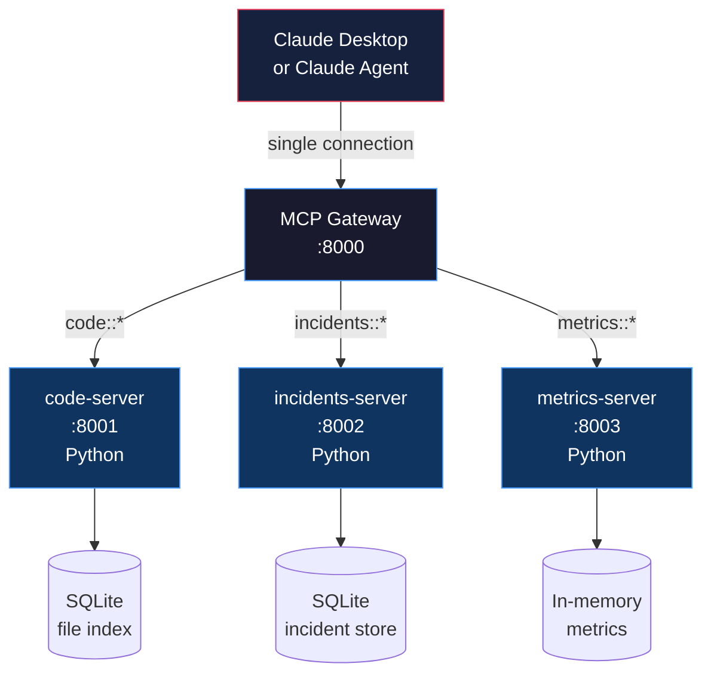

# Capstone: MCP Tool Ecosystem for a Domain

> The gap between "build an MCP server" and "build an MCP ecosystem" is everything you do after the first tool works.

**Type:** Build
**Languages:** Both
**Prerequisites:** 07-build-mcp-server, 08-build-mcp-client, 12-mcp-gateways-and-registries, 13-integrating-real-systems
**Time:** ~90 min
**Learning Objectives:**
- Build three interdependent MCP servers that share a domain (Engineering Operations)
- Configure a gateway that routes all three behind a single entry point
- Connect the ecosystem to Claude Desktop using `claude_desktop_config.json`
- Write a production runbook covering new server onboarding, token rotation, health monitoring, and failure debugging

---

## MOTTO

A tool ecosystem is not a collection of individual servers. It is a contract between your AI agents and your operational reality.

---

## THE PROBLEM

"Build me an MCP server" and "build me a production MCP tool ecosystem" are different scopes by roughly an order of magnitude.

Building one MCP server: three hours, one engineer, a working demo.

Building a production MCP ecosystem: three servers with overlapping concerns (code references incidents, incidents reference metrics, metrics explain code behavior), a gateway that routes them, auth tokens that rotate, services that go down and come back, agents that span multiple servers in a single task, and a runbook so the next engineer can operate it without asking you.

This capstone closes that gap. You will build an Engineering Operations ecosystem with three servers, wire them behind a gateway, connect Claude Desktop to it, and write the runbook that lets someone else operate it.

The goal is not to demonstrate that three MCP servers can exist. The goal is to demonstrate that they can work together as a system.

---

## THE CONCEPT

### The Engineering Operations Domain

Three servers, each responsible for one slice of engineering operational data:



**code-server:** Exposes the codebase as a queryable resource. Tools: search files, read content, list directories. Resources: `repo://README`, `repo://ARCHITECTURE.md`. Backed by a SQLite index of mock file metadata.

**incidents-server:** Manages engineering incident data. Tools: list incidents, get incident details, add notes. Resources: `incidents://active`. Prompt: `draft_postmortem(incident_id)`. Backed by a SQLite table of mock incidents.

**metrics-server:** Exposes operational metrics. Tools: `get_metric(name, window)`, `list_metrics()`. Resources: `metrics://dashboard`. Backed by in-memory stub data.

### Why Three Servers Instead of One

You could put all these tools in one server. That is the right call for a small team. But separating them has operational value at scale:

- Each server can be owned by a different team (platform, SRE, observability)
- Each server can be deployed, scaled, and updated independently
- Auth can be scoped per server (incidents server uses pagerduty token, metrics server uses prometheus token)
- One server going down does not take down all tools

The gateway makes the separation transparent to clients. An agent using `code::search_codebase` has no idea that incidents and metrics are on separate processes.

### The Operational Contract

An ecosystem is only useful if it can be operated by someone other than the person who built it. The operational contract is a runbook that answers four questions:

```
OPERATIONAL CONTRACT
====================

1. How do I add a new server?
   - Who approves the registry entry?
   - What is the namespace naming convention?
   - What health check format is required?

2. How do I rotate an auth token?
   - Which env var controls which server?
   - What is the zero-downtime rotation procedure?
   - How do I verify the rotation worked?

3. How do I monitor health?
   - Which endpoint shows the status of all servers?
   - What does an alert look like?
   - What is the escalation path?

4. How do I debug a tool call failure?
   - Where are the logs?
   - How do I reproduce the failure locally?
   - What information do I need from the caller?
```

---

## BUILD IT

### The Full Ecosystem in Code

The complete implementation is in `code/main.py`. It starts all three servers in-process (using mock backends), initializes the gateway, and runs a demo client session that spans all three servers.

Here is the architecture of each server component:

**code-server: codebase search and navigation**

The server uses a SQLite file index to simulate a codebase. In production, this index would be populated by a git hook or a scheduled crawler.

```python
# Abbreviated -- full version in code/main.py

CODE_TOOLS = [
    Tool(name="search_codebase", description="Full-text search across the indexed codebase.",
         inputSchema={"type": "object", "properties": {"query": {"type": "string"},
                      "limit": {"type": "integer", "default": 10}}, "required": ["query"]}),
    Tool(name="get_file", description="Get the content of a specific file by path.",
         inputSchema={"type": "object", "properties": {"path": {"type": "string"}}, "required": ["path"]}),
    Tool(name="list_directory", description="List files in a directory.",
         inputSchema={"type": "object", "properties": {"path": {"type": "string", "default": "/"}}}),
]

# Resources: repo://README, repo://ARCHITECTURE.md
# These are fetched via resources/read, not tools/call
```

**incidents-server: incident tracking and postmortem drafting**

The incidents server exposes the only prompt in this ecosystem: `draft_postmortem`. Prompts in MCP are reusable message templates that pre-populate context for the model.

```python
# Abbreviated -- full version in code/main.py

INCIDENTS_TOOLS = [
    Tool(name="list_incidents", description="List incidents filtered by status.",
         inputSchema={"type": "object", "properties": {
             "status": {"type": "string", "enum": ["open", "investigating", "resolved", "all"],
                        "default": "all"},
             "limit": {"type": "integer", "default": 10}}}),
    Tool(name="get_incident", description="Get full incident details including notes.",
         inputSchema={"type": "object", "properties": {"id": {"type": "string"}}, "required": ["id"]}),
    Tool(name="add_note", description="Add a note to an incident.",
         inputSchema={"type": "object", "properties": {
             "incident_id": {"type": "string"}, "note": {"type": "string"}},
             "required": ["incident_id", "note"]}),
]

# Prompt: draft_postmortem(incident_id)
# Returns a structured prompt template with incident data pre-filled
```

**metrics-server: operational metrics**

```python
# Abbreviated -- full version in code/main.py

METRICS_TOOLS = [
    Tool(name="get_metric", description="Get a named metric for a time window.",
         inputSchema={"type": "object", "properties": {
             "name": {"type": "string"}, "window": {"type": "string", "default": "1h"}},
             "required": ["name"]}),
    Tool(name="list_metrics", description="List all available metric names.",
         inputSchema={"type": "object", "properties": {}}),
]
```

**The gateway wiring**

The gateway from Lesson 12 is initialized with all three servers. The same routing, discovery, and health check logic applies here without modification. This is the payoff of building the gateway as a reusable component.

```python
gateway = MCPGateway(servers=[
    MockServer(name="code-server",      namespace="code",      ...),
    MockServer(name="incidents-server", namespace="incidents", ...),
    MockServer(name="metrics-server",   namespace="metrics",   ...),
])
```

The gateway's `tools/list` returns all tools from all three servers, prefixed:

```
code::search_codebase
code::get_file
code::list_directory
incidents::list_incidents
incidents::get_incident
incidents::add_note
metrics::get_metric
metrics::list_metrics
```

> **Real-world check:** An agent is debugging an incident. It calls `incidents::get_incident`, sees high error rates, then needs to call `metrics::get_metric` to check service latency, then calls `code::search_codebase` to find the relevant code. Each call goes to a different server. Does the agent need to know this?

No. The agent only knows tool names like `incidents::get_incident` and the gateway URL. The fact that these tools live on three separate processes with separate auth and separate databases is invisible to the agent. This is the point: the ecosystem's internal structure is an operational concern, not an agent concern. The agent's job is to reason about incidents, metrics, and code. The gateway's job is to route the calls correctly.

---

## USE IT

### Connecting Claude Desktop

Claude Desktop connects to the gateway as a single MCP server. No individual server URLs appear in the config.

```json
{
  "mcpServers": {
    "eng-ops-gateway": {
      "command": "python",
      "args": [
        "/path/to/phases/03-tools-and-mcp/14-capstone-mcp-ecosystem/code/main.py",
        "--server"
      ],
      "env": {
        "GATEWAY_API_KEY": "your-gateway-key",
        "CODE_SERVER_TOKEN": "your-code-server-token",
        "INCIDENTS_SERVER_TOKEN": "your-incidents-token",
        "METRICS_SERVER_TOKEN": "your-metrics-token"
      }
    }
  }
}
```

Place this in `~/Library/Application Support/Claude/claude_desktop_config.json` on macOS or `%APPDATA%\Claude\claude_desktop_config.json` on Windows. Restart Claude Desktop. All eight tools appear in the tool selector.

### What a Multi-Server Agent Session Looks Like

With all three servers connected, Claude can reason across the entire Engineering Operations domain in a single conversation:

```
User: "Our API error rate spiked 20 minutes ago. What's going on?"

Claude: [calls metrics::get_metric("api_error_rate", "30m")]
        -> 2.8% error rate, spike started at 14:42

Claude: [calls incidents::list_incidents(status="open")]
        -> INC-2024: "auth-service latency spike", opened 14:40

Claude: [calls incidents::get_incident("INC-2024")]
        -> details: auth service p95 latency 1800ms, normally 80ms

Claude: [calls code::search_codebase("auth service token validation")]
        -> auth/token_validator.py: added Redis cache lookup 2 hours ago

Claude: "The API error spike started at 14:42, two minutes after INC-2024
         was opened for auth-service latency. A recent change in
         auth/token_validator.py added a Redis cache lookup. This is likely
         the root cause. I recommend checking Redis health and rolling back
         the cache change if Redis is degraded."
```

This is cross-server reasoning: one coherent answer assembled from data on three separate servers, routed through one gateway, visible to one agent.

> **Perspective shift:** Someone asks: "Why build all this infrastructure when you could just give Claude access to a PostgreSQL database with all this data in it?" What does the MCP ecosystem give you that a direct database connection does not?

Three things. First, separation of concerns: each server enforces its own access rules. The incidents server can restrict who can add notes. The code server can be read-only. A direct database connection gives the model access to everything in the schema. Second, protocol: MCP tools return structured data the model can reason about, with explicit schemas. Raw SQL results are rows and columns with no semantic meaning. Third, evolution: you can change the incidents server's backend from SQLite to PagerDuty without changing any agent code. A direct database connection couples the agent to the storage implementation.

---

## SHIP IT

The artifact this lesson produces is a production runbook for operating the Engineering Operations MCP ecosystem. See `outputs/runbook-mcp-ecosystem.md`.

The runbook answers the four operational questions from the concept section: how to add a new server, how to rotate auth tokens, how to monitor health, and how to debug tool call failures. It is written for the engineer who is on call at 2am, not the engineer who built the system.

---

## EVALUATE IT

### Testing the Ecosystem

A production ecosystem needs four levels of testing. Each level catches a different class of failure.

**Level 1: Tool schema validation**

For every tool in the ecosystem, assert that the input schema matches the actual function signature. This catches the mismatch where a tool description says `query` is required but the handler expects `search_query`.

```python
def test_tool_schema_completeness():
    """Every required field in the schema has a handler parameter. No extras."""
    for tool in gateway.list_tools():
        schema = tool["inputSchema"]
        required = schema.get("required", [])
        properties = set(schema.get("properties", {}).keys())
        assert set(required).issubset(properties), (
            f"{tool['name']}: required fields {required} not all in properties {list(properties)}"
        )
```

**Level 2: Round-trip integration test per tool**

For each tool, send a valid call through the gateway and assert you get a non-error response with the expected structure.

```python
def test_all_tools_round_trip():
    test_calls = [
        ("code::search_codebase", {"query": "auth"}),
        ("code::get_file", {"path": "auth/token_validator.py"}),
        ("code::list_directory", {"path": "/"}),
        ("incidents::list_incidents", {"status": "open"}),
        ("incidents::get_incident", {"id": "INC-2024"}),
        ("incidents::add_note", {"incident_id": "INC-2024", "note": "test note"}),
        ("metrics::get_metric", {"name": "api_error_rate", "window": "1h"}),
        ("metrics::list_metrics", {}),
    ]
    for tool_name, args in test_calls:
        result = gateway.call_tool(tool_name, args)
        assert "error" not in result, f"{tool_name} returned error: {result}"
```

**Level 3: Gateway routing test**

Assert that the gateway routes each tool call to the correct server and never to the wrong one. Use call logging to verify.

```python
def test_routing_correctness():
    """Each tool call reaches the right server and only that server."""
    call_log = []
    original_handlers = {}

    for ns, server in gateway._servers.items():
        original_handlers[ns] = server.handler
        def logging_handler(tool, args, _ns=ns):
            call_log.append(_ns)
            return original_handlers[_ns](tool, args)
        server.handler = logging_handler

    gateway.call_tool("code::search_codebase", {"query": "test"})
    assert call_log == ["code"], f"Expected ['code'], got {call_log}"

    call_log.clear()
    gateway.call_tool("incidents::list_incidents", {})
    assert call_log == ["incidents"], f"Expected ['incidents'], got {call_log}"
```

**Level 4: Agent eval -- cross-server reasoning**

This is the end-to-end test. Give an agent a question that requires calling tools from at least two different servers, and score the response on: (1) did it call the right tools, (2) did it call them in a reasonable order, (3) does the final answer correctly synthesize data from multiple servers.

```python
def eval_cross_server_reasoning():
    """Agent must use tools from 2+ servers to answer correctly."""
    question = "Are there any open incidents related to services with high error rates?"
    # Expected tool calls: metrics::get_metric or metrics::list_metrics + incidents::list_incidents
    # Score: 1.0 if both servers called + answer mentions specific incident + metric
    #        0.5 if only one server called
    #        0.0 if no tool calls or wrong tools
```

The eval score for cross-server reasoning is a leading indicator of ecosystem health. If the score drops, it typically means a tool schema changed in a way that confuses the model, or a server is returning malformed data, or the gateway routing broke.
