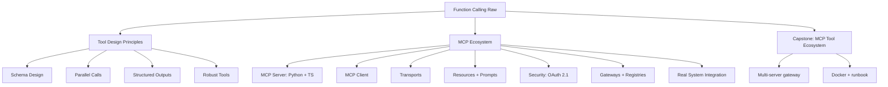

# Phase 03: Tools, Function Calling & MCP

14 lessons. ~14 hours. Master function calling from raw API to production-grade tool design, then build and integrate real MCP servers and clients.

## The through-line

Tools are the bridge between language models and real systems. Before you can build reliable agents, you need tools that behave predictably: correct schemas, structured outputs, error recovery, idempotency. This phase teaches that foundation raw, then introduces MCP as the 2026 standard for connecting models to the systems they need to act on.

## What you build

## Lessons

| # | Lesson | Artifact | Time |
|---|--------|----------|------|
| 01 | Function Calling Fundamentals | `skill-function-calling.md` | ~45 min |
| 02 | Tool Schema Design: the Agent-Computer Interface | `prompt-tool-schema-review.md` | ~60 min |
| 03 | Parallel & Streaming Tool Calls | `skill-parallel-tool-calls.md` | ~45 min |
| 04 | Structured Tool Outputs & Error Handling | `skill-tool-output-contract.md` | ~45 min |
| 05 | Robust Tools: Idempotency, Timeouts, Validation | `skill-robust-tool-design.md` | ~60 min |
| 06 | MCP Fundamentals: Tools, Resources, Prompts, Sampling | `skill-mcp-mental-model.md` | ~60 min |
| 07 | Build an MCP Server: Python + TypeScript | `skill-mcp-server-template.md` | ~75 min |
| 08 | Build an MCP Client | `skill-mcp-client.md` | ~60 min |
| 09 | MCP Transports: stdio, HTTP, Streamable | `skill-mcp-transport-selector.md` | ~45 min |
| 10 | MCP Resources & Prompts | `skill-mcp-resources-prompts.md` | ~45 min |
| 11 | MCP Security: Tool Poisoning, OAuth 2.1, Prod Auth | `skill-mcp-security-checklist.md` | ~60 min |
| 12 | MCP Gateways & Registries | `skill-mcp-gateway.md` | ~45 min |
| 13 | Integrating Real Systems: DBs, SaaS APIs, Internal Tools | `skill-real-system-integration.md` | ~75 min |
| 14 | Capstone: MCP Tool Ecosystem for a Domain | `runbook-mcp-ecosystem.md` | ~90 min |

## Prerequisites

Phase 01 (Prompt and Context Engineering) gives you the right foundation. You can start here with just basic Python and familiarity with the Anthropic API.

## Stack

- Python + `anthropic` SDK (primary)
- TypeScript + `@modelcontextprotocol/sdk` for MCP server/client
- `pydantic` for structured outputs and tool schemas
- `fastapi` for HTTP transport in the capstone
- No LangChain required - you build the tool loop and MCP primitives raw first
