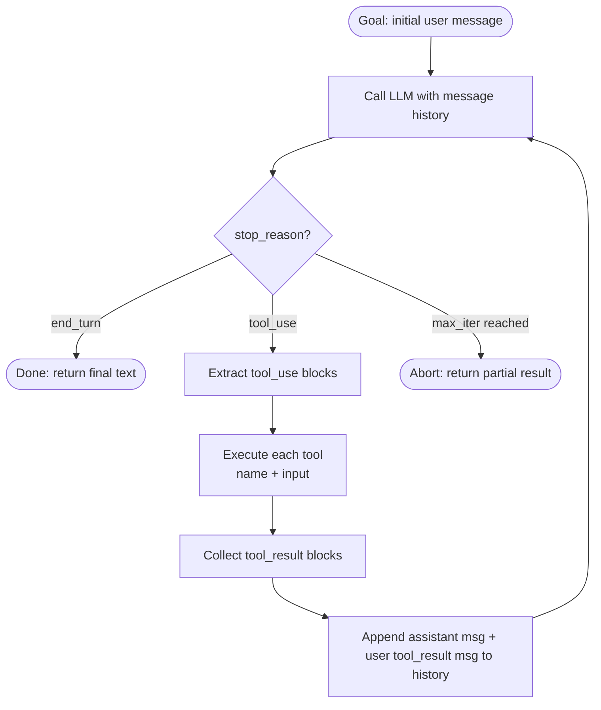

# حلقة الـ agent: خام، بدون اعتماديات

> الـ agent ما هو إلا حلقة (loop): اسأل النموذج عن الخطوة التالية، نفّذها، أخبر النموذج بما حدث، وكرّر حتى الانتهاء.

**النوع:** بناء
**اللغات:** Python
**المتطلبات:** أساسيات Python، Anthropic SDK (`pip install anthropic`)، إلمام باستخدام الأدوات (tool use) في Claude API
**الوقت:** ~60 دقيقة
**أهداف التعلّم:**
- بناء حلقة agent كاملة في ~120 سطرًا باستخدام `anthropic` SDK وحده
- شرح بنية الرسائل الدقيقة في كل دورة (ما الذي يُضاف ولماذا)
- تحديد شرطَي الخروج لحلقة الـ agent: `end_turn` وحاجز الحد الأقصى للتكرارات (max-iteration guard)
- تنفيذ توزيع الأدوات (tool dispatch) عبر نمط السجل (registry pattern) وإرسال كتل `tool_result` إلى النموذج
- وصف كيف تنمو قائمة الرسائل في كل دورة ولماذا تكون بنيتها حتمية (deterministic)

---

## المشكلة

تريد بناء agent قادر على استخدام الأدوات. تقدّم لك الإنترنت LangChain وCrewAI وAutoGen، ودزينة من الأطر (frameworks) الأخرى. كل واحد منها يحمل قناعاته المدمجة: كيف تُنسَّق الرسائل، ومتى تُستدعى الأدوات، وكيف تُعالَج الأخطاء، وكيف تنتهي الحلقة. وحين يعلق الـ agent في بيئة الإنتاج داخل حلقة استدعاء أداة عند الساعة الثانية فجرًا، تحتاج إلى فهم ما تفعله الحلقة، لا مجرد معرفة أي تجريد (abstraction) هو الذي يسيء التصرف.

المشكلة الأعمق: معظم المهندسين يتعاملون مع كلمة "agent" كأنها كلمة سحرية. يوصّلون إطارًا، فيعمل في الغالب، ولا ينظرون أبدًا إلى ما يحدث بين استجابة النموذج والاستدعاء التالي للنموذج. تلك الفجوة هي حيث تختبئ العلل. نتيجة الأداة التي تُقتطع (truncated) بصمت. الأداة التي تُطلق استثناءً (exception) بينما تواصل الحلقة عملها رغم ذلك. الـ agent الذي يستدعي الأداة نفسها 40 مرة لأن شرط التوقف كان خاطئًا.

لا شيء سحري في حلقة الـ agent. إنها حلقة while تستدعي الـ API، وتقرأ الاستجابة، وتنفّذ الأدوات إن طُلب ذلك، وتُلحق النتائج بسجل الرسائل، ثم تستدعي الـ API مجددًا. يمكنك كتابة الأمر بأكمله في ~120 سطرًا من Python قبل الغداء. افعل ذلك أولًا. ثم استخدم إطارًا وافهم بالضبط ما الذي يقدّمه لك.

---

## المفهوم

### الحلقة بوصفها آلة حالات (State Machine)

حلقة الـ agent لها أربع حالات بالضبط:

1. **الاستدعاء (Call):** أرسل سجل الرسائل الحالي إلى النموذج
2. **الفحص (Check):** اقرأ `stop_reason`. إن كان `end_turn`، فاخرج. وإن كان `tool_use`، فانتقل إلى الحالة 3.
3. **التنفيذ (Execute):** نفّذ كل أداة في كتل `tool_use` ضمن محتوى الاستجابة
4. **الإلحاق (Append):** أضف رسالة المساعد (assistant message) ورسالة المستخدم التي تحوي `tool_result` إلى السجل، ثم ارجع إلى الحالة 1

سجل الرسائل هو الذاكرة العاملة للـ agent. ينمو برسالتين بالضبط في كل دورة استخدام أداة: رسالة مساعد واحدة (تحوي كتلة `tool_use`) ورسالة مستخدم واحدة (تحوي كتلة `tool_result`). يقرأ النموذج السجل الكامل عند كل استدعاء.



### نمو قائمة الرسائل في كل دورة

تُضيف كل دورة رسالتين بالضبط إلى السجل عند استدعاء أداة. البنية حتمية وقابلة للتدقيق (auditable).

```
TURN 0 (initial state):
  messages = [
    { role: "user", content: "What is 144 * 17?" }
  ]

TURN 1 (after first LLM call, stop_reason = tool_use):
  messages = [
    { role: "user",      content: "What is 144 * 17?" },
    { role: "assistant", content: [{ type: "tool_use", id: "toolu_01", name: "calculator", input: {"expression": "144 * 17"} }] },
    { role: "user",      content: [{ type: "tool_result", tool_use_id: "toolu_01", content: "2448" }] }
  ]

TURN 2 (after second LLM call, stop_reason = end_turn):
  messages = [
    { role: "user",      content: "What is 144 * 17?" },
    { role: "assistant", content: [{ type: "tool_use", ... }] },
    { role: "user",      content: [{ type: "tool_result", ... }] },
    { role: "assistant", content: [{ type: "text", text: "144 times 17 is 2,448." }] }
  ]
```

نمط التناوب بين `assistant` و`user` مطلوب من قِبل الـ API. تعيش كتل `tool_result` داخل رسائل المستخدم. وهذا ليس اختياريًا: سيرفض الـ API أي سجل يكسر هذا التناوب.

---

## البناء

### حلقة الـ agent الخام في ~120 سطرًا

التنفيذ من ثلاثة أجزاء: سجل الأدوات (tool registry)، ومنفّذ الأدوات (tool executor)، والحلقة نفسها. راجع `code/main.py` للحصول على الملف الكامل القابل للتشغيل.

**الخطوة 1: عرّف أدواتك بصيغة مخططات JSON (JSON schemas).**

تُمرَّر قائمة `tools` مباشرةً إلى `client.messages.create()`. كل عنصر هو dict يحوي `name` و`description` و`input_schema`. المخطط هو كائن JSON Schema قياسي.

```python
import anthropic
import json
import math

client = anthropic.Anthropic()

TOOLS = [
    {
        "name": "calculator",
        "description": "Evaluate a mathematical expression. Input must be a valid Python math expression.",
        "input_schema": {
            "type": "object",
            "properties": {
                "expression": {
                    "type": "string",
                    "description": "A Python-evaluable math expression, e.g. '144 * 17' or 'math.sqrt(144)'"
                }
            },
            "required": ["expression"]
        }
    },
    {
        "name": "web_search",
        "description": "Search the web for current information. Returns a stub result for demo purposes.",
        "input_schema": {
            "type": "object",
            "properties": {
                "query": {
                    "type": "string",
                    "description": "The search query"
                }
            },
            "required": ["query"]
        }
    }
]
```

**الخطوة 2: نفّذ منفّذ الأدوات.**

المنفّذ عبارة عن سجل: dict يربط أسماء الأدوات بدوال Python. تتكرر دالة التوزيع (dispatch) عبر كل كتل `tool_use` في الاستجابة، وتستدعي الدالة الصحيحة، وتُعيد قائمة من dicts الخاصة بـ `tool_result`.

```python
def run_calculator(expression: str) -> str:
    try:
        # Restrict eval to math module only
        result = eval(expression, {"__builtins__": {}, "math": math})
        return str(result)
    except Exception as e:
        return f"Error: {e}"

def run_web_search(query: str) -> str:
    # Stub: replace with real search API in production
    return f"[STUB] Top result for '{query}': This is a placeholder search result."

TOOL_REGISTRY = {
    "calculator": lambda args: run_calculator(args["expression"]),
    "web_search": lambda args: run_web_search(args["query"]),
}

def execute_tools(tool_use_blocks: list) -> list[dict]:
    """Execute all tool_use blocks and return tool_result dicts."""
    results = []
    for block in tool_use_blocks:
        tool_name = block.name
        tool_input = block.input
        tool_use_id = block.id

        if tool_name in TOOL_REGISTRY:
            output = TOOL_REGISTRY[tool_name](tool_input)
        else:
            output = f"Error: unknown tool '{tool_name}'"

        results.append({
            "type": "tool_result",
            "tool_use_id": tool_use_id,
            "content": output
        })
    return results
```

**الخطوة 3: الحلقة نفسها.**

تبدأ الحلقة بهدف المستخدم، وتستدعي النموذج، وتفحص `stop_reason`، وتوزّع الأدوات، وتُلحق النتائج، ثم تكرر. يمنع حاجز `max_iterations` الحلقات المنفلتة (runaway loops).

```python
def run_agent(goal: str, max_iterations: int = 10) -> str:
    messages = [{"role": "user", "content": goal}]
    system = "You are a helpful assistant with access to a calculator and web search. Use tools when needed to answer accurately."

    for iteration in range(max_iterations):
        response = client.messages.create(
            model="claude-3-5-haiku-20241022",
            max_tokens=1024,
            system=system,
            tools=TOOLS,
            messages=messages
        )

        print(f"\n[Turn {iteration + 1}] stop_reason={response.stop_reason}")

        # Exit condition: model is done
        if response.stop_reason == "end_turn":
            # Extract the final text response
            for block in response.content:
                if hasattr(block, "text"):
                    return block.text
            return "(no text in final response)"

        # Tool use: execute and loop
        if response.stop_reason == "tool_use":
            tool_use_blocks = [b for b in response.content if b.type == "tool_use"]

            for block in tool_use_blocks:
                print(f"  Tool call: {block.name}({json.dumps(block.input)})")

            # Append the assistant message (with tool_use blocks)
            messages.append({"role": "assistant", "content": response.content})

            # Execute tools and build tool_result user message
            tool_results = execute_tools(tool_use_blocks)
            for r in tool_results:
                print(f"  Tool result: {r['content'][:80]}")

            messages.append({"role": "user", "content": tool_results})
            continue

        # Unexpected stop reason
        return f"Unexpected stop_reason: {response.stop_reason}"

    return f"Agent stopped after {max_iterations} iterations without end_turn."
```

> **اختبار من الواقع:** الـ agent خاصتك عالق يستدعي الأداة نفسها داخل حلقة، 40 مرة، قبل بلوغ حد التكرارات لديك. ما السببان الأكثر احتمالًا، وما الذي ستضيفه إلى الحلقة لاكتشاف هذا النمط مبكرًا؟

السببان الأكثر احتمالًا: أولًا، أن الأداة تُعيد خطأً ويواصل النموذج إعادة المحاولة من دون أن يُعرَض الخطأ بوضوح (لُفّ تنفيذ الأداة في try/except وأعد سلسلة خطأ مُهيكلة يستطيع النموذج التفكير فيها). ثانيًا، أن الهدف غامض فيفسّر النموذج كل نتيجة أداة على أنها تتطلب استدعاء أداة آخر "للتحقق" (حسّن system prompt ليُخبر النموذج متى تكون نتيجة أداة واحدة كافية). وللاكتشاف المبكر: تتبّع آخر N من استدعاءات الأدوات واخرج إذا استُدعيت الأداة نفسها بمدخلات متطابقة أكثر من مرتين.

---

## الاستخدام

### البث (Streaming) ومعالجة أنظف للأدوات عبر الـ SDK

تعمل الحلقة الخام، لكن Anthropic SDK يوفّر البث وطريقة أكثر سلاسة لمعالجة الاستجابات. البنية هي نفسها: لا يخفي الـ SDK الحلقة ولا إلحاق الرسائل. إنه فقط يجعل الإدخال/الإخراج (I/O) أنظف.

الترقية الأساسية هي `stream=True` واستخدام `with client.messages.stream(...)` للحصول على الرموز (tokens) فور وصولها. وبالنسبة لاستخدام الأدوات، لا تزال تفحص `stop_reason` وتعالج كتل `tool_use`. منطق الحلقة متطابق.

```python
def run_agent_streaming(goal: str, max_iterations: int = 10) -> str:
    messages = [{"role": "user", "content": goal}]
    system = "You are a helpful assistant with access to a calculator and web search."

    for iteration in range(max_iterations):
        # Use the streaming context manager
        with client.messages.stream(
            model="claude-3-5-haiku-20241022",
            max_tokens=1024,
            system=system,
            tools=TOOLS,
            messages=messages
        ) as stream:
            # Stream text tokens as they arrive
            for text in stream.text_stream:
                print(text, end="", flush=True)

            # After streaming completes, get the final message object
            response = stream.get_final_message()

        print()  # newline after streamed output

        if response.stop_reason == "end_turn":
            for block in response.content:
                if hasattr(block, "text"):
                    return block.text
            return "(no text)"

        if response.stop_reason == "tool_use":
            tool_use_blocks = [b for b in response.content if b.type == "tool_use"]
            messages.append({"role": "assistant", "content": response.content})
            tool_results = execute_tools(tool_use_blocks)
            messages.append({"role": "user", "content": tool_results})

    return f"Stopped after {max_iterations} iterations."
```

الفرق عن النسخة الخام: يرى المستخدم النص وهو يُبَث بدلًا من انتظار الاستجابة الكاملة. يُنتج المولّد (generator) `stream.text_stream` الرموز. ويحجب `stream.get_final_message()` التنفيذ حتى اكتمال البث ثم يُعيد بنية كائن الاستجابة نفسها التي تحصل عليها من الاستدعاء غير المبثوث.

> **نقلة في المنظور:** يقول زميل لك: "أنا فقط أستخدم agents الخاصة بـ LangChain حتى لا أضطر للتفكير في حلقة الرسائل." ما التكلفة المحددة لهذا الخيار حين يحدث خلل في الإنتاج؟

حين يسيء الـ agent التصرف في الإنتاج، تحتاج إلى معرفة سجل الرسائل الدقيق الذي أنتج المخرَج السيئ. ومع إطار يخفي الحلقة، عليك أن تتعلّم تمثيل الإطار الداخلي للحالة، وصيغة الرسائل لديه، وخطافات التسجيل (logging hooks) قبل أن تتمكن حتى من رؤية ما الذي تلقّاه النموذج. أما مع الحلقة الخام، فقائمة `messages` هي حالتك. يمكنك طباعتها أو تسجيلها أو تفريغها إلى JSON في أي لحظة. التجريد ليس مجانيًا. إنه يكلّفك القدرة على رؤية ما رآه النموذج بالضبط.

---

## التسليم

المُخرَج (artifact) الذي يُنتجه هذا الدرس هو قالب جاهز للنسخ واللصق لحلقة agent. راجع `outputs/skill-agent-loop.md`.

يلتقط القالب نمط توزيع الأدوات الكامل: صيغة تعريف الأداة، والبحث في السجل (registry lookup)، وتسلسل إلحاق الرسائل، وحاجز الحد الأقصى للتكرارات. أدرجه في أي مشروع يحتاج إلى حلقة خام من دون اعتماديات إطار. استبدل نماذج الأدوات الصورية (stubs) بتنفيذات حقيقية وحدّث قائمة `TOOLS` بمخططاتك الفعلية.

---

## التقييم

تكون حلقة الـ agent صحيحة حين تنتهي بشكل موثوق، وتستدعي الأدوات الصحيحة، وتعالج الأخطاء من دون ابتلاعها بصمت. وإليك كيفية التحقق من كل خاصية:

**الإنهاء (Termination).** شغّل 20 هدفًا متنوعًا، منها 5 على الأقل لا تتطلب أدوات (ينبغي أن يبلغ النموذج `end_turn` في استدعاء واحد). تحقّق من أن الحلقة تخرج بنظافة في كل مرة. تتبّع متوسط عدد الدورات. الأهداف التي تتطلب استدعاءين فأكثر من الأدوات ينبغي أن تكتمل في أقل من 5 تكرارات للمهام المحددة جيدًا.

**دقة توزيع الأدوات.** لكل أداة في سجلك، اكتب 3 أهداف اختبار تتطلب تلك الأداة بلا لبس. شغّل الحلقة وتحقّق من أن أسماء كتل `tool_use` تطابق التوقعات. هدف الآلة الحاسبة يجب ألا يُطلق `web_search`. ينبغي أن تكون دقة التوزيع 100% للأهداف غير الملتبسة.

**معالجة الأخطاء.** مرّر عمدًا تعبيرًا مشوّهًا إلى `run_calculator` (مثل `"1 / 0"` أو `"os.system('rm -rf /')"`) وتحقّق من إعادة سلسلة الخطأ بنظافة إلى النموذج بدلًا من إطلاق استثناء. ينبغي أن تواصل الحلقة حتى `end_turn` مع إقرار النموذج بالخطأ.

**سلامة سجل الرسائل.** بعد كل تشغيل، تأكّد (assert) من أن قائمة الرسائل تتناوب بين دورَي `assistant` و`user`، وأن لكل كتلة `tool_use` في رسالة مساعد كتلة `tool_result` مقابلة في رسالة المستخدم التالية. هذا تأكيد من 5 أسطر يمكنك تشغيله بعد كل استدعاء agent في وضع الاختبار.

**اكتشاف الانفلات (Runaway detection).** اضبط `max_iterations=3` وأعطِ الـ agent هدفًا يتطلب 5 استدعاءات أدوات. تحقّق من أن الحلقة تخرج عند 3 برسالة الحاجز، لا باستثناء غير معالَج أو حلقة لانهائية.
