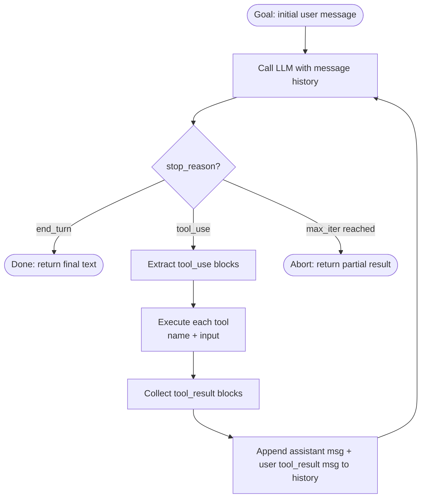

# The Agent Loop: Raw, No Dependencies

> An agent is just a loop: ask the model what to do, do it, tell the model what happened, repeat until done.

**Type:** Build
**Languages:** Python
**Prerequisites:** Basic Python, Anthropic SDK (`pip install anthropic`), familiarity with tool use in Claude API
**Time:** ~60 min
**Learning Objectives:**
- Implement a complete agent loop in ~120 lines using only the `anthropic` SDK
- Explain the exact message structure at each turn (what gets appended and why)
- Identify the two exit conditions for an agent loop: `end_turn` and max-iteration guard
- Execute tool dispatch via a registry pattern and send `tool_result` blocks back to the model
- Describe how the message list grows each turn and why its shape is deterministic

---

## THE PROBLEM

You want to build an agent that can use tools. The internet offers LangChain, CrewAI, AutoGen, and a dozen other frameworks. Each one has opinions baked in: how messages are formatted, when tools are called, how errors are handled, how the loop terminates. When your production agent gets stuck in a tool-call loop at 2 a.m., you need to understand what the loop is doing, not just which abstraction is misbehaving.

The deeper problem: most engineers treat "agent" as a magic word. They wire up a framework, it mostly works, and they never look at what happens between the model response and the next model call. That gap is where bugs live. The tool result that gets silently truncated. The tool that raises an exception but the loop continues anyway. The agent that calls the same tool 40 times because the stop condition was wrong.

There is nothing magic about an agent loop. It is a while loop that calls the API, reads the response, executes tools if requested, appends results to the message history, and calls the API again. You can write the whole thing in ~120 lines of Python before lunch. Do that first. Then use a framework and understand exactly what it is giving you.

---

## THE CONCEPT

### The Loop as a State Machine

An agent loop has exactly four states:

1. **Call**: Send the current message history to the model
2. **Check**: Read the `stop_reason`. If it is `end_turn`, exit. If it is `tool_use`, proceed to state 3.
3. **Execute**: Run every tool in the response's `tool_use` content blocks
4. **Append**: Add the assistant message and the `tool_result` user message to history, go to state 1

The message history is the agent's working memory. It grows by exactly two messages per tool-use turn: one assistant message (containing the `tool_use` block) and one user message (containing the `tool_result` block). The model reads the full history on every call.



### The Message List Growing Each Turn

Each turn adds exactly two messages to the history when a tool is called. The structure is deterministic and auditable.

```
TURN 0 (initial state):
  messages = [
    { role: "user", content: "What is 144 * 17?" }
  ]

TURN 1 (after first LLM call, stop_reason = tool_use):
  messages = [
    { role: "user",      content: "What is 144 * 17?" },
    { role: "assistant", content: [{ type: "tool_use", id: "toolu_01", name: "calculator", input: {"expression": "144 * 17"} }] },
    { role: "user",      content: [{ type: "tool_result", tool_use_id: "toolu_01", content: "2448" }] }
  ]

TURN 2 (after second LLM call, stop_reason = end_turn):
  messages = [
    { role: "user",      content: "What is 144 * 17?" },
    { role: "assistant", content: [{ type: "tool_use", ... }] },
    { role: "user",      content: [{ type: "tool_result", ... }] },
    { role: "assistant", content: [{ type: "text", text: "144 times 17 is 2,448." }] }
  ]
```

The alternating `assistant` / `user` pattern is required by the API. `tool_result` blocks live in user messages. This is not optional: the API will reject a history that breaks this alternation.

---

## BUILD IT

### The Raw Agent Loop in ~120 Lines

The implementation has three parts: the tool registry, the tool executor, and the loop itself. See `code/main.py` for the full runnable file.

**Step 1: Define your tools as JSON schemas.**

The `tools` list is passed directly to `client.messages.create()`. Each entry is a dict with `name`, `description`, and `input_schema`. The schema is a standard JSON Schema object.

```python
import anthropic
import json
import math

client = anthropic.Anthropic()

TOOLS = [
    {
        "name": "calculator",
        "description": "Evaluate a mathematical expression. Input must be a valid Python math expression.",
        "input_schema": {
            "type": "object",
            "properties": {
                "expression": {
                    "type": "string",
                    "description": "A Python-evaluable math expression, e.g. '144 * 17' or 'math.sqrt(144)'"
                }
            },
            "required": ["expression"]
        }
    },
    {
        "name": "web_search",
        "description": "Search the web for current information. Returns a stub result for demo purposes.",
        "input_schema": {
            "type": "object",
            "properties": {
                "query": {
                    "type": "string",
                    "description": "The search query"
                }
            },
            "required": ["query"]
        }
    }
]
```

**Step 2: Implement the tool executor.**

The executor is a registry: a dict mapping tool names to Python functions. The dispatch function iterates over all `tool_use` blocks in a response, calls the right function, and returns a list of `tool_result` dicts.

```python
def run_calculator(expression: str) -> str:
    try:
        # Restrict eval to math module only
        result = eval(expression, {"__builtins__": {}, "math": math})
        return str(result)
    except Exception as e:
        return f"Error: {e}"

def run_web_search(query: str) -> str:
    # Stub: replace with real search API in production
    return f"[STUB] Top result for '{query}': This is a placeholder search result."

TOOL_REGISTRY = {
    "calculator": lambda args: run_calculator(args["expression"]),
    "web_search": lambda args: run_web_search(args["query"]),
}

def execute_tools(tool_use_blocks: list) -> list[dict]:
    """Execute all tool_use blocks and return tool_result dicts."""
    results = []
    for block in tool_use_blocks:
        tool_name = block.name
        tool_input = block.input
        tool_use_id = block.id

        if tool_name in TOOL_REGISTRY:
            output = TOOL_REGISTRY[tool_name](tool_input)
        else:
            output = f"Error: unknown tool '{tool_name}'"

        results.append({
            "type": "tool_result",
            "tool_use_id": tool_use_id,
            "content": output
        })
    return results
```

**Step 3: The loop itself.**

The loop starts with the user's goal, calls the model, checks `stop_reason`, dispatches tools, appends results, and repeats. The `max_iterations` guard prevents runaway loops.

```python
def run_agent(goal: str, max_iterations: int = 10) -> str:
    messages = [{"role": "user", "content": goal}]
    system = "You are a helpful assistant with access to a calculator and web search. Use tools when needed to answer accurately."

    for iteration in range(max_iterations):
        response = client.messages.create(
            model="claude-3-5-haiku-20241022",
            max_tokens=1024,
            system=system,
            tools=TOOLS,
            messages=messages
        )

        print(f"\n[Turn {iteration + 1}] stop_reason={response.stop_reason}")

        # Exit condition: model is done
        if response.stop_reason == "end_turn":
            # Extract the final text response
            for block in response.content:
                if hasattr(block, "text"):
                    return block.text
            return "(no text in final response)"

        # Tool use: execute and loop
        if response.stop_reason == "tool_use":
            tool_use_blocks = [b for b in response.content if b.type == "tool_use"]

            for block in tool_use_blocks:
                print(f"  Tool call: {block.name}({json.dumps(block.input)})")

            # Append the assistant message (with tool_use blocks)
            messages.append({"role": "assistant", "content": response.content})

            # Execute tools and build tool_result user message
            tool_results = execute_tools(tool_use_blocks)
            for r in tool_results:
                print(f"  Tool result: {r['content'][:80]}")

            messages.append({"role": "user", "content": tool_results})
            continue

        # Unexpected stop reason
        return f"Unexpected stop_reason: {response.stop_reason}"

    return f"Agent stopped after {max_iterations} iterations without end_turn."
```

> **Real-world check:** Your agent is stuck calling the same tool in a loop, 40 times, before hitting your iteration limit. What are the two most likely causes, and what would you add to the loop to detect the pattern early?

The two most likely causes: first, the tool is returning an error and the model keeps retrying without the error being surfaced clearly (wrap tool execution in try/except and return a structured error string the model can reason about). Second, the goal is ambiguous and the model interprets each tool result as requiring another tool call to "verify" (improve the system prompt to tell the model when a single tool result is sufficient). To detect early: track the last N tool calls and exit if the same tool is called with identical inputs more than twice.

---

## USE IT

### Streaming and Cleaner Tool Handling with the SDK

The raw loop works, but the Anthropic SDK provides streaming and a more ergonomic way to process responses. The structure is the same: the SDK does not hide the loop or the message appending. It just makes I/O cleaner.

The key upgrade is `stream=True` and using `with client.messages.stream(...)` to get tokens as they arrive. For tool use, you still check `stop_reason` and handle `tool_use` blocks. The loop logic is identical.

```python
def run_agent_streaming(goal: str, max_iterations: int = 10) -> str:
    messages = [{"role": "user", "content": goal}]
    system = "You are a helpful assistant with access to a calculator and web search."

    for iteration in range(max_iterations):
        # Use the streaming context manager
        with client.messages.stream(
            model="claude-3-5-haiku-20241022",
            max_tokens=1024,
            system=system,
            tools=TOOLS,
            messages=messages
        ) as stream:
            # Stream text tokens as they arrive
            for text in stream.text_stream:
                print(text, end="", flush=True)

            # After streaming completes, get the final message object
            response = stream.get_final_message()

        print()  # newline after streamed output

        if response.stop_reason == "end_turn":
            for block in response.content:
                if hasattr(block, "text"):
                    return block.text
            return "(no text)"

        if response.stop_reason == "tool_use":
            tool_use_blocks = [b for b in response.content if b.type == "tool_use"]
            messages.append({"role": "assistant", "content": response.content})
            tool_results = execute_tools(tool_use_blocks)
            messages.append({"role": "user", "content": tool_results})

    return f"Stopped after {max_iterations} iterations."
```

The difference from the raw version: the user sees text as it streams rather than waiting for the full response. The `stream.text_stream` generator yields tokens. `stream.get_final_message()` blocks until the stream is complete and returns the same response object structure you get from the non-streaming call.

> **Perspective shift:** A colleague says "I just use LangChain agents so I don't have to think about the message loop." What is the specific cost of that choice when something breaks in production?

When an agent misbehaves in production, you need to know the exact message history that produced the bad output. With a framework hiding the loop, you need to learn the framework's internal state representation, its message format, and its logging hooks before you can even see what the model received. With a raw loop, the `messages` list is your state. You can print it, log it, or dump it to JSON at any point. The abstraction is not free. It costs you the ability to see exactly what the model saw.

---

## SHIP IT

The artifact this lesson produces is a copy-paste ready agent loop template. See `outputs/skill-agent-loop.md`.

The template captures the full tool dispatch pattern: tool definition format, the registry lookup, the message append sequence, and the max-iteration guard. Drop it into any project that needs a raw loop without framework dependencies. Swap the tool stubs for real implementations and update the `TOOLS` list with your actual schemas.

---

## EVALUATE IT

An agent loop is correct when it terminates reliably, calls the right tools, and handles errors without silently swallowing them. Here is how to verify each property:

**Termination.** Run 20 diverse goals, including at least 5 that require no tools (the model should reach `end_turn` in a single call). Verify the loop exits cleanly every time. Track average turn count. Goals requiring 2+ tool calls should complete in under 5 iterations for well-defined tasks.

**Tool dispatch accuracy.** For each tool in your registry, write 3 test goals that unambiguously require that tool. Run the loop and check the `tool_use` block names match expectations. A calculator goal should not trigger `web_search`. Dispatch accuracy should be 100% for unambiguous goals.

**Error handling.** Deliberately pass a malformed expression to `run_calculator` (e.g., `"1 / 0"`, `"os.system('rm -rf /')"`) and verify the error string is returned cleanly to the model rather than raising an exception. The loop should continue to `end_turn` with the model acknowledging the error.

**Message history integrity.** After each run, assert that the message list alternates between `assistant` and `user` roles and that every `tool_use` block in an assistant message has a corresponding `tool_result` in the next user message. This is a 5-line assertion you can run after every agent call in test mode.

**Runaway detection.** Set `max_iterations=3` and give the agent a goal that requires 5 tool calls. Verify the loop exits at 3 with the guard message, not with an unhandled exception or infinite loop.
