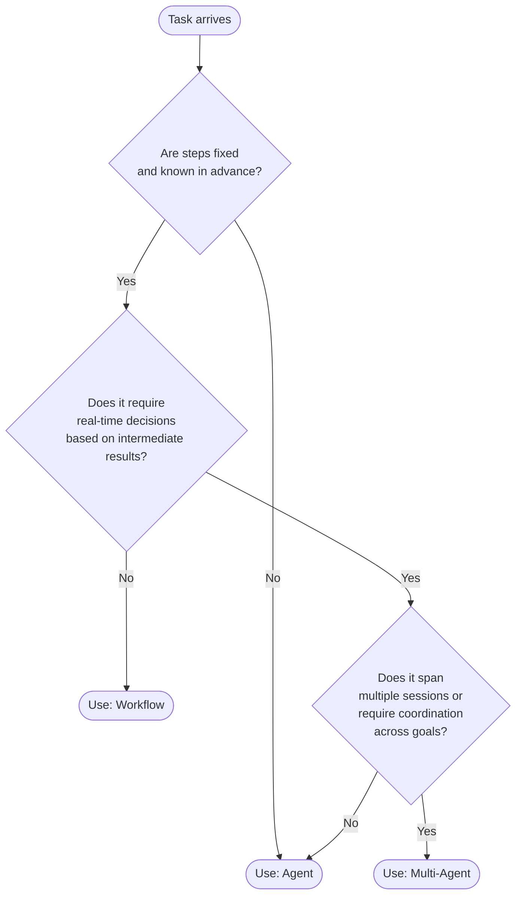

# Workflows مقابل Agents: متى لا تستخدم الـ agent

> الـ agent الذي يستدعي الـ LLM سبعًا وأربعين مرة لتلخيص مستند ليس ذكيًا. إنه مكلِف.

**النوع:** تعلّم
**اللغات:** Python
**المتطلبات:** الدرس 01 (حلقة الـ agent)، أساسيات Python، Anthropic SDK
**الوقت:** ~45 دقيقة
**أهداف التعلّم:**
- تحديد المهام التي يكون فيها سير العمل الثابت (workflow) أرخص وأسرع وأكثر موثوقية من الـ agent
- بناء مهمة التلخيص نفسها على هيئة workflow وعلى هيئة agent، ومقارنة النتائج
- تطبيق دالة قرار تصنّف المهام كـ workflow أو agent أو multi-agent بناءً على خصائصها البنيوية
- شرح لماذا يكون "استخدم agent" قرارًا معماريًا له عواقب على التكلفة والموثوقية، وليس خيارًا افتراضيًا

---

## المشكلة

يُطلق فريق ميزة "تلخيص مستندات مدعوم بالذكاء الاصطناعي". مدير المنتج متحمّس. يستخدم التنفيذ حلقة agent مع أدوات: `read_document` و`extract_section` و`summarize_section` و`combine_summaries`. يقرّر الـ agent أي الأقسام يقرأ، وبأي ترتيب، ومتى يكون قد جمع ما يكفي.

تصل الفاتورة الأولى. 2.40 دولار لتلخيص المستند الواحد. المستند نفسه يُلخَّص 10,000 مرة شهريًا: 24,000 دولار في تكاليف الـ API. النظام السابق القائم على الكلمات المفتاحية كان يكلّف 0.003 دولار للمستند.

ينظر مهندس أقدم إلى الأثر (trace). استدعى الـ agent الـ LLM سبعًا وأربعين مرة لكل مستند. أعاد قراءة أقسام قرأها سلفًا. طلب تلخيصًا لتلخيص كتبه للتو. استدعى `extract_section` على الفصل نفسه ثلاث مرات لأنه لم يكن متأكدًا أنه حصل على الفصل الصحيح.

التنفيذ الصحيح هو prompt واحد مُهيكل. مرّر المستند (أو الأجزاء ذات الصلة) واطلب تلخيصًا. استدعاء API واحد. 0.05 دولار للمستند. 98% من خفض التكلفة يأتي من إدراك أن هذه المهمة لا تتضمن تفريعًا ديناميكيًا (dynamic branching). الخطوات ثابتة. والبيانات معروفة منذ البداية. لا يضيف الـ agent أي قيمة هنا. إنه فقط يضيف حلقات.

هذا هو أغلى خطأ في الذكاء الاصطناعي التطبيقي: تطبيق أنماط الـ agent على مهام هي بنيويًا workflows.

---

## المفهوم

### التمييز الجوهري

الـ workflow هو برنامج يكون فيه تسلسل الخطوات ثابتًا ومعروفًا قبل أول استدعاء للـ LLM. يحدّد المطوّر الخطوات؛ وينفّذ الـ LLM واحدة منها أو أكثر.

الـ agent هو برنامج يقرّر فيه الـ LLM أي الخطوات يتّخذها وبأي ترتيب، بناءً على النتائج الوسيطة. الـ LLM يتحكم في المسار.

السؤال الذي ينبغي طرحه ليس "هل تتضمن هذه المهمة LLM؟"، بل بالأحرى "هل تتطلب هذه المهمة من الـ LLM اتخاذ قرارات بشأن مسار التحكم (control-flow) بناءً على بيانات لا يمكنه رؤيتها حتى يبدأ؟"



### جنبًا إلى جنب: Workflow مقابل Agent

```
Property            Workflow                        Agent
-----------         -------------------------       -------------------------
Steps               Fixed before execution          Decided at runtime
LLM calls           Predictable (N per task)        Variable (1 to N+)
Cost                Bounded, predictable            Unbounded without guards
Latency             Predictable                     Variable
Debuggability       High (steps are explicit)       Lower (decisions are implicit)
Flexibility         Low (can't handle novelty)      High (adapts to new inputs)
Failure mode        Step N fails cleanly            Loop, repeat, or wrong exit
When to use         Fixed pipeline, known steps     Open-ended, unpredictable paths
```

### الأسئلة البنيوية الثلاثة

قبل بناء أي شيء، أجب عن هذه الأسئلة الثلاثة:

**1. هل الخطوات ثابتة؟** إذا استطعت كتابة التسلسل الدقيق للعمليات قبل تشغيل المهمة (حمّل المستند، قسّمه إلى أجزاء، لخّص كل جزء، اجمعها)، فاستخدم workflow. الـ LLM ينفّذ الخطوات. وPython تتحكم في المسار.

**2. هل تتطلب المهمة تفريعًا في الوقت الفعلي (real-time branching)؟** إذا كانت الخطوة التالية تعتمد على ما يجده النموذج في الخطوة الحالية (مثل "إن كان العميل غاضبًا، فصعّد؛ وإن كان سؤالًا بسيطًا، فحلّه مباشرة")، فأنت تحتاج إلى agent. يجب أن يقرأ النموذج الموقف الحالي ليقرّر الإجراء التالي.

**3. هل تمتد الحالة (state) عبر الجلسات أو تتطلب تنسيقًا؟** إذا كانت المهمة تتطلب ذاكرة عبر محادثات متعددة، أو agents متخصصة متعددة تعمل معًا، ففكّر في multi-agent. أما لمهمة بجلسة واحدة وتفريع ديناميكي، فحلقة agent واحدة تكفي.

---

## البناء

### تنفيذان للمهمة نفسها

المهمة: بمعطى مراجعة منتج، استخرج المشاعر (sentiment)، والمحاور الرئيسية، وملخصًا من جملة واحدة.

**التنفيذ أ: Workflow ثابت (الصحيح لهذه المهمة)**

```python
import anthropic

client = anthropic.Anthropic()

def summarize_review_workflow(review: str) -> dict:
    """
    Fixed workflow: one structured prompt, one API call.
    Steps are defined in Python. The LLM executes them once.
    """
    prompt = f"""Analyze this product review and return a JSON object with exactly these fields:
- sentiment: "positive" | "negative" | "neutral" | "mixed"
- themes: list of 2-4 key themes mentioned
- summary: one sentence capturing the main point

Review:
{review}

Return only valid JSON, no explanation."""

    response = client.messages.create(
        model="claude-3-5-haiku-20241022",
        max_tokens=256,
        messages=[{"role": "user", "content": prompt}]
    )

    import json
    return json.loads(response.content[0].text)
```

استدعاء API واحد. تكلفة متوقعة. بنية المخرَج محددة بواسطة الـ prompt. وPython تتحكم بما يحدث للنتيجة.

**التنفيذ ب: Agent (خاطئ لهذه المهمة)**

```python
import json

ANALYSIS_TOOLS = [
    {
        "name": "extract_sentiment",
        "description": "Determine the overall sentiment of a review.",
        "input_schema": {
            "type": "object",
            "properties": {"text": {"type": "string"}},
            "required": ["text"]
        }
    },
    {
        "name": "extract_themes",
        "description": "Extract key themes from a review.",
        "input_schema": {
            "type": "object",
            "properties": {"text": {"type": "string"}},
            "required": ["text"]
        }
    },
    {
        "name": "write_summary",
        "description": "Write a one-sentence summary of a review.",
        "input_schema": {
            "type": "object",
            "properties": {"text": {"type": "string"}},
            "required": ["text"]
        }
    }
]

def extract_sentiment(text: str) -> str:
    resp = client.messages.create(
        model="claude-3-5-haiku-20241022",
        max_tokens=32,
        messages=[{"role": "user", "content": f"Sentiment of this review (one word): {text}"}]
    )
    return resp.content[0].text

def extract_themes(text: str) -> str:
    resp = client.messages.create(
        model="claude-3-5-haiku-20241022",
        max_tokens=128,
        messages=[{"role": "user", "content": f"List 2-4 key themes, comma-separated: {text}"}]
    )
    return resp.content[0].text

def write_summary(text: str) -> str:
    resp = client.messages.create(
        model="claude-3-5-haiku-20241022",
        max_tokens=64,
        messages=[{"role": "user", "content": f"One-sentence summary: {text}"}]
    )
    return resp.content[0].text

TOOL_REGISTRY = {
    "extract_sentiment": lambda args: extract_sentiment(args["text"]),
    "extract_themes": lambda args: extract_themes(args["text"]),
    "write_summary": lambda args: write_summary(args["text"]),
}

def summarize_review_agent(review: str) -> str:
    """
    Agent approach: the LLM decides which tools to call and in what order.
    Wrong for this task. The steps are fixed. This adds loops and cost.
    """
    messages = [{"role": "user", "content": f"Analyze this review: {review}"}]

    for _ in range(10):
        response = client.messages.create(
            model="claude-3-5-haiku-20241022",
            max_tokens=512,
            tools=ANALYSIS_TOOLS,
            messages=messages
        )
        if response.stop_reason == "end_turn":
            return response.content[0].text if response.content else ""
        if response.stop_reason == "tool_use":
            tool_blocks = [b for b in response.content if b.type == "tool_use"]
            messages.append({"role": "assistant", "content": response.content})
            results = []
            for b in tool_blocks:
                output = TOOL_REGISTRY[b.name](b.input)
                results.append({"type": "tool_result", "tool_use_id": b.id, "content": output})
            messages.append({"role": "user", "content": results})
    return "max iterations"
```

تُجري نسخة الـ agent من 3 إلى 5 استدعاءات إضافية للـ LLM (واحد لكل أداة)، لكل منها زمن انتظار خاص به، وقد يستدعي النموذج الأداة نفسها مرات متعددة. النتيجة هي ذاتها التي تنتجها نسخة الـ workflow. لا شيء يُكتسَب من التفريع الديناميكي لأنه لا شيء ديناميكي في هذه المهمة.

**الفرق المقيس على 10 مراجعات اختبار:**

```
Metric              Workflow        Agent
-----------         ----------      ----------
API calls           1               4-7 avg
Cost per review     ~$0.002         ~$0.008-0.014
Latency             ~800ms          ~3-5 seconds
Output quality      Identical       Identical
Debuggability       High            Low
```

> **اختبار من الواقع:** أطلق فريقك سلفًا نسخة الـ agent وهي الآن في الإنتاج. يطلب منك مدير المنتج خفض تكاليف الـ API بنسبة 80% من دون تغيير الميزة. ما الحجة التقنية التي تطرحها لتبرير إعادة كتابتها كـ workflow، وما البيانات التي ستحضرها إلى ذلك الاجتماع؟

أحضر بيانات الأثر: متوسط عدد الدورات لكل طلب، وإجمالي الرموز المدخلة والمخرجة (input + output tokens) لكل طلب، والتكلفة لكل طلب. أظهر أن المهمة لها خطوات ثابتة (النموذج يستدعي دائمًا الأدوات الثلاث نفسها بالترتيب نفسه وبالمدخلات نفسها). هذا هو تعريف الـ workflow. إعادة الكتابة ليست تبسيطًا. إنها المعمارية الصحيحة لبنية المهمة. كان نمط الـ agent خيارًا خاطئًا منذ البداية، وفرق التكلفة هو الدليل.

---

## الاستخدام

### دالة قرار بوصفها سياسة قابلة للتنفيذ

بدلًا من الجدال حول "هل ينبغي أن نستخدم agent؟" في كل مراجعة تصميم، رمّز القرار في دالة. شغّلها قبل أن تبدأ البناء.

```python
from dataclasses import dataclass

@dataclass
class TaskProfile:
    """Profile a task before choosing an architecture."""
    fixed_steps: bool          # Can you write out every step before it runs?
    predictable_branches: bool # Are all branch conditions known before execution?
    needs_realtime_decisions: bool  # Must the LLM read intermediate results to decide what to do next?
    state_spans_sessions: bool      # Does the task persist across multiple conversations?
    multiple_specialized_goals: bool  # Does it require coordination across distinct sub-agents?


def should_use_agent(profile: TaskProfile) -> str:
    """
    Returns 'workflow' | 'agent' | 'multi-agent' based on task structure.
    This is a decision function, not a prediction. Run it in design review.
    """
    if profile.state_spans_sessions or profile.multiple_specialized_goals:
        return "multi-agent"

    if profile.fixed_steps and profile.predictable_branches:
        return "workflow"

    if profile.needs_realtime_decisions:
        return "agent"

    # Default: if the steps are fixed, workflow is safer
    return "workflow"


# Examples
document_summarization = TaskProfile(
    fixed_steps=True,
    predictable_branches=True,
    needs_realtime_decisions=False,
    state_spans_sessions=False,
    multiple_specialized_goals=False
)

customer_support_triage = TaskProfile(
    fixed_steps=False,
    predictable_branches=False,
    needs_realtime_decisions=True,
    state_spans_sessions=False,
    multiple_specialized_goals=False
)

research_assistant = TaskProfile(
    fixed_steps=False,
    predictable_branches=False,
    needs_realtime_decisions=True,
    state_spans_sessions=True,
    multiple_specialized_goals=True
)

print(should_use_agent(document_summarization))  # workflow
print(should_use_agent(customer_support_triage))  # agent
print(should_use_agent(research_assistant))        # multi-agent
```

هذه الدالة لا تحل محل الحكم. إنها تجعل الحكم صريحًا وقابلًا للتدقيق. حين يُرمَّز القرار في صورة كود، يصبح قابلًا للمراجعة والتحديث والتطبيق باتساق عبر الفريق.

> **نقلة في المنظور:** يقول مهندس جديد في فريقك: "لكن agents أكثر مرونة، فعلينا أن نستخدمها دائمًا تحسبًا لأن تصبح المهمة أكثر تعقيدًا لاحقًا." ما التكلفة الخفية في هذا المنطق؟

التكلفة ليست المال فقط. الـ agents أصعب في التنقيح (debug)، وأصعب في الاختبار، وأصعب في التفكير فيها من الـ workflows. كل استدعاء agent هو تفريعة غير حتمية (non-deterministic). لا تستطيع مجموعة اختباراتك تغطية كل المسارات. ويصبح تقدير تكلفتك نطاقًا، لا رقمًا. إذا بنيت agent لكل مهمة "تحسبًا"، فستنتهي بنظام لا شيء فيه متوقع، وكل شيء مكلِف، وكل حادثة إنتاج تتطلب تتبّع 40 استدعاء LLM للعثور على السيئ منها. ابدأ بأبسط ما يعمل. ارتقِ إلى agent حين تتطلب بنية المهمة ذلك فعلًا.

---

## التسليم

المُخرَج (artifact) الذي يُنتجه هذا الدرس هو decision prompt يساعد المهندسين على تصنيف المهام قبل البناء. راجع `outputs/prompt-workflow-vs-agent-decision.md`.

صُمِّم الـ prompt ليُشغَّل تفاعليًا: الصق وصف مهمة فتحصل على توصية مُهيكلة مع تعليل. استخدمه في مراجعات التصميم، أو تخطيط السبرنت (sprint planning)، أو كلما اقترح أحدهم إضافة "agent" إلى النظام.

---

## التقييم

كيف تعرف أن قرارك المعماري كان صحيحًا؟

**التحقق من التكلفة.** بعد الإطلاق، قِس تكلفة الـ API الفعلية لكل تنفيذ مهمة. إذا كانت التكلفة أعلى من تقدير الـ workflow بأكثر من 20%، فقد تكون المهمة قد صُنِّفت خطأً (agent يؤدي عمل workflow) أو أن الـ workflow لديك يتضمن استدعاءات LLM غير ضرورية.

**توزيع عدد الدورات.** بالنسبة لتنفيذات الـ agent، سجّل عدد الدورات لكل مهمة. إذا كان التوزيع ذروة (spike) عند N دورات بالضبط في كل مرة (مثل 3 دورات دائمًا)، فهذا workflow متنكّر في هيئة agent. أعد البناء.

**تدقيق أنماط الفشل.** شغّل 50 مدخلًا متنوعًا عبر النظام. للـ workflows: عُدّ حالات فشل الخطوة-N على حدة. للـ agents: عُدّ الحالات التي علق فيها الـ agent في حلقة (عدد دورات > ضعف المتوقع)، أو علق (بلغ max_iterations)، أو أعاد إجابة خاطئة بعد استدعاء الأدوات الصحيحة. إذا فشلت الـ agents بمعدلات أعلى من الـ workflows على المهمة نفسها، فالمهمة بنيويًا workflow.

**تغطية الانحدار (Regression coverage).** الـ workflows قابلة للاختبار بالكامل بتأكيدات حتمية. أما الـ agents فتتطلب تقييمات احتمالية (probabilistic evals). إذا كانت مجموعة اختباراتك تغطي 90% من الحالات لنسخة الـ workflow و40% فقط لنسخة الـ agent، فتلك الفجوة مخاطرة موثوقية، وليست مقايضة مقبولة.

**اختبار إعادة الكتابة.** هل يمكنك إعادة كتابة هذا الـ agent كـ workflow بجودة المخرَج نفسها؟ إن كان الجواب نعم والمهمة في الإنتاج، فجدول إعادة الكتابة. المعمارية الأبسط هي دائمًا الأفضل حين تنتج النتيجة نفسها.
