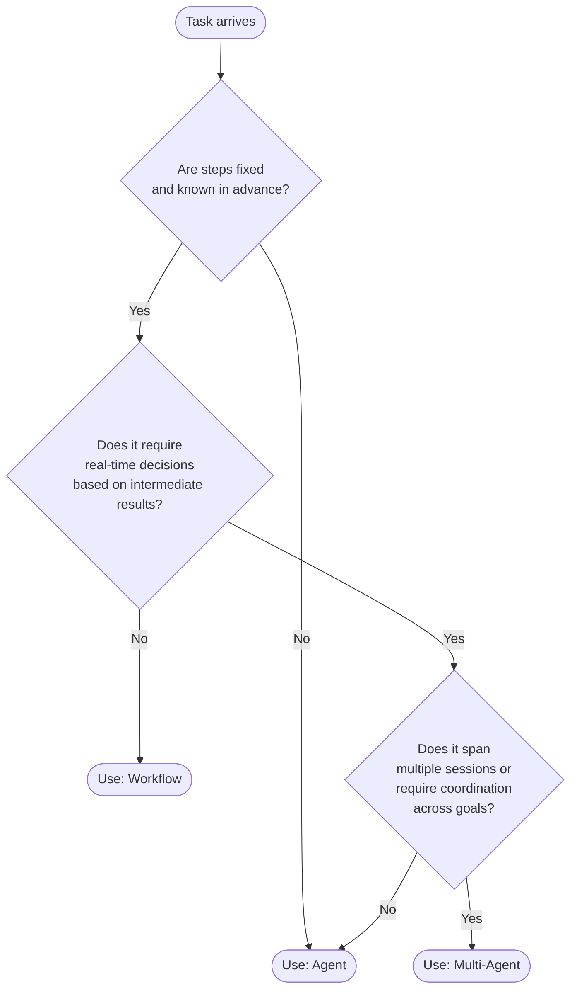

# Workflows vs Agents: When NOT to Use an Agent

> An agent that calls the LLM 47 times to summarize a document is not intelligent. It is expensive.

**Type:** Learn
**Languages:** Python
**Prerequisites:** Lesson 01 (The Agent Loop), basic Python, Anthropic SDK
**Time:** ~45 min
**Learning Objectives:**
- Identify tasks where a fixed workflow is cheaper, faster, and more reliable than an agent
- Implement the same summarization task as both a workflow and an agent, and compare the results
- Apply a decision function that classifies tasks as workflow, agent, or multi-agent based on structural properties
- Explain why "use an agent" is an architectural decision with cost and reliability consequences, not a default

---

## THE PROBLEM

A team ships an "AI-powered document summarization" feature. The product manager is excited. The implementation uses an agent loop with tools: `read_document`, `extract_section`, `summarize_section`, `combine_summaries`. The agent decides which sections to read, in which order, and when it has enough.

The first bill arrives. $2.40 per document summarization. The same document summarized 10,000 times per month: $24,000 in API costs. The previous keyword-based system cost $0.003 per document.

A senior engineer looks at the trace. The agent called the LLM 47 times per document. It re-read sections it had already read. It asked for a summary of a summary it had just written. It called `extract_section` on the same chapter three times because it was not sure it had the right one.

The correct implementation is one structured prompt. Pass the document (or the relevant chunks) and ask for a summary. One API call. $0.05 per document. 98% of the cost reduction comes from recognizing that this task does not have dynamic branching. The steps are fixed. The data is known at the start. An agent adds no value here. It just adds loops.

This is the most expensive mistake in applied AI: applying agent patterns to tasks that are structurally workflows.

---

## THE CONCEPT

### The Core Distinction

A workflow is a program where the sequence of steps is fixed and known before the first LLM call. A developer defines the steps; the LLM executes one or more of them.

An agent is a program where the LLM decides which steps to take and in what order, based on intermediate results. The LLM controls the flow.

The question to ask is not "does this task involve an LLM?" but rather "does this task require the LLM to make control-flow decisions based on data it cannot see until it starts?"



### Side-by-Side: Workflow vs Agent

```
Property            Workflow                        Agent
-----------         -------------------------       -------------------------
Steps               Fixed before execution          Decided at runtime
LLM calls           Predictable (N per task)        Variable (1 to N+)
Cost                Bounded, predictable            Unbounded without guards
Latency             Predictable                     Variable
Debuggability       High (steps are explicit)       Lower (decisions are implicit)
Flexibility         Low (can't handle novelty)      High (adapts to new inputs)
Failure mode        Step N fails cleanly            Loop, repeat, or wrong exit
When to use         Fixed pipeline, known steps     Open-ended, unpredictable paths
```

### The Three Structural Questions

Before building anything, answer these three questions:

**1. Are the steps fixed?** If you can write out the exact sequence of operations before the task runs (load document, chunk it, summarize each chunk, combine), use a workflow. The LLM executes the steps. Python controls the flow.

**2. Does the task require real-time branching?** If the next step depends on what the model finds in the current step (e.g., "if the customer is angry, escalate; if it is a simple question, resolve directly"), you need an agent. The model must read the current situation to decide the next action.

**3. Does state span sessions or require coordination?** If the task requires memory across multiple conversations, or multiple specialized agents working together, consider multi-agent. For a single-session task with dynamic branching, a single agent loop is enough.

---

## BUILD IT

### Two Implementations of the Same Task

The task: given a product review, extract the sentiment, key themes, and a one-sentence summary.

**Implementation A: Fixed Workflow (correct for this task)**

```python
import anthropic

client = anthropic.Anthropic()

def summarize_review_workflow(review: str) -> dict:
    """
    Fixed workflow: one structured prompt, one API call.
    Steps are defined in Python. The LLM executes them once.
    """
    prompt = f"""Analyze this product review and return a JSON object with exactly these fields:
- sentiment: "positive" | "negative" | "neutral" | "mixed"
- themes: list of 2-4 key themes mentioned
- summary: one sentence capturing the main point

Review:
{review}

Return only valid JSON, no explanation."""

    response = client.messages.create(
        model="claude-3-5-haiku-20241022",
        max_tokens=256,
        messages=[{"role": "user", "content": prompt}]
    )

    import json
    return json.loads(response.content[0].text)
```

One API call. Predictable cost. The structure of the output is defined by the prompt. Python controls what happens with the result.

**Implementation B: Agent (wrong for this task)**

```python
import json

ANALYSIS_TOOLS = [
    {
        "name": "extract_sentiment",
        "description": "Determine the overall sentiment of a review.",
        "input_schema": {
            "type": "object",
            "properties": {"text": {"type": "string"}},
            "required": ["text"]
        }
    },
    {
        "name": "extract_themes",
        "description": "Extract key themes from a review.",
        "input_schema": {
            "type": "object",
            "properties": {"text": {"type": "string"}},
            "required": ["text"]
        }
    },
    {
        "name": "write_summary",
        "description": "Write a one-sentence summary of a review.",
        "input_schema": {
            "type": "object",
            "properties": {"text": {"type": "string"}},
            "required": ["text"]
        }
    }
]

def extract_sentiment(text: str) -> str:
    resp = client.messages.create(
        model="claude-3-5-haiku-20241022",
        max_tokens=32,
        messages=[{"role": "user", "content": f"Sentiment of this review (one word): {text}"}]
    )
    return resp.content[0].text

def extract_themes(text: str) -> str:
    resp = client.messages.create(
        model="claude-3-5-haiku-20241022",
        max_tokens=128,
        messages=[{"role": "user", "content": f"List 2-4 key themes, comma-separated: {text}"}]
    )
    return resp.content[0].text

def write_summary(text: str) -> str:
    resp = client.messages.create(
        model="claude-3-5-haiku-20241022",
        max_tokens=64,
        messages=[{"role": "user", "content": f"One-sentence summary: {text}"}]
    )
    return resp.content[0].text

TOOL_REGISTRY = {
    "extract_sentiment": lambda args: extract_sentiment(args["text"]),
    "extract_themes": lambda args: extract_themes(args["text"]),
    "write_summary": lambda args: write_summary(args["text"]),
}

def summarize_review_agent(review: str) -> str:
    """
    Agent approach: the LLM decides which tools to call and in what order.
    Wrong for this task. The steps are fixed. This adds loops and cost.
    """
    messages = [{"role": "user", "content": f"Analyze this review: {review}"}]

    for _ in range(10):
        response = client.messages.create(
            model="claude-3-5-haiku-20241022",
            max_tokens=512,
            tools=ANALYSIS_TOOLS,
            messages=messages
        )
        if response.stop_reason == "end_turn":
            return response.content[0].text if response.content else ""
        if response.stop_reason == "tool_use":
            tool_blocks = [b for b in response.content if b.type == "tool_use"]
            messages.append({"role": "assistant", "content": response.content})
            results = []
            for b in tool_blocks:
                output = TOOL_REGISTRY[b.name](b.input)
                results.append({"type": "tool_result", "tool_use_id": b.id, "content": output})
            messages.append({"role": "user", "content": results})
    return "max iterations"
```

The agent version makes 3-5 additional LLM calls (one per tool), each with its own latency, and the model may call the same tool multiple times. The result is the same as the workflow version. Nothing is gained from the dynamic branching because there is nothing dynamic about this task.

**Measured difference on 10 test reviews:**

```
Metric              Workflow        Agent
-----------         ----------      ----------
API calls           1               4-7 avg
Cost per review     ~$0.002         ~$0.008-0.014
Latency             ~800ms          ~3-5 seconds
Output quality      Identical       Identical
Debuggability       High            Low
```

> **Real-world check:** Your team has already shipped the agent version and it is in production. The PM asks you to cut API costs by 80% without changing the feature. What is the technical argument you make to justify rewriting it as a workflow, and what data would you bring to that meeting?

Bring the trace data: average turn count per request, total input + output tokens per request, and cost per request. Show that the task has fixed steps (the model always calls the same three tools in the same order with the same inputs). That is the definition of a workflow. The rewrite is not a simplification. It is the correct architecture for the task's structure. The agent pattern was the wrong choice from the start, and the cost difference is the evidence.

---

## USE IT

### A Decision Function as Executable Policy

Instead of debating "should we use an agent?" in every design review, encode the decision as a function. Run it before you start building.

```python
from dataclasses import dataclass

@dataclass
class TaskProfile:
    """Profile a task before choosing an architecture."""
    fixed_steps: bool          # Can you write out every step before it runs?
    predictable_branches: bool # Are all branch conditions known before execution?
    needs_realtime_decisions: bool  # Must the LLM read intermediate results to decide what to do next?
    state_spans_sessions: bool      # Does the task persist across multiple conversations?
    multiple_specialized_goals: bool  # Does it require coordination across distinct sub-agents?


def should_use_agent(profile: TaskProfile) -> str:
    """
    Returns 'workflow' | 'agent' | 'multi-agent' based on task structure.
    This is a decision function, not a prediction. Run it in design review.
    """
    if profile.state_spans_sessions or profile.multiple_specialized_goals:
        return "multi-agent"

    if profile.fixed_steps and profile.predictable_branches:
        return "workflow"

    if profile.needs_realtime_decisions:
        return "agent"

    # Default: if the steps are fixed, workflow is safer
    return "workflow"


# Examples
document_summarization = TaskProfile(
    fixed_steps=True,
    predictable_branches=True,
    needs_realtime_decisions=False,
    state_spans_sessions=False,
    multiple_specialized_goals=False
)

customer_support_triage = TaskProfile(
    fixed_steps=False,
    predictable_branches=False,
    needs_realtime_decisions=True,
    state_spans_sessions=False,
    multiple_specialized_goals=False
)

research_assistant = TaskProfile(
    fixed_steps=False,
    predictable_branches=False,
    needs_realtime_decisions=True,
    state_spans_sessions=True,
    multiple_specialized_goals=True
)

print(should_use_agent(document_summarization))  # workflow
print(should_use_agent(customer_support_triage))  # agent
print(should_use_agent(research_assistant))        # multi-agent
```

This function does not replace judgment. It makes the judgment explicit and auditable. When the decision is encoded as code, it can be reviewed, updated, and applied consistently across the team.

> **Perspective shift:** A new engineer on your team says "but agents are more flexible, so we should always use them just in case the task gets more complex later." What is the hidden cost in that reasoning?

The cost is not just money. Agents are harder to debug, harder to test, and harder to reason about than workflows. Every agent call is a non-deterministic branch. Your test suite cannot cover all paths. Your cost estimate becomes a range, not a number. If you build an agent for every task "just in case," you end up with a system where nothing is predictable, everything is expensive, and every production incident requires tracing 40 LLM calls to find the bad one. Start with the simplest thing that works. Promote to agent when the task structure actually requires it.

---

## SHIP IT

The artifact this lesson produces is a decision prompt that helps engineers classify tasks before building. See `outputs/prompt-workflow-vs-agent-decision.md`.

The prompt is designed to be run interactively: paste in a task description and get back a structured recommendation with reasoning. Use it in design reviews, sprint planning, or whenever someone proposes adding an "agent" to the system.

---

## EVALUATE IT

How do you know your architectural decision was correct?

**Cost validation.** After shipping, measure actual API cost per task execution. If cost is higher than your workflow estimate by more than 20%, the task may have been misclassified (agent doing workflow work) or your workflow has unnecessary LLM calls.

**Turn count distribution.** For agent implementations, log the number of turns per task. If the distribution is a spike at exactly N turns every time (e.g., always 3 turns), that is a workflow masquerading as an agent. Refactor.

**Failure mode audit.** Run 50 diverse inputs through the system. For workflows: count step-N failures separately. For agents: count cases where the agent looped (turn count > 2x expected), got stuck (hit max_iterations), or returned a wrong answer after calling the right tools. If agents fail at higher rates than workflows on the same task, the task is structurally a workflow.

**Regression coverage.** Workflows are fully testable with deterministic assertions. Agents require probabilistic evals. If your test suite covers 90% of cases for the workflow version and only 40% for the agent version, that gap is a reliability risk, not an acceptable trade-off.

**The rewrite test.** Could you rewrite this agent as a workflow with the same output quality? If yes, and the task is in production, schedule the rewrite. The simpler architecture is always preferable when it produces the same result.
