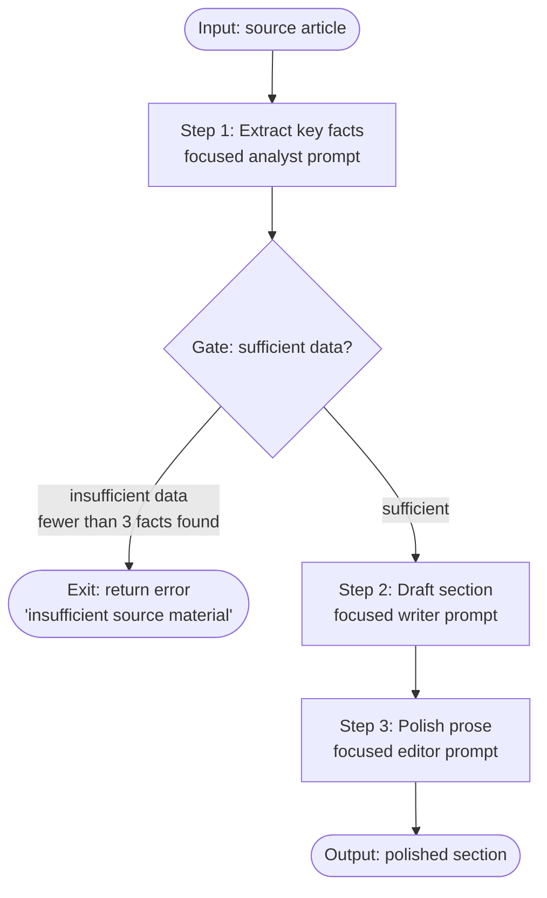

# النمط: Prompt Chaining (تسلسل الـ prompts)

> كل خطوة في السلسلة تُتقن أمرًا واحدًا. والـ prompt الذي يفعل خمسة أشياء لا يُتقن أيًا منها.

**النوع:** بناء
**اللغات:** Python
**المتطلبات:** الدرس 01 (حلقة الـ agent)، الدرس 02 (Workflows مقابل Agents)، Anthropic SDK
**الوقت:** ~45 دقيقة
**أهداف التعلّم:**
- بناء سلسلة prompts من 3 خطوات تكون فيها كل خطوة استدعاءً منفصلًا لـ `client.messages.create()`
- إضافة بوابة (gate) بين الخطوات توقف السلسلة حين تكون جودة المدخل غير كافية
- بناء صنف `Chain` قابل لإعادة الاستخدام مع منطق إعادة محاولة (retry) لكل خطوة
- شرح لماذا يُنتج تقسيم مهمة متعددة الأدوار عبر prompts منفصلة مخرجًا أفضل من prompt واحد معقّد
- وصف نقاط الفشل الثلاث في السلسلة (فشل الخطوة، رفض البوابة، التلوّث اللاحق) وكيفية اكتشاف كل منها

---

## المشكلة

يبني فريق محتوى خط أنابيب (pipeline) يأخذ مقالًا مصدريًا ويُنتج قسم ملخص مصقول لقاعدة معرفتهم. يكتبون prompt واحدًا: "اقرأ هذا المقال، استخرج الحقائق الرئيسية، صُغ قسم ملخص، واصقل الأسلوب ليطابق نمط مؤسستنا."

المخرَج متوسط في كل خطوة. الاستخراج مبهم ("يناقش المقال مواضيع متنوعة"). المسوّدة عامة. الصقل ضئيل. الـ prompt الواحد يتنقّل بين أربعة أدوار: محلّل، وأمين أرشيف، وكاتب، ومحرّر. كل دور يتطلب انتباهًا مختلفًا. ينشر النموذج طاقته على جميعها في آن واحد.

الحل هو تقسيم العمل. شغّل الاستخراج كـ prompt مستقل. شغّل المسوّدة كـ prompt مستقل بالحقائق المستخرَجة وحدها كمدخل. شغّل الصقل كـ prompt مستقل بالمسوّدة وحدها. كل خطوة تركّز بالكامل على مهمة واحدة. تتحسن الجودة في كل خطوة لأن النموذج لا يوازن بين أهداف متنافسة.

تظهر المشكلة الثانية فور التقسيم: تتلقى خطوة المسوّدة استخراجًا غير كافٍ من الخطوة الأولى (المقال المصدري كان يكاد يخلو من محتوى صالح) فتُنتج قسمًا مهلوسًا (hallucinated). الحل هو بوابة (gate): فحص جودة بين الاستخراج والمسوّدة يوقف السلسلة ويعيد خطأً واضحًا حين تكون البيانات المستخرَجة غير جيدة بما يكفي للبناء عليها. البوابة ليست ميزة إضافية. إنها الحد الأدنى من ضبط الجودة الذي تحتاجه أي سلسلة إنتاجية.

---

## المفهوم

### لماذا تُنتج الـ prompts المنفصلة مخرجًا أفضل

حين يطلب prompt واحد من النموذج أداء أدوار متمايزة متعددة، فإنه يساوم بينها. شخصية الاستخراج تريد الدقة والضغط. وشخصية الكتابة تريد الطلاقة والإسهاب. وهذان في توتر. يحل النموذج التوتر بالموازنة (averaging)، والموازنة أسوأ من أداء أي من الدورين على حدة.

تزيل الـ prompts المنفصلة التوتر. يحصل كل استدعاء على system prompt نظيف، ومهمة مركّزة، والمدخل ذي الصلة بتلك المهمة وحده. لا يحتاج النموذج إلى تذكّر أنه محرّر أيضًا بينما هو محلّل.

هذا هو المبدأ نفسه الذي هو فصل الاهتمامات (separation of concerns) في البرمجيات. كل دالة تفعل أمرًا واحدًا. وكل prompt يفعل أمرًا واحدًا.

### السلسلة مع بوابة



البوابة ليست استدعاء LLM. إنها فحص بلغة Python على مخرَج الخطوة 1: عُدّ الحقائق المستخرَجة، تحقّق من طولها، تأكّد من بنيتها. إذا فشل الفحص، تخرج السلسلة مبكرًا بخطأ وصفي قبل أن تعالج أي خطوة لاحقة بيانات سيئة. هذا يهم لأن استخراجًا سيئًا يُغذّي مسوّدة سيئة تُغذّي صقلًا سيئًا. الرديء ينتشر. والبوابة توقفه عند المصدر.

### تلوّث المخرَج

```
WITHOUT A GATE:

  Step 1 output: "Article discusses some topics. Main theme is technology."
  Step 2 input:  [vague extraction above]
  Step 2 output: "Technology is changing rapidly in many ways..." [hallucination]
  Step 3 input:  [hallucinated draft above]
  Step 3 output: "Technology is reshaping our world in profound..." [polished hallucination]

  Result: confident, well-written, wrong.

WITH A GATE:

  Step 1 output: "Article discusses some topics. Main theme is technology."
  Gate check:    found 0 specific facts. Required: 3. HALT.
  Chain output:  ChainError("Insufficient extraction: 0 facts found, need at least 3")

  Result: clear error, no downstream contamination.
```

---

## البناء

### سلسلة من 3 خطوات مع بوابة

التنفيذ من أربعة أجزاء: دوال الخطوات الثلاث، والبوابة، ومنطق التنسيق (orchestration). راجع `code/main.py` للحصول على الملف الكامل القابل للتشغيل.

**الخطوة 1: استخراج الحقائق الرئيسية.**

```python
import anthropic
import json
from dataclasses import dataclass

client = anthropic.Anthropic()

def step_extract_facts(article: str) -> list[str]:
    """
    Step 1: Extract specific, verifiable facts from the article.
    Returns a list of fact strings. Returns empty list on failure.
    """
    prompt = f"""Extract the key facts from this article. Return a JSON array of strings.
Each string is one specific, verifiable fact (not a vague theme or topic).
Include only facts explicitly stated in the article. Do not infer or expand.
Return between 3 and 8 facts. Return only the JSON array, no explanation.

Article:
{article}"""

    response = client.messages.create(
        model="claude-3-5-haiku-20241022",
        max_tokens=512,
        messages=[{"role": "user", "content": prompt}]
    )

    try:
        return json.loads(response.content[0].text)
    except (json.JSONDecodeError, IndexError):
        return []
```

**البوابة: تحقّق من جودة الاستخراج قبل المتابعة.**

```python
@dataclass
class ChainError:
    step: str
    reason: str
    def __str__(self):
        return f"Chain halted at '{self.step}': {self.reason}"

def gate_check_extraction(facts: list[str]) -> ChainError | None:
    """
    Gate between step 1 and step 2.
    Returns a ChainError if the extraction is insufficient, None if it passes.
    """
    if len(facts) < 3:
        return ChainError("gate_after_extract",
                         f"Insufficient extraction: {len(facts)} facts found, need at least 3. "
                         "Source article may lack substantive content.")

    # Check that facts are not empty or trivially short
    substantive = [f for f in facts if len(f.strip()) > 20]
    if len(substantive) < 3:
        return ChainError("gate_after_extract",
                         f"Extraction quality too low: {len(substantive)} substantive facts found. "
                         "Facts appear vague or empty.")

    return None  # Gate passes
```

**الخطوة 2: صياغة قسم من الحقائق.**

```python
def step_draft_section(facts: list[str], topic: str) -> str:
    """
    Step 2: Write a draft knowledge base section from the extracted facts.
    Input is ONLY the extracted facts, not the original article.
    """
    facts_text = "\n".join(f"- {f}" for f in facts)
    prompt = f"""Write a knowledge base section about '{topic}' using ONLY these facts:

{facts_text}

Requirements:
- 2-3 paragraphs
- Professional, neutral tone
- Do not add information not in the facts above
- Do not use bullet points in the output"""

    response = client.messages.create(
        model="claude-3-5-haiku-20241022",
        max_tokens=512,
        messages=[{"role": "user", "content": prompt}]
    )
    return response.content[0].text
```

**الخطوة 3: صقل الأسلوب.**

```python
def step_polish_prose(draft: str) -> str:
    """
    Step 3: Polish the draft to match house style.
    Input is ONLY the draft, not the facts or original article.
    """
    prompt = f"""Polish this text to match professional knowledge base style:
- Active voice where possible
- Remove filler phrases ("it is worth noting that", "in conclusion")
- Tighten sentences without changing meaning
- Keep all facts intact

Text to polish:
{draft}"""

    response = client.messages.create(
        model="claude-3-5-haiku-20241022",
        max_tokens=512,
        messages=[{"role": "user", "content": prompt}]
    )
    return response.content[0].text
```

**التنسيق: تشغيل السلسلة.**

```python
def run_chain(article: str, topic: str) -> str | ChainError:
    """
    Run the 3-step chain with a gate between steps 1 and 2.
    Returns the polished section on success, or a ChainError on failure.
    """
    print("[1/3] Extracting facts...")
    facts = step_extract_facts(article)
    print(f"  -> Found {len(facts)} facts")

    error = gate_check_extraction(facts)
    if error:
        print(f"  -> GATE FAILED: {error}")
        return error

    print("[2/3] Drafting section...")
    draft = step_draft_section(facts, topic)
    print(f"  -> Draft: {len(draft)} characters")

    print("[3/3] Polishing prose...")
    polished = step_polish_prose(draft)
    print(f"  -> Polished: {len(polished)} characters")

    return polished
```

> **اختبار من الواقع:** الخطوة 2 (المسوّدة) في سلسلتك تُنتج مخرجًا منخفض الجودة حتى حين تجتاز الخطوة 1 البوابة بـ 5 حقائق جيدة. كيف ستشخّص ما إذا كانت المشكلة في prompt الخطوة 2 أم في جودة الحقائق المُمرَّرة إليها؟

سجّل مدخلات ومخرجات كل خطوة على حدة. شغّل الخطوة 2 معزولة بقائمة من 5 حقائق عالية الجودة صغتها أنت بنفسك يدويًا. إذا كان المخرَج جيدًا، فالمشكلة في الحقائق الآتية من الخطوة 1، وعتبة البوابة تحتاج إلى أن تكون أكثر صرامة (أضف فحص جودة على نوعية الحقائق، لا على عددها فقط). أما إذا ظل المخرَج سيئًا بحقائقك اليدوية، فالمشكلة في prompt الخطوة 2 نفسه، وتُصلحها بتكرار التحسين على تعليمات ذلك الـ prompt معزولًا، من دون إعادة تشغيل السلسلة الكاملة.

---

## الاستخدام

### صنف Chain قابل لإعادة الاستخدام مع منطق إعادة المحاولة

تعمل الدوال الخام، لكن صنف `Chain` يجعل النمط قابلًا لإعادة الاستخدام عبر خطوط أنابيب مختلفة. يمكن تسجيل كل خطوة مع عدد اختياري لإعادة المحاولات. وتُسجَّل البوابة كخطوة لكنها تُعيد `None` عند النجاح أو `ChainError` عند الفشل.

```python
from typing import Callable, Any
import time

class Step:
    def __init__(self, name: str, fn: Callable, retries: int = 0, is_gate: bool = False):
        self.name = name
        self.fn = fn
        self.retries = retries
        self.is_gate = is_gate


class Chain:
    def __init__(self):
        self._steps: list[Step] = []

    def add_step(self, name: str, fn: Callable, retries: int = 0) -> "Chain":
        self._steps.append(Step(name, fn, retries=retries))
        return self

    def add_gate(self, name: str, fn: Callable) -> "Chain":
        self._steps.append(Step(name, fn, is_gate=True))
        return self

    def run(self, initial_input: Any) -> Any | ChainError:
        value = initial_input

        for step in self._steps:
            attempt = 0
            last_error = None

            while attempt <= step.retries:
                try:
                    result = step.fn(value)

                    if step.is_gate:
                        if result is not None:  # Gate returned an error
                            return result
                        # Gate passed: value is unchanged, continue
                        break

                    value = result
                    break  # Success: move to next step

                except Exception as e:
                    last_error = e
                    attempt += 1
                    if attempt <= step.retries:
                        wait = 2 ** attempt  # exponential backoff
                        print(f"  [retry {attempt}/{step.retries}] {step.name} failed: {e}. Retrying in {wait}s...")
                        time.sleep(wait)

            else:
                # All retries exhausted
                return ChainError(step.name, f"All {step.retries + 1} attempts failed. Last error: {last_error}")

        return value


# Usage - same pipeline as before, but composable and testable per step
def build_content_chain(article: str, topic: str) -> str | ChainError:
    chain = (
        Chain()
        .add_step("extract_facts", lambda x: step_extract_facts(x), retries=1)
        .add_gate("quality_gate", gate_check_extraction)
        .add_step("draft_section", lambda x: step_draft_section(x, topic), retries=1)
        .add_step("polish_prose", step_polish_prose, retries=0)
    )
    return chain.run(article)
```

لاحظ مشكلة عدم تطابق الأنواع (type mismatch): تتلقى البوابة الحقائق المستخرَجة، لكن الخطوتين 1 و2 لهما أنواع مدخلات/مخرجات مختلفة. تُمرّر السلسلة مخرَج كل خطوة كمدخل للتالية، لذا تتولى أغلفة `lambda` جسر الأنواع (type-bridging). في الإنتاج، استخدم مخرجات `dataclass` لكل خطوة لتكون الأنواع صريحة.

> **نقلة في المنظور:** يسأل زميل: "لماذا لا نضيف ببساطة مزيدًا من التعليمات إلى الـ prompt الواحد بدلًا من بناء سلسلة؟" ما الجواب الملموس، مقيسًا بجودة المخرَج؟

أجرِ التجربة: خذ سلسلتك ذات الخطوات الثلاث واطوِها في prompt واحد توصف فيه الأدوار الثلاثة كلها. قيّم كلا المخرَجين على 20 مدخلًا باستخدام المعيار (rubric) نفسه. عمليًا، يسجّل الـ prompt الواحد عادةً أقل بنسبة 10-20% في الخطوة الأخيرة (الصقل) لأن النموذج يخصّص انتباهًا لتذكّر تعليمات الاستخراج بينما ينبغي أن يكون مركّزًا على جودة الأسلوب. السلسلة تفرض العزل بحكم التصميم، لا بحكم قدرة النموذج.

---

## التسليم

المُخرَج (artifact) الذي يُنتجه هذا الدرس هو قالب prompt chaining قابل لإعادة الاستخدام مع نمط السلسلة المُبوّبة (gated chain). راجع `outputs/skill-prompt-chaining.md`.

يتضمن القالب توقيع دالة الخطوة، ونمط البوابة، وصنف `Chain`، ونمط جسر الأنواع للخطوات ذات أنواع المدخلات/المخرجات المختلفة. أدرجه في أي خط أنابيب محتوى متعدد الخطوات يكون فيه لكل خطوة دور متمايز.

---

## التقييم

تكون السلسلة صحيحة حين تُنتج كل خطوة مخرجًا جيدًا بمعطى مدخل جيد، وحين تلتقط البوابة بشكل موثوق فشل الجودة قبل أن ينتشر.

**اختبار عزل الخطوات.** اختبر كل دالة خطوة بشكل مستقل بمدخلات مصوغة يدويًا عند ثلاثة مستويات جودة: مدخل ممتاز، ومدخل حدّي (borderline)، ومدخل رديء. سجّل جودة المخرَج عند كل مستوى. هذا يخبرك بحساسية كل خطوة لجودة المدخل، وهو ما يخبرك بمدى الصرامة المطلوبة في عتبات بواباتك.

**معايرة البوابة.** شغّل السلسلة على 50 مقالًا متنوعًا. بعد الخطوة 1، صنّف كل استخراج يدويًا كـ "كافٍ" أو "غير كافٍ". قارن بقرار البوابة. الهدف: دقة (precision) للبوابة أعلى من 90% (إيجابيات كاذبة قليلة جدًا، وهي التي ترفض استخراجات جيدة بلا داعٍ) واسترجاع (recall) للبوابة أعلى من 95% (سلبيات كاذبة تكاد تنعدم، وهي التي تُمرّر استخراجات سيئة).

**تقييم الجودة من طرف إلى طرف.** بالنسبة للمخرجات التي تجتاز البوابة، قيّم الأقسام النهائية المصقولة على معيار من 1 إلى 5 (الدقة الواقعية، وجودة الأسلوب، والاكتمال). تتبّع متوسط النتيجة عبر الزمن. الانحدار يعني أن شيئًا تغيّر في أحد prompts الخطوات الثلاث أو في إصدار النموذج.

**فحص التلوّث اللاحق.** أطعِم السلسلة عمدًا مقالًا مزروعًا فيه حقيقة خاطئة واحدة. تحقّق من ظهور الحقيقة الخاطئة في الاستخراج وفي المخرَج النهائي. هذا هو السلوك المتوقع (السلسلة لا تضيف معلومات). ينبغي ألا تهلوس السلسلة حقائق خاطئة إضافية. إن فعلت، فإن تعليمة prompt الصياغة "استخدم الحقائق المقدّمة فقط" لا تُتّبع.

**فاعلية إعادة المحاولة.** شغّل السلسلة 20 مرة مع دالة خطوة تفشل 50% من الوقت (احقن استثناءً عشوائيًا). تحقّق من أن `retries=1` يُنتج معدل نجاح قريبًا من 75% (50% + 50% من الـ 50% المتبقية). إذا كان معدل النجاح أدنى باستمرار، فمنطق إعادة المحاولة لا يُنفَّذ بشكل صحيح.
