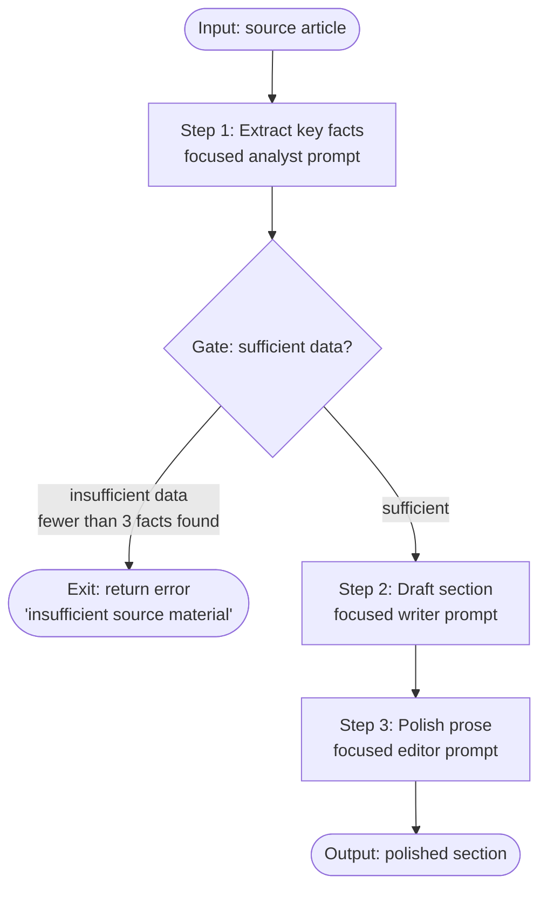

# Pattern: Prompt Chaining

> Each step in a chain does one thing well. A prompt that does five things does none of them well.

**Type:** Build
**Languages:** Python
**Prerequisites:** Lesson 01 (The Agent Loop), Lesson 02 (Workflows vs Agents), Anthropic SDK
**Time:** ~45 min
**Learning Objectives:**
- Implement a 3-step prompt chain where each step is a separate `client.messages.create()` call
- Add a gate between steps that halts the chain when input quality is insufficient
- Build a reusable `Chain` class with per-step retry logic
- Explain why splitting a multi-role task across separate prompts produces better output than a single complex prompt
- Describe the three failure points in a chain (step failure, gate rejection, downstream contamination) and how to detect each

---

## THE PROBLEM

A content team builds a pipeline that takes a source article and produces a polished summary section for their knowledge base. They write one prompt: "Read this article, extract the key facts, draft a summary section, and polish the prose to match our house style."

The output is mediocre at every step. The extraction is vague ("the article discusses various topics"). The draft is generic. The polish is minimal. The single prompt is context-switching between four roles: analyst, archivist, writer, and editor. Each role requires different attention. The model spreads its capacity across all of them simultaneously.

The fix is to split the work. Run the extraction as its own prompt. Run the draft as its own prompt with only the extracted facts as input. Run the polish as its own prompt with only the draft. Each step focuses entirely on one task. The quality at each step improves because the model is not juggling competing objectives.

The second problem appears immediately after the split: the draft step receives insufficient extraction from step one (the source article had almost no usable content) and produces a hallucinated section. The fix is a gate: a quality check between extraction and drafting that halts the chain and returns a clear error when the extracted data is not good enough to build on. A gate is not a feature. It is the minimum quality control a production chain needs.

---

## THE CONCEPT

### Why Separate Prompts Produce Better Output

When a single prompt asks a model to perform multiple distinct roles, it compromises between them. The extraction persona wants precision and compression. The writing persona wants fluency and elaboration. These are in tension. The model resolves the tension by averaging, and the average is worse than either role performed independently.

Separate prompts remove the tension. Each call gets a clean system prompt, a focused task, and only the input relevant to that task. The model does not need to remember it is also an editor while it is being an analyst.

This is the same principle as separation of concerns in software. Each function does one thing. Each prompt does one thing.

### The Chain with a Gate



The gate is not an LLM call. It is a Python check on the output of step 1: count the extracted facts, check their length, verify the structure. If the check fails, the chain exits early with a descriptive error before any downstream step processes bad data. This matters because a bad extraction feeds a bad draft feeds a bad polish. Garbage propagates. The gate stops it at the source.

### Output Contamination

```
WITHOUT A GATE:

  Step 1 output: "Article discusses some topics. Main theme is technology."
  Step 2 input:  [vague extraction above]
  Step 2 output: "Technology is changing rapidly in many ways..." [hallucination]
  Step 3 input:  [hallucinated draft above]
  Step 3 output: "Technology is reshaping our world in profound..." [polished hallucination]

  Result: confident, well-written, wrong.

WITH A GATE:

  Step 1 output: "Article discusses some topics. Main theme is technology."
  Gate check:    found 0 specific facts. Required: 3. HALT.
  Chain output:  ChainError("Insufficient extraction: 0 facts found, need at least 3")

  Result: clear error, no downstream contamination.
```

---

## BUILD IT

### A 3-Step Chain with a Gate

The implementation has four parts: the three step functions, the gate, and the orchestration logic. See `code/main.py` for the full runnable file.

**Step 1: Extract key facts.**

```python
import anthropic
import json
from dataclasses import dataclass

client = anthropic.Anthropic()

def step_extract_facts(article: str) -> list[str]:
    """
    Step 1: Extract specific, verifiable facts from the article.
    Returns a list of fact strings. Returns empty list on failure.
    """
    prompt = f"""Extract the key facts from this article. Return a JSON array of strings.
Each string is one specific, verifiable fact (not a vague theme or topic).
Include only facts explicitly stated in the article. Do not infer or expand.
Return between 3 and 8 facts. Return only the JSON array, no explanation.

Article:
{article}"""

    response = client.messages.create(
        model="claude-3-5-haiku-20241022",
        max_tokens=512,
        messages=[{"role": "user", "content": prompt}]
    )

    try:
        return json.loads(response.content[0].text)
    except (json.JSONDecodeError, IndexError):
        return []
```

**Gate: check extraction quality before continuing.**

```python
@dataclass
class ChainError:
    step: str
    reason: str
    def __str__(self):
        return f"Chain halted at '{self.step}': {self.reason}"

def gate_check_extraction(facts: list[str]) -> ChainError | None:
    """
    Gate between step 1 and step 2.
    Returns a ChainError if the extraction is insufficient, None if it passes.
    """
    if len(facts) < 3:
        return ChainError("gate_after_extract",
                         f"Insufficient extraction: {len(facts)} facts found, need at least 3. "
                         "Source article may lack substantive content.")

    # Check that facts are not empty or trivially short
    substantive = [f for f in facts if len(f.strip()) > 20]
    if len(substantive) < 3:
        return ChainError("gate_after_extract",
                         f"Extraction quality too low: {len(substantive)} substantive facts found. "
                         "Facts appear vague or empty.")

    return None  # Gate passes
```

**Step 2: Draft a section from the facts.**

```python
def step_draft_section(facts: list[str], topic: str) -> str:
    """
    Step 2: Write a draft knowledge base section from the extracted facts.
    Input is ONLY the extracted facts, not the original article.
    """
    facts_text = "\n".join(f"- {f}" for f in facts)
    prompt = f"""Write a knowledge base section about '{topic}' using ONLY these facts:

{facts_text}

Requirements:
- 2-3 paragraphs
- Professional, neutral tone
- Do not add information not in the facts above
- Do not use bullet points in the output"""

    response = client.messages.create(
        model="claude-3-5-haiku-20241022",
        max_tokens=512,
        messages=[{"role": "user", "content": prompt}]
    )
    return response.content[0].text
```

**Step 3: Polish the prose.**

```python
def step_polish_prose(draft: str) -> str:
    """
    Step 3: Polish the draft to match house style.
    Input is ONLY the draft, not the facts or original article.
    """
    prompt = f"""Polish this text to match professional knowledge base style:
- Active voice where possible
- Remove filler phrases ("it is worth noting that", "in conclusion")
- Tighten sentences without changing meaning
- Keep all facts intact

Text to polish:
{draft}"""

    response = client.messages.create(
        model="claude-3-5-haiku-20241022",
        max_tokens=512,
        messages=[{"role": "user", "content": prompt}]
    )
    return response.content[0].text
```

**Orchestration: run the chain.**

```python
def run_chain(article: str, topic: str) -> str | ChainError:
    """
    Run the 3-step chain with a gate between steps 1 and 2.
    Returns the polished section on success, or a ChainError on failure.
    """
    print("[1/3] Extracting facts...")
    facts = step_extract_facts(article)
    print(f"  -> Found {len(facts)} facts")

    error = gate_check_extraction(facts)
    if error:
        print(f"  -> GATE FAILED: {error}")
        return error

    print("[2/3] Drafting section...")
    draft = step_draft_section(facts, topic)
    print(f"  -> Draft: {len(draft)} characters")

    print("[3/3] Polishing prose...")
    polished = step_polish_prose(draft)
    print(f"  -> Polished: {len(polished)} characters")

    return polished
```

> **Real-world check:** Your chain's step 2 (draft) is producing low-quality output even when step 1 passes the gate with 5 good facts. How would you diagnose whether the problem is in the step 2 prompt or in the quality of the facts being passed to it?

Log the inputs and outputs of every step separately. Run step 2 in isolation with a manually crafted list of 5 high-quality facts you wrote yourself. If the output is good, the problem is in the facts from step 1, and the gate threshold needs to be tighter (add a quality check on fact specificity, not just count). If the output is still bad with your manual facts, the problem is in the step 2 prompt itself, and you fix it by iterating on that prompt's instructions in isolation, without re-running the full chain.

---

## USE IT

### A Reusable Chain Class with Retry Logic

The raw functions work, but a `Chain` class makes the pattern reusable across different pipelines. Each step can be registered with an optional retry count. A gate is registered like a step but returns `None` on pass or a `ChainError` on fail.

```python
from typing import Callable, Any
import time

class Step:
    def __init__(self, name: str, fn: Callable, retries: int = 0, is_gate: bool = False):
        self.name = name
        self.fn = fn
        self.retries = retries
        self.is_gate = is_gate


class Chain:
    def __init__(self):
        self._steps: list[Step] = []

    def add_step(self, name: str, fn: Callable, retries: int = 0) -> "Chain":
        self._steps.append(Step(name, fn, retries=retries))
        return self

    def add_gate(self, name: str, fn: Callable) -> "Chain":
        self._steps.append(Step(name, fn, is_gate=True))
        return self

    def run(self, initial_input: Any) -> Any | ChainError:
        value = initial_input

        for step in self._steps:
            attempt = 0
            last_error = None

            while attempt <= step.retries:
                try:
                    result = step.fn(value)

                    if step.is_gate:
                        if result is not None:  # Gate returned an error
                            return result
                        # Gate passed: value is unchanged, continue
                        break

                    value = result
                    break  # Success: move to next step

                except Exception as e:
                    last_error = e
                    attempt += 1
                    if attempt <= step.retries:
                        wait = 2 ** attempt  # exponential backoff
                        print(f"  [retry {attempt}/{step.retries}] {step.name} failed: {e}. Retrying in {wait}s...")
                        time.sleep(wait)

            else:
                # All retries exhausted
                return ChainError(step.name, f"All {step.retries + 1} attempts failed. Last error: {last_error}")

        return value


# Usage - same pipeline as before, but composable and testable per step
def build_content_chain(article: str, topic: str) -> str | ChainError:
    chain = (
        Chain()
        .add_step("extract_facts", lambda x: step_extract_facts(x), retries=1)
        .add_gate("quality_gate", gate_check_extraction)
        .add_step("draft_section", lambda x: step_draft_section(x, topic), retries=1)
        .add_step("polish_prose", step_polish_prose, retries=0)
    )
    return chain.run(article)
```

Note the type mismatch problem: the gate receives the extracted facts, but steps 1 and 2 have different input/output types. The chain passes the output of each step as the input to the next, so the `lambda` wrappers handle the type-bridging. In production, use `dataclass` outputs for each step so the types are explicit.

> **Perspective shift:** A colleague asks: "Why not just add more instructions to the single prompt instead of building a chain?" What is the concrete answer, measured in output quality?

Run the experiment: take your 3-step chain and collapse it into one prompt with all three roles described. Score both outputs on 20 inputs using the same rubric. In practice, the single prompt typically scores 10-20% lower on the final step (polish) because the model is allocating attention to remembering the extraction instructions while it should be focused on prose quality. The chain forces isolation by design, not by model capability.

---

## SHIP IT

The artifact this lesson produces is a reusable prompt chaining template with the gated chain pattern. See `outputs/skill-prompt-chaining.md`.

The template includes the step function signature, the gate pattern, the `Chain` class, and the type-bridging pattern for steps with different input/output types. Drop it into any multi-step content pipeline where each step has a distinct role.

---

## EVALUATE IT

A chain is correct when each step produces quality output given quality input, and the gate reliably catches quality failures before they propagate.

**Step isolation testing.** Test each step function independently with manually crafted inputs at three quality levels: excellent input, borderline input, and garbage input. Record the output quality at each level. This tells you each step's sensitivity to input quality, which tells you how tight your gate thresholds need to be.

**Gate calibration.** Run the chain on 50 diverse articles. After step 1, manually label each extraction as "sufficient" or "insufficient." Compare to the gate's decision. Target: gate precision above 90% (very few false positives, which would wastefully reject good extractions) and gate recall above 95% (almost no false negatives, which would let bad extractions through).

**End-to-end quality scoring.** For the outputs that pass the gate, score the final polished sections on a 1-5 rubric (factual accuracy, prose quality, completeness). Track the mean score over time. A regression means something changed in one of the three steps' prompts or in the model version.

**Downstream contamination check.** Deliberately feed the chain an article with one false fact embedded. Verify the false fact appears in the extraction and in the final output. This is the expected behavior (the chain does not add information). The chain should not hallucinate additional false facts. If it does, the drafting prompt's instruction to "use only the provided facts" is not being followed.

**Retry effectiveness.** Run the chain 20 times with a step function that fails 50% of the time (inject a random exception). Verify that `retries=1` produces a success rate close to 75% (50% + 50% of remaining 50%). If the success rate is consistently lower, the retry logic is not executing correctly.
