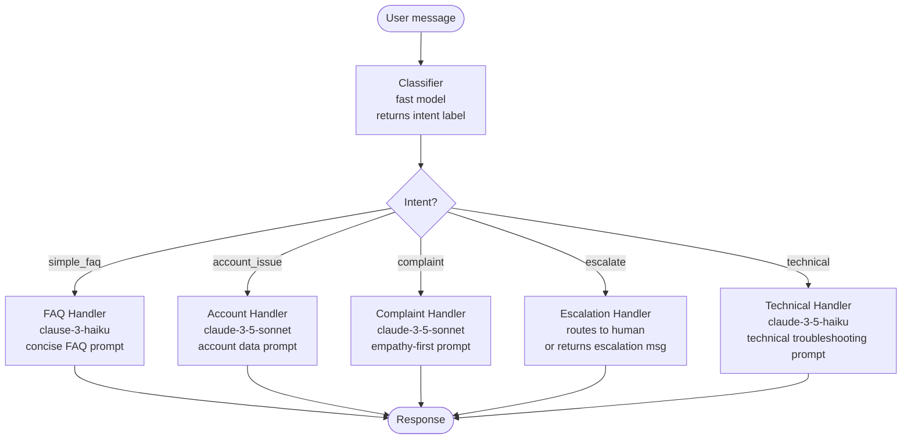

# النمط: Routing (التوجيه)

> النموذج المناسب لكل رسالة. لا النموذج الأقوى لكل رسالة.

**النوع:** بناء
**اللغات:** Python
**المتطلبات:** الدرس 01 (حلقة الـ agent)، الدرس 02 (Workflows مقابل Agents)، Anthropic SDK
**الوقت:** ~45 دقيقة
**أهداف التعلّم:**
- بناء موجّه (router) يصنّف نوايا (intents) دعم العملاء باستخدام نموذج سريع/رخيص
- توزيع النوايا المصنّفة إلى المعالِج (handler) الصحيح (system prompts مختلفة، نماذج مختلفة)
- بناء صنف `Router` بمعالِجات مسجّلة ومعالِج احتياطي (fallback handler)
- شرح حجة التكلفة وزمن الانتظار لصالح التوجيه مقابل نهج النموذج الواحد
- قياس دقة التصنيف والوفورات في التكلفة لإعداد توجيه حقيقي

---

## المشكلة

تُطلق شركة SaaS بوت دعم عملاء. كل رسالة تذهب إلى `claude-opus-4` مع system prompt طويل وشامل يحاول التعامل مع كل الحالات: طلبات الاسترداد، وأسئلة الفوترة، والمشكلات التقنية، وبلاغات الأعطال، وطلبات الميزات، والوصول إلى الحساب. النظام قادر. وهو أيضًا مكلِف.

يراجع فريق الدعم السجلات. 60% من الرسائل أسئلة شائعة (FAQs) بسيطة: "ما ساعات عملكم؟"، "هل تقدّمون نسخة تجريبية مجانية؟"، "كيف أعيد ضبط كلمة المرور؟" هذه تستغرق ثانيتين وتكلّف 0.08 دولار لكل منها على Opus. ويمكن أن يتعامل معها نموذج يكلّف أرخص بعشرين ضعفًا ويستجيب أسرع بأربعة أضعاف.

12% من الرسائل مشكلات حساب تحتاج إلى البحث في بيانات الحساب. و8% شكاوى تحتاج إلى تعاطف ومعالجة دقيقة. و3% حالات حدّية تتطلب فعلًا تفكيرًا على مستوى Opus. والـ 17% المتبقية أسئلة تقنية.

المعمارية الصحيحة: مصنّف (classifier) يعمل أولًا باستخدام نموذج رخيص وسريع. يقرأ الرسالة ويُعيد واحدة من خمس تسميات نوايا. ثم يوجّه موزّع (dispatcher) إلى المعالِج المناسب: نموذج FAQ رخيص مع prompt مختصر للأسئلة الشائعة، ونموذج أقدر مع prompt لبيانات الحساب، ونموذج دقيق مع prompt يُقدّم التعاطف، والتصعيد إلى بشري للـ 3% من الحالات الحدّية.

الموجّه لا يجعل كل رسالة أرخص. بل يجعل الرسائل الصحيحة أرخص. الـ 3% التي تحتاج فعلًا إلى Opus لا تزال تحصل على Opus. والـ 60% التي تحتاج إلى جدول بحث (lookup table) تحصل على جدول بحث.

---

## المفهوم

### نمط الموجّه (Router)

للموجّه مكوّنان: مصنّف وموزّع.

المصنّف هو استدعاء LLM واحد (أو أحيانًا قاعدة) يقرأ المدخل ويُعيد تسمية فئة. يُختار نموذج التصنيف للسرعة والتكلفة، لا للقدرة. وprompt التصنيف محكم ويُعيد واحدة من N تسمية معروفة بصيغة مُهيكلة.

الموزّع هو جدول بحث: تسمية النية تُربط بـ (دالة معالِج، نموذج، system prompt). يستدعي الموزّع المعالِج الصحيح برسالة المستخدم الأصلية.



### جدول التوجيه

```
Intent          Model                     System prompt focus     Expected latency
-----------     ------------------------  ----------------------  ----------------
simple_faq      claude-3-5-haiku-20241022 Concise FAQ answers     ~0.5s
technical       claude-3-5-haiku-20241022 Step-by-step debug      ~0.8s
account_issue   claude-3-5-sonnet-20241022 Context + data lookup  ~1.2s
complaint       claude-3-5-sonnet-20241022 Empathy + resolution   ~1.5s
escalate        (human or no-op)           Transfer message        ~0.1s
```

يستخدم المصنّف `claude-3-5-haiku-20241022`. يكلّف استدعاء التصنيف ~0.0005 دولار للرسالة. تكلفة توجيه رسالة بشكل خاطئ (إرسال شكوى إلى معالِج FAQ) أعلى من تكلفة التصنيف، لذا يجب أن يكون المصنّف دقيقًا قبل أن تحسّنه أكثر.

---

## البناء

### الموجّه الخام في Python

التنفيذ من ثلاثة أجزاء: prompt التصنيف، ومنطق التوزيع، ودوال المعالِجات. راجع `code/main.py` للحصول على الملف الكامل القابل للتشغيل.

**الخطوة 1: prompt التصنيف.**

يجب أن يكون prompt التصنيف محكمًا. أعد كلمة واحدة. لا شرح. النموذج سريع ورخيص لأن المهمة بسيطة.

```python
import anthropic
import json

client = anthropic.Anthropic()

VALID_INTENTS = ["simple_faq", "account_issue", "complaint", "escalate", "technical"]

CLASSIFICATION_SYSTEM = """You are a customer support message classifier. 
Classify the user's message into exactly one of these categories:

- simple_faq: General questions about the product, pricing, hours, features, policies
- account_issue: Questions about the user's specific account, billing, subscription, or data
- complaint: Expressions of frustration, negative experience, or request for compensation
- escalate: Threats of legal action, regulatory complaints, or requests to speak to a manager
- technical: Bug reports, error messages, integration issues, or technical troubleshooting

Respond with ONLY the category name, nothing else."""

def classify_intent(message: str) -> str:
    """
    Classify a customer message into one of 5 intent categories.
    Uses the fast/cheap model. Returns a lowercase intent string.
    Falls back to 'technical' on parse error.
    """
    response = client.messages.create(
        model="claude-3-5-haiku-20241022",
        max_tokens=16,
        system=CLASSIFICATION_SYSTEM,
        messages=[{"role": "user", "content": message}]
    )

    intent = response.content[0].text.strip().lower()

    # Validate against known intents
    if intent not in VALID_INTENTS:
        # Fuzzy match: check if any valid intent is a substring
        for valid in VALID_INTENTS:
            if valid in intent:
                return valid
        return "simple_faq"  # safe fallback for unknown classifications

    return intent
```

**الخطوة 2: دوال المعالِجات.**

يتلقى كل معالِج رسالة المستخدم الأصلية ويُعيد سلسلة استجابة. يمكن للمعالِجات أن تختلف في النموذج، وفي system prompt، وفي max_tokens.

```python
FAQ_SYSTEM = """You are a concise customer support assistant.
Answer only what is asked. Keep responses under 3 sentences.
If you don't have specific information, say so briefly and offer to connect them with support."""

TECHNICAL_SYSTEM = """You are a technical support specialist.
Provide step-by-step troubleshooting instructions.
Ask for error messages or screenshots if needed.
Escalate to engineering if the issue is a confirmed bug."""

ACCOUNT_SYSTEM = """You are an account support specialist.
You help with billing questions, subscription changes, and account access.
Always confirm the user's identity before discussing account details.
Be precise about what actions you can and cannot take."""

COMPLAINT_SYSTEM = """You are a senior customer relations specialist.
Lead with empathy. Acknowledge the customer's frustration directly.
Propose a concrete resolution path, not just an apology.
Do not promise outcomes you cannot guarantee."""

def handle_simple_faq(message: str) -> tuple[str, str]:
    response = client.messages.create(
        model="claude-3-5-haiku-20241022",
        max_tokens=256,
        system=FAQ_SYSTEM,
        messages=[{"role": "user", "content": message}]
    )
    return response.content[0].text, "claude-3-5-haiku-20241022"

def handle_technical(message: str) -> tuple[str, str]:
    response = client.messages.create(
        model="claude-3-5-haiku-20241022",
        max_tokens=512,
        system=TECHNICAL_SYSTEM,
        messages=[{"role": "user", "content": message}]
    )
    return response.content[0].text, "claude-3-5-haiku-20241022"

def handle_account_issue(message: str) -> tuple[str, str]:
    response = client.messages.create(
        model="claude-3-5-sonnet-20241022",
        max_tokens=512,
        system=ACCOUNT_SYSTEM,
        messages=[{"role": "user", "content": message}]
    )
    return response.content[0].text, "claude-3-5-sonnet-20241022"

def handle_complaint(message: str) -> tuple[str, str]:
    response = client.messages.create(
        model="claude-3-5-sonnet-20241022",
        max_tokens=512,
        system=COMPLAINT_SYSTEM,
        messages=[{"role": "user", "content": message}]
    )
    return response.content[0].text, "claude-3-5-sonnet-20241022"

def handle_escalate(message: str) -> tuple[str, str]:
    # In production: open a ticket, page on-call, or hand off to human
    response = (
        "I'm connecting you with a senior member of our team right away. "
        "You'll receive a response within 2 hours. Your case ID is #[TICKET_ID]. "
        "Thank you for your patience."
    )
    return response, "no-model (escalation)"
```

**الخطوة 3: دالة التوزيع.**

```python
HANDLER_REGISTRY = {
    "simple_faq":    handle_simple_faq,
    "technical":     handle_technical,
    "account_issue": handle_account_issue,
    "complaint":     handle_complaint,
    "escalate":      handle_escalate,
}

def route_message(message: str, verbose: bool = True) -> dict:
    """
    Classify and dispatch a customer message.
    Returns a dict with: intent, response, model_used, classification_model.
    """
    intent = classify_intent(message)

    if verbose:
        print(f"  Classified as: {intent}")

    handler = HANDLER_REGISTRY.get(intent, handle_simple_faq)  # fallback
    response_text, model_used = handler(message)

    return {
        "intent": intent,
        "response": response_text,
        "model_used": model_used,
        "classification_model": "claude-3-5-haiku-20241022"
    }
```

> **اختبار من الواقع:** يصنّف موجّهك "تم خصم المبلغ مني مرتين هذا الشهر وأنا غاضب جدًا" على أنها `account_issue` بدلًا من `complaint`. فيستجيب معالِج الحساب بخطوات إجرائية بدلًا من التعاطف. ما الأثر على الإنتاج، وما التغيير في prompt التصنيف الذي يمنع ذلك؟

الأثر على الإنتاج هو عميل محبَط يشعر بأنه غير مسموع، مما يرفع معدل التصعيد ومخاطر التسرّب (churn). الحل: أضف أمثلة إلى system prompt الخاص بالتصنيف تميّز اللغة العاطفية ("غاضب"، "محبَط"، "مستاء") عن الأسئلة الإجرائية حول الحسابات. مثال واحد مختار بعناية لكل حدّ بين النوايا يمنع معظم سوء التصنيف عند الأطراف. وبدلًا من ذلك، أعد تقييم 50 حالة حدّية من سجلاتك وحدّد الأنماط التي يخطئ فيها المصنّف، ثم أضفها كأمثلة.

---

## الاستخدام

### صنف Router بمعالِجات مسجّلة ومعالِج احتياطي

تعمل دالة التوزيع الخام، لكن صنف `Router` يجعل النمط قابلًا للتركيب وللاختبار.

```python
from typing import Callable

class Handler:
    def __init__(self, fn: Callable[[str], tuple[str, str]], description: str = ""):
        self.fn = fn
        self.description = description

    def run(self, message: str) -> tuple[str, str]:
        return self.fn(message)


class Router:
    """
    A router that classifies input and dispatches to registered handlers.
    Falls back to the default handler for unknown intents.
    """
    def __init__(self, classifier_fn: Callable[[str], str]):
        self._classifier = classifier_fn
        self._handlers: dict[str, Handler] = {}
        self._fallback: Handler | None = None

    def register(self, intent: str, fn: Callable, description: str = "") -> "Router":
        self._handlers[intent] = Handler(fn, description)
        return self

    def set_fallback(self, fn: Callable, description: str = "") -> "Router":
        self._fallback = Handler(fn, description)
        return self

    def route(self, message: str) -> dict:
        intent = self._classifier(message)

        handler = self._handlers.get(intent)
        if handler is None:
            if self._fallback is not None:
                handler = self._fallback
                intent = f"fallback (original: {intent})"
            else:
                return {"intent": intent, "error": "No handler and no fallback registered"}

        response_text, model_used = handler.run(message)
        return {
            "intent": intent,
            "response": response_text,
            "model_used": model_used
        }

    def list_handlers(self) -> None:
        for intent, handler in self._handlers.items():
            print(f"  {intent:<20} {handler.description}")
        if self._fallback:
            print(f"  {'(fallback)':<20} {self._fallback.description}")


# Build the router
support_router = (
    Router(classify_intent)
    .register("simple_faq",   handle_simple_faq,   "Fast FAQ - Haiku")
    .register("technical",    handle_technical,    "Technical support - Haiku")
    .register("account_issue", handle_account_issue, "Account handling - Sonnet")
    .register("complaint",    handle_complaint,    "Complaint resolution - Sonnet")
    .register("escalate",     handle_escalate,     "Human escalation")
    .set_fallback(handle_simple_faq,               "Default: treat as FAQ")
)

# Use it
result = support_router.route("What is your refund policy?")
print(f"Intent: {result['intent']}")
print(f"Model: {result['model_used']}")
print(f"Response: {result['response']}")
```

يلتقط معالِج `set_fallback` أي نية يعيدها المصنّف ولا يوجد لها معالِج مسجّل. هذا يهم في الإنتاج: إذا بدأ المصنّف يعيد تسمية جديدة (انجراف النموذج، تغيير الـ prompt)، يمنع المعالِج الاحتياطي تعطّلًا صامتًا.

> **نقلة في المنظور:** يقول زميل: "بدلًا من التوجيه، لماذا لا نستخدم prompt ذكيًا واحدًا يقول 'إن كانت الرسالة شكوى، فكن متعاطفًا؛ وإن كانت تقنية، فكن دقيقًا'؟" ما المشكلة في هذا النهج على نطاق واسع؟

المشكلة ليست الصحة في الحالات السهلة. الـ prompt الذكي يتعامل مع الواضح منها. المشكلة هي الحالات الحدّية عند الأطراف، وتكلفة استخدام نموذج قادر لكل FAQ بسيط، وصعوبة تحسين معالجة الشكاوى من دون التأثير على سلوك الـ FAQ، وعدم القدرة على تخصيص ميزانيات زمن انتظار مختلفة لنوايا مختلفة. الـ prompt المتراص (monolithic) يعني أن أي تغيير في معالجة الشكاوى يتطلب إعادة اختبار كل نية أخرى. أما الموجّه فيعزل كل معالِج: يمكنك استبدال نموذج الشكاوى، وتحديث prompt التعاطف، واختبار حالات الشكاوى وحدها من دون المساس بأي شيء آخر.

---

## التسليم

المُخرَج (artifact) الذي يُنتجه هذا الدرس هو قالب موجّه قابل لإعادة الاستخدام مع prompt التصنيف ونمط التوزيع. راجع `outputs/skill-router.md`.

يتضمن القالب system prompt الخاص بالتصنيف، وصنف `Router`، ونمط تسجيل المعالِجات، وإعداد المعالِج الاحتياطي. أدرجه في أي نظام تحتاج فيه أنواع المدخلات المختلفة إلى معالجة أو نماذج أو system prompts مختلفة.

---

## التقييم

يكون الموجّه صحيحًا حين يصنّف بدقة، ويوزّع إلى المعالِج الصحيح، ويعالج المعالِجات الاحتياطية بنظافة.

**دقة التصنيف.** اجمع 100 رسالة موسومة (labeled) من سجلات الإنتاج (أو اكتبها يدويًا إن كنت في مرحلة ما قبل الإنتاج). شغّل المصنّف على الـ 100 كلها. احسب الدقة (precision) والاسترجاع (recall) لكل نية. الهدف: دقة إجمالية أعلى من 90%، مع دقة على `escalate` و`complaint` أعلى من 95% (سوء تصنيف هذه هو الأكثر كلفة).

**تدقيق مصفوفة الالتباس (confusion matrix).** أي النوايا يُخلَط بينها أكثر؟ المصنّفات على مستوى Haiku كثيرًا ما تخلط بين `account_issue` و`complaint` حين تحوي الرسالة لغة عاطفية وإشارات إلى الحساب معًا. أضف أمثلة للأزواج المتلبسة في prompt التصنيف، وأعد التشغيل، وقِس التحسّن.

**خط الأساس للتكلفة والوفورات.** قبل التوجيه: قِس التكلفة لكل رسالة (الكل على النموذج المكلِف). بعد التوجيه: قِس متوسط التكلفة لكل رسالة (مرجّحًا بتوزيع النوايا). الهدف: خفض للتكلفة بنسبة 40-60% قابل للتحقيق لتوزيعات الدعم النموذجية. سجّل كل نية ونموذج مُستخدَم لتتمكن من تتبّع انزياح التوزيع عبر الزمن.

**جودة استجابة المعالِج.** قيّم كل معالِج بشكل مستقل على 20 رسالة من نوع نيته. استخدم معيارًا (rubric) مناسبًا للنية: إجابات الـ FAQ تُقيّم على الدقة والإيجاز، واستجابات الشكاوى على التعاطف ووضوح الحل، والاستجابات التقنية على الصحة والقابلية للتنفيذ. المعالِج الذي يوجّه إلى المكان الصحيح لكنه يُنتج استجابة سيئة هو فشل نظام حتى لو كان الموجّه يعمل بشكل صحيح.

**معدل الاحتياطي (Fallback rate).** سجّل نسبة الرسائل التي تصل إلى المعالِج الاحتياطي. معدل أعلى من 5% يشير إلى أن المصنّف يعيد تسميات ليست في سجل معالِجاتك، مما يعني إما أن prompt التصنيف انجرف أو أن أنواع نوايا جديدة تظهر في الإنتاج. حقّق حين يتجاوز معدل الاحتياطي خط أساسك.

**زمن الانتظار بحسب النية.** قِس زمن الانتظار عند p50 وp95 لكل نية. ينبغي أن يكتمل الـ FAQ البسيط في أقل من 800ms. ويمكن لمعالِجات الشكاوى والحسابات أن تكون أبطأ. إذا كان زمن انتظار الـ FAQ يتسلّل صعودًا، فقد يكون system prompt الخاص بمعالِج الـ FAQ صار معقّدًا أكثر من اللازم ويحتاج إلى تقليم.
