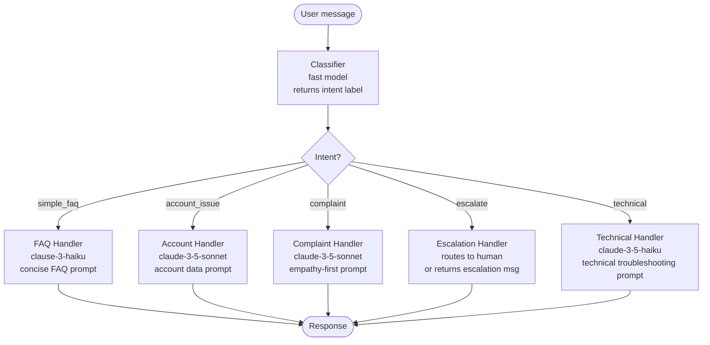

# Pattern: Routing

> The right model for every message. Not the most powerful model for every message.

**Type:** Build
**Languages:** Python
**Prerequisites:** Lesson 01 (The Agent Loop), Lesson 02 (Workflows vs Agents), Anthropic SDK
**Time:** ~45 min
**Learning Objectives:**
- Implement a router that classifies customer support intents using a fast/cheap model
- Dispatch classified intents to the right handler (different system prompts, different models)
- Build a `Router` class with registered handlers and a fallback handler
- Explain the cost and latency case for routing over a single-model approach
- Measure classification accuracy and cost savings for a real routing setup

---

## THE PROBLEM

A SaaS company ships a customer support bot. Every message goes to `claude-opus-4` with a long, comprehensive system prompt that tries to handle all cases: refund requests, billing questions, technical issues, outage reports, feature requests, and account access. The system is capable. It is also expensive.

The support team reviews the logs. 60% of messages are simple FAQs: "What are your hours?", "Do you offer a free trial?", "How do I reset my password?" These take 2 seconds and cost $0.08 each on Opus. They could be handled by a model that costs 20x less and responds 4x faster.

12% of messages are account issues that need account data lookup. 8% are complaints that need empathy and careful handling. 3% are edge cases that genuinely require Opus-level reasoning. The remaining 17% are technical questions.

The correct architecture: a classifier runs first, using a cheap fast model. It reads the message and returns one of five intent labels. Then a dispatcher routes to the appropriate handler: a cheap FAQ model with a concise FAQ prompt, a more capable model with an account-data prompt, a careful model with an empathy-first prompt, and escalation to a human for the 3% edge cases.

The router does not make every message cheaper. It makes the right messages cheaper. The 3% that genuinely need Opus still get Opus. The 60% that need a lookup table get a lookup table.

---

## THE CONCEPT

### The Router Pattern

A router has two components: a classifier and a dispatcher.

The classifier is a single LLM call (or sometimes a rule) that reads the input and returns a category label. The model for classification is chosen for speed and cost, not capability. The classification prompt is tight and returns one of N known labels in structured format.

The dispatcher is a lookup table: intent label maps to (handler function, model, system prompt). The dispatcher calls the right handler with the original user message.



### The Routing Table

```
Intent          Model                     System prompt focus     Expected latency
-----------     ------------------------  ----------------------  ----------------
simple_faq      claude-3-5-haiku-20241022 Concise FAQ answers     ~0.5s
technical       claude-3-5-haiku-20241022 Step-by-step debug      ~0.8s
account_issue   claude-3-5-sonnet-20241022 Context + data lookup  ~1.2s
complaint       claude-3-5-sonnet-20241022 Empathy + resolution   ~1.5s
escalate        (human or no-op)           Transfer message        ~0.1s
```

The classifier uses `claude-3-5-haiku-20241022`. The classification call costs ~$0.0005 per message. The cost of misrouting a message (sending a complaint to the FAQ handler) is higher than the classification cost, so the classifier must be accurate before you optimize it further.

---

## BUILD IT

### The Raw Router in Python

The implementation has three parts: the classification prompt, the dispatch logic, and the handler functions. See `code/main.py` for the full runnable file.

**Step 1: The classification prompt.**

The classification prompt must be tight. Return one word. No explanation. The model is fast and cheap because the task is simple.

```python
import anthropic
import json

client = anthropic.Anthropic()

VALID_INTENTS = ["simple_faq", "account_issue", "complaint", "escalate", "technical"]

CLASSIFICATION_SYSTEM = """You are a customer support message classifier. 
Classify the user's message into exactly one of these categories:

- simple_faq: General questions about the product, pricing, hours, features, policies
- account_issue: Questions about the user's specific account, billing, subscription, or data
- complaint: Expressions of frustration, negative experience, or request for compensation
- escalate: Threats of legal action, regulatory complaints, or requests to speak to a manager
- technical: Bug reports, error messages, integration issues, or technical troubleshooting

Respond with ONLY the category name, nothing else."""

def classify_intent(message: str) -> str:
    """
    Classify a customer message into one of 5 intent categories.
    Uses the fast/cheap model. Returns a lowercase intent string.
    Falls back to 'technical' on parse error.
    """
    response = client.messages.create(
        model="claude-3-5-haiku-20241022",
        max_tokens=16,
        system=CLASSIFICATION_SYSTEM,
        messages=[{"role": "user", "content": message}]
    )

    intent = response.content[0].text.strip().lower()

    # Validate against known intents
    if intent not in VALID_INTENTS:
        # Fuzzy match: check if any valid intent is a substring
        for valid in VALID_INTENTS:
            if valid in intent:
                return valid
        return "simple_faq"  # safe fallback for unknown classifications

    return intent
```

**Step 2: Handler functions.**

Each handler receives the original user message and returns a response string. Handlers can differ in model, system prompt, and max_tokens.

```python
FAQ_SYSTEM = """You are a concise customer support assistant.
Answer only what is asked. Keep responses under 3 sentences.
If you don't have specific information, say so briefly and offer to connect them with support."""

TECHNICAL_SYSTEM = """You are a technical support specialist.
Provide step-by-step troubleshooting instructions.
Ask for error messages or screenshots if needed.
Escalate to engineering if the issue is a confirmed bug."""

ACCOUNT_SYSTEM = """You are an account support specialist.
You help with billing questions, subscription changes, and account access.
Always confirm the user's identity before discussing account details.
Be precise about what actions you can and cannot take."""

COMPLAINT_SYSTEM = """You are a senior customer relations specialist.
Lead with empathy. Acknowledge the customer's frustration directly.
Propose a concrete resolution path, not just an apology.
Do not promise outcomes you cannot guarantee."""

def handle_simple_faq(message: str) -> tuple[str, str]:
    response = client.messages.create(
        model="claude-3-5-haiku-20241022",
        max_tokens=256,
        system=FAQ_SYSTEM,
        messages=[{"role": "user", "content": message}]
    )
    return response.content[0].text, "claude-3-5-haiku-20241022"

def handle_technical(message: str) -> tuple[str, str]:
    response = client.messages.create(
        model="claude-3-5-haiku-20241022",
        max_tokens=512,
        system=TECHNICAL_SYSTEM,
        messages=[{"role": "user", "content": message}]
    )
    return response.content[0].text, "claude-3-5-haiku-20241022"

def handle_account_issue(message: str) -> tuple[str, str]:
    response = client.messages.create(
        model="claude-3-5-sonnet-20241022",
        max_tokens=512,
        system=ACCOUNT_SYSTEM,
        messages=[{"role": "user", "content": message}]
    )
    return response.content[0].text, "claude-3-5-sonnet-20241022"

def handle_complaint(message: str) -> tuple[str, str]:
    response = client.messages.create(
        model="claude-3-5-sonnet-20241022",
        max_tokens=512,
        system=COMPLAINT_SYSTEM,
        messages=[{"role": "user", "content": message}]
    )
    return response.content[0].text, "claude-3-5-sonnet-20241022"

def handle_escalate(message: str) -> tuple[str, str]:
    # In production: open a ticket, page on-call, or hand off to human
    response = (
        "I'm connecting you with a senior member of our team right away. "
        "You'll receive a response within 2 hours. Your case ID is #[TICKET_ID]. "
        "Thank you for your patience."
    )
    return response, "no-model (escalation)"
```

**Step 3: The dispatch function.**

```python
HANDLER_REGISTRY = {
    "simple_faq":    handle_simple_faq,
    "technical":     handle_technical,
    "account_issue": handle_account_issue,
    "complaint":     handle_complaint,
    "escalate":      handle_escalate,
}

def route_message(message: str, verbose: bool = True) -> dict:
    """
    Classify and dispatch a customer message.
    Returns a dict with: intent, response, model_used, classification_model.
    """
    intent = classify_intent(message)

    if verbose:
        print(f"  Classified as: {intent}")

    handler = HANDLER_REGISTRY.get(intent, handle_simple_faq)  # fallback
    response_text, model_used = handler(message)

    return {
        "intent": intent,
        "response": response_text,
        "model_used": model_used,
        "classification_model": "claude-3-5-haiku-20241022"
    }
```

> **Real-world check:** Your router misclassifies "I've been charged twice this month and I'm furious" as `account_issue` instead of `complaint`. The account handler responds with process steps instead of empathy. What is the production impact, and what change to the classification prompt would prevent it?

The production impact is a frustrated customer who feels unheard, which increases escalation rate and churn risk. The fix: add examples to the classification system prompt that distinguish emotional language ("furious", "frustrated", "outraged") from procedural questions about accounts. One well-chosen example per intent boundary prevents most misclassification at the edges. Alternatively, re-score 50 edge cases from your logs and identify the patterns the classifier is getting wrong, then add those as examples.

---

## USE IT

### A Router Class with Registered Handlers and a Fallback

The raw dispatch function works, but a `Router` class makes the pattern composable and testable.

```python
from typing import Callable

class Handler:
    def __init__(self, fn: Callable[[str], tuple[str, str]], description: str = ""):
        self.fn = fn
        self.description = description

    def run(self, message: str) -> tuple[str, str]:
        return self.fn(message)


class Router:
    """
    A router that classifies input and dispatches to registered handlers.
    Falls back to the default handler for unknown intents.
    """
    def __init__(self, classifier_fn: Callable[[str], str]):
        self._classifier = classifier_fn
        self._handlers: dict[str, Handler] = {}
        self._fallback: Handler | None = None

    def register(self, intent: str, fn: Callable, description: str = "") -> "Router":
        self._handlers[intent] = Handler(fn, description)
        return self

    def set_fallback(self, fn: Callable, description: str = "") -> "Router":
        self._fallback = Handler(fn, description)
        return self

    def route(self, message: str) -> dict:
        intent = self._classifier(message)

        handler = self._handlers.get(intent)
        if handler is None:
            if self._fallback is not None:
                handler = self._fallback
                intent = f"fallback (original: {intent})"
            else:
                return {"intent": intent, "error": "No handler and no fallback registered"}

        response_text, model_used = handler.run(message)
        return {
            "intent": intent,
            "response": response_text,
            "model_used": model_used
        }

    def list_handlers(self) -> None:
        for intent, handler in self._handlers.items():
            print(f"  {intent:<20} {handler.description}")
        if self._fallback:
            print(f"  {'(fallback)':<20} {self._fallback.description}")


# Build the router
support_router = (
    Router(classify_intent)
    .register("simple_faq",   handle_simple_faq,   "Fast FAQ - Haiku")
    .register("technical",    handle_technical,    "Technical support - Haiku")
    .register("account_issue", handle_account_issue, "Account handling - Sonnet")
    .register("complaint",    handle_complaint,    "Complaint resolution - Sonnet")
    .register("escalate",     handle_escalate,     "Human escalation")
    .set_fallback(handle_simple_faq,               "Default: treat as FAQ")
)

# Use it
result = support_router.route("What is your refund policy?")
print(f"Intent: {result['intent']}")
print(f"Model: {result['model_used']}")
print(f"Response: {result['response']}")
```

The `set_fallback` handler catches any intent the classifier returns that has no registered handler. This matters for production: if the classifier starts returning a new label (model drift, prompt change), the fallback prevents a silent crash.

> **Perspective shift:** A colleague says "instead of routing, why not just use one smart prompt that says 'if the message is a complaint, be empathetic; if it is technical, be precise'?" What is the problem with that approach at scale?

The problem is not correctness on easy cases. A smart prompt handles the obvious ones. The problem is the edge cases at the boundaries, the cost of using a capable model for every simple FAQ, the difficulty of improving the complaint handling without affecting the FAQ behavior, and the inability to assign different latency budgets to different intents. A monolithic prompt means any change to complaint handling requires re-testing every other intent. A router isolates each handler: you can swap the complaint model, update the empathy prompt, and test only complaint cases without touching anything else.

---

## SHIP IT

The artifact this lesson produces is a reusable router template with the classification prompt and dispatch pattern. See `outputs/skill-router.md`.

The template includes the classification system prompt, the `Router` class, the handler registration pattern, and the fallback setup. Drop it into any system where different input types need different handling, models, or system prompts.

---

## EVALUATE IT

A router is correct when it classifies accurately, dispatches to the right handler, and handles fallbacks cleanly.

**Classification accuracy.** Collect 100 labeled messages from production logs (or write them manually if in pre-production). Run the classifier on all 100. Compute per-intent precision and recall. Target: overall accuracy above 90%, with precision on `escalate` and `complaint` above 95% (misclassifying these is the most costly).

**Confusion matrix audit.** Which intents are most often confused? Haiku-level classifiers frequently confuse `account_issue` with `complaint` when the message contains both emotional language and account references. Add examples for the confused pairs in the classification prompt, re-run, and measure the improvement.

**Cost baseline and savings.** Before routing: measure cost per message (all on expensive model). After routing: measure average cost per message (weighted by intent distribution). Target: 40-60% cost reduction is achievable for typical support distributions. Log every intent and model used so you can track the distribution shift over time.

**Handler response quality.** Evaluate each handler independently on 20 messages of its intent type. Use a rubric appropriate to the intent: FAQ answers scored on accuracy and conciseness, complaint responses on empathy and resolution clarity, technical responses on correctness and actionability. A handler that routes to the right place but produces a bad response is a system failure even if the router is working correctly.

**Fallback rate.** Log the percentage of messages that hit the fallback handler. A rate above 5% suggests the classifier is returning labels not in your handler registry, which means either the classification prompt has drifted or new intent types are appearing in production. Investigate when the fallback rate exceeds your baseline.

**Latency by intent.** Measure p50 and p95 latency per intent. Simple FAQ should complete in under 800ms. Complaint and account handlers can be slower. If FAQ latency is creeping up, the FAQ handler's system prompt may be getting too complex and needs trimming.
