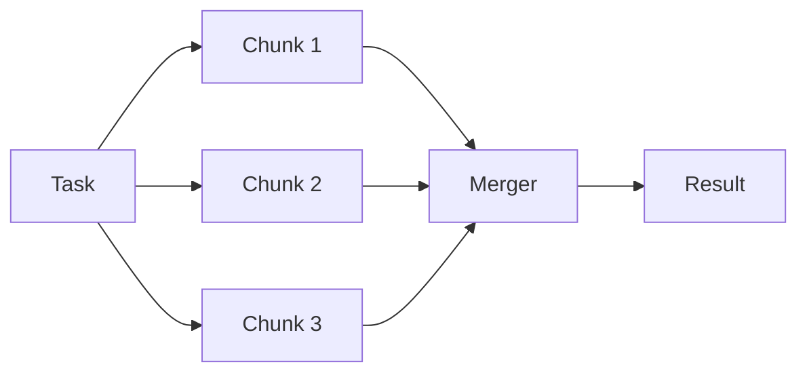

# النمط: Parallelization (التوازي)

> أداء 12 شيئًا واحدًا تلو الآخر ليس استراتيجية. إنه طابور (queue) بأوهام العظمة.

**النوع:** بناء
**اللغات:** Python
**المتطلبات:** 04-01 حلقة الـ agent، أساسيات async في Python
**الوقت:** ~45 دقيقة
**أهداف التعلّم:**
- تمييز المهام المتوازية تمامًا (embarrassingly parallel) عن المهام المترابطة تسلسليًا
- بناء التفرّع/التجميع (fan-out/fan-in) باستخدام `asyncio.gather` مع عميل Anthropic غير المتزامن (async)
- بناء نمط التصويت (voting) لزيادة الثقة في المخرَج
- الاختيار بين `asyncio` و`ThreadPoolExecutor` لحالة الاستخدام المناسبة
- دمج المخرجات المتوازية من دون إدخال آثار هلوسة (hallucination artifacts)

---

## المشكلة

يقرأ research agent اثني عشر مستندًا ويُنتج ملخصًا لكل منها قبل كتابة توليفة (synthesis) نهائية. يستغرق كل استدعاء `messages.create()` نحو 20 ثانية. وبتشغيلها تسلسليًا، يستغرق خط الأنابيب الكامل 4 دقائق. ينصرف المستخدمون بعد 45 ثانية. وتُلام الميزة. المشكلة الحقيقية ليست زمن الانتظار: إنها التسلسلية.

ملخصات المستندات الاثني عشر لا تعتمد على بعضها. ملخص المستند 7 لا يحتاج إلى وجود ملخص المستند 3 أولًا. أنت تُجري 12 طلبًا مستقلًا واحدًا تلو الآخر بلا سبب سوى أن الكود كُتب بحلقة `for`.

هذا عمل متوازٍ تمامًا (embarrassingly parallel). كلمة "تمامًا" ليست انتقاصًا؛ بل تعني أن التوازي بديهي إلى درجة لا يحتاج معها إلى أي تنسيق. كل وحدة عمل مستقلة. لا حالة مشتركة، ولا قيد ترتيب، ولا تسابق (race condition) يُدار.

أنظمة الذكاء الاصطناعي الإنتاجية تصطدم بهذا النمط باستمرار: لخّص N مستندًا، صنّف N مدخلًا، قيّم N مرشحًا، ترجم N سلسلة. النسخة التسلسلية هي دائمًا المسوّدة الأولى. والنسخة المتوازية هي ما يُطلَق.

ثمة مشكلة ثانية بجوار هذه: هشاشة نقطة المخرَج الواحدة (single-point-of-output fragility). حين تستدعي النموذج مرة واحدة وتحصل على إجابة واحدة، قد تكون تلك الإجابة جيدة أو قد تكون شاذة منخفضة الاحتمال. وللقرارات عالية الرهان، تريد أن "يصوّت" النموذج. شغّل الـ prompt نفسه ثلاث مرات، اجمع ثلاث إجابات، اختر الأغلبية. تنخفض التكلفة المتوقعة لمخرَج سيئ انخفاضًا ملحوظًا.

---

## المفهوم

### نمطان فرعيان

يغطي التوازي تقنيتين متمايزتين تحلّان مشكلتين مختلفتين.

```
Sub-pattern      Problem it solves             Example
-----------      -------------------------     ---------------------------
Sectioning       N independent tasks           Summarize 12 documents
                 taking too long in sequence

Voting           One task, uncertain output    Classify sentiment 3 ways
                 needing higher confidence     and take the majority
```

تستخدم كلتاهما شكل التفرّع/التجميع (fan-out/fan-in) نفسه، لكن القصد ومنطق الدمج مختلفان.

### التفرّع / التجميع (Fan-Out / Fan-In)



التفرّع (fan-out): مهمة واحدة تتحول إلى N مهمة فرعية متزامنة. والتجميع (fan-in): N نتيجة متزامنة تتحول إلى مخرَج واحد مدموج. أداة الدمج (merger) هي حيث تقرّر معنى "الجمع": ضمّ الملخصات، أو توليف المحاور، أو اختيار تصويت الأغلبية.

### التقطيع مقابل التصويت: جنبًا إلى جنب

```
SECTIONING                           VOTING
-------------------------------      --------------------------------
Goal: process N different inputs     Goal: process 1 input N times
      in parallel                          with varied outputs

Each call:  unique input              Each call: same prompt + input
            unique output                       different output (temp > 0)

Merge:  combine all N outputs         Merge: pick majority or synthesize

Use when: N independent tasks         Use when: 1 high-stakes decision
          each takes >1s              needs confidence signal

Risk: merger introduces noise         Risk: all 3 votes are wrong
      if not carefully designed             (model consensus failure)
```

### لماذا async للعمل المقيّد بالإدخال/الإخراج (I/O-Bound)

استدعاءات LLM API مقيّدة بالإدخال/الإخراج (I/O-bound): يقضي كودك جُلّ وقته منتظرًا الشبكة. خلال ذلك الانتظار، يكون مفسّر Python خاملًا. يتيح `asyncio` للمفسّر التبديل إلى مهام أخرى أثناء الانتظار، فتكون الطلبات الاثنا عشر كلها قيد التنفيذ في آن واحد. ويصبح الوقت الإجمالي تقريبًا وقت أبطأ طلب منفرد، لا مجموع الطلبات.

يفعل `ThreadPoolExecutor` الشيء نفسه عبر خيوط (threads) نظام التشغيل. كلاهما يعمل. الاختيار الصحيح يعتمد على ما إذا كانت قاعدة الكود لديك متزامنة (sync) أم غير متزامنة (async)، لا على فروق الأداء للعمل المقيّد بالإدخال/الإخراج.

---

## البناء

### الخطوة 1: التقطيع مع asyncio.gather

ثبّت العميل غير المتزامن: يحوي Anthropic Python SDK عميلًا غير متزامن مدمجًا. لا حاجة إلى حزمة إضافية.

```python
import asyncio
import anthropic

async def summarize_document(client: anthropic.AsyncAnthropic, doc: str, doc_id: int) -> dict:
    """Summarize a single document. Designed to run concurrently."""
    message = await client.messages.create(
        model="claude-3-5-haiku-20241022",
        max_tokens=256,
        messages=[
            {
                "role": "user",
                "content": f"Summarize this document in 2-3 sentences:\n\n{doc}"
            }
        ]
    )
    return {
        "doc_id": doc_id,
        "summary": message.content[0].text
    }


async def summarize_all(documents: list[str]) -> list[dict]:
    """Fan-out: run all summaries concurrently. Fan-in: collect results."""
    client = anthropic.AsyncAnthropic()

    # Create all coroutines first (does NOT start them yet)
    tasks = [
        summarize_document(client, doc, i)
        for i, doc in enumerate(documents)
    ]

    # asyncio.gather launches all coroutines concurrently and waits for all
    results = await asyncio.gather(*tasks)

    return list(results)


async def synthesize_summaries(summaries: list[dict]) -> str:
    """Merge step: synthesize all summaries into a final report."""
    client = anthropic.AsyncAnthropic()

    # Build a structured input from all summaries
    summaries_text = "\n\n".join(
        f"Document {s['doc_id']}:\n{s['summary']}"
        for s in sorted(summaries, key=lambda x: x["doc_id"])
    )

    message = await client.messages.create(
        model="claude-3-5-haiku-20241022",
        max_tokens=512,
        messages=[
            {
                "role": "user",
                "content": (
                    "You have received summaries of multiple documents. "
                    "Write a 1-paragraph synthesis that identifies the key themes "
                    "across all documents.\n\n"
                    f"{summaries_text}"
                )
            }
        ]
    )
    return message.content[0].text


async def research_pipeline(documents: list[str]) -> str:
    import time

    print(f"Summarizing {len(documents)} documents in parallel...")
    start = time.time()

    summaries = await summarize_all(documents)

    elapsed = time.time() - start
    print(f"All {len(documents)} summaries done in {elapsed:.1f}s")

    synthesis = await synthesize_summaries(summaries)
    return synthesis
```

> **اختبار من الواقع:** يسأل قائد فريقك: "لماذا لا نضيف `await` فقط إلى حلقة for؟ هذا ما زال async، أليس كذلك؟" ما الفرق الحاسم بين `for doc in docs: await summarize(doc)` و`asyncio.gather(*[summarize(doc) for doc in docs])`؟

حلقة الـ `for` مع `await` تسلسلية: كل `await` يُوقِف التنفيذ حتى يكتمل ذلك الاستدعاء الواحد قبل بدء التالي. أما `asyncio.gather` فيُطلق كل الـ coroutines قبل انتظار أيٍّ منها، فتكون كل الاستدعاءات قيد التنفيذ دفعة واحدة. حلقة الـ `for` لا توفّر أي وقت مقارنة بالكود المتزامن. أما `asyncio.gather` فيُقلّص الوقت الإجمالي من `N * latency` إلى نحو `max(latency)`.

### الخطوة 2: التصويت مع درجة الحرارة (Temperature)

```python
async def vote_on_classification(text: str, n_votes: int = 3) -> str:
    """
    Run the same classification prompt N times with temperature > 0.
    Return the majority vote.
    """
    client = anthropic.AsyncAnthropic()

    async def single_vote(vote_id: int) -> str:
        message = await client.messages.create(
            model="claude-3-5-haiku-20241022",
            max_tokens=64,
            temperature=0.7,  # Vary outputs so voting is meaningful
            messages=[
                {
                    "role": "user",
                    "content": (
                        "Classify the sentiment of this text as exactly one of: "
                        "POSITIVE, NEGATIVE, or NEUTRAL.\n"
                        "Respond with only the label.\n\n"
                        f"Text: {text}"
                    )
                }
            ]
        )
        return message.content[0].text.strip().upper()

    # Run N votes concurrently
    votes = await asyncio.gather(*[single_vote(i) for i in range(n_votes)])
    print(f"Votes received: {votes}")

    # Majority picker
    from collections import Counter
    counts = Counter(votes)
    winner, count = counts.most_common(1)[0]

    if count > n_votes // 2:
        return winner
    else:
        # Tie: synthesize rather than pick arbitrarily
        return await synthesize_votes(text, votes)


async def synthesize_votes(text: str, votes: list[str]) -> str:
    """Fallback when there is no clear majority: ask model to resolve."""
    client = anthropic.AsyncAnthropic()
    message = await client.messages.create(
        model="claude-3-5-haiku-20241022",
        max_tokens=64,
        messages=[
            {
                "role": "user",
                "content": (
                    f"Three classifiers disagreed on this text: {votes}. "
                    f"Text: '{text}'. "
                    "Give the single best label: POSITIVE, NEGATIVE, or NEUTRAL."
                )
            }
        ]
    )
    return message.content[0].text.strip().upper()
```

---

## الاستخدام

### الأنماط نفسها مع ThreadPoolExecutor (العميل المتزامن)

حين لا تكون قاعدة الكود لديك غير متزامنة (تطبيق Flask، أو سكربت، أو دفتر Jupyter)، استخدم `concurrent.futures.ThreadPoolExecutor` مع العميل المتزامن `anthropic.Anthropic()`. النمط متطابق: التفرّع عبر `executor.map` أو `executor.submit`، والتجميع عبر جمع الـ futures.

```python
import anthropic
from concurrent.futures import ThreadPoolExecutor, as_completed

def summarize_document_sync(args: tuple) -> dict:
    """Sync version. Takes a tuple because executor.map passes single args."""
    client, doc, doc_id = args
    message = client.messages.create(
        model="claude-3-5-haiku-20241022",
        max_tokens=256,
        messages=[{"role": "user", "content": f"Summarize in 2-3 sentences:\n\n{doc}"}]
    )
    return {"doc_id": doc_id, "summary": message.content[0].text}


def summarize_all_sync(documents: list[str], max_workers: int = 10) -> list[dict]:
    """
    ThreadPoolExecutor version. Use when:
    - Your codebase is sync (Flask, script, notebook)
    - You need max_workers control for rate limiting
    """
    client = anthropic.Anthropic()

    args = [(client, doc, i) for i, doc in enumerate(documents)]

    with ThreadPoolExecutor(max_workers=max_workers) as executor:
        results = list(executor.map(summarize_document_sync, args))

    return results


def vote_sync(text: str, n_votes: int = 3) -> str:
    """Voting pattern via threads. Same logic, sync client."""
    client = anthropic.Anthropic()

    def single_vote(_: int) -> str:
        message = client.messages.create(
            model="claude-3-5-haiku-20241022",
            max_tokens=64,
            temperature=0.7,
            messages=[{
                "role": "user",
                "content": (
                    "Classify as POSITIVE, NEGATIVE, or NEUTRAL. "
                    f"Respond with only the label.\n\nText: {text}"
                )
            }]
        )
        return message.content[0].text.strip().upper()

    from collections import Counter
    with ThreadPoolExecutor(max_workers=n_votes) as executor:
        votes = list(executor.map(single_vote, range(n_votes)))

    print(f"Votes: {votes}")
    counts = Counter(votes)
    return counts.most_common(1)[0][0]
```

### متى تستخدم كل واحد

```
asyncio + AsyncAnthropic          ThreadPoolExecutor + Anthropic
-------------------------------   --------------------------------
Codebase is already async         Codebase is sync
FastAPI, aiohttp, async scripts   Flask, Django sync views, scripts
Need fine-grained concurrency     Need simple max_workers cap
control per coroutine             for rate limiting

Limitation: requires async all    Limitation: thread overhead for
the way up the call stack         very large N (>50 workers)
```

> **نقلة في المنظور:** يقول زميل: "async أسرع دائمًا من الخيوط (threads) لاستدعاءات الـ API." هل هذا صحيح؟ متى تختار الخيوط بدلًا من async حتى للعمل المقيّد بالإدخال/الإخراج البحت؟

لاستدعاءات API المقيّدة بالإدخال/الإخراج، يقدّم النهجان إنتاجية (throughput) متماثلة. اختر الخيوط عند التكامل مع مكتبات متزامنة فقط، أو قواعد كود قديمة (legacy)، أو أطر لا تدعم async (كثير من الـ ORMs، وبعض مشغّلات قواعد البيانات). فرق الأداء لـ 10-50 استدعاء LLM متزامنًا مهمل. أما فرق المعمارية فحقيقي: async يُعدي مكدّس الاستدعاءات (call stack) — كل مستدعٍ يجب أن يكون async أيضًا — بينما الخيوط لا تفعل ذلك.

---

## التسليم

المُخرَج (artifact) القابل لإعادة الاستخدام من هذا الدرس هو `outputs/skill-parallelization.md`. يحوي كلا النمطين الفرعيين (التقطيع والتصويت) كقوالب للنسخ واللصق، مع تضمين أداة الدمج ومعالجة حدود المعدل (rate-limit).

جُرِّد المُخرَج عمدًا من المنطق الخاص بمجال معيّن (لا إشارات إلى "مستند" أو "مشاعر"). أدرِج prompt الخاص بك، وقائمة المدخلات الخاصة بك، واختر استراتيجية الدمج التي تناسب مهمتك.

---

## التقييم

كيف تعرف أن التوازي قد نجح فعلًا ولم يُدخل انحدارات في الجودة؟

**فحص زمن الانتظار.** قِس زمن النسخة التسلسلية والنسخة المتوازية على الـ N مدخلًا نفسها. ينبغي أن يكون المتوازي قريبًا من `1/N` من الوقت التسلسلي. إن لم يكن كذلك، فتحقّق من حدود المعدل: قد يكون الـ API يُسلسِل الطلبات من جانبه. قلّل `max_workers` أو أضف سيمافور (semaphore).

**تكافؤ المخرَج.** بالنسبة للتقطيع، شغّل النسختين على المستندات العشرة نفسها. ينبغي أن تكون الملخصات الفردية متكافئة في الجودة. استخدم LLM-as-judge لتقييم المجموعتين على المعيار (rubric) نفسه. إذا سجّلت الملخصات المتوازية أقل، فالمشكلة عادةً في أداة الدمج، لا في الاستدعاءات المتوازية نفسها.

**استقرار التصويت.** بالنسبة للتصويت بثلاث جولات: تتبّع كم مرة تتفق الأصوات الثلاثة (معدل الإجماع) مقابل كم مرة يحدث انقسام. معدل إجماع أقل من 60% في مهمتك يعني أن المهمة ملتبسة أو أن الـ prompt غير محدّد بما يكفي. هذا إشارة لإصلاح الـ prompt، لا لزيادة الأصوات.

**هامش حدود المعدل.** سجّل الترويسة `x-ratelimit-remaining-requests`. إذا بلغت صفرًا أثناء التنفيذ المتوازي، فأنت تصطدم بحد معدل الـ API. أضف `asyncio.Semaphore` لتقييد التزامن:

```python
sem = asyncio.Semaphore(5)  # Max 5 concurrent requests

async def summarize_with_limit(client, doc, doc_id):
    async with sem:
        return await summarize_document(client, doc, doc_id)
```
