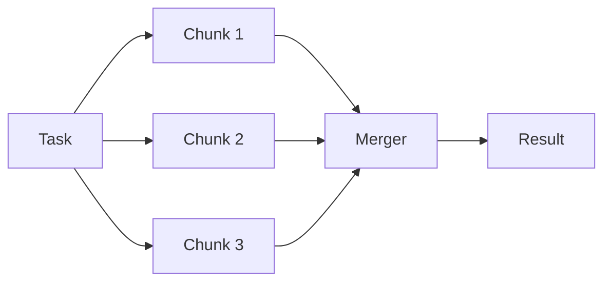

# Pattern: Parallelization

> Doing 12 things one at a time is not a strategy. It is a queue with delusions of grandeur.

**Type:** Build
**Languages:** Python
**Prerequisites:** 04-01 The Agent Loop, basic Python async
**Time:** ~45 min
**Learning Objectives:**
- Identify tasks that are embarrassingly parallel vs. sequentially dependent
- Implement fan-out/fan-in using `asyncio.gather` with the async Anthropic client
- Implement a voting pattern to increase output confidence
- Choose between `asyncio` and `ThreadPoolExecutor` for the right use case
- Merge parallel outputs without introducing hallucination artifacts

---

## THE PROBLEM

A research agent reads 12 documents and produces a summary of each before writing a final synthesis. Each `messages.create()` call takes about 20 seconds. Running sequentially, the full pipeline takes 4 minutes. Users click away after 45 seconds. The feature gets blamed. The actual problem is not latency: it is sequentiality.

The 12 document summaries have no dependency on each other. Document 7's summary does not need Document 3's summary to exist first. You are making 12 independent requests one after another for no reason except that the code was written with a `for` loop.

This is embarrassingly parallel work. The term "embarrassingly" is not pejorative; it means the parallelism is so obvious it requires no coordination. Each unit of work is independent. There is no shared state, no ordering constraint, no race condition to manage.

Production AI systems hit this pattern constantly: summarize N documents, classify N inputs, evaluate N candidates, translate N strings. The sequential version is always the first draft. The parallel version is what ships.

There is a second problem adjacent to this one: single-point-of-output fragility. When you call the model once and get one answer, that answer may be good or it may be a low-probability outlier. For high-stakes decisions, you want the model to "vote." Run the same prompt three times, collect three answers, pick the majority. The expected cost of a bad output drops significantly.

---

## THE CONCEPT

### Two Sub-Patterns

Parallelization covers two distinct techniques that solve different problems.

```
Sub-pattern      Problem it solves             Example
-----------      -------------------------     ---------------------------
Sectioning       N independent tasks           Summarize 12 documents
                 taking too long in sequence

Voting           One task, uncertain output    Classify sentiment 3 ways
                 needing higher confidence     and take the majority
```

Both use the same fan-out/fan-in shape, but the intent and the merge logic are different.

### Fan-Out / Fan-In



Fan-out: one task becomes N concurrent subtasks. Fan-in: N concurrent results become one merged output. The merger is where you decide what "combining" means: concatenate summaries, synthesize themes, pick majority vote.

### Sectioning vs. Voting: Side by Side

```
SECTIONING                           VOTING
-------------------------------      --------------------------------
Goal: process N different inputs     Goal: process 1 input N times
      in parallel                          with varied outputs

Each call:  unique input              Each call: same prompt + input
            unique output                       different output (temp > 0)

Merge:  combine all N outputs         Merge: pick majority or synthesize

Use when: N independent tasks         Use when: 1 high-stakes decision
          each takes >1s              needs confidence signal

Risk: merger introduces noise         Risk: all 3 votes are wrong
      if not carefully designed             (model consensus failure)
```

### Why Async for I/O-Bound Work

LLM API calls are I/O-bound: your code spends almost all its time waiting for the network. During that wait, the Python interpreter is idle. `asyncio` lets the interpreter switch to other tasks while waiting, so all 12 requests are in-flight simultaneously. The total time becomes roughly the time of the single slowest request, not the sum.

`ThreadPoolExecutor` does the same thing via OS threads. Both work. The right choice depends on whether your codebase is async or sync, not on performance differences for I/O-bound work.

---

## BUILD IT

### Step 1: Sectioning with asyncio.gather

Install the async client: the Anthropic Python SDK has a built-in async client. No extra package needed.

```python
import asyncio
import anthropic

async def summarize_document(client: anthropic.AsyncAnthropic, doc: str, doc_id: int) -> dict:
    """Summarize a single document. Designed to run concurrently."""
    message = await client.messages.create(
        model="claude-3-5-haiku-20241022",
        max_tokens=256,
        messages=[
            {
                "role": "user",
                "content": f"Summarize this document in 2-3 sentences:\n\n{doc}"
            }
        ]
    )
    return {
        "doc_id": doc_id,
        "summary": message.content[0].text
    }


async def summarize_all(documents: list[str]) -> list[dict]:
    """Fan-out: run all summaries concurrently. Fan-in: collect results."""
    client = anthropic.AsyncAnthropic()

    # Create all coroutines first (does NOT start them yet)
    tasks = [
        summarize_document(client, doc, i)
        for i, doc in enumerate(documents)
    ]

    # asyncio.gather launches all coroutines concurrently and waits for all
    results = await asyncio.gather(*tasks)

    return list(results)


async def synthesize_summaries(summaries: list[dict]) -> str:
    """Merge step: synthesize all summaries into a final report."""
    client = anthropic.AsyncAnthropic()

    # Build a structured input from all summaries
    summaries_text = "\n\n".join(
        f"Document {s['doc_id']}:\n{s['summary']}"
        for s in sorted(summaries, key=lambda x: x["doc_id"])
    )

    message = await client.messages.create(
        model="claude-3-5-haiku-20241022",
        max_tokens=512,
        messages=[
            {
                "role": "user",
                "content": (
                    "You have received summaries of multiple documents. "
                    "Write a 1-paragraph synthesis that identifies the key themes "
                    "across all documents.\n\n"
                    f"{summaries_text}"
                )
            }
        ]
    )
    return message.content[0].text


async def research_pipeline(documents: list[str]) -> str:
    import time

    print(f"Summarizing {len(documents)} documents in parallel...")
    start = time.time()

    summaries = await summarize_all(documents)

    elapsed = time.time() - start
    print(f"All {len(documents)} summaries done in {elapsed:.1f}s")

    synthesis = await synthesize_summaries(summaries)
    return synthesis
```

> **Real-world check:** Your team lead asks: "Why not just add `await` to a for loop? That's still async, right?" What is the critical difference between `for doc in docs: await summarize(doc)` and `asyncio.gather(*[summarize(doc) for doc in docs])`?

The `for` loop with `await` is sequential: each `await` pauses until that one call completes before starting the next. `asyncio.gather` launches all coroutines before awaiting any of them, so all calls are in-flight at once. The `for` loop saves no time compared to sync code. `asyncio.gather` reduces total time from `N * latency` to approximately `max(latency)`.

### Step 2: Voting with Temperature

```python
async def vote_on_classification(text: str, n_votes: int = 3) -> str:
    """
    Run the same classification prompt N times with temperature > 0.
    Return the majority vote.
    """
    client = anthropic.AsyncAnthropic()

    async def single_vote(vote_id: int) -> str:
        message = await client.messages.create(
            model="claude-3-5-haiku-20241022",
            max_tokens=64,
            temperature=0.7,  # Vary outputs so voting is meaningful
            messages=[
                {
                    "role": "user",
                    "content": (
                        "Classify the sentiment of this text as exactly one of: "
                        "POSITIVE, NEGATIVE, or NEUTRAL.\n"
                        "Respond with only the label.\n\n"
                        f"Text: {text}"
                    )
                }
            ]
        )
        return message.content[0].text.strip().upper()

    # Run N votes concurrently
    votes = await asyncio.gather(*[single_vote(i) for i in range(n_votes)])
    print(f"Votes received: {votes}")

    # Majority picker
    from collections import Counter
    counts = Counter(votes)
    winner, count = counts.most_common(1)[0]

    if count > n_votes // 2:
        return winner
    else:
        # Tie: synthesize rather than pick arbitrarily
        return await synthesize_votes(text, votes)


async def synthesize_votes(text: str, votes: list[str]) -> str:
    """Fallback when there is no clear majority: ask model to resolve."""
    client = anthropic.AsyncAnthropic()
    message = await client.messages.create(
        model="claude-3-5-haiku-20241022",
        max_tokens=64,
        messages=[
            {
                "role": "user",
                "content": (
                    f"Three classifiers disagreed on this text: {votes}. "
                    f"Text: '{text}'. "
                    "Give the single best label: POSITIVE, NEGATIVE, or NEUTRAL."
                )
            }
        ]
    )
    return message.content[0].text.strip().upper()
```

---

## USE IT

### Same Patterns with ThreadPoolExecutor (Sync Client)

When your codebase is not async (a Flask app, a script, a Jupyter notebook), use `concurrent.futures.ThreadPoolExecutor` with the sync `anthropic.Anthropic()` client. The pattern is identical: fan-out via `executor.map` or `executor.submit`, fan-in via collecting futures.

```python
import anthropic
from concurrent.futures import ThreadPoolExecutor, as_completed

def summarize_document_sync(args: tuple) -> dict:
    """Sync version. Takes a tuple because executor.map passes single args."""
    client, doc, doc_id = args
    message = client.messages.create(
        model="claude-3-5-haiku-20241022",
        max_tokens=256,
        messages=[{"role": "user", "content": f"Summarize in 2-3 sentences:\n\n{doc}"}]
    )
    return {"doc_id": doc_id, "summary": message.content[0].text}


def summarize_all_sync(documents: list[str], max_workers: int = 10) -> list[dict]:
    """
    ThreadPoolExecutor version. Use when:
    - Your codebase is sync (Flask, script, notebook)
    - You need max_workers control for rate limiting
    """
    client = anthropic.Anthropic()

    args = [(client, doc, i) for i, doc in enumerate(documents)]

    with ThreadPoolExecutor(max_workers=max_workers) as executor:
        results = list(executor.map(summarize_document_sync, args))

    return results


def vote_sync(text: str, n_votes: int = 3) -> str:
    """Voting pattern via threads. Same logic, sync client."""
    client = anthropic.Anthropic()

    def single_vote(_: int) -> str:
        message = client.messages.create(
            model="claude-3-5-haiku-20241022",
            max_tokens=64,
            temperature=0.7,
            messages=[{
                "role": "user",
                "content": (
                    "Classify as POSITIVE, NEGATIVE, or NEUTRAL. "
                    f"Respond with only the label.\n\nText: {text}"
                )
            }]
        )
        return message.content[0].text.strip().upper()

    from collections import Counter
    with ThreadPoolExecutor(max_workers=n_votes) as executor:
        votes = list(executor.map(single_vote, range(n_votes)))

    print(f"Votes: {votes}")
    counts = Counter(votes)
    return counts.most_common(1)[0][0]
```

### When to Use Each

```
asyncio + AsyncAnthropic          ThreadPoolExecutor + Anthropic
-------------------------------   --------------------------------
Codebase is already async         Codebase is sync
FastAPI, aiohttp, async scripts   Flask, Django sync views, scripts
Need fine-grained concurrency     Need simple max_workers cap
control per coroutine             for rate limiting

Limitation: requires async all    Limitation: thread overhead for
the way up the call stack         very large N (>50 workers)
```

> **Perspective shift:** A colleague says "async is always faster than threads for API calls." Is that true? When would you choose threads over async even for pure I/O-bound work?

For I/O-bound API calls, both approaches offer similar throughput. Choose threads when integrating with sync-only libraries, legacy codebases, or frameworks that don't support async (many ORMs, some database drivers). The performance difference for 10-50 concurrent LLM calls is negligible. The architecture difference is real: async infects the call stack (every caller must also be async), while threads don't.

---

## SHIP IT

The reusable artifact from this lesson is `outputs/skill-parallelization.md`. It contains both sub-patterns (sectioning and voting) as copy-paste templates, with the merger and rate-limit handling included.

The artifact is intentionally stripped of domain-specific logic (no "document" or "sentiment" references). Drop in your own prompt, your own input list, and choose the merge strategy that fits your task.

---

## EVALUATE IT

How do you know parallelization actually worked and did not introduce quality regressions?

**Latency check.** Time the sequential version and the parallel version on the same N inputs. Parallel should be close to `1/N` of the sequential time. If it is not, check for rate limiting: the API may be serializing requests on its end. Reduce `max_workers` or add a semaphore.

**Output equivalence.** For sectioning, run both versions on the same 10 documents. The individual summaries should be equivalent in quality. Use an LLM-as-judge to score both sets on the same rubric. If parallel summaries score lower, the issue is usually the merger, not the parallel calls themselves.

**Vote stability.** For voting with 3 runs: track how often all 3 votes agree (consensus rate) vs. how often there is a split. A consensus rate below 60% on your task means the task is ambiguous or the prompt is underspecified. That is a signal to fix the prompt, not to increase votes.

**Rate limit headroom.** Log the `x-ratelimit-remaining-requests` header. If it hits zero during parallel execution, you are hitting the API rate limit. Add a `asyncio.Semaphore` to cap concurrency:

```python
sem = asyncio.Semaphore(5)  # Max 5 concurrent requests

async def summarize_with_limit(client, doc, doc_id):
    async with sem:
        return await summarize_document(client, doc, doc_id)
```
