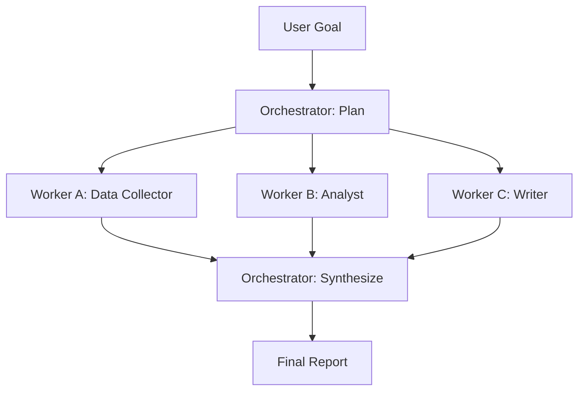

# النمط: Orchestrator-Workers (المنسّق والعمّال)

> العامّ (generalist) الذي يحاول فعل كل شيء يؤدي كل أمر أسوأ من المتخصص الذي يفعل أمرًا واحدًا.

**النوع:** بناء
**اللغات:** Python
**المتطلبات:** 04-01 حلقة الـ agent، 04-05 التوازي
**الوقت:** ~60 دقيقة
**أهداف التعلّم:**
- شرح لماذا يتدهور استدعاء LLM واحد في المهام المعقدة متعددة الأدوار
- بناء orchestrator خام يُنتج خطة عمل مُهيكلة
- بناء عمّال (workers) ذوي أنواع محددة بـ system prompts متخصصة
- توصيل مخرجات الـ orchestrator بمدخلات العمّال من دون كود توجيه يدوي
- إضافة تحقق من المخرَج (output validation) لالتقاط استجابات العمّال المشوّهة قبل التوليف

---

## المشكلة

يطلب مدير منتج من نظام الذكاء الاصطناعي إنتاج تقرير أبحاث سوق عن منافس. يُسلَّم الـ prompt إلى استدعاء LLM واحد: "ابحث عن المنافس X وأنتج تقريرًا يغطي بيانات السوق، والتحليل الاستراتيجي، وملخصًا تنفيذيًا مكتوبًا."

المخرَج متوسط عبر الأبعاد الثلاثة كلها. قسم بيانات السوق فيه إحصاءات مبهمة بلا مصادر. والتحليل الاستراتيجي عام. والملخص التنفيذي محشوّ. لا جزء منه خاطئ بما يكفي لرفضه، ولا جزء جيد بما يكفي لاستخدامه من دون تحرير كبير.

المشكلة ليست في قدرة النموذج. إنها تصادم الأدوار (role collision). نافذة سياق واحدة (context window) يُطلب منها أن تكون باحث بيانات، ومحلّلًا استراتيجيًا، وكاتبًا تجاريًا في آن واحد. كل دور يحتاج إلى عقلية مختلفة مرمّزة في system prompt، وتعليمات مختلفة لما ينبغي إعطاؤه الأولوية، ومتطلبات صيغة مخرَج مختلفة. حشر ثلاثة أدوار في استدعاء واحد يعني ألا ينال أيٌّ منها الانتباه الذي يحتاجه.

هذا هو نمط orchestrator-workers: مهمة تتطلب كفاءات (competencies) متمايزة متعددة تُقسَّم إلى مهام فرعية، تتولى كل واحدة منها عاملٌ مُحسَّن لتلك المهمة الفرعية. ويُنسّق استدعاء orchestrator منفصل العمل: يقرأ الهدف، ويقرّر أي العمّال يُرسِل وبأي ترتيب، ويُولِّف النتائج في مخرَج نهائي.

يظهر النمط باستمرار في الإنتاج: agent دعم عملاء يوجّه إلى متخصص فوترة، أو مستكشف أعطال تقني، أو كاتب تصعيد. agent مراجعة كود يُرسِل إلى فاحص أمني، ومدقّق أداء، وفاحص أسلوب. خط أنابيب محتوى به باحث، ومدقّق حقائق، وكاتب نصوص.

---

## المفهوم

### لماذا ينجح التخصص

حين يتلقى النموذج system prompt مكتوبًا بعناية يقول "أنت محلّل بيانات. مهمتك تفسير البيانات الكمّية واستخلاص نتائج قابلة للدفاع عنها. لا تُبدِ رأيًا تحريريًا"، تكون مخرجاته في ذلك الدور أفضل مما لو تلقّى prompt عامًا وكان مُتوقَّعًا منه ضمنًا أن يؤدي التحليل والكتابة والبحث في آن واحد.

الـ system prompts ليست سحرًا: إنها لا تُطلِق قدرات خفية. بل تفعل شيئًا أكثر عملية: تُقيّد فضاء المخرَج (output space) وتركّز الانتباه. prompt العامل المتخصص يزيل الغموض حول الشكل الذي يبدو عليه النجاح.

### مهمة الـ orchestrator

الـ orchestrator لا ينفّذ العمل. بل يخطّط العمل ويوّلف النتائج. مسؤولياته:

1. تفكيك الهدف إلى قائمة مُهيكلة من المهام الفرعية
2. إسناد كل مهمة فرعية إلى نوع عامل
3. إرسال العمّال (بالتوازي أو بالتسلسل حسب الاعتماديات)
4. توليف مخرجات العمّال في استجابة نهائية



### تدفّقات الرسائل

كل استدعاء له دور متمايز ويتلقى سياقًا مختلفًا:

```
ORCHESTRATOR (planning call)
Input:  user goal
Output: JSON plan with subtasks and worker assignments

WORKER A (data_collector)
System: "You are a data collector. Find and organize factual data.
         Output structured facts only, no analysis."
Input:  subtask description + relevant context
Output: structured data

WORKER B (analyst)
System: "You are a strategic analyst. Interpret data to draw conclusions.
         Be specific. Cite data points."
Input:  subtask description + worker A output
Output: analysis

WORKER C (writer)
System: "You are a business writer. Write clearly for an executive audience.
         Use the analysis provided. Do not add new facts."
Input:  subtask description + worker B output
Output: final narrative

ORCHESTRATOR (synthesis call)
Input:  all worker outputs + original goal
Output: final integrated report
```

### العمّال التسلسليون مقابل المتوازين

```
PARALLEL workers:               SEQUENTIAL workers:
No dependency between them      Worker B needs Worker A's output

data_collector [===]            data_collector [===]
analyst        [===]                           analyst   [===]
writer         [===]                                     writer [===]

Use: asyncio.gather             Use: chain outputs explicitly
```

---

## البناء

### الخطوة 1: استدعاء التخطيط في الـ orchestrator

يتلقى الـ orchestrator الهدف ويُعيد قائمة JSON من المهام الفرعية. كل مهمة فرعية تسمّي نوع العامل، ووصف المهمة، والمدخلات التي يحتاجها العامل.

```python
import json
import anthropic

ORCHESTRATOR_SYSTEM = """You are a research orchestrator. Your job is to decompose a complex
research goal into a list of subtasks, each assigned to a specialist worker.

Available worker types:
- data_collector: gathers and organizes factual data and statistics
- analyst: interprets data and draws strategic conclusions
- writer: produces polished narrative content for an executive audience

Return a JSON object with this exact structure:
{
  "goal_summary": "one sentence restatement of the goal",
  "subtasks": [
    {
      "id": "t1",
      "worker_type": "data_collector",
      "task": "Collect key market size, growth rate, and competitor count data for [domain]",
      "depends_on": []
    },
    {
      "id": "t2",
      "worker_type": "analyst",
      "task": "Analyze the market data to identify strategic opportunities and risks",
      "depends_on": ["t1"]
    },
    {
      "id": "t3",
      "worker_type": "writer",
      "task": "Write a 3-paragraph executive summary of the market position",
      "depends_on": ["t1", "t2"]
    }
  ]
}

Return only valid JSON. No markdown formatting, no code blocks."""


def orchestrate_plan(goal: str) -> dict:
    """Call the orchestrator to produce a work plan."""
    client = anthropic.Anthropic()
    message = client.messages.create(
        model="claude-3-5-haiku-20241022",
        max_tokens=1024,
        system=ORCHESTRATOR_SYSTEM,
        messages=[{"role": "user", "content": f"Goal: {goal}"}]
    )
    return json.loads(message.content[0].text)
```

### الخطوة 2: system prompts الخاصة بالعمّال

لكل نوع عامل system prompt متمايز يُقيّد دوره.

```python
WORKER_SYSTEMS = {
    "data_collector": """You are a market data collector. Your only job is to gather and
organize factual information relevant to the task. Present data as structured lists or
tables. Do not analyze or interpret. Do not editorialize.
Format: Use bullet points for data points. Include approximate figures when exact ones
are unavailable, and mark them as estimates.""",

    "analyst": """You are a strategic analyst. Your job is to interpret data and draw
defensible conclusions. Be specific: cite data points. Identify the top 2-3 strategic
implications. Do not write narrative prose. Use structured sections.
Format: ## Finding, then bullet points with supporting evidence.""",

    "writer": """You are a business writer for an executive audience. Write clearly,
concisely, and without jargon. Use only the information provided to you. Do not add
facts or statistics not in your input. 3 paragraphs maximum.
Format: Plain prose, no headers, no bullets.""",
}
```

### الخطوة 3: إرسال العامل

```python
def run_worker(worker_type: str, task: str, context: str = "") -> str:
    """Run a single worker with its specialized system prompt."""
    client = anthropic.Anthropic()

    user_content = f"Task: {task}"
    if context:
        user_content += f"\n\nContext from previous work:\n{context}"

    message = client.messages.create(
        model="claude-3-5-haiku-20241022",
        max_tokens=512,
        system=WORKER_SYSTEMS[worker_type],
        messages=[{"role": "user", "content": user_content}]
    )
    return message.content[0].text
```

### الخطوة 4: تنفيذ الخطة

```python
def execute_plan(goal: str, plan: dict) -> dict:
    """
    Execute subtasks in dependency order.
    Simple topological execution: tasks with no unfulfilled deps run next.
    """
    completed: dict[str, str] = {}

    subtasks = plan["subtasks"]

    # Simple sequential execution respecting depends_on order
    # For production: use asyncio.gather for tasks with same deps
    for subtask in subtasks:
        # Build context from dependencies
        context_parts = []
        for dep_id in subtask.get("depends_on", []):
            if dep_id in completed:
                context_parts.append(f"[{dep_id}]:\n{completed[dep_id]}")
        context = "\n\n".join(context_parts)

        print(f"  Running {subtask['worker_type']} ({subtask['id']})...")
        output = run_worker(
            worker_type=subtask["worker_type"],
            task=subtask["task"],
            context=context
        )
        completed[subtask["id"]] = output
        print(f"  Done: {output[:80]}...")

    return completed


def synthesize_report(goal: str, completed: dict, plan: dict) -> str:
    """Final orchestrator call: synthesize all worker outputs."""
    client = anthropic.Anthropic()

    all_outputs = "\n\n".join(
        f"=== {task['id']} ({task['worker_type']}) ===\n{completed[task['id']]}"
        for task in plan["subtasks"]
        if task["id"] in completed
    )

    message = client.messages.create(
        model="claude-3-5-haiku-20241022",
        max_tokens=1024,
        messages=[
            {
                "role": "user",
                "content": (
                    f"Original goal: {goal}\n\n"
                    f"Worker outputs:\n{all_outputs}\n\n"
                    "Synthesize these outputs into a cohesive final report. "
                    "Integrate the data, analysis, and writing. "
                    "Resolve any contradictions. Keep it under 400 words."
                )
            }
        ]
    )
    return message.content[0].text


def run_market_research(goal: str) -> str:
    """Full pipeline: plan, execute, synthesize."""
    print(f"\nGoal: {goal}")
    print("Step 1: Orchestrating plan...")
    plan = orchestrate_plan(goal)
    print(f"  Subtasks: {[t['id'] + ':' + t['worker_type'] for t in plan['subtasks']]}")

    print("Step 2: Executing workers...")
    completed = execute_plan(goal, plan)

    print("Step 3: Synthesizing report...")
    report = synthesize_report(goal, completed, plan)
    return report
```

> **اختبار من الواقع:** يُعيد الـ orchestrator خطة بخمس مهام فرعية. يفشل أحد العمّال في منتصف الطريق ويُعيد سلسلة خطأ بدلًا من مخرَج مُهيكل. ويتلقى استدعاء التوليف سلسلة الخطأ كما لو كانت مخرَجًا صالحًا. ما الذي ينبغي إضافته لمنع هذا من تسميم التقرير النهائي؟

أضف تحققًا من المخرَج قبل التوليف. بعد كل استدعاء عامل، تحقّق مما إذا كان المخرَج يطابق الصيغة المتوقعة لنوع ذلك العامل (بيانات مُهيكلة، أو أقسام تحليل، أو نثر). إذا فشل التحقق، فإما أن تعيد محاولة العامل بـ prompt مصحّح، أو تضع علامة على تلك المهمة الفرعية كفاشلة وتُعلِم استدعاء التوليف بالإشارة إلى الفجوة. لا تمرّر أبدًا سلسلة خطأ خام كسياق للخطوة التالية.

---

## الاستخدام

### معاد البناء مع Worker Dataclass وصنف Orchestrator

النسخة الخام تحوي كل المنطق لكن الاقتران (coupling) ظاهر: سلاسل نوع العامل تُستخدم في أماكن متعددة، والتحقق غائب، وتنفيذ الخطة إجرائي. إعادة البناء في صنف تجعل النمط قابلًا لإعادة الاستخدام وتضيف التحقق.

```python
import json
from dataclasses import dataclass
import anthropic


@dataclass
class WorkerResult:
    task_id: str
    worker_type: str
    output: str
    valid: bool
    error: str = ""


class Orchestrator:
    def __init__(self):
        self.client = anthropic.Anthropic()
        self.worker_systems = WORKER_SYSTEMS  # reuse from above

    def plan(self, goal: str) -> dict:
        """Generate a work plan for the given goal."""
        message = self.client.messages.create(
            model="claude-3-5-haiku-20241022",
            max_tokens=1024,
            system=ORCHESTRATOR_SYSTEM,
            messages=[{"role": "user", "content": f"Goal: {goal}"}]
        )
        return json.loads(message.content[0].text)

    def dispatch_worker(self, worker_type: str, task: str, context: str = "") -> WorkerResult:
        """Dispatch one worker and validate its output."""
        if worker_type not in self.worker_systems:
            return WorkerResult(
                task_id="",
                worker_type=worker_type,
                output="",
                valid=False,
                error=f"Unknown worker type: {worker_type}"
            )

        user_content = f"Task: {task}"
        if context:
            user_content += f"\n\nContext:\n{context}"

        message = self.client.messages.create(
            model="claude-3-5-haiku-20241022",
            max_tokens=512,
            system=self.worker_systems[worker_type],
            messages=[{"role": "user", "content": user_content}]
        )
        output = message.content[0].text

        # Validation: check output is non-empty and has minimum length
        valid = len(output.strip()) > 50
        error = "" if valid else "Output too short - likely a failed response"

        return WorkerResult(
            task_id="",
            worker_type=worker_type,
            output=output,
            valid=valid,
            error=error
        )

    def execute(self, goal: str, plan: dict) -> dict[str, WorkerResult]:
        """Execute the plan, collecting WorkerResult per task."""
        results: dict[str, WorkerResult] = {}

        for subtask in plan["subtasks"]:
            context_parts = [
                f"[{dep}]:\n{results[dep].output}"
                for dep in subtask.get("depends_on", [])
                if dep in results and results[dep].valid
            ]
            context = "\n\n".join(context_parts)

            result = self.dispatch_worker(
                worker_type=subtask["worker_type"],
                task=subtask["task"],
                context=context
            )
            result.task_id = subtask["id"]
            results[subtask["id"]] = result

            if not result.valid:
                print(f"  WARNING: {subtask['id']} produced invalid output: {result.error}")

        return results

    def synthesize(self, goal: str, results: dict[str, WorkerResult], plan: dict) -> str:
        """Synthesize valid worker outputs. Note any gaps from failed workers."""
        valid_outputs = []
        failed_tasks = []

        for task in plan["subtasks"]:
            tid = task["id"]
            if tid in results and results[tid].valid:
                valid_outputs.append(
                    f"=== {tid} ({task['worker_type']}) ===\n{results[tid].output}"
                )
            else:
                failed_tasks.append(f"{tid} ({task['worker_type']})")

        all_outputs = "\n\n".join(valid_outputs)

        gap_note = ""
        if failed_tasks:
            gap_note = f"\nNote: The following subtasks failed and their output is missing: {', '.join(failed_tasks)}. Acknowledge these gaps in the report."

        message = self.client.messages.create(
            model="claude-3-5-haiku-20241022",
            max_tokens=1024,
            messages=[{
                "role": "user",
                "content": (
                    f"Original goal: {goal}\n\n"
                    f"Worker outputs:\n{all_outputs}"
                    f"{gap_note}\n\n"
                    "Synthesize into a cohesive final report under 400 words."
                )
            }]
        )
        return message.content[0].text

    def run(self, goal: str) -> str:
        """Full pipeline."""
        plan = self.plan(goal)
        results = self.execute(goal, plan)
        return self.synthesize(goal, results, plan)
```

> **نقلة في المنظور:** يقترح زميل استبدال الـ orchestrator بدالة توجيه مبرمَجة (hardcoded): "إن وُجدت 'data' في الهدف، فأرسِل data_collector أولًا." ما الذي يمنحك إياه orchestrator يعتمد على LLM ولا يستطيع التوجيه المبرمَج منحه؟

يستطيع الـ orchestrator المعتمد على LLM التعامل مع هياكل أهداف جديدة لم يرها من قبل. أما التوجيه المبرمَج فلا يتعامل إلا مع الحالات التي توقّعها المهندس. الـ orchestrator الذي يخطّط ديناميكيًا يستطيع التعامل مع أهداف "ابحث وابنِ ولخّص"، وتنويع عدد العمّال بناءً على تعقيد المهمة، وإعادة ترتيب الاعتماديات حين يكون ذلك مناسبًا، وتكييف إسناد العمّال للسياق. تخسر هذا التعميم في اللحظة التي تُبرمِج فيها منطق التوجيه.

---

## التسليم

المُخرَج (artifact) القابل لإعادة الاستخدام من هذا الدرس هو `outputs/skill-orchestrator-workers.md`. يحوي قالب system prompt الخاص بالـ orchestrator، ونمط إرسال العامل، وإرشادات لإضافة أنواع عمّال جديدة.

أدرجه في أي مشروع يحاول فيه استدعاء LLM واحد أداء وظائف متمايزة متعددة. أضف أنواع العمّال الخاصة بك مع system prompts الخاصة بها. وprompt التوليف يبقى متماثلًا تقريبًا عبر حالات الاستخدام.

---

## التقييم

كيف تعرف أن نمط orchestrator-workers يحسّن جودة المخرَج فعلًا؟

**مقارنة المتخصصين.** خذ 10 أهداف تمثيلية. شغّل كل واحد عبر: (أ) استدعاء واحد عام الغرض، (ب) خط أنابيب orchestrator-workers. استخدم LLM-as-judge لتقييم كل مخرَج على الدقة، والعمق، والتماسك. توقّع أن يفوز orchestrator-workers في العمق. إن لم يفعل، فإن system prompts الخاصة بالعمّال غير متمايزة بما يكفي.

**معدل صلاحية الخطة.** سجّل كل استدعاء تخطيط في الـ orchestrator وحلّل الـ JSON. تتبّع نسبة الخطط التي تكون JSON صالحًا (قابلًا للتحليل وصحيحًا بنيويًا). معدل أقل من 95% يعني أن system prompt الخاص بالـ orchestrator يحتاج إلى إحكام. حالات الفشل الشائعة: markdown إضافي في الـ JSON، أو حقل `depends_on` مفقود، أو أسماء أنواع عمّال غير صالحة.

**معدل نجاح العامل.** لكل نوع عامل، سجّل علامة valid من `WorkerResult`. إذا كان لـ `analyst` معدل نجاح 70% بينما لـ `data_collector` معدل 98%، فحقّق في prompt المحلّل. معدل النجاح المنخفض لنوع عامل واحد يشير دائمًا تقريبًا إلى system prompt غير محدّد بما يكفي.

**أمانة التوليف.** تحقّق مما إذا كان مخرَج التوليف يُدخل حقائق غير موجودة في أي مخرَج عامل. اختر عيّنة من 20 توليفًا وأبرِز أي ادعاء لا يمكن تتبّعه إلى عامل. معدل أمانة أقل من 80% يعني أن prompt التوليف يحتاج إلى تعليمات تأريض (grounding) صريحة ("استخدم المخرجات المقدّمة فقط، لا تضف معلومات جديدة").
