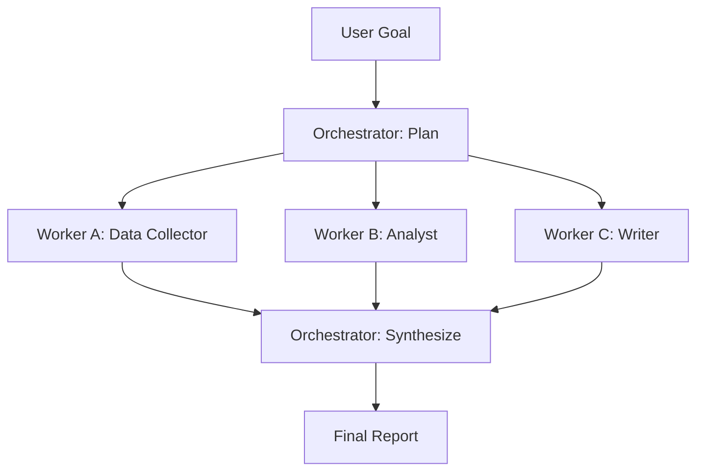

# Pattern: Orchestrator-Workers

> A generalist who tries to do everything does each thing worse than a specialist who does one thing.

**Type:** Build
**Languages:** Python
**Prerequisites:** 04-01 The Agent Loop, 04-05 Parallelization
**Time:** ~60 min
**Learning Objectives:**
- Explain why a single LLM call degrades on complex multi-role tasks
- Build a raw orchestrator that produces a structured work plan
- Implement typed workers with specialized system prompts
- Wire orchestrator outputs to worker inputs without manual routing code
- Add output validation to catch malformed worker responses before synthesis

---

## THE PROBLEM

A product manager asks the AI system to produce a market research report on a competitor. The prompt is handed to a single LLM call: "Research competitor X and produce a report covering market data, strategic analysis, and a written executive summary."

The output is mediocre across all three dimensions. The market data section has vague statistics without sources. The strategic analysis is generic. The executive summary is padded. No part is wrong enough to reject, but none is good enough to use without significant editing.

The problem is not the model's capability. It is the role collision. A single context window is being asked to be a data researcher, a strategic analyst, and a business writer at the same time. Each role needs a different mindset encoded in the system prompt, different instructions for what to prioritize, and different output format requirements. Cramming three roles into one call means none of them get the attention they need.

This is the orchestrator-workers pattern: a task that requires multiple distinct competencies is broken into subtasks, each handled by a worker optimized for that subtask. A separate orchestrator call coordinates the work: it reads the goal, decides what workers to dispatch and in what order, and synthesizes the results into a final output.

The pattern shows up constantly in production: a customer support agent that routes to a billing specialist, a technical troubleshooter, or an escalation writer. A code review agent that dispatches to a security checker, a performance auditor, and a style checker. A content pipeline with a researcher, a fact-checker, and a copywriter.

---

## THE CONCEPT

### Why Specialization Works

When a model receives a carefully written system prompt that says "You are a data analyst. Your job is to interpret quantitative data and draw defensible conclusions. Do not editorialize," its outputs in that role are better than when it receives a generic prompt and is implicitly expected to do analysis, writing, and research simultaneously.

System prompts are not magic: they do not unlock hidden abilities. They do something more practical: they constrain the output space and focus attention. A specialized worker prompt removes ambiguity about what success looks like.

### The Orchestrator's Job

The orchestrator does not execute work. It plans work and synthesizes results. Its responsibilities:

1. Parse the goal into a structured list of subtasks
2. Assign each subtask to a worker type
3. Dispatch workers (in parallel or in sequence depending on dependencies)
4. Synthesize worker outputs into a final response



### Message Flows

Each call has a distinct role and receives different context:

```
ORCHESTRATOR (planning call)
Input:  user goal
Output: JSON plan with subtasks and worker assignments

WORKER A (data_collector)
System: "You are a data collector. Find and organize factual data.
         Output structured facts only, no analysis."
Input:  subtask description + relevant context
Output: structured data

WORKER B (analyst)
System: "You are a strategic analyst. Interpret data to draw conclusions.
         Be specific. Cite data points."
Input:  subtask description + worker A output
Output: analysis

WORKER C (writer)
System: "You are a business writer. Write clearly for an executive audience.
         Use the analysis provided. Do not add new facts."
Input:  subtask description + worker B output
Output: final narrative

ORCHESTRATOR (synthesis call)
Input:  all worker outputs + original goal
Output: final integrated report
```

### Sequential vs. Parallel Workers

```
PARALLEL workers:               SEQUENTIAL workers:
No dependency between them      Worker B needs Worker A's output

data_collector [===]            data_collector [===]
analyst        [===]                           analyst   [===]
writer         [===]                                     writer [===]

Use: asyncio.gather             Use: chain outputs explicitly
```

---

## BUILD IT

### Step 1: The Orchestrator Planning Call

The orchestrator receives the goal and returns a JSON list of subtasks. Each subtask names the worker type, the task description, and what inputs the worker needs.

```python
import json
import anthropic

ORCHESTRATOR_SYSTEM = """You are a research orchestrator. Your job is to decompose a complex
research goal into a list of subtasks, each assigned to a specialist worker.

Available worker types:
- data_collector: gathers and organizes factual data and statistics
- analyst: interprets data and draws strategic conclusions
- writer: produces polished narrative content for an executive audience

Return a JSON object with this exact structure:
{
  "goal_summary": "one sentence restatement of the goal",
  "subtasks": [
    {
      "id": "t1",
      "worker_type": "data_collector",
      "task": "Collect key market size, growth rate, and competitor count data for [domain]",
      "depends_on": []
    },
    {
      "id": "t2",
      "worker_type": "analyst",
      "task": "Analyze the market data to identify strategic opportunities and risks",
      "depends_on": ["t1"]
    },
    {
      "id": "t3",
      "worker_type": "writer",
      "task": "Write a 3-paragraph executive summary of the market position",
      "depends_on": ["t1", "t2"]
    }
  ]
}

Return only valid JSON. No markdown formatting, no code blocks."""


def orchestrate_plan(goal: str) -> dict:
    """Call the orchestrator to produce a work plan."""
    client = anthropic.Anthropic()
    message = client.messages.create(
        model="claude-3-5-haiku-20241022",
        max_tokens=1024,
        system=ORCHESTRATOR_SYSTEM,
        messages=[{"role": "user", "content": f"Goal: {goal}"}]
    )
    return json.loads(message.content[0].text)
```

### Step 2: Worker System Prompts

Each worker type has a distinct system prompt that constrains its role.

```python
WORKER_SYSTEMS = {
    "data_collector": """You are a market data collector. Your only job is to gather and
organize factual information relevant to the task. Present data as structured lists or
tables. Do not analyze or interpret. Do not editorialize.
Format: Use bullet points for data points. Include approximate figures when exact ones
are unavailable, and mark them as estimates.""",

    "analyst": """You are a strategic analyst. Your job is to interpret data and draw
defensible conclusions. Be specific: cite data points. Identify the top 2-3 strategic
implications. Do not write narrative prose. Use structured sections.
Format: ## Finding, then bullet points with supporting evidence.""",

    "writer": """You are a business writer for an executive audience. Write clearly,
concisely, and without jargon. Use only the information provided to you. Do not add
facts or statistics not in your input. 3 paragraphs maximum.
Format: Plain prose, no headers, no bullets.""",
}
```

### Step 3: Worker Dispatch

```python
def run_worker(worker_type: str, task: str, context: str = "") -> str:
    """Run a single worker with its specialized system prompt."""
    client = anthropic.Anthropic()

    user_content = f"Task: {task}"
    if context:
        user_content += f"\n\nContext from previous work:\n{context}"

    message = client.messages.create(
        model="claude-3-5-haiku-20241022",
        max_tokens=512,
        system=WORKER_SYSTEMS[worker_type],
        messages=[{"role": "user", "content": user_content}]
    )
    return message.content[0].text
```

### Step 4: Execute the Plan

```python
def execute_plan(goal: str, plan: dict) -> dict:
    """
    Execute subtasks in dependency order.
    Simple topological execution: tasks with no unfulfilled deps run next.
    """
    completed: dict[str, str] = {}

    subtasks = plan["subtasks"]

    # Simple sequential execution respecting depends_on order
    # For production: use asyncio.gather for tasks with same deps
    for subtask in subtasks:
        # Build context from dependencies
        context_parts = []
        for dep_id in subtask.get("depends_on", []):
            if dep_id in completed:
                context_parts.append(f"[{dep_id}]:\n{completed[dep_id]}")
        context = "\n\n".join(context_parts)

        print(f"  Running {subtask['worker_type']} ({subtask['id']})...")
        output = run_worker(
            worker_type=subtask["worker_type"],
            task=subtask["task"],
            context=context
        )
        completed[subtask["id"]] = output
        print(f"  Done: {output[:80]}...")

    return completed


def synthesize_report(goal: str, completed: dict, plan: dict) -> str:
    """Final orchestrator call: synthesize all worker outputs."""
    client = anthropic.Anthropic()

    all_outputs = "\n\n".join(
        f"=== {task['id']} ({task['worker_type']}) ===\n{completed[task['id']]}"
        for task in plan["subtasks"]
        if task["id"] in completed
    )

    message = client.messages.create(
        model="claude-3-5-haiku-20241022",
        max_tokens=1024,
        messages=[
            {
                "role": "user",
                "content": (
                    f"Original goal: {goal}\n\n"
                    f"Worker outputs:\n{all_outputs}\n\n"
                    "Synthesize these outputs into a cohesive final report. "
                    "Integrate the data, analysis, and writing. "
                    "Resolve any contradictions. Keep it under 400 words."
                )
            }
        ]
    )
    return message.content[0].text


def run_market_research(goal: str) -> str:
    """Full pipeline: plan, execute, synthesize."""
    print(f"\nGoal: {goal}")
    print("Step 1: Orchestrating plan...")
    plan = orchestrate_plan(goal)
    print(f"  Subtasks: {[t['id'] + ':' + t['worker_type'] for t in plan['subtasks']]}")

    print("Step 2: Executing workers...")
    completed = execute_plan(goal, plan)

    print("Step 3: Synthesizing report...")
    report = synthesize_report(goal, completed, plan)
    return report
```

> **Real-world check:** Your orchestrator returns a plan with 5 subtasks. One worker fails midway and returns an error string instead of structured output. The synthesis call receives the error string as if it were valid output. What should you add to prevent this from poisoning the final report?

Add output validation before synthesis. After each worker call, check whether the output matches the expected format for that worker type (structured data, analysis sections, or prose). If validation fails, either retry the worker with a corrected prompt or mark that subtask as failed and instruct the synthesis call to note the gap. Never pass a raw error string as context to the next step.

---

## USE IT

### Refactored with Worker Dataclass and Orchestrator Class

The raw version has all the logic but the coupling is visible: worker type strings are used in multiple places, validation is absent, and the plan execution is procedural. Refactoring into a class makes the pattern reusable and adds validation.

```python
import json
from dataclasses import dataclass
import anthropic


@dataclass
class WorkerResult:
    task_id: str
    worker_type: str
    output: str
    valid: bool
    error: str = ""


class Orchestrator:
    def __init__(self):
        self.client = anthropic.Anthropic()
        self.worker_systems = WORKER_SYSTEMS  # reuse from above

    def plan(self, goal: str) -> dict:
        """Generate a work plan for the given goal."""
        message = self.client.messages.create(
            model="claude-3-5-haiku-20241022",
            max_tokens=1024,
            system=ORCHESTRATOR_SYSTEM,
            messages=[{"role": "user", "content": f"Goal: {goal}"}]
        )
        return json.loads(message.content[0].text)

    def dispatch_worker(self, worker_type: str, task: str, context: str = "") -> WorkerResult:
        """Dispatch one worker and validate its output."""
        if worker_type not in self.worker_systems:
            return WorkerResult(
                task_id="",
                worker_type=worker_type,
                output="",
                valid=False,
                error=f"Unknown worker type: {worker_type}"
            )

        user_content = f"Task: {task}"
        if context:
            user_content += f"\n\nContext:\n{context}"

        message = self.client.messages.create(
            model="claude-3-5-haiku-20241022",
            max_tokens=512,
            system=self.worker_systems[worker_type],
            messages=[{"role": "user", "content": user_content}]
        )
        output = message.content[0].text

        # Validation: check output is non-empty and has minimum length
        valid = len(output.strip()) > 50
        error = "" if valid else "Output too short - likely a failed response"

        return WorkerResult(
            task_id="",
            worker_type=worker_type,
            output=output,
            valid=valid,
            error=error
        )

    def execute(self, goal: str, plan: dict) -> dict[str, WorkerResult]:
        """Execute the plan, collecting WorkerResult per task."""
        results: dict[str, WorkerResult] = {}

        for subtask in plan["subtasks"]:
            context_parts = [
                f"[{dep}]:\n{results[dep].output}"
                for dep in subtask.get("depends_on", [])
                if dep in results and results[dep].valid
            ]
            context = "\n\n".join(context_parts)

            result = self.dispatch_worker(
                worker_type=subtask["worker_type"],
                task=subtask["task"],
                context=context
            )
            result.task_id = subtask["id"]
            results[subtask["id"]] = result

            if not result.valid:
                print(f"  WARNING: {subtask['id']} produced invalid output: {result.error}")

        return results

    def synthesize(self, goal: str, results: dict[str, WorkerResult], plan: dict) -> str:
        """Synthesize valid worker outputs. Note any gaps from failed workers."""
        valid_outputs = []
        failed_tasks = []

        for task in plan["subtasks"]:
            tid = task["id"]
            if tid in results and results[tid].valid:
                valid_outputs.append(
                    f"=== {tid} ({task['worker_type']}) ===\n{results[tid].output}"
                )
            else:
                failed_tasks.append(f"{tid} ({task['worker_type']})")

        all_outputs = "\n\n".join(valid_outputs)

        gap_note = ""
        if failed_tasks:
            gap_note = f"\nNote: The following subtasks failed and their output is missing: {', '.join(failed_tasks)}. Acknowledge these gaps in the report."

        message = self.client.messages.create(
            model="claude-3-5-haiku-20241022",
            max_tokens=1024,
            messages=[{
                "role": "user",
                "content": (
                    f"Original goal: {goal}\n\n"
                    f"Worker outputs:\n{all_outputs}"
                    f"{gap_note}\n\n"
                    "Synthesize into a cohesive final report under 400 words."
                )
            }]
        )
        return message.content[0].text

    def run(self, goal: str) -> str:
        """Full pipeline."""
        plan = self.plan(goal)
        results = self.execute(goal, plan)
        return self.synthesize(goal, results, plan)
```

> **Perspective shift:** A colleague proposes replacing the orchestrator with a hardcoded routing function: "if 'data' in goal, dispatch data_collector first." What does the LLM orchestrator give you that hardcoded routing cannot?

The LLM orchestrator can handle novel goal structures it has never seen before. Hardcoded routing only handles the cases the engineer anticipated. An orchestrator that plans dynamically can handle "research AND build AND summarize" goals, vary the number of workers based on task complexity, reorder dependencies when appropriate, and adapt worker assignments to context. You lose that generalization the moment you hardcode the routing logic.

---

## SHIP IT

The reusable artifact from this lesson is `outputs/skill-orchestrator-workers.md`. It contains the orchestrator system prompt template, the worker dispatch pattern, and guidance for adding new worker types.

Drop it into any project where a single LLM call is trying to do multiple distinct jobs. Add your own worker types with their system prompts. The synthesis prompt stays nearly identical across use cases.

---

## EVALUATE IT

How do you know the orchestrator-workers pattern is actually improving output quality?

**Specialist comparison.** Take 10 representative goals. Run each through: (a) a single general-purpose call, (b) the orchestrator-workers pipeline. Use an LLM-as-judge to score each output on accuracy, depth, and coherence. Expect orchestrator-workers to win on depth. If it does not, the worker system prompts are not differentiated enough.

**Plan validity rate.** Log every orchestrator planning call and parse the JSON. Track what fraction of plans are valid JSON (parseable and structurally correct). A rate below 95% means the orchestrator system prompt needs tightening. Common failures: extra markdown in JSON, missing `depends_on` field, invalid worker type names.

**Worker pass rate.** For each worker type, log the valid flag from `WorkerResult`. If `analyst` has a 70% pass rate but `data_collector` has 98%, investigate the analyst prompt. A low pass rate for one worker type almost always points to an underspecified system prompt.

**Synthesis faithfulness.** Check whether the synthesis output introduces facts not present in any worker output. Sample 20 syntheses and highlight any claim that cannot be traced to a worker. A faithfulness rate below 80% means the synthesis prompt needs explicit grounding instructions ("use only the provided outputs, do not add new information").
