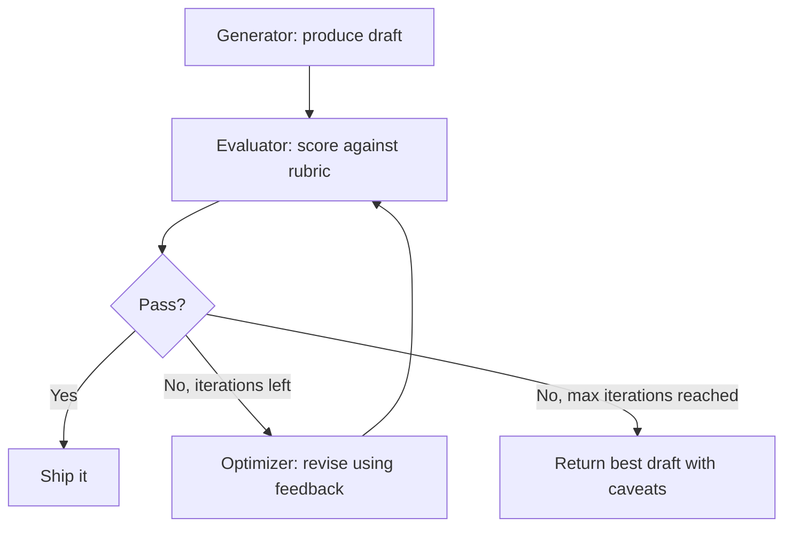

# النمط: Evaluator-Optimizer (المُقيّم والمُحسّن)

> المسوّدة الأولى ليست المخرَج. إنها نقطة البداية.

**النوع:** بناء
**اللغات:** Python
**المتطلبات:** 04-01 حلقة الـ agent، 04-06 Orchestrator-Workers
**الوقت:** ~60 دقيقة
**أهداف التعلّم:**
- شرح لماذا يُنتج التوليد بمرور واحد (single-pass) مخرجات متوسطة بشكل منهجي
- بناء حلقة evaluator-optimizer خام مع معيار (rubric) مُهيكل وتقييم بصيغة JSON
- بناء حلقة تتكرر حتى النجاح أو بلوغ max_iterations
- إعادة البناء في صنف EvalOptimizeLoop مع مُقيّمات (evaluators) قابلة للاستبدال
- توصيل الحلقة بمُقيّم human-in-the-loop للقرارات عالية الرهان

---

## المشكلة

يستخدم فريق منتج LLM لتوليد أوصاف منتجات لكتالوج متجرهم الإلكتروني. تأتي المسودات الأولى مقبولة لكنها غير مقنعة: تُغفِل منافع رئيسية، وتستخدم لغة عامة، وتدفن عرض القيمة (value proposition). يراجع محرّر بشري كل واحدة. وبعد ثلاث جولات تحرير، يصبح كل وصف جيدًا أخيرًا.

هذا مكلِف وبطيء. لكن تأمّل ما يفعله المحرّر البشري: يقرأ المسوّدة، ويحدّد مشكلات بعينها ("مبهم جدًا"، "قائمة الميزات قبل المنفعة"، "لا دعوة لاتخاذ إجراء")، ويقدّم تغذية راجعة دقيقة تدفع المراجعة التالية. تلك عملية قابلة للمراجعة والتكرار. ويستطيع الـ LLM القيام بها.

نمط evaluator-optimizer يستبدل حلقة المراجعة البشرية بأخرى آلية. استدعاء مولّد (generator) يُنتج مسوّدة. واستدعاء مُقيّم (evaluator) يقرأ المسوّدة مقابل معيار ويُعيد تغذية راجعة مُهيكلة: نتيجة، وقائمة بمشكلات بعينها، وقرار نجاح/فشل. إذا فشلت المسوّدة، فإن استدعاء مُحسّن (optimizer) يأخذ المسوّدة والمشكلات ويُنتج مراجعة. تستمر الحلقة حتى يُجيز المُقيّم المخرَج أو يُبلغ حد أقصى من التكرارات.

ينطبق هذا النمط في أي وقت يمكنك فيه كتابة معيار. إذا استطعت تحديد الشكل الذي يبدو عليه "الجيد" كقائمة مرجعية (checklist)، فيمكنك أتمتة حلقة المراجعة. أوصاف المنتجات، وعناوين رسائل البريد، وتوثيق الكود، والمواصفات التقنية، والوصف الوظيفي: كل هذه لها معايير يمكن ترميزها كـ prompts للمُقيّم.

لا يزال المحرّر البشري ذا قيمة، لكنه يدخل العملية بعد أن تكون الحلقة الآلية قد أجرت ثلاث جولات تحسين بالفعل. فيبدأ من نقطة أفضل.

---

## المفهوم

### لماذا يفشل التوليد بمرور واحد

تتبع جودة مخرَج الـ LLM منحنى عوائد متناقصة. الاستدعاء الأول يُنتج مسوّدة في أعلى المئين 60-70 من المخرجات الممكنة. النموذج ليس كسولًا؛ بل إنه فعلًا لا يستطيع معرفة التحسين المحدد الذي تريده من دون تغذية راجعة. ومن دونها، يكتفي النموذج (satisfices): يُنتج شيئًا معقولًا ويتوقف.

ومع تغذية راجعة مُهيكلة، تستهدف كل مراجعة أنماط فشل بعينها. ويزداد انحدار منحنى الجودة. وبحلول التكرار 2-3، تكون غالبًا في المئين 85-95.



### ما الذي يتلقاه كل استدعاء

للاستدعاءات الثلاثة في الحلقة أدوار متمايزة وتتلقى سياقًا متمايزًا:

```
GENERATOR call
Input:   task + requirements
Output:  draft text

EVALUATOR call
Input:   original requirements + draft
Output:  {"score": 0-10, "issues": [...], "pass": bool}
         - score:  overall quality estimate
         - issues: specific problems that must be fixed
         - pass:   true if score >= threshold and no blocking issues

OPTIMIZER call
Input:   original requirements + draft + issues from evaluator
Output:  revised draft
         - must address every issue in the issues list
         - must preserve what was already good
```

### شكل حلقة التغذية الراجعة

```
ITERATION 0            ITERATION 1              ITERATION 2
-----------            -----------              -----------
Generator              Evaluator                Evaluator
  "write a             "Score: 4/10             "Score: 8/10
   product             Issues:                  Issues:
   description"          - no headline          (none blocking)
       |                  - generic benefits    Pass: true
       v                  - no CTA"                 |
   draft v0                    |                    v
                               v                 SHIP IT
                          Optimizer
                          "revise with
                           these issues"
                               |
                               v
                           draft v1
```

---

## البناء

### الخطوة 1: استدعاء المولّد (Generator)

```python
import json
import anthropic

def generate_draft(task: str, requirements: str) -> str:
    """Initial draft generation. No feedback yet."""
    client = anthropic.Anthropic()
    message = client.messages.create(
        model="claude-3-5-haiku-20241022",
        max_tokens=512,
        messages=[
            {
                "role": "user",
                "content": (
                    f"Task: {task}\n\n"
                    f"Requirements:\n{requirements}\n\n"
                    "Write the output now."
                )
            }
        ]
    )
    return message.content[0].text
```

### الخطوة 2: استدعاء المُقيّم (Evaluator) مع معيار مُهيكل

يستخدم المُقيّم system prompt يُرمّز المعيار. ويُعيد JSON كي تستطيع الحلقة تحليل النتيجة برمجيًا.

```python
EVALUATOR_SYSTEM = """You are a quality evaluator for product copy. Evaluate the draft
against the requirements and return a JSON object with exactly this structure:

{
  "score": <integer 0-10>,
  "issues": [
    "<specific problem that must be fixed>",
    "<another specific problem>"
  ],
  "strengths": [
    "<what is already good>"
  ],
  "pass": <true if score >= 7 and no blocking issues, false otherwise>
}

Rubric:
- 9-10: Excellent. Clear benefit statement, specific details, compelling CTA.
- 7-8: Good. Passes. Minor improvements possible but not required.
- 5-6: Acceptable draft. Needs at least one specific revision before shipping.
- 3-4: Below bar. Multiple issues that reduce customer confidence or clarity.
- 1-2: Not usable. Missing critical elements or actively misleading.

Issues list: be specific. "Too vague" is not useful. "Benefit statement uses generic
phrase 'high quality' instead of a specific differentiator" is useful.

Return only valid JSON. No markdown, no code blocks."""


def evaluate_draft(draft: str, task: str, requirements: str) -> dict:
    """Evaluate the draft against the rubric. Returns structured JSON."""
    client = anthropic.Anthropic()
    message = client.messages.create(
        model="claude-3-5-haiku-20241022",
        max_tokens=512,
        system=EVALUATOR_SYSTEM,
        messages=[
            {
                "role": "user",
                "content": (
                    f"Original task: {task}\n\n"
                    f"Requirements:\n{requirements}\n\n"
                    f"Draft to evaluate:\n{draft}"
                )
            }
        ]
    )
    return json.loads(message.content[0].text)
```

### الخطوة 3: استدعاء المُحسّن (Optimizer)

يتلقى المُحسّن المسوّدة والمشكلات المحددة من المُقيّم. ويُوجَّه إلى معالجة كل مشكلة مع الحفاظ على نقاط القوة.

```python
def optimize_draft(draft: str, task: str, requirements: str, eval_result: dict) -> str:
    """Revise the draft based on evaluator feedback."""
    client = anthropic.Anthropic()

    issues_text = "\n".join(f"- {issue}" for issue in eval_result["issues"])
    strengths_text = "\n".join(f"- {s}" for s in eval_result.get("strengths", []))

    message = client.messages.create(
        model="claude-3-5-haiku-20241022",
        max_tokens=512,
        messages=[
            {
                "role": "user",
                "content": (
                    f"Task: {task}\n\n"
                    f"Requirements:\n{requirements}\n\n"
                    f"Current draft:\n{draft}\n\n"
                    f"Issues to fix (address ALL of these):\n{issues_text}\n\n"
                    f"Strengths to preserve:\n{strengths_text}\n\n"
                    "Rewrite the draft. Fix every issue. Preserve the strengths."
                )
            }
        ]
    )
    return message.content[0].text
```

### الخطوة 4: الحلقة

```python
def eval_optimize_loop(
    task: str,
    requirements: str,
    max_iterations: int = 3
) -> dict:
    """
    Run the evaluator-optimizer loop until pass or max_iterations.
    Returns the final draft and the full history.
    """
    history = []

    # Initial generation
    current_draft = generate_draft(task, requirements)
    print(f"\nInitial draft generated ({len(current_draft)} chars)")

    for iteration in range(max_iterations):
        print(f"\nIteration {iteration + 1}/{max_iterations}: Evaluating...")

        eval_result = evaluate_draft(current_draft, task, requirements)

        print(f"  Score: {eval_result['score']}/10  Pass: {eval_result['pass']}")
        if eval_result.get("issues"):
            print(f"  Issues: {eval_result['issues']}")

        history.append({
            "iteration": iteration,
            "draft": current_draft,
            "eval": eval_result,
        })

        if eval_result["pass"]:
            print(f"  Passed on iteration {iteration + 1}")
            break

        if iteration < max_iterations - 1:
            print(f"  Optimizing...")
            current_draft = optimize_draft(current_draft, task, requirements, eval_result)
        else:
            print(f"  Max iterations reached. Returning best draft.")

    return {
        "final_draft": current_draft,
        "final_score": eval_result["score"],
        "passed": eval_result["pass"],
        "iterations_used": len(history),
        "history": history,
    }
```

> **اختبار من الواقع:** يسأل مدير منتجك لماذا يستخدم المُقيّم استجابة JSON مُهيكلة بمشكلات بعينها بدلًا من مجرد مطالبة النموذج بأن "يقيّمها ويعطي تغذية راجعة." ما الذي ينكسر إذا استخدمت النسخة غير المُهيكلة؟

التغذية الراجعة غير المُهيكلة يصعب تحليلها برمجيًا. لا يمكنك استخلاص قرار النجاح/الفشل، أو النتيجة، أو المشكلات المحددة كقائمة بشكل موثوق. يحتاج استدعاء المُحسّن إلى المشكلات كمدخل مُهيكل لمعالجتها منهجيًا. ومن دون هيكلة، لا يمكنك أيضًا تتبّع اتجاهات النتيجة عبر التكرارات أو بناء لوحات معلومات (dashboards). الـ JSON بمخطط محدد هو العقد (contract) بين المُقيّم والحلقة.

---

## الاستخدام

### معاد البناء في صنف EvalOptimizeLoop

نسخة الصنف تفصل المُقيّم كمكوّن قابل للاستبدال، مما يُسهّل استبدال مُقيّم الـ LLM بنسخة human-in-the-loop لحالات الاستخدام عالية الرهان.

```python
from abc import ABC, abstractmethod
from dataclasses import dataclass, field


@dataclass
class EvalResult:
    score: int
    issues: list[str]
    strengths: list[str]
    passed: bool


class BaseEvaluator(ABC):
    @abstractmethod
    def evaluate(self, draft: str, task: str, requirements: str) -> EvalResult:
        """Evaluate a draft. Return structured result."""
        ...


class LLMEvaluator(BaseEvaluator):
    """LLM-based evaluator using EVALUATOR_SYSTEM prompt."""

    def __init__(self):
        self.client = anthropic.Anthropic()

    def evaluate(self, draft: str, task: str, requirements: str) -> EvalResult:
        message = self.client.messages.create(
            model="claude-3-5-haiku-20241022",
            max_tokens=512,
            system=EVALUATOR_SYSTEM,
            messages=[{
                "role": "user",
                "content": (
                    f"Original task: {task}\n\n"
                    f"Requirements:\n{requirements}\n\n"
                    f"Draft to evaluate:\n{draft}"
                )
            }]
        )
        data = json.loads(message.content[0].text)
        return EvalResult(
            score=data["score"],
            issues=data.get("issues", []),
            strengths=data.get("strengths", []),
            passed=data["pass"]
        )


class HumanEvaluator(BaseEvaluator):
    """
    Human-in-the-loop evaluator. Prints the draft and collects feedback via input().
    Use for high-stakes content where LLM judgment is not sufficient.
    """

    def evaluate(self, draft: str, task: str, requirements: str) -> EvalResult:
        print("\n" + "=" * 50)
        print("HUMAN REVIEW REQUIRED")
        print("=" * 50)
        print(f"\nTask: {task}")
        print(f"\nDraft:\n{draft}")
        print("\n" + "-" * 50)

        score_str = input("Score (0-10): ").strip()
        score = int(score_str)

        issues_str = input("Issues (comma-separated, or ENTER for none): ").strip()
        issues = [i.strip() for i in issues_str.split(",") if i.strip()] if issues_str else []

        passed = score >= 7 and not issues
        print(f"Pass: {passed}")

        return EvalResult(score=score, issues=issues, strengths=[], passed=passed)


class EvalOptimizeLoop:
    def __init__(self, evaluator: BaseEvaluator, max_iterations: int = 3):
        self.evaluator = evaluator
        self.max_iterations = max_iterations
        self.client = anthropic.Anthropic()

    def _generate(self, task: str, requirements: str) -> str:
        message = self.client.messages.create(
            model="claude-3-5-haiku-20241022",
            max_tokens=512,
            messages=[{
                "role": "user",
                "content": f"Task: {task}\n\nRequirements:\n{requirements}\n\nWrite the output now."
            }]
        )
        return message.content[0].text

    def _optimize(self, draft: str, task: str, requirements: str, eval_result: EvalResult) -> str:
        issues_text = "\n".join(f"- {i}" for i in eval_result.issues)
        strengths_text = "\n".join(f"- {s}" for s in eval_result.strengths)
        message = self.client.messages.create(
            model="claude-3-5-haiku-20241022",
            max_tokens=512,
            messages=[{
                "role": "user",
                "content": (
                    f"Task: {task}\n\nRequirements:\n{requirements}\n\n"
                    f"Current draft:\n{draft}\n\n"
                    f"Issues to fix:\n{issues_text}\n\n"
                    f"Strengths to preserve:\n{strengths_text}\n\n"
                    "Rewrite the draft. Fix every issue. Preserve the strengths."
                )
            }]
        )
        return message.content[0].text

    def run(self, task: str, requirements: str) -> dict:
        """Run the loop. Returns final draft, score, pass status, and history."""
        history = []
        current_draft = self._generate(task, requirements)
        last_eval = None

        for i in range(self.max_iterations):
            eval_result = self.evaluator.evaluate(current_draft, task, requirements)
            last_eval = eval_result

            history.append({"iteration": i, "draft": current_draft, "eval": eval_result})

            if eval_result.passed:
                break

            if i < self.max_iterations - 1:
                current_draft = self._optimize(current_draft, task, requirements, eval_result)

        return {
            "final_draft": current_draft,
            "final_score": last_eval.score if last_eval else 0,
            "passed": last_eval.passed if last_eval else False,
            "iterations_used": len(history),
            "history": history,
        }
```

> **نقلة في المنظور:** لديك معيار للمُقيّم، لكن زميلًا يقول "استخدم المُحسّن بتعليمات أفضل بدلًا من دورة منفصلة تقيّم-ثم-تحسّن." ما الذي تمنحه إياه دورة تقيّم-ثم-تحسّن ولا يمنحه إياه استدعاء مراجعة واحد؟

دورة تقيّم-ثم-تحسّن تمنحك تقدّمًا قابلًا للقياس. بعد كل تكرار، لديك نتيجة رقمية وقائمة مشكلات محددة. يمكنك تتبّع ما إذا كانت النتيجة تتحسّن فعلًا. ويمكنك اكتشاف متى يظل المُقيّم يجد المشكلات نفسها عبر التكرارات (علامة على أن المُحسّن يفشل في معالجتها). أما استدعاء المراجعة الواحد فيمنحك مسوّدة جديدة، لكن بلا إشارة عمّا إذا كانت أفضل أم أسوأ. اتجاه النتيجة هو إشارة تغذيتك الراجعة.

---

## التسليم

المُخرَج (artifact) القابل لإعادة الاستخدام من هذا الدرس هو `outputs/skill-evaluator-optimizer.md`. يحوي قوالب prompts المولّد والمُقيّم والمُحسّن إلى جانب هيكل الحلقة. معيار المُقيّم هو الجزء الذي تخصّصه لكل مهمة. وهيكل الحلقة يبقى كما هو.

التخصيص الأكثر شيوعًا: كيّف قسم المعيار في EVALUATOR_SYSTEM لمجالك. أوصاف المنتجات تحتاج إلى معايير مختلفة عن عناوين رسائل البريد أو توثيق الـ API. وكل ما عداه (مخطط JSON، ومنطق عتبة النجاح، وتعليمات المُحسّن) ينتقل مباشرةً.

---

## التقييم

كيف تعرف أن حلقة evaluator-optimizer تحسّن الجودة فعلًا ولا تغيّرها فحسب؟

**تحليل اتجاه النتيجة.** سجّل النتيجة من كل تكرار عبر دفعة من 50 مدخلًا. احسب متوسط تحسّن النتيجة لكل تكرار. إذا انتقل التكرار 1 من 4.2 إلى 6.8 في المتوسط، فالمُحسّن يعمل. وإذا انتقل التكرار 2 من 6.8 إلى 6.9، فالمكاسب متناقصة وقد لا تحتاج إلى تكرار ثالث.

**اتفاق المُقيّم البشري مقابل الـ LLM.** خذ 20 عيّنة من أزواج (مسوّدة، نتيجة تقييم). اجعل بشريًا يقيّم كل مسوّدة بشكل مستقل على المعيار نفسه. احسب معدل الاتفاق بين قرار النجاح/الفشل لمُقيّم الـ LLM وقرار البشري. معدل اتفاق أقل من 70% يعني أن معيار المُقيّم لا يلتقط ما يهتم به البشر فعلًا.

**معدل حل المشكلات.** بعد كل تحسين، أعد تشغيل المُقيّم. تحقّق مما إذا كانت مشكلات التكرار السابق تظهر في قائمة المشكلات الجديدة. إذا استمرت المشكلة نفسها بعد التحسين، فإن prompt المُحسّن لا يستوعب التغذية الراجعة بفاعلية. أضف "You MUST address every issue in the list" إلى prompt المُحسّن.

**معدل الخروج من الحلقة.** تتبّع نسبة المدخلات التي تخرج عبر النجاح مقابل بلوغ max_iterations. إذا بلغ 80% سقف التكرارات من دون نجاح، فقد تكون عتبة المعيار صارمة أكثر من اللازم على مولّدك، أو أن المُحسّن غير فعّال. وإذا نجح 100% في التكرار 1، فعتبة المُقيّم متساهلة أكثر من اللازم.
