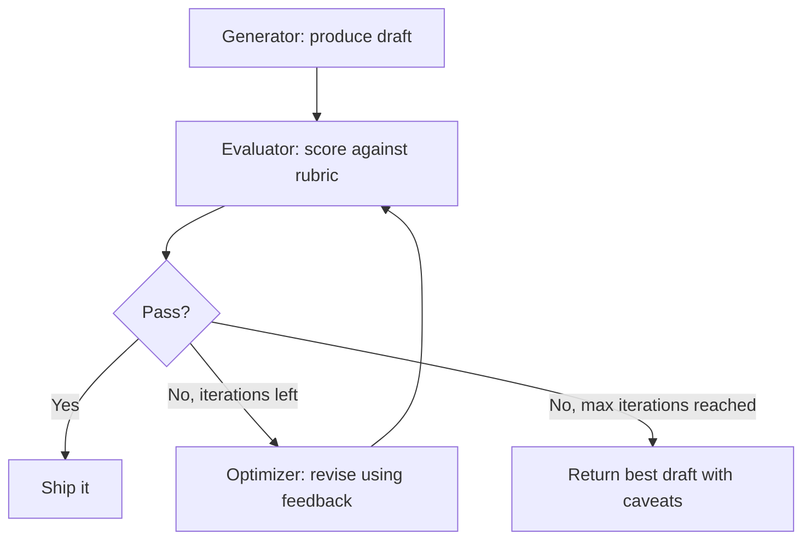

# Pattern: Evaluator-Optimizer

> The first draft is not the output. It is the starting point.

**Type:** Build
**Languages:** Python
**Prerequisites:** 04-01 The Agent Loop, 04-06 Orchestrator-Workers
**Time:** ~60 min
**Learning Objectives:**
- Explain why single-pass generation produces systematically mediocre outputs
- Build a raw evaluator-optimizer loop with a structured rubric and JSON scoring
- Implement a loop that iterates until pass or max_iterations
- Refactor into an EvalOptimizeLoop class with swappable evaluators
- Connect the loop to a human-in-the-loop evaluator for high-stakes decisions

---

## THE PROBLEM

A product team uses an LLM to generate product descriptions for their e-commerce catalog. The first drafts come back acceptable but not compelling: missing key benefits, using generic language, burying the value proposition. A human editor revises each one. Three rounds of editing later, each description is finally good.

This is expensive and slow. But examine what the human editor is doing: reading the draft, identifying specific problems ("too vague," "feature list before benefit," "no call to action"), and providing precise feedback that drives the next revision. That is a reviewable, repeatable process. An LLM can do it.

The evaluator-optimizer pattern replaces the human revision loop with an automated one. A generator call produces a draft. An evaluator call reads the draft against a rubric and returns structured feedback: a score, a list of specific issues, and a pass/fail decision. If the draft fails, an optimizer call takes the draft and the issues and produces a revision. The loop continues until the evaluator passes the output or a maximum iteration count is reached.

This pattern applies any time you can write a rubric. If you can specify what "good" looks like as a checklist, you can automate the revision loop. Product descriptions, email subject lines, code documentation, technical specifications, job descriptions: all of these have rubrics that can be encoded as evaluator prompts.

The human editor is still valuable, but they enter the process after the automated loop has already done three rounds of improvement. They start from a better place.

---

## THE CONCEPT

### Why Single-Pass Generation Fails

LLM output quality follows a diminishing returns curve. The first call produces a draft in the top 60-70th percentile of possible outputs. The model is not lazy; it genuinely cannot know what specific improvement you want without feedback. Without feedback, the model satisfices: it produces something reasonable and stops.

With structured feedback, each revision targets specific failure modes. The quality curve steepens. By iteration 2-3, you are often in the 85-95th percentile.



### What Each Call Receives

The three calls in the loop have distinct roles and receive distinct context:

```
GENERATOR call
Input:   task + requirements
Output:  draft text

EVALUATOR call
Input:   original requirements + draft
Output:  {"score": 0-10, "issues": [...], "pass": bool}
         - score:  overall quality estimate
         - issues: specific problems that must be fixed
         - pass:   true if score >= threshold and no blocking issues

OPTIMIZER call
Input:   original requirements + draft + issues from evaluator
Output:  revised draft
         - must address every issue in the issues list
         - must preserve what was already good
```

### The Feedback Loop Shape

```
ITERATION 0            ITERATION 1              ITERATION 2
-----------            -----------              -----------
Generator              Evaluator                Evaluator
  "write a             "Score: 4/10             "Score: 8/10
   product             Issues:                  Issues:
   description"          - no headline          (none blocking)
       |                  - generic benefits    Pass: true
       v                  - no CTA"                 |
   draft v0                    |                    v
                               v                 SHIP IT
                          Optimizer
                          "revise with
                           these issues"
                               |
                               v
                           draft v1
```

---

## BUILD IT

### Step 1: Generator Call

```python
import json
import anthropic

def generate_draft(task: str, requirements: str) -> str:
    """Initial draft generation. No feedback yet."""
    client = anthropic.Anthropic()
    message = client.messages.create(
        model="claude-3-5-haiku-20241022",
        max_tokens=512,
        messages=[
            {
                "role": "user",
                "content": (
                    f"Task: {task}\n\n"
                    f"Requirements:\n{requirements}\n\n"
                    "Write the output now."
                )
            }
        ]
    )
    return message.content[0].text
```

### Step 2: Evaluator Call with Structured Rubric

The evaluator uses a system prompt encoding the rubric. It returns JSON so the loop can parse the result programmatically.

```python
EVALUATOR_SYSTEM = """You are a quality evaluator for product copy. Evaluate the draft
against the requirements and return a JSON object with exactly this structure:

{
  "score": <integer 0-10>,
  "issues": [
    "<specific problem that must be fixed>",
    "<another specific problem>"
  ],
  "strengths": [
    "<what is already good>"
  ],
  "pass": <true if score >= 7 and no blocking issues, false otherwise>
}

Rubric:
- 9-10: Excellent. Clear benefit statement, specific details, compelling CTA.
- 7-8: Good. Passes. Minor improvements possible but not required.
- 5-6: Acceptable draft. Needs at least one specific revision before shipping.
- 3-4: Below bar. Multiple issues that reduce customer confidence or clarity.
- 1-2: Not usable. Missing critical elements or actively misleading.

Issues list: be specific. "Too vague" is not useful. "Benefit statement uses generic
phrase 'high quality' instead of a specific differentiator" is useful.

Return only valid JSON. No markdown, no code blocks."""


def evaluate_draft(draft: str, task: str, requirements: str) -> dict:
    """Evaluate the draft against the rubric. Returns structured JSON."""
    client = anthropic.Anthropic()
    message = client.messages.create(
        model="claude-3-5-haiku-20241022",
        max_tokens=512,
        system=EVALUATOR_SYSTEM,
        messages=[
            {
                "role": "user",
                "content": (
                    f"Original task: {task}\n\n"
                    f"Requirements:\n{requirements}\n\n"
                    f"Draft to evaluate:\n{draft}"
                )
            }
        ]
    )
    return json.loads(message.content[0].text)
```

### Step 3: Optimizer Call

The optimizer receives the draft and the specific issues from the evaluator. It is instructed to address every issue while preserving the strengths.

```python
def optimize_draft(draft: str, task: str, requirements: str, eval_result: dict) -> str:
    """Revise the draft based on evaluator feedback."""
    client = anthropic.Anthropic()

    issues_text = "\n".join(f"- {issue}" for issue in eval_result["issues"])
    strengths_text = "\n".join(f"- {s}" for s in eval_result.get("strengths", []))

    message = client.messages.create(
        model="claude-3-5-haiku-20241022",
        max_tokens=512,
        messages=[
            {
                "role": "user",
                "content": (
                    f"Task: {task}\n\n"
                    f"Requirements:\n{requirements}\n\n"
                    f"Current draft:\n{draft}\n\n"
                    f"Issues to fix (address ALL of these):\n{issues_text}\n\n"
                    f"Strengths to preserve:\n{strengths_text}\n\n"
                    "Rewrite the draft. Fix every issue. Preserve the strengths."
                )
            }
        ]
    )
    return message.content[0].text
```

### Step 4: The Loop

```python
def eval_optimize_loop(
    task: str,
    requirements: str,
    max_iterations: int = 3
) -> dict:
    """
    Run the evaluator-optimizer loop until pass or max_iterations.
    Returns the final draft and the full history.
    """
    history = []

    # Initial generation
    current_draft = generate_draft(task, requirements)
    print(f"\nInitial draft generated ({len(current_draft)} chars)")

    for iteration in range(max_iterations):
        print(f"\nIteration {iteration + 1}/{max_iterations}: Evaluating...")

        eval_result = evaluate_draft(current_draft, task, requirements)

        print(f"  Score: {eval_result['score']}/10  Pass: {eval_result['pass']}")
        if eval_result.get("issues"):
            print(f"  Issues: {eval_result['issues']}")

        history.append({
            "iteration": iteration,
            "draft": current_draft,
            "eval": eval_result,
        })

        if eval_result["pass"]:
            print(f"  Passed on iteration {iteration + 1}")
            break

        if iteration < max_iterations - 1:
            print(f"  Optimizing...")
            current_draft = optimize_draft(current_draft, task, requirements, eval_result)
        else:
            print(f"  Max iterations reached. Returning best draft.")

    return {
        "final_draft": current_draft,
        "final_score": eval_result["score"],
        "passed": eval_result["pass"],
        "iterations_used": len(history),
        "history": history,
    }
```

> **Real-world check:** Your PM asks why the evaluator uses a structured JSON response with specific issues rather than just asking the model to "rate it and give feedback." What breaks if you use the unstructured version?

Unstructured feedback is hard to parse programmatically. You cannot reliably extract the pass/fail decision, the score, or the specific issues as a list. The optimizer call needs the issues as structured input to address them systematically. Without structure, you also cannot track score trends across iterations or build dashboards. JSON with a defined schema is the contract between the evaluator and the loop.

---

## USE IT

### Refactored into EvalOptimizeLoop Class

The class version separates the evaluator as a swappable component, making it easy to replace the LLM evaluator with a human-in-the-loop version for high-stakes use cases.

```python
from abc import ABC, abstractmethod
from dataclasses import dataclass, field


@dataclass
class EvalResult:
    score: int
    issues: list[str]
    strengths: list[str]
    passed: bool


class BaseEvaluator(ABC):
    @abstractmethod
    def evaluate(self, draft: str, task: str, requirements: str) -> EvalResult:
        """Evaluate a draft. Return structured result."""
        ...


class LLMEvaluator(BaseEvaluator):
    """LLM-based evaluator using EVALUATOR_SYSTEM prompt."""

    def __init__(self):
        self.client = anthropic.Anthropic()

    def evaluate(self, draft: str, task: str, requirements: str) -> EvalResult:
        message = self.client.messages.create(
            model="claude-3-5-haiku-20241022",
            max_tokens=512,
            system=EVALUATOR_SYSTEM,
            messages=[{
                "role": "user",
                "content": (
                    f"Original task: {task}\n\n"
                    f"Requirements:\n{requirements}\n\n"
                    f"Draft to evaluate:\n{draft}"
                )
            }]
        )
        data = json.loads(message.content[0].text)
        return EvalResult(
            score=data["score"],
            issues=data.get("issues", []),
            strengths=data.get("strengths", []),
            passed=data["pass"]
        )


class HumanEvaluator(BaseEvaluator):
    """
    Human-in-the-loop evaluator. Prints the draft and collects feedback via input().
    Use for high-stakes content where LLM judgment is not sufficient.
    """

    def evaluate(self, draft: str, task: str, requirements: str) -> EvalResult:
        print("\n" + "=" * 50)
        print("HUMAN REVIEW REQUIRED")
        print("=" * 50)
        print(f"\nTask: {task}")
        print(f"\nDraft:\n{draft}")
        print("\n" + "-" * 50)

        score_str = input("Score (0-10): ").strip()
        score = int(score_str)

        issues_str = input("Issues (comma-separated, or ENTER for none): ").strip()
        issues = [i.strip() for i in issues_str.split(",") if i.strip()] if issues_str else []

        passed = score >= 7 and not issues
        print(f"Pass: {passed}")

        return EvalResult(score=score, issues=issues, strengths=[], passed=passed)


class EvalOptimizeLoop:
    def __init__(self, evaluator: BaseEvaluator, max_iterations: int = 3):
        self.evaluator = evaluator
        self.max_iterations = max_iterations
        self.client = anthropic.Anthropic()

    def _generate(self, task: str, requirements: str) -> str:
        message = self.client.messages.create(
            model="claude-3-5-haiku-20241022",
            max_tokens=512,
            messages=[{
                "role": "user",
                "content": f"Task: {task}\n\nRequirements:\n{requirements}\n\nWrite the output now."
            }]
        )
        return message.content[0].text

    def _optimize(self, draft: str, task: str, requirements: str, eval_result: EvalResult) -> str:
        issues_text = "\n".join(f"- {i}" for i in eval_result.issues)
        strengths_text = "\n".join(f"- {s}" for s in eval_result.strengths)
        message = self.client.messages.create(
            model="claude-3-5-haiku-20241022",
            max_tokens=512,
            messages=[{
                "role": "user",
                "content": (
                    f"Task: {task}\n\nRequirements:\n{requirements}\n\n"
                    f"Current draft:\n{draft}\n\n"
                    f"Issues to fix:\n{issues_text}\n\n"
                    f"Strengths to preserve:\n{strengths_text}\n\n"
                    "Rewrite the draft. Fix every issue. Preserve the strengths."
                )
            }]
        )
        return message.content[0].text

    def run(self, task: str, requirements: str) -> dict:
        """Run the loop. Returns final draft, score, pass status, and history."""
        history = []
        current_draft = self._generate(task, requirements)
        last_eval = None

        for i in range(self.max_iterations):
            eval_result = self.evaluator.evaluate(current_draft, task, requirements)
            last_eval = eval_result

            history.append({"iteration": i, "draft": current_draft, "eval": eval_result})

            if eval_result.passed:
                break

            if i < self.max_iterations - 1:
                current_draft = self._optimize(current_draft, task, requirements, eval_result)

        return {
            "final_draft": current_draft,
            "final_score": last_eval.score if last_eval else 0,
            "passed": last_eval.passed if last_eval else False,
            "iterations_used": len(history),
            "history": history,
        }
```

> **Perspective shift:** You have a rubric for the evaluator, but a colleague says "just use the optimizer with better instructions instead of a separate evaluate-then-optimize cycle." What does the evaluate-then-optimize cycle give you that a single revision call does not?

The evaluate-then-optimize cycle gives you measurable progress. After each iteration, you have a numeric score and a specific issues list. You can track whether the score is actually improving. You can detect when the evaluator keeps finding the same issues across iterations (a sign the optimizer is failing to address them). A single revision call gives you a new draft, but no signal about whether it is better or worse. The score trend is your feedback signal.

---

## SHIP IT

The reusable artifact from this lesson is `outputs/skill-evaluator-optimizer.md`. It contains the generator, evaluator, and optimizer prompt templates alongside the loop skeleton. The evaluator rubric is the part you customize per task. The loop structure stays the same.

The most common customization: adapt the rubric section of EVALUATOR_SYSTEM to your domain. Product descriptions need different criteria than email subject lines or API documentation. Everything else (JSON schema, pass threshold logic, optimizer instructions) transfers directly.

---

## EVALUATE IT

How do you know the evaluator-optimizer loop is actually improving quality and not just changing it?

**Score trend analysis.** Log the score from each iteration across a batch of 50 inputs. Compute the mean score improvement per iteration. If iteration 1 goes from 4.2 to 6.8 on average, the optimizer is working. If iteration 2 goes from 6.8 to 6.9, the gains are diminishing and you may not need a third iteration.

**Human vs. LLM evaluator agreement.** Take 20 samples of (draft, eval_result) pairs. Have a human independently score each draft on the same rubric. Compute the agreement rate between the LLM evaluator's pass/fail and the human's. An agreement rate below 70% means the evaluator rubric is not capturing what humans actually care about.

**Issue resolution rate.** After each optimization, re-run the evaluator. Check whether the issues from the previous iteration appear in the new issues list. If the same issue persists after optimization, the optimizer prompt is not incorporating the feedback effectively. Add "You MUST address every issue in the list" to the optimizer prompt.

**Loop escape rate.** Track what fraction of inputs exit via pass vs. max_iterations_reached. If 80% hit the iteration cap without passing, the rubric threshold may be too strict for your generator, or the optimizer is not effective. If 100% pass on iteration 1, the evaluator threshold is too lenient.
