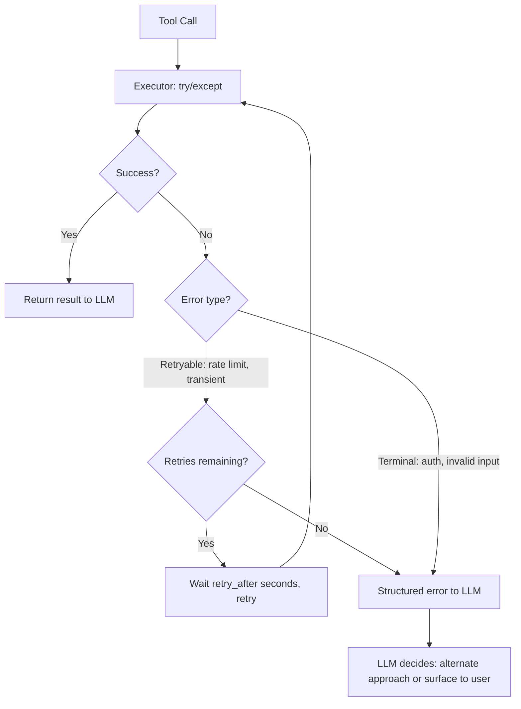

# استخدام الأدوات والتعافي من الأخطاء داخل الحلقة (Tool Use and Error Recovery in the Loop)

> الـ agent الذي يصاب بالذعر عند ظهور 503 ليس agent. إنه script يرتدي معطفًا.

**النوع:** بناء
**اللغات:** Python
**المتطلبات:** 04-01 حلقة الـ Agent، الاستخدام الأساسي للأدوات مع Anthropic API
**الوقت:** ~60 دقيقة
**أهداف التعلّم:**
- بناء مُنفِّذ أدوات (tool executor) مُحصَّن للإنتاج مع try/except حول كل استدعاء أداة
- إرجاع استجابات أخطاء منظَّمة تمنح الـ LLM سياقًا كافيًا للتكيّف
- تطبيق منطق إعادة المحاولة (retry) مع إشارات `retry_after` في الحلقة الـ agentic
- التمييز بين الأخطاء القابلة لإعادة المحاولة (rate limit، و503 العابر) والأخطاء النهائية (مدخل غير صالح، فشل المصادقة)
- استخدام ToolRegistry و `@tool` decorator لإبقاء تسجيل الأدوات نظيفًا

---

## المشكلة

يستدعي agent واجهة بحث (search API). تُرجع الـ API ‏503 Service Unavailable. لا يلتقط مُنفِّذ الأدوات لدى الـ agent الاستثناء. ينتشر traceback الخام في Python لأعلى ويُمرَّر إلى الـ LLM كرسالة `tool_result`:

```
Traceback (most recent call last):
  File "agent.py", line 42, in run_tool
    response = requests.get(url, timeout=5)
  ...
requests.exceptions.ConnectionError: ('Connection aborted.', RemoteDisconnected(...))
```

يقرأ الـ LLM هذا الـ traceback. لا فكرة لديه ماذا يفعل. فإمّا أن يهلوس استجابة ("I found 12 results about your query...") أو يستسلم ("I was unable to complete the search. Please try again."). يرى المستخدم فشلًا بلا أي إشارة إلى ما إذا كان عليه إعادة المحاولة، أو الانتظار، أو إعادة صياغة طلبه.

هذه ليست حالة طرفية (edge case). الـ APIs المتقلّبة هي القاعدة في الإنتاج: حدود المعدّل، والمهلات (timeouts)، والأعطال المؤقتة، والمصادقة المُهيّأة خطأً، والحالات الطرفية للمدخلات غير الصالحة. الـ agent الذي لم يفكّر في فشل الأدوات سيفشل بشكل غير متوقَّع في الإنتاج.

الحل من ثلاثة أجزاء. أولًا، يجب تغليف كل استدعاء أداة بـ try/except يحوّل الاستثناءات إلى كائنات خطأ منظَّمة. ثانيًا، يجب أن يمنح الخطأ المنظَّم الـ LLM معلومات كافية ليقرر ما يفعله تاليًا: إعادة المحاولة، أو تجربة مقاربة مختلفة، أو سؤال المستخدم. ثالثًا، يجب أن تطبّق الحلقة منطق إعادة المحاولة كي يستطيع الـ LLM فعليًا التصرف بناءً على إشارات إعادة المحاولة دون أن يُجبَر على إعادة التخطيط من الصفر.

---

## المفهوم

### ماذا ينكسر بدون معالجة الأخطاء

الفرق بين ما يراه الـ LLM مع معالجة أخطاء سيئة مقابل جيدة هو المشكلة بأكملها:

```
BAD: raw exception as tool_result
---------------------------------------------
tool_result: "Traceback (most recent call last):
  File 'search.py', line 42 in execute
    resp = requests.get(url, timeout=5)
  ConnectionError: Remote end closed connection"

LLM response: "I searched but found no results."
  (hallucination: it did not search, the call failed)


GOOD: structured error as tool_result
---------------------------------------------
tool_result: {
  "success": false,
  "error": "Search tool temporarily unavailable (rate limited).",
  "retry_after": 2,
  "suggestion": "Wait 2 seconds and retry, or try a narrower query."
}

LLM response: "The search tool hit a rate limit. I'll retry
               in 2 seconds with the same query."
  (accurate: acts on the error signal)
```

### شجرة قرار التعافي من الأخطاء



### تصنيف الأخطاء

```
RETRYABLE errors                  TERMINAL errors
--------------------------        --------------------------
HTTP 429 Too Many Requests        HTTP 401/403 Unauthorized
HTTP 503 Service Unavailable      HTTP 400 Bad Request (input issue)
HTTP 500 Internal Server Error    HTTP 404 Not Found
ConnectionTimeout                 ValueError from bad arguments
NetworkError (transient)          Schema validation failure

Action: wait + retry              Action: surface to LLM with
                                  suggestion to try differently
```

---

## البناء

### الخطوة 1: سجلّ الأدوات (Tool Registry)

dict يربط أسماء الأدوات بدوال Python. يبحث المُنفِّذ عن الدالة بالاسم ويستدعيها.

```python
import time
import random
import anthropic
from typing import Any

# Tool registry: maps tool name to callable
TOOL_REGISTRY: dict[str, callable] = {}


def search_web(query: str, max_results: int = 5) -> list[dict]:
    """
    Deliberately flaky web search. Fails 50% of the time to demonstrate
    error recovery. In production: replace with real search API call.
    """
    if random.random() < 0.5:
        raise ConnectionError("Rate limited: too many requests to search API")

    # Simulated results
    return [
        {"title": f"Result {i} for '{query}'", "url": f"https://example.com/{i}", "snippet": f"Content about {query} ({i})"}
        for i in range(1, max_results + 1)
    ]


def get_weather(city: str) -> dict:
    """Always succeeds for demo purposes."""
    return {
        "city": city,
        "temperature": 22,
        "conditions": "Partly cloudy",
        "humidity": 65,
    }


# Register tools
TOOL_REGISTRY["search_web"] = search_web
TOOL_REGISTRY["get_weather"] = get_weather
```

### الخطوة 2: مُنفِّذ الأدوات مع استجابة خطأ منظَّمة

يمرّ كل استدعاء أداة عبر المُنفِّذ. يلتقط الاستثناءات ويحوّلها إلى استجابات منظَّمة.

```python
def execute_tool(tool_name: str, tool_input: dict) -> dict:
    """
    Wraps every tool call in try/except.
    Returns {"success": True, "result": ...} or {"success": False, "error": ..., "retry_after": N}
    """
    if tool_name not in TOOL_REGISTRY:
        return {
            "success": False,
            "error": f"Tool '{tool_name}' is not registered.",
            "retry_after": None,
            "suggestion": "Use one of the available tools or check the tool name spelling."
        }

    try:
        result = TOOL_REGISTRY[tool_name](**tool_input)
        return {"success": True, "result": result}

    except ConnectionError as e:
        # Rate limit or transient network: retryable
        return {
            "success": False,
            "error": f"The {tool_name} tool is temporarily unavailable (connection error). It may be rate limited.",
            "retry_after": 2,
            "suggestion": "Wait 2 seconds and retry the same request, or try a simpler query."
        }

    except ValueError as e:
        # Bad input: terminal, not retryable
        return {
            "success": False,
            "error": f"The {tool_name} tool received invalid input: {str(e)}",
            "retry_after": None,
            "suggestion": "Check the input parameters and try again with corrected values."
        }

    except Exception as e:
        # Unknown: be conservative, treat as retryable once
        return {
            "success": False,
            "error": f"The {tool_name} tool encountered an unexpected error.",
            "retry_after": 1,
            "suggestion": "Try once more. If this persists, try a different approach."
        }
```

### الخطوة 3: منطق إعادة المحاولة في الحلقة الـ agentic

```python
def run_tool_with_retry(tool_name: str, tool_input: dict, max_retries: int = 2) -> dict:
    """
    Execute a tool with automatic retry on retryable errors.
    Returns the first success or the last error after max_retries.
    """
    for attempt in range(max_retries + 1):
        result = execute_tool(tool_name, tool_input)

        if result["success"]:
            return result

        retry_after = result.get("retry_after")

        if retry_after is None:
            # Terminal error: do not retry
            print(f"  Terminal error on {tool_name}: {result['error']}")
            return result

        if attempt < max_retries:
            print(f"  Retryable error on {tool_name} (attempt {attempt + 1}/{max_retries + 1}). "
                  f"Waiting {retry_after}s...")
            time.sleep(retry_after)
        else:
            print(f"  Max retries reached for {tool_name}. Returning error to LLM.")

    return result
```

### الخطوة 4: الحلقة الـ agentic الكاملة

```python
# Tool definitions for the Anthropic API
TOOL_DEFINITIONS = [
    {
        "name": "search_web",
        "description": "Search the web for current information on a topic.",
        "input_schema": {
            "type": "object",
            "properties": {
                "query": {"type": "string", "description": "The search query"},
                "max_results": {"type": "integer", "description": "Number of results (default 5)", "default": 5}
            },
            "required": ["query"]
        }
    },
    {
        "name": "get_weather",
        "description": "Get current weather conditions for a city.",
        "input_schema": {
            "type": "object",
            "properties": {
                "city": {"type": "string", "description": "City name"}
            },
            "required": ["city"]
        }
    }
]


def run_agent(user_message: str, max_turns: int = 10) -> str:
    """
    Full agentic loop with production-hardened tool execution.
    Handles retries internally; sends structured errors to LLM on terminal failure.
    """
    client = anthropic.Anthropic()
    messages = [{"role": "user", "content": user_message}]

    for turn in range(max_turns):
        response = client.messages.create(
            model="claude-3-5-haiku-20241022",
            max_tokens=1024,
            tools=TOOL_DEFINITIONS,
            messages=messages,
        )

        # Add assistant response to history
        messages.append({"role": "assistant", "content": response.content})

        if response.stop_reason == "end_turn":
            # Extract final text response
            for block in response.content:
                if hasattr(block, "text"):
                    return block.text
            return "Agent completed with no text response."

        if response.stop_reason != "tool_use":
            break

        # Process all tool calls in this turn
        tool_results = []
        for block in response.content:
            if block.type != "tool_use":
                continue

            print(f"\nTool call: {block.name}({block.input})")

            # Execute with retry
            exec_result = run_tool_with_retry(block.name, block.input, max_retries=2)

            if exec_result["success"]:
                tool_result_content = exec_result["result"]
                print(f"  Success: {str(tool_result_content)[:100]}...")
            else:
                # Structured error message to LLM - not a raw exception
                tool_result_content = (
                    f"{exec_result['error']} "
                    f"Suggestion: {exec_result.get('suggestion', 'Try a different approach.')}"
                )
                print(f"  Error passed to LLM: {tool_result_content[:100]}")

            tool_results.append({
                "type": "tool_result",
                "tool_use_id": block.id,
                "content": str(tool_result_content),
            })

        messages.append({"role": "user", "content": tool_results})

    return "Agent reached max turns without completing."
```

> **اختبار من الواقع:** يفشل استدعاء أداة لدى الـ agent بخطأ 401 Unauthorized. يصنّفه مُنفِّذك على أنه قابل لإعادة المحاولة فيعيد المحاولة مرتين، وفي كلتيهما يحصل على 401. بعد الفشل الثالث، يذهب الخطأ المنظَّم إلى الـ LLM. ما الخطأ في تصنيف 401 على أنه قابل لإعادة المحاولة؟

خطأ 401 Unauthorized لن يُحَلّ بالانتظار. فاعتمادات الـ API خاطئة أو منتهية الصلاحية أو مفقودة. إعادة محاولة 401 تهدر استدعاءين وتضيف latency. ينبغي أن تُطرَح الأخطاء النهائية فورًا مع اقتراح يعالج السبب الفعلي: "Authentication failed. Check that API_KEY is set correctly in environment variables." إعادة المحاولة مناسبة فقط عندما يكون الخطأ عابرًا (rate limit، انقطاع شبكة عابر) لا حين يكون الخطأ بنيويًا (مصادقة، مدخل خاطئ).

---

## الاستخدام

### صنف ToolRegistry مع `@tool` decorator

النسخة الخام يتناثر فيها تسجيل الأدوات عبر كود على مستوى الموديول. نسخة الصنف تُبقي كل شيء معًا وتضيف decorator لتسجيل نظيف.

```python
import functools
import inspect
import json
from typing import Callable


class ToolRegistry:
    """
    Registry that stores tool functions and auto-generates Anthropic tool definitions
    from type hints and docstrings.
    """

    def __init__(self):
        self._tools: dict[str, Callable] = {}
        self._definitions: list[dict] = []

    def tool(self, func: Callable) -> Callable:
        """Decorator to register a tool function."""
        self._tools[func.__name__] = func

        # Auto-generate basic tool definition from function signature
        sig = inspect.signature(func)
        properties = {}
        required = []

        for name, param in sig.parameters.items():
            annotation = param.annotation
            if annotation == inspect.Parameter.empty:
                param_type = "string"
            elif annotation == int:
                param_type = "integer"
            elif annotation == bool:
                param_type = "boolean"
            else:
                param_type = "string"

            properties[name] = {"type": param_type, "description": f"The {name} parameter"}

            if param.default == inspect.Parameter.empty:
                required.append(name)

        self._definitions.append({
            "name": func.__name__,
            "description": func.__doc__ or f"Tool: {func.__name__}",
            "input_schema": {
                "type": "object",
                "properties": properties,
                "required": required,
            }
        })

        @functools.wraps(func)
        def wrapper(*args, **kwargs):
            return func(*args, **kwargs)

        return wrapper

    def execute(self, name: str, input_dict: dict) -> dict:
        """Execute a registered tool with structured error handling."""
        if name not in self._tools:
            return {
                "success": False,
                "error": f"Unknown tool: {name}",
                "retry_after": None,
                "suggestion": f"Available tools: {list(self._tools.keys())}"
            }
        try:
            result = self._tools[name](**input_dict)
            return {"success": True, "result": result}
        except ConnectionError as e:
            return {
                "success": False,
                "error": f"{name} is temporarily unavailable.",
                "retry_after": 2,
                "suggestion": "Retry in 2 seconds."
            }
        except ValueError as e:
            return {
                "success": False,
                "error": f"Invalid input for {name}: {e}",
                "retry_after": None,
                "suggestion": "Check input types and required fields."
            }
        except Exception as e:
            return {
                "success": False,
                "error": f"{name} encountered an unexpected error.",
                "retry_after": 1,
                "suggestion": "Try once more or try a different approach."
            }

    @property
    def definitions(self) -> list[dict]:
        return self._definitions


# Usage: register tools with the decorator
registry = ToolRegistry()


@registry.tool
def search_web(query: str, max_results: int = 5) -> list:
    """Search the web for current information on a topic."""
    if random.random() < 0.5:
        raise ConnectionError("Rate limited")
    return [{"title": f"Result {i} for '{query}'", "url": f"https://example.com/{i}"}
            for i in range(1, max_results + 1)]


@registry.tool
def get_weather(city: str) -> dict:
    """Get current weather conditions for a city."""
    return {"city": city, "temperature": 22, "conditions": "Partly cloudy"}
```

> **نقلة في المنظور:** يولّد `@tool` decorator تعريفات الأدوات تلقائيًا من type hints و docstrings. يقول زميل: "هذه هندسة مفرطة، فقط اكتب التعريفات يدويًا." متى يثمر التوليد التلقائي من type hints، ومتى يفوز التعريف اليدوي؟

يثمر التوليد التلقائي حين تكون مجموعة الأدوات كبيرة وتتطور باستمرار: إضافة معامل (parameter) تعني تحديث مكان واحد (توقيع الدالة)، لا مكانين (الدالة و dict التعريف). يفوز التعريف اليدوي حين تحتاج تحكّمًا دقيقًا في الأوصاف أو الأمثلة أو قيود الـ enum التي لا تستطيع type hints التعبير عنها. معظم أنظمة الإنتاج تنتهي بالتوليد التلقائي للبنية والتجاوز اليدوي للأوصاف.

---

## التسليم

القطعة القابلة لإعادة الاستخدام من هذا الدرس هي `outputs/skill-tool-recovery.md`. تحتوي على نمط مُنفِّذ الأدوات مع دليل تصنيف الأخطاء، وقوالب الأخطاء المنظَّمة، وهيكل `ToolRegistry` + `@tool` decorator.

أسقطها في أي حلقة agentic تلمس فيها الأدوات واجهات API خارجية. استبدل دالتي `search_web` و `get_weather` بتطبيقات أدواتك الفعلية. يبقى مُغلِّف معالجة الأخطاء كما هو بغضّ النظر عمّا تفعله الأدوات.

---

## التقييم

كيف تعرف أن معالجة الأخطاء لديك تعمل فعلًا في الإنتاج؟

**توزيع أنواع الأخطاء.** سجّل نتيجة كل تنفيذ أداة: نجاح، أو خطأ قابل لإعادة المحاولة، أو خطأ نهائي. تتبّع التوزيع لكل أداة. إذا كان لـ `search_web` معدّل أخطاء 40%، فإمّا أن الـ API غير موثوق (أصلِح التكامل) أو أنك تستدعيه بعدوانية مفرطة (أضِف rate limiting). يخبرك التوزيع بأي الأدوات تحتاج اهتمامًا.

**فعالية إعادة المحاولة.** للأخطاء القابلة لإعادة المحاولة، تتبّع معدّل النجاح بعد إعادة المحاولة: (النجاحات عند المحاولة N) / (إجمالي الأخطاء القابلة لإعادة المحاولة). إذا كان معدّل نجاح إعادة المحاولة دون 50%، فإمّا أن الأخطاء ليست عابرة فعلًا (سوء تصنيف)، أو أن تأخير `retry_after` قصير جدًا. سجّل كلًّا من نوع الخطأ ورمز حالة الـ HTTP لتشخيص ذلك.

**سلوك تعافي الـ LLM.** بعد أن ترسل الحلقة خطأً منظَّمًا إلى الـ LLM، سجّل تصرّف الـ LLM التالي: هل أعاد المحاولة باستعلام مختلف؟ هل جرّب أداة مختلفة؟ هل طرح الخطأ على المستخدم؟ تتبّع توزيع هذه الاستجابات. إذا هلوس الـ LLM بدلًا من التصرف بناءً على الخطأ (زاعمًا أنه حصل على نتائج بينما فشلت الأداة)، فرسالة الخطأ ليست واضحة بما يكفي. أضِف "The tool failed. You do not have this information." صراحةً.

**الهلوسة عند الخطأ.** عيّن دوريًا من استجابات الـ agent التي فشل فيها استدعاء أداة واحد على الأقل. افحص ما إذا كانت الاستجابة النهائية تستخدم معلومات لم تُسترجَع بنجاح قط. هذا هو نمط الفشل الحرج: يتصرف الـ agent كأن الأدوات نجحت بينما لم تنجح. أنشئ فحصًا آليًا يقاطع الادّعاءات في الاستجابة النهائية مع مجموعة نتائج الأدوات الناجحة.
