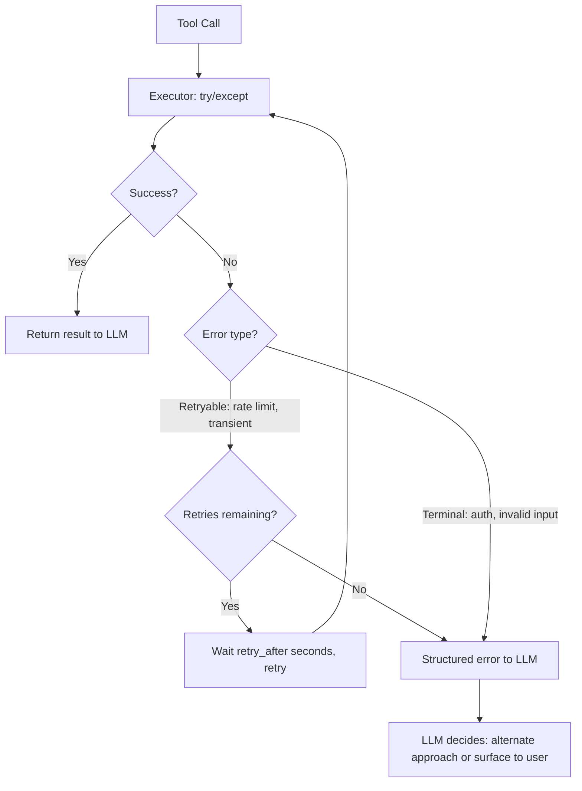

# Tool Use and Error Recovery in the Loop

> An agent that panics on a 503 is not an agent. It is a script wearing a trench coat.

**Type:** Build
**Languages:** Python
**Prerequisites:** 04-01 The Agent Loop, basic tool use with the Anthropic API
**Time:** ~60 min
**Learning Objectives:**
- Build a production-hardened tool executor with try/except around every tool call
- Return structured error responses that give the LLM enough context to adapt
- Implement retry logic with `retry_after` signals in the agentic loop
- Distinguish between retryable errors (rate limit, transient 503) and terminal errors (invalid input, auth failure)
- Use a ToolRegistry and `@tool` decorator to keep tool registration clean

---

## THE PROBLEM

An agent calls a search API. The API returns a 503 Service Unavailable. The agent's tool executor does not catch the exception. The raw Python traceback propagates up and gets passed back to the LLM as a `tool_result` message:

```
Traceback (most recent call last):
  File "agent.py", line 42, in run_tool
    response = requests.get(url, timeout=5)
  ...
requests.exceptions.ConnectionError: ('Connection aborted.', RemoteDisconnected(...))
```

The LLM reads this traceback. It has no idea what to do. It either hallucinates a response ("I found 12 results about your query...") or gives up ("I was unable to complete the search. Please try again."). The user sees a failure with no indication of whether to retry, wait, or reformulate their request.

This is not an edge case. Flaky APIs are the norm in production: rate limits, timeouts, temporary outages, misconfigured authentication, and invalid input edge cases. An agent that has not thought about tool failure will fail unpredictably in production.

The fix has three parts. First, every tool call must be wrapped in a try/except that converts exceptions into structured error objects. Second, the structured error must give the LLM enough information to decide what to do next: retry, try a different approach, or ask the user. Third, the loop must implement the retry logic so the LLM can actually act on retry signals without being forced to re-plan from scratch.

---

## THE CONCEPT

### What Breaks Without Error Handling

The difference between what the LLM sees with bad vs. good error handling is the entire problem:

```
BAD: raw exception as tool_result
---------------------------------------------
tool_result: "Traceback (most recent call last):
  File 'search.py', line 42 in execute
    resp = requests.get(url, timeout=5)
  ConnectionError: Remote end closed connection"

LLM response: "I searched but found no results."
  (hallucination: it did not search, the call failed)


GOOD: structured error as tool_result
---------------------------------------------
tool_result: {
  "success": false,
  "error": "Search tool temporarily unavailable (rate limited).",
  "retry_after": 2,
  "suggestion": "Wait 2 seconds and retry, or try a narrower query."
}

LLM response: "The search tool hit a rate limit. I'll retry
               in 2 seconds with the same query."
  (accurate: acts on the error signal)
```

### The Error Recovery Decision Tree



### Error Classification

```
RETRYABLE errors                  TERMINAL errors
--------------------------        --------------------------
HTTP 429 Too Many Requests        HTTP 401/403 Unauthorized
HTTP 503 Service Unavailable      HTTP 400 Bad Request (input issue)
HTTP 500 Internal Server Error    HTTP 404 Not Found
ConnectionTimeout                 ValueError from bad arguments
NetworkError (transient)          Schema validation failure

Action: wait + retry              Action: surface to LLM with
                                  suggestion to try differently
```

---

## BUILD IT

### Step 1: Tool Registry

A dict mapping tool names to Python functions. The executor looks up the function by name and calls it.

```python
import time
import random
import anthropic
from typing import Any

# Tool registry: maps tool name to callable
TOOL_REGISTRY: dict[str, callable] = {}


def search_web(query: str, max_results: int = 5) -> list[dict]:
    """
    Deliberately flaky web search. Fails 50% of the time to demonstrate
    error recovery. In production: replace with real search API call.
    """
    if random.random() < 0.5:
        raise ConnectionError("Rate limited: too many requests to search API")

    # Simulated results
    return [
        {"title": f"Result {i} for '{query}'", "url": f"https://example.com/{i}", "snippet": f"Content about {query} ({i})"}
        for i in range(1, max_results + 1)
    ]


def get_weather(city: str) -> dict:
    """Always succeeds for demo purposes."""
    return {
        "city": city,
        "temperature": 22,
        "conditions": "Partly cloudy",
        "humidity": 65,
    }


# Register tools
TOOL_REGISTRY["search_web"] = search_web
TOOL_REGISTRY["get_weather"] = get_weather
```

### Step 2: Tool Executor with Structured Error Response

Every tool call goes through the executor. It catches exceptions and converts them to structured responses.

```python
def execute_tool(tool_name: str, tool_input: dict) -> dict:
    """
    Wraps every tool call in try/except.
    Returns {"success": True, "result": ...} or {"success": False, "error": ..., "retry_after": N}
    """
    if tool_name not in TOOL_REGISTRY:
        return {
            "success": False,
            "error": f"Tool '{tool_name}' is not registered.",
            "retry_after": None,
            "suggestion": "Use one of the available tools or check the tool name spelling."
        }

    try:
        result = TOOL_REGISTRY[tool_name](**tool_input)
        return {"success": True, "result": result}

    except ConnectionError as e:
        # Rate limit or transient network: retryable
        return {
            "success": False,
            "error": f"The {tool_name} tool is temporarily unavailable (connection error). It may be rate limited.",
            "retry_after": 2,
            "suggestion": "Wait 2 seconds and retry the same request, or try a simpler query."
        }

    except ValueError as e:
        # Bad input: terminal, not retryable
        return {
            "success": False,
            "error": f"The {tool_name} tool received invalid input: {str(e)}",
            "retry_after": None,
            "suggestion": "Check the input parameters and try again with corrected values."
        }

    except Exception as e:
        # Unknown: be conservative, treat as retryable once
        return {
            "success": False,
            "error": f"The {tool_name} tool encountered an unexpected error.",
            "retry_after": 1,
            "suggestion": "Try once more. If this persists, try a different approach."
        }
```

### Step 3: Retry Logic in the Agentic Loop

```python
def run_tool_with_retry(tool_name: str, tool_input: dict, max_retries: int = 2) -> dict:
    """
    Execute a tool with automatic retry on retryable errors.
    Returns the first success or the last error after max_retries.
    """
    for attempt in range(max_retries + 1):
        result = execute_tool(tool_name, tool_input)

        if result["success"]:
            return result

        retry_after = result.get("retry_after")

        if retry_after is None:
            # Terminal error: do not retry
            print(f"  Terminal error on {tool_name}: {result['error']}")
            return result

        if attempt < max_retries:
            print(f"  Retryable error on {tool_name} (attempt {attempt + 1}/{max_retries + 1}). "
                  f"Waiting {retry_after}s...")
            time.sleep(retry_after)
        else:
            print(f"  Max retries reached for {tool_name}. Returning error to LLM.")

    return result
```

### Step 4: The Full Agentic Loop

```python
# Tool definitions for the Anthropic API
TOOL_DEFINITIONS = [
    {
        "name": "search_web",
        "description": "Search the web for current information on a topic.",
        "input_schema": {
            "type": "object",
            "properties": {
                "query": {"type": "string", "description": "The search query"},
                "max_results": {"type": "integer", "description": "Number of results (default 5)", "default": 5}
            },
            "required": ["query"]
        }
    },
    {
        "name": "get_weather",
        "description": "Get current weather conditions for a city.",
        "input_schema": {
            "type": "object",
            "properties": {
                "city": {"type": "string", "description": "City name"}
            },
            "required": ["city"]
        }
    }
]


def run_agent(user_message: str, max_turns: int = 10) -> str:
    """
    Full agentic loop with production-hardened tool execution.
    Handles retries internally; sends structured errors to LLM on terminal failure.
    """
    client = anthropic.Anthropic()
    messages = [{"role": "user", "content": user_message}]

    for turn in range(max_turns):
        response = client.messages.create(
            model="claude-3-5-haiku-20241022",
            max_tokens=1024,
            tools=TOOL_DEFINITIONS,
            messages=messages,
        )

        # Add assistant response to history
        messages.append({"role": "assistant", "content": response.content})

        if response.stop_reason == "end_turn":
            # Extract final text response
            for block in response.content:
                if hasattr(block, "text"):
                    return block.text
            return "Agent completed with no text response."

        if response.stop_reason != "tool_use":
            break

        # Process all tool calls in this turn
        tool_results = []
        for block in response.content:
            if block.type != "tool_use":
                continue

            print(f"\nTool call: {block.name}({block.input})")

            # Execute with retry
            exec_result = run_tool_with_retry(block.name, block.input, max_retries=2)

            if exec_result["success"]:
                tool_result_content = exec_result["result"]
                print(f"  Success: {str(tool_result_content)[:100]}...")
            else:
                # Structured error message to LLM - not a raw exception
                tool_result_content = (
                    f"{exec_result['error']} "
                    f"Suggestion: {exec_result.get('suggestion', 'Try a different approach.')}"
                )
                print(f"  Error passed to LLM: {tool_result_content[:100]}")

            tool_results.append({
                "type": "tool_result",
                "tool_use_id": block.id,
                "content": str(tool_result_content),
            })

        messages.append({"role": "user", "content": tool_results})

    return "Agent reached max turns without completing."
```

> **Real-world check:** An agent's tool call fails with a 401 Unauthorized error. Your executor classifies it as retryable and retries twice, both times getting 401. After the third failure, the structured error goes to the LLM. What was wrong with classifying 401 as retryable?

A 401 Unauthorized error will not resolve by waiting. The API credentials are wrong, expired, or missing. Retrying a 401 wastes 2 calls and adds latency. Terminal errors should be surfaced immediately with a suggestion that addresses the actual cause: "Authentication failed. Check that API_KEY is set correctly in environment variables." Retrying is only appropriate when the error is transient (rate limit, network blip) not when the error is structural (auth, bad input).

---

## USE IT

### ToolRegistry Class with @tool Decorator

The raw version has tool registration scattered across module-level code. The class version keeps everything together and adds a decorator for clean registration.

```python
import functools
import inspect
import json
from typing import Callable


class ToolRegistry:
    """
    Registry that stores tool functions and auto-generates Anthropic tool definitions
    from type hints and docstrings.
    """

    def __init__(self):
        self._tools: dict[str, Callable] = {}
        self._definitions: list[dict] = []

    def tool(self, func: Callable) -> Callable:
        """Decorator to register a tool function."""
        self._tools[func.__name__] = func

        # Auto-generate basic tool definition from function signature
        sig = inspect.signature(func)
        properties = {}
        required = []

        for name, param in sig.parameters.items():
            annotation = param.annotation
            if annotation == inspect.Parameter.empty:
                param_type = "string"
            elif annotation == int:
                param_type = "integer"
            elif annotation == bool:
                param_type = "boolean"
            else:
                param_type = "string"

            properties[name] = {"type": param_type, "description": f"The {name} parameter"}

            if param.default == inspect.Parameter.empty:
                required.append(name)

        self._definitions.append({
            "name": func.__name__,
            "description": func.__doc__ or f"Tool: {func.__name__}",
            "input_schema": {
                "type": "object",
                "properties": properties,
                "required": required,
            }
        })

        @functools.wraps(func)
        def wrapper(*args, **kwargs):
            return func(*args, **kwargs)

        return wrapper

    def execute(self, name: str, input_dict: dict) -> dict:
        """Execute a registered tool with structured error handling."""
        if name not in self._tools:
            return {
                "success": False,
                "error": f"Unknown tool: {name}",
                "retry_after": None,
                "suggestion": f"Available tools: {list(self._tools.keys())}"
            }
        try:
            result = self._tools[name](**input_dict)
            return {"success": True, "result": result}
        except ConnectionError as e:
            return {
                "success": False,
                "error": f"{name} is temporarily unavailable.",
                "retry_after": 2,
                "suggestion": "Retry in 2 seconds."
            }
        except ValueError as e:
            return {
                "success": False,
                "error": f"Invalid input for {name}: {e}",
                "retry_after": None,
                "suggestion": "Check input types and required fields."
            }
        except Exception as e:
            return {
                "success": False,
                "error": f"{name} encountered an unexpected error.",
                "retry_after": 1,
                "suggestion": "Try once more or try a different approach."
            }

    @property
    def definitions(self) -> list[dict]:
        return self._definitions


# Usage: register tools with the decorator
registry = ToolRegistry()


@registry.tool
def search_web(query: str, max_results: int = 5) -> list:
    """Search the web for current information on a topic."""
    if random.random() < 0.5:
        raise ConnectionError("Rate limited")
    return [{"title": f"Result {i} for '{query}'", "url": f"https://example.com/{i}"}
            for i in range(1, max_results + 1)]


@registry.tool
def get_weather(city: str) -> dict:
    """Get current weather conditions for a city."""
    return {"city": city, "temperature": 22, "conditions": "Partly cloudy"}
```

> **Perspective shift:** The `@tool` decorator auto-generates tool definitions from type hints and docstrings. A colleague says "that's over-engineering, just write the definitions manually." When does auto-generation from type hints pay off, and when does manual definition win?

Auto-generation pays off when the tool set is large and evolves frequently: adding a parameter means updating one place (the function signature), not two (the function and the definition dict). Manual definitions win when you need fine-grained control over descriptions, examples, or enum constraints that type hints cannot express. Most production systems end up with auto-generation for the structure and manual override for the descriptions.

---

## SHIP IT

The reusable artifact from this lesson is `outputs/skill-tool-recovery.md`. It contains the tool executor pattern with the error classification guide, structured error templates, and the `ToolRegistry` + `@tool` decorator skeleton.

Drop it into any agentic loop where tools touch external APIs. Replace the `search_web` and `get_weather` functions with your actual tool implementations. The error handling wrapper stays the same regardless of what the tools do.

---

## EVALUATE IT

How do you know your error handling is actually working in production?

**Error type distribution.** Log every tool execution result: success, retryable error, or terminal error. Track the distribution per tool. If `search_web` has a 40% error rate, either the API is unreliable (fix the integration) or you are calling it too aggressively (add rate limiting). The distribution tells you which tools need attention.

**Retry effectiveness.** For retryable errors, track the success rate after retry: (successes on retry N) / (total retryable errors). If retry success rate is below 50%, either the errors are not actually transient (misclassified), or the `retry_after` delay is too short. Log both the error type and the HTTP status code to diagnose.

**LLM recovery behavior.** After the loop sends a structured error to the LLM, log the LLM's next action: did it retry with a different query? Try a different tool? Surface the error to the user? Track the distribution of these responses. If the LLM hallucinates instead of acting on the error (claiming it got results when the tool failed), the error message is not clear enough. Add "The tool failed. You do not have this information." explicitly.

**Hallucination on error.** Periodically sample agent responses where at least one tool call failed. Check whether the final response uses information that was never successfully retrieved. This is the critical failure mode: the agent acts as if tools succeeded when they didn't. Set up an automated check that cross-references claims in the final response against the set of successful tool results.
