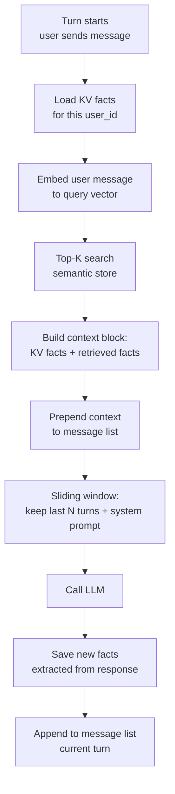

# الذاكرة: قصيرة المدى، طويلة المدى، ومتى لا تحتاجها

> كل token تنفقه على memory لا تحتاجها هو token مسروق من الإجابة.

**النوع:** بناء
**اللغات:** Python
**المتطلبات:** 04-08 (استخدام الأدوات وحلقة الـ agent)، أساسيات قواميس Python (dicts)، إلمام بالـ embeddings
**الوقت:** ~60 دقيقة
**أهداف التعلّم:**
- تسمية أنواع الذاكرة الأربعة وشرح المقايضة (tradeoff) التي يقدّمها كل نوع
- تطبيق الاقتطاع بنافذة منزلقة (sliding-window truncation) لإبقاء حلقة الـ agent ضمن ميزانية الـ context
- بناء مخزن key-value لتفضيلات المستخدم يبقى محفوظًا عبر الجلسات
- استرجاع الحقائق ذات الصلة من مخزن دلالي (semantic store) دون تحميل تاريخ المستخدم كاملًا
- دمج أنواع الذاكرة الثلاثة وقت التشغيل في فئة MemoryManager واحدة

---

## المشكلة

أنت تبني agent موجّهًا للعملاء. يفتح المستخدم محادثة ويقول "أفضّل وحدات النظام المتري وأنا نباتي"، ثم يطرح ثلاثة أسئلة أخرى. في السؤال الرابع يطلب وصفة طعام. يوصي الـ agent بطبق دجاج بوحدة الأونصة. لقد نسي بالفعل.

يبدو الحل واضحًا: احتفظ بكل شيء في قائمة الرسائل (message list). فتفعل ذلك. بعد ثلاثة أسابيع، يعرض عليك فريق العمليات تقرير تكلفة. الـ agent يستنزف 2.40$ في الجلسة الواحدة لأن كل دور (turn) يرسل 200KB من تاريخ الرسائل إلى النموذج. معظم هذا التاريخ غير ذي صلة بالسؤال الحالي. المستخدم الذي ضبط تفضيلاته في الجلسة الأولى يموّل إعادة قراءة كاملة لتلك المحادثة في كل نداء خلال الجلسة العشرين.

هذان وجهان لنفس المشكلة. يحدث النسيان قصير المدى عندما تمتلئ نافذة الـ context فتقتطع بإهمال، فتحذف تفضيل المستخدم الذي ذُكر مبكرًا. ويحدث التضخم طويل المدى عندما تتعامل مع مبدأ "تذكّر كل شيء" كاستراتيجية.

الذاكرة في الـ agents ليست إعدادًا ثنائيًا (binary) تشغّله. إنها قرار توجيه (routing) تتخذه أربع مرات في كل دور: ما الذي ينتمي إلى قائمة الرسائل الآن، وما الذي ينتمي إلى مخزن key-value مفهرس حسب المستخدم، وما الذي ينتمي إلى مخزن دلالي يُسترجع حسب الصلة، وما الذي ينتمي إلى الـ system prompt كتعليمات قائمة. الخطأ في هذا التوجيه يكلّف مالًا، أو يخفض الجودة، أو كليهما.

---

## المفهوم

### أنواع الذاكرة الأربعة

```
+------------------+------------------------+----------------------------+
|                  |   IN-CONTEXT           |   EXTERNAL                 |
+------------------+------------------------+----------------------------+
| SHORT-TERM       | Message list           | (not applicable)           |
|                  | Current conversation   |                            |
|                  | Sliding window         |                            |
+------------------+------------------------+----------------------------+
| LONG-TERM        | System prompt          | Key-value store            |
|                  | (procedural rules,     | (user prefs, facts)        |
|                  |  persona, constraints) |                            |
|                  |                        | Semantic store             |
|                  |                        | (retrieved by relevance)   |
+------------------+------------------------+----------------------------+
```

**قصيرة المدى داخل الـ context (قائمة الرسائل):** المحادثة المتدحرجة. سريعة، بلا زمن انتظار (latency)، متاحة تلقائيًا للنموذج. محدودة بنافذة الـ context. استخدمها لـ: كل ما في الجلسة الحالية مما قد يحتاجه النموذج للتماسك (coherence).

**طويلة المدى داخل الـ context (الـ system prompt):** القواعد والشخصية (persona) التي لا تتغير أبدًا. يكتبها المطوّر، ولا تُحدَّث لكل مستخدم. استخدمها لـ: النبرة، والقدرات، والقيود الصارمة. لا تستخدمها لـ: حقائق خاصة بمستخدم بعينه.

**key-value خارجية (dict أو Redis):** حقائق منظّمة خاصة بالمستخدم تُحمَّل عند بدء الجلسة. أمثلة: اللغة المفضّلة، القيود الغذائية، فئة الحساب. بحث سريع، زمن انتظار منخفض، استرجاع دقيق. استخدمها لـ: الحقائق التي تعرف أنك ستحتاجها دائمًا. التكلفة: تدفع context في كل دور حتى عندما لا تكون الحقائق ذات صلة.

**دلالية خارجية (vector store):** حقائق غير منظّمة خاصة بالمستخدم تُسترجع بتشابه الـ embedding. تقوم بعمل embedding للاستعلام الحالي، وتجد أكثر الحقائق المخزّنة صلة، ثم تحقن تلك فقط. استخدمها لـ: مجموعات الحقائق الكبيرة حيث معظم الحقائق غير ذات صلة بأي دور معيّن. التكلفة: نداء embedding واحد لكل دور إضافةً إلى زمن انتظار بحث المتجهات (vector search).

### مسار استرجاع الذاكرة



### متى لا تحتاج نوعًا بعينه

قاعدة تقريبية: إن كنت تحتاج الحقيقة دائمًا، استخدم KV. إن كنت قد تحتاجها، استخدم الدلالي (semantic). إن كنت تحتاجها في هذه الجلسة فقط، أبقِها في قائمة الرسائل. إن كانت لا تتغير لكل مستخدم، ضعها في الـ system prompt.

أخطاء شائعة:

- وضع كل تاريخ المستخدم في الـ system prompt (ينمو بلا حدود وتدفع ثمنه في كل دور)
- استخدام الاسترجاع الدلالي لحقائق قصيرة وثابتة مثل "user timezone = UTC-5" (مبالغة؛ استخدم KV ببساطة)
- إبقاء 200 دور في قائمة الرسائل "تحسبًا" (يستنزف الـ context على حقائق لا تظهر مجددًا أبدًا)

---

## البناء

### الخطوة 1: الذاكرة قصيرة المدى مع الاقتطاع بنافذة منزلقة

تنمو قائمة الرسائل مع كل دور. بدون اقتطاع ستتجاوز في النهاية نافذة الـ context أو ميزانية تكلفتك. أبسط استراتيجية آمنة: احتفظ بالـ system prompt إضافةً إلى آخر N من التبادلات.

راجع `code/main.py` للتطبيق الكامل. دالة الاقتطاع الأساسية:

```python
def truncate_messages(
    messages: list[dict],
    system: str,
    max_turns: int = 10,
) -> list[dict]:
    """
    Keep the last max_turns pairs (user + assistant) from the message list.
    The system prompt is passed separately and always included by the SDK.
    """
    # Each "turn" is one user message + one assistant message = 2 items
    max_messages = max_turns * 2
    if len(messages) > max_messages:
        messages = messages[-max_messages:]
    return messages
```

لماذا أزواج، لا رسائل مفردة؟ لأن حدّ الاقتطاع في منتصف تبادل بين المستخدم والـ assistant ينتج context مشوّهًا. يرى النموذج رسالة assistant بلا رسالة مستخدم سابقة، أو العكس. اقتطع دائمًا عند حدود الأدوار.

### الخطوة 2: مخزن key-value طويل المدى

للحقائق المنظّمة التي تحتاجها بشكل موثوق في كل جلسة (التفضيلات، إعدادات الحساب، السمات المعروفة)، يكفي dict بسيط. في الإنتاج (production) ستستبدل الـ dict بـ Redis أو DynamoDB، لكن الواجهة تبقى كما هي.

```python
from dataclasses import dataclass, field

@dataclass
class UserFacts:
    preferences: dict[str, str] = field(default_factory=dict)
    facts: dict[str, str] = field(default_factory=dict)

# In-process store (swap for Redis in production)
_KV_STORE: dict[str, UserFacts] = {}

def load_user_facts(user_id: str) -> UserFacts:
    return _KV_STORE.get(user_id, UserFacts())

def save_user_facts(user_id: str, facts: UserFacts) -> None:
    _KV_STORE[user_id] = facts

def format_kv_context(facts: UserFacts) -> str:
    """Convert stored facts to a string block for injection into context."""
    lines = []
    if facts.preferences:
        lines.append("User preferences:")
        for k, v in facts.preferences.items():
            lines.append(f"  - {k}: {v}")
    if facts.facts:
        lines.append("Known user facts:")
        for k, v in facts.facts.items():
            lines.append(f"  - {k}: {v}")
    return "\n".join(lines) if lines else ""
```

حمّل عند بدء الجلسة، واحفظ عند نهايتها. لا تُعِد التحميل في منتصف الجلسة إلا إذا حدّثت عملية أخرى المخزن.

### الخطوة 3: مخزن دلالي طويل المدى

لمجموعات الحقائق الأكبر، حمّل فقط ما هو ذو صلة بالدور الحالي. يستخدم هذا المثال تشابه جيب التمام (cosine similarity) على متجهات بسيطة بنمط TF. في الإنتاج، استبدل دالة الـ embedding بـ embeddings من `anthropic` أو بـ `sentence-transformers`.

```python
import math
from collections import Counter

def simple_embed(text: str) -> dict[str, float]:
    """
    Bag-of-words embedding (mock). Replace with real embeddings in production.
    Returns a normalized term-frequency vector as a dict.
    """
    words = text.lower().split()
    counts = Counter(words)
    norm = math.sqrt(sum(v ** 2 for v in counts.values()))
    return {w: c / norm for w, c in counts.items()} if norm > 0 else {}

def cosine_similarity(a: dict[str, float], b: dict[str, float]) -> float:
    return sum(a.get(w, 0.0) * b.get(w, 0.0) for w in b)

class SemanticStore:
    def __init__(self):
        self._entries: list[tuple[str, dict[str, float]]] = []

    def add(self, text: str) -> None:
        self._entries.append((text, simple_embed(text)))

    def retrieve(self, query: str, top_k: int = 3) -> list[str]:
        if not self._entries:
            return []
        q_vec = simple_embed(query)
        scored = [
            (cosine_similarity(q_vec, vec), text)
            for text, vec in self._entries
        ]
        scored.sort(reverse=True)
        return [text for _, text in scored[:top_k]]
```

### الخطوة 4: رؤية الأنواع الثلاثة وهي تعمل في جلسة واحدة

أثر (trace) لجلسة عيّنة يوضّح أي نوع ذاكرة يقدّم كل جزء من الـ context:

```
Turn 1
  User: "I'm a vegetarian and I prefer metric units."
  [KV: empty] [Semantic: empty]
  → Agent responds. KV updated: preferences["diet"] = "vegetarian",
    preferences["units"] = "metric"

Turn 2
  User: "What's a good high-protein breakfast?"
  [KV: loads diet=vegetarian, units=metric]
  [Semantic: retrieves "I'm a vegetarian" (score: 0.94)]
  → Agent answers with vegetarian options in grams.

Turn 7 (messages list has grown)
  [Sliding window: only turns 3-7 kept in message list]
  [KV: still has diet and units, loaded fresh from store]
  [Semantic: retrieves "prefers metric units" (score: 0.89)]
  → Preference is available even though the original message was truncated.
```

هذه هي الفكرة الجوهرية: ذاكرة KV والذاكرة الدلالية هما شبكة الأمان لديك للحقائق التي لولاهما لسقطت خارج النافذة المنزلقة.

> **اختبار من الواقع:** الـ agent لديك يقتطع إلى آخر 10 أدوار. ذكر المستخدم قيده الغذائي في الدور 2. في الدور 12، يطلب خطة وجبات. أين يجب أن يعيش ذلك القيد الغذائي ليبقى لدى الـ agent؟

يجب أن يعيش في مخزن KV، لا في قائمة الرسائل. لن تحتوي قائمة الرسائل بعد الآن على الدور 2. يحمّل مخزن KV التفضيلات الغذائية عند بدء الجلسة بغضّ النظر عن عدد الأدوار التي مرّت. الاعتماد على قائمة الرسائل لحقائق المستخدم الدائمة خطأ تصميمي ينتج بالضبط هذا النوع من التراجع (regression).

---

## الاستخدام

### فئة MemoryManager

دمج الأنواع الثلاثة في واجهة واحدة يمكن لحلقة الـ agent استدعاؤها في كل دور:

```python
import anthropic

class MemoryManager:
    def __init__(self, user_id: str):
        self.user_id = user_id
        self.kv = load_user_facts(user_id)
        self.semantic = SemanticStore()
        self.messages: list[dict] = []
        self._max_turns = 10

    def build_context_prefix(self, user_message: str) -> str:
        """
        Retrieve relevant memory and format it for injection before the user message.
        Called once per turn, before appending the user message.
        """
        kv_block = format_kv_context(self.kv)
        semantic_hits = self.semantic.retrieve(user_message, top_k=3)
        semantic_block = (
            "Recalled facts:\n" + "\n".join(f"  - {f}" for f in semantic_hits)
            if semantic_hits else ""
        )
        parts = [p for p in [kv_block, semantic_block] if p]
        return "\n\n".join(parts) if parts else ""

    def add_turn(self, role: str, content: str) -> None:
        self.messages.append({"role": role, "content": content})
        self.messages = truncate_messages(self.messages, system="", max_turns=self._max_turns)

    def extract_and_store(self, assistant_message: str) -> None:
        """
        Naive fact extraction: any sentence containing 'user' or 'you' gets stored
        in the semantic store. Replace with an LLM extraction call in production.
        """
        for sentence in assistant_message.split("."):
            if any(w in sentence.lower() for w in ["user", "you", "prefer", "like", "dislike"]):
                self.semantic.add(sentence.strip())

    def save(self) -> None:
        save_user_facts(self.user_id, self.kv)


def run_agent_turn(
    memory: MemoryManager,
    user_message: str,
    system_prompt: str,
    client: anthropic.Anthropic,
) -> str:
    context_prefix = memory.build_context_prefix(user_message)

    # Inject memory context as a system-level note before the user message
    augmented_message = user_message
    if context_prefix:
        augmented_message = f"[Memory context]\n{context_prefix}\n\n[User message]\n{user_message}"

    memory.add_turn("user", augmented_message)

    response = client.messages.create(
        model="claude-3-5-haiku-20241022",
        max_tokens=1024,
        system=system_prompt,
        messages=memory.messages,
    )
    reply = response.content[0].text
    memory.add_turn("assistant", reply)
    memory.extract_and_store(reply)
    return reply
```

تبقى حلقة الـ agent نظيفة. وتُغلَّف قرارات الذاكرة داخلها.

> **نقلة في المنظور:** تقرأ هذا وتفكّر "لماذا لا نضع كل شيء في الـ system prompt، فهو أبسط؟" ما الذي ينكسر على نطاق واسع عندما تنمو الحقائق الخاصة بالمستخدم بلا حدود في الـ system prompt؟

يُرسَل الـ system prompt في كل نداء API على حِدة. الـ system prompt بحجم 200KB يحوي تاريخ المستخدم كاملًا يكلّف نفس الكمية للمعالجة سواء كانت أي من تلك الحقائق مهمة للسؤال الحالي أم لا. تتراكم التكلفة عبر كل دور في كل جلسة. في المقابل، يحاسبك المخزن الدلالي على نداء embedding واحد لكل دور لكنه يحقن فقط أكثر ثلاث حقائق صلة، وعادةً بضع مئات من الـ tokens. مع نمو تاريخ المستخدم من 10 حقائق إلى 10,000، يصبح أسلوب الـ system prompt غير قابل للاستخدام. أما الأسلوب الدلالي فيبقى مستويًا.

---

## التسليم

المُخرَج الذي يُنتجه هذا الدرس هو نمط `MemoryManager` قابل لإعادة الاستخدام مع إطار قرار توجيه الذاكرة. راجع `outputs/skill-agent-memory.md`.

استخدم هذا المُخرَج عند إضافة memory إلى أي agent جديد. يتضمّن مصفوفة القرار رباعية الأرباع، وتوقيع فئة `MemoryManager`، ومسار الاسترجاع لكل دور كقائمة تحقّق. انسخ الفئة، واستبدل بها الـ embedding الحقيقي ومخزن KV الخاص بك، ويكون منطق التوجيه قد تقرر مسبقًا.

---

## التقييم

**الذاكرة قصيرة المدى:** شغّل جلسة من 20 دورًا. تحقّق من أنه بعد الاقتطاع، لا يزال لدى النموذج السياق الصحيح للدور الحالي. نمط الفشل: الاقتطاع عند الحد الخاطئ ينتج قائمة رسائل تبدأ برسالة assistant (بلا رسالة مستخدم سابقة). تحقّق عبر التأكيد على `messages[0]["role"] == "user"` بعد كل اقتطاع.

**صحة KV:** اضبط تفضيلًا في الدور 1. شغّل 15 دورًا. في الدور 16، اطرح سؤالًا يتطلب التفضيل. تحقّق من أن الـ agent يستخدمه. الدرجة: 1.0 إن جرى احترام التفضيل، 0.0 إن لم يُحترم. شغّل 10 جلسات كهذه؛ معدل النجاح المستهدف هو 10/10.

**دقة الاسترجاع الدلالي:** ازرع المخزن الدلالي بـ 20 حقيقة. في كل استعلام من 10 استعلامات اختبارية، تحقّق من أن واحدة على الأقل من أكثر ثلاث حقائق مُسترجَعة هي الأكثر صلة (حسب حكم إنسان). الهدف: 8/10.

**قياس التكلفة:** سجّل `usage.input_tokens` لكل دور في جلسة من 20 دورًا مع الاسترجاع الدلالي وبدونه (مقابل حقن التاريخ الكامل). يجب أن يستخدم الأسلوب الدلالي عددًا أقل من إجمالي الـ tokens عندما تتجاوز مجموعة الحقائق المخزّنة 50 مُدخَلًا.
