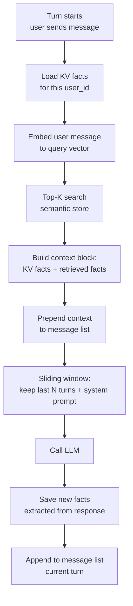

# Memory: Short-Term, Long-Term, When You Don't Need It

> Every token you spend on memory you don't need is a token stolen from the answer.

**Type:** Build
**Languages:** Python
**Prerequisites:** 04-08 (tool use and the agent loop), basic Python dicts, familiarity with embeddings
**Time:** ~60 min
**Learning Objectives:**
- Name the four memory types and explain the tradeoff each makes
- Implement sliding-window truncation to keep the agent loop inside the context budget
- Build a key-value store for user preferences that survives across sessions
- Retrieve relevant facts from a semantic store without loading all user history
- Combine all three runtime memory types in a single MemoryManager class

---

## THE PROBLEM

You are building a customer-facing agent. A user opens a conversation, says "I prefer metric units and I'm a vegetarian," then asks three more questions. On the fourth question they ask for a recipe. The agent recommends a chicken dish in ounces. It has already forgotten.

The fix seems obvious: keep everything in the message list. So you do. Three weeks later, your ops team shows you a cost report. Your agent is burning $2.40 per session because every turn ships 200KB of message history to the model. Most of that history is irrelevant to the current question. A user who set their preferences in session one is funding a full re-read of that conversation on every call in session twenty.

These are two sides of the same problem. Short-term forgetting happens when the context window fills up and you truncate carelessly, cutting out the user preference that was stated early. Long-term bloat happens when you treat "remember everything" as a strategy.

Memory in agents is not a binary setting you turn on. It is a routing decision you make four times per turn: what belongs in the message list right now, what belongs in a key-value store indexed by user, what belongs in a semantic store retrieved by relevance, and what belongs in the system prompt as a standing instruction. Getting that routing wrong costs money, degrades quality, or both.

---

## THE CONCEPT

### Four Memory Types

```
+------------------+------------------------+----------------------------+
|                  |   IN-CONTEXT           |   EXTERNAL                 |
+------------------+------------------------+----------------------------+
| SHORT-TERM       | Message list           | (not applicable)           |
|                  | Current conversation   |                            |
|                  | Sliding window         |                            |
+------------------+------------------------+----------------------------+
| LONG-TERM        | System prompt          | Key-value store            |
|                  | (procedural rules,     | (user prefs, facts)        |
|                  |  persona, constraints) |                            |
|                  |                        | Semantic store             |
|                  |                        | (retrieved by relevance)   |
+------------------+------------------------+----------------------------+
```

**In-context short-term (message list):** The rolling conversation. Fast, zero latency, automatically available to the model. Limited by the context window. Use for: everything in the current session that the model might need for coherence.

**In-context long-term (system prompt):** Rules and persona that never change. Written by the developer, not updated per user. Use for: tone, capabilities, hard constraints. Do not use for: user-specific facts.

**External key-value (dict or Redis):** User-specific structured facts loaded at session start. Examples: preferred language, dietary restrictions, account tier. Fast lookup, low latency, exact retrieval. Use for: facts you know you will always need. Cost: you pay context on every turn even when the facts are not relevant.

**External semantic (vector store):** User-specific unstructured facts retrieved by embedding similarity. You embed the current query, find the most relevant stored facts, inject only those. Use for: large fact sets where most facts are irrelevant to any given turn. Cost: one embedding call per turn plus vector search latency.

### Memory Retrieval Flow



### When You Don't Need a Given Type

A rule of thumb: if you always need the fact, use KV. If you might need it, use semantic. If you only need it this session, keep it in the message list. If it never changes per user, put it in the system prompt.

Common mistakes:

- Putting all user history in the system prompt (it grows unbounded and you pay for it every turn)
- Using semantic retrieval for short stable facts like "user timezone = UTC-5" (overkill; just use KV)
- Keeping 200 turns in the message list "just in case" (burns context for facts that never come up again)

---

## BUILD IT

### Step 1: Short-Term Memory with Sliding Window Truncation

The message list grows with every turn. Without truncation it will eventually exceed the context window or your cost budget. The simplest safe strategy: keep the system prompt plus the last N exchanges.

See `code/main.py` for the full implementation. The core truncation function:

```python
def truncate_messages(
    messages: list[dict],
    system: str,
    max_turns: int = 10,
) -> list[dict]:
    """
    Keep the last max_turns pairs (user + assistant) from the message list.
    The system prompt is passed separately and always included by the SDK.
    """
    # Each "turn" is one user message + one assistant message = 2 items
    max_messages = max_turns * 2
    if len(messages) > max_messages:
        messages = messages[-max_messages:]
    return messages
```

Why pairs, not individual messages? Because a truncation boundary in the middle of a user/assistant exchange produces malformed context. The model sees an assistant message with no preceding user message, or vice versa. Always truncate at turn boundaries.

### Step 2: Long-Term Key-Value Store

For structured facts you reliably need each session (preferences, account settings, known attributes), a simple dict is sufficient. In production you would replace the dict with Redis or DynamoDB, but the interface stays the same.

```python
from dataclasses import dataclass, field

@dataclass
class UserFacts:
    preferences: dict[str, str] = field(default_factory=dict)
    facts: dict[str, str] = field(default_factory=dict)

# In-process store (swap for Redis in production)
_KV_STORE: dict[str, UserFacts] = {}

def load_user_facts(user_id: str) -> UserFacts:
    return _KV_STORE.get(user_id, UserFacts())

def save_user_facts(user_id: str, facts: UserFacts) -> None:
    _KV_STORE[user_id] = facts

def format_kv_context(facts: UserFacts) -> str:
    """Convert stored facts to a string block for injection into context."""
    lines = []
    if facts.preferences:
        lines.append("User preferences:")
        for k, v in facts.preferences.items():
            lines.append(f"  - {k}: {v}")
    if facts.facts:
        lines.append("Known user facts:")
        for k, v in facts.facts.items():
            lines.append(f"  - {k}: {v}")
    return "\n".join(lines) if lines else ""
```

Load at session start, save at session end. Do not reload mid-session unless another process updates the store.

### Step 3: Long-Term Semantic Store

For larger fact sets, load only what is relevant to the current turn. This example uses cosine similarity on simple TF-style vectors. In production, replace the embedding function with `anthropic` embeddings or `sentence-transformers`.

```python
import math
from collections import Counter

def simple_embed(text: str) -> dict[str, float]:
    """
    Bag-of-words embedding (mock). Replace with real embeddings in production.
    Returns a normalized term-frequency vector as a dict.
    """
    words = text.lower().split()
    counts = Counter(words)
    norm = math.sqrt(sum(v ** 2 for v in counts.values()))
    return {w: c / norm for w, c in counts.items()} if norm > 0 else {}

def cosine_similarity(a: dict[str, float], b: dict[str, float]) -> float:
    return sum(a.get(w, 0.0) * b.get(w, 0.0) for w in b)

class SemanticStore:
    def __init__(self):
        self._entries: list[tuple[str, dict[str, float]]] = []

    def add(self, text: str) -> None:
        self._entries.append((text, simple_embed(text)))

    def retrieve(self, query: str, top_k: int = 3) -> list[str]:
        if not self._entries:
            return []
        q_vec = simple_embed(query)
        scored = [
            (cosine_similarity(q_vec, vec), text)
            for text, vec in self._entries
        ]
        scored.sort(reverse=True)
        return [text for _, text in scored[:top_k]]
```

### Step 4: Seeing All Three Fire in a Session

A sample session trace showing which memory type provides each piece of context:

```
Turn 1
  User: "I'm a vegetarian and I prefer metric units."
  [KV: empty] [Semantic: empty]
  → Agent responds. KV updated: preferences["diet"] = "vegetarian",
    preferences["units"] = "metric"

Turn 2
  User: "What's a good high-protein breakfast?"
  [KV: loads diet=vegetarian, units=metric]
  [Semantic: retrieves "I'm a vegetarian" (score: 0.94)]
  → Agent answers with vegetarian options in grams.

Turn 7 (messages list has grown)
  [Sliding window: only turns 3-7 kept in message list]
  [KV: still has diet and units, loaded fresh from store]
  [Semantic: retrieves "prefers metric units" (score: 0.89)]
  → Preference is available even though the original message was truncated.
```

This is the key insight: KV and semantic memory are your safety net for facts that would otherwise fall out of the sliding window.

> **Real-world check:** Your agent truncates to the last 10 turns. A user stated their dietary restriction in turn 2. On turn 12, they ask for a meal plan. Where should that dietary restriction live so the agent still has it?

It should live in the KV store, not the message list. The message list will no longer contain turn 2. The KV store loads dietary preferences at session start regardless of how many turns have passed. Relying on the message list for durable user facts is a design error that produces exactly this kind of regression.

---

## USE IT

### A MemoryManager Class

Combining all three types in a single interface that an agent loop can call on each turn:

```python
import anthropic

class MemoryManager:
    def __init__(self, user_id: str):
        self.user_id = user_id
        self.kv = load_user_facts(user_id)
        self.semantic = SemanticStore()
        self.messages: list[dict] = []
        self._max_turns = 10

    def build_context_prefix(self, user_message: str) -> str:
        """
        Retrieve relevant memory and format it for injection before the user message.
        Called once per turn, before appending the user message.
        """
        kv_block = format_kv_context(self.kv)
        semantic_hits = self.semantic.retrieve(user_message, top_k=3)
        semantic_block = (
            "Recalled facts:\n" + "\n".join(f"  - {f}" for f in semantic_hits)
            if semantic_hits else ""
        )
        parts = [p for p in [kv_block, semantic_block] if p]
        return "\n\n".join(parts) if parts else ""

    def add_turn(self, role: str, content: str) -> None:
        self.messages.append({"role": role, "content": content})
        self.messages = truncate_messages(self.messages, system="", max_turns=self._max_turns)

    def extract_and_store(self, assistant_message: str) -> None:
        """
        Naive fact extraction: any sentence containing 'user' or 'you' gets stored
        in the semantic store. Replace with an LLM extraction call in production.
        """
        for sentence in assistant_message.split("."):
            if any(w in sentence.lower() for w in ["user", "you", "prefer", "like", "dislike"]):
                self.semantic.add(sentence.strip())

    def save(self) -> None:
        save_user_facts(self.user_id, self.kv)


def run_agent_turn(
    memory: MemoryManager,
    user_message: str,
    system_prompt: str,
    client: anthropic.Anthropic,
) -> str:
    context_prefix = memory.build_context_prefix(user_message)

    # Inject memory context as a system-level note before the user message
    augmented_message = user_message
    if context_prefix:
        augmented_message = f"[Memory context]\n{context_prefix}\n\n[User message]\n{user_message}"

    memory.add_turn("user", augmented_message)

    response = client.messages.create(
        model="claude-3-5-haiku-20241022",
        max_tokens=1024,
        system=system_prompt,
        messages=memory.messages,
    )
    reply = response.content[0].text
    memory.add_turn("assistant", reply)
    memory.extract_and_store(reply)
    return reply
```

The agent loop stays clean. The memory decisions are encapsulated.

> **Perspective shift:** You're reading this and thinking "why not just put everything in the system prompt, it's simpler?" What breaks at scale when user-specific facts grow unbounded in the system prompt?

The system prompt is sent on every single API call. A 200KB system prompt with a user's full history costs the same to process whether or not any of those facts matter to the current question. The cost compounds across every turn of every session. By contrast, a semantic store charges you one embedding call per turn but only injects the top-3 relevant facts, typically a few hundred tokens. As user history grows from 10 facts to 10,000, the system prompt approach becomes unusable. The semantic approach stays flat.

---

## SHIP IT

The artifact this lesson produces is a reusable `MemoryManager` pattern with the memory routing decision framework. See `outputs/skill-agent-memory.md`.

Use this artifact when adding memory to any new agent. It includes the four-quadrant decision matrix, the `MemoryManager` class signature, and the per-turn retrieval flow as a checklist. Copy the class, swap in your real embedding and KV backend, and the routing logic is already decided.

---

## EVALUATE IT

**Short-term memory:** Run a session with 20 turns. Verify that after truncation, the model still has correct context for the current turn. Failure mode: truncation at the wrong boundary creates a message list that starts with an assistant message (no preceding user message). Check by asserting `messages[0]["role"] == "user"` after every truncation.

**KV correctness:** Set a preference in turn 1. Run 15 turns. On turn 16, ask a question that requires the preference. Verify the agent uses it. Score: 1.0 if preference is honored, 0.0 if not. Run 10 such sessions; target pass rate is 10/10.

**Semantic retrieval precision:** Seed the semantic store with 20 facts. On each of 10 test queries, verify that at least 1 of the top-3 retrieved facts is the most relevant one (as judged by a human). Target: 8/10.

**Cost measurement:** Log `usage.input_tokens` per turn in a 20-turn session with and without semantic retrieval (versus full history injection). The semantic approach should use fewer total tokens when the stored fact set exceeds 50 entries.
