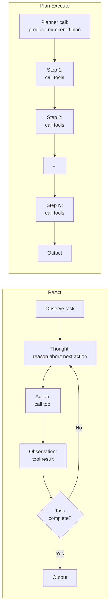

# التخطيط (Planning): ReAct، وPlan-and-Execute

> الـ agent بلا خطة هو حلقة (loop) لديها مشكلة ميزانية.

**النوع:** بناء
**اللغات:** Python
**المتطلبات:** 04-08 (استخدام الأدوات والتعافي من الأخطاء)، 04-04 (التوجيه/routing)، أساسيات Python
**الوقت:** ~60 دقيقة
**أهداف التعلّم:**
- شرح الفرق بين ReAct وPlan-and-Execute ومتى يستحق كلٌّ منهما تعقيده
- تطبيق حلقة ReAct تستخرج وتسجّل "Thought:" قبل كل نداء أداة
- بناء حلقة Plan-and-Execute بمرحلتين، فيها نداء مخطِّط (planner) وحلقة منفّذ (executor) منفصلة
- تطبيق كلا النمطين على مهمة بحثية متعددة الخطوات ومقارنة جودة المُخرَجات
- تحديد أنماط الفشل التي يُدخلها كل نمط

---

## المشكلة

تعطي الـ agent المهمة: "ابحث واكتب تحليلًا تنافسيًا لمنتجنا." يبدأ الـ agent باستدعاء الأدوات فورًا. أولًا يبحث عن "competitors". ثم يبحث عن "competitor pricing". ثم يبحث عن "competitor funding". يجري 8 نداءات أدوات. بحلول الدور 8، يمتلئ الـ context ولم يغطِّ الـ agent سوى منافس واحد من الخمسة الذين توقّعتهم. يتوقف، وينتج تحليلًا جزئيًا، ويبلّغ عنه على أنه مكتمل.

لم يحدث خطأ في نداءات الأدوات نفسها. الأدوات عملت. الـ agent فقط لم تكن لديه خطة. عمل في وضع رد فعل محض: استقبل المهمة، استدعِ الأداة المعقولة التالية، استقبل النتيجة، استدعِ الأداة المعقولة التالية. بلا خطة، ليس لدى الـ agent طريقة ليعرف متى ينتهي، ولا طريقة ليكتشف أنه خرج عن المسار، ولا نقطة توقف طبيعية قبل أن ينفد الـ context.

المشكلة ليست خاصة بمهام البحث. أي مهمة agent متعددة الخطوات تمسّ أكثر من 3 أدوات تحتاج شكلًا ما من التخطيط. بدونه، يكون سلوك الـ agent ناشئًا (emergent)، وغير قابل للتدقيق، ونهمًا للـ context.

يعالج هذا نمطان: يضيف ReAct تفكيرًا خفيفًا قبل كل إجراء كي يستطيع النموذج تصحيح نفسه. ويضيف Plan-and-Execute خطة كاملة مسبقًا كي يعرف المنفّذ متى انتهى.

---

## المفهوم

### ReAct: التفكير والإجراء بالتناوب

ReAct ليس ميزة في إطار عمل (framework). إنه عُرف في صياغة الـ prompt. تُرشد النموذج إلى إنتاج سطر "Thought:" قبل كل نداء أداة. لا تُرسَل الفكرة إلى أي أداة. إنها التفكير الداخلي للنموذج، مرئيٌّ لك كمطوّر، يوجّه أي أداة تُستدعى تاليًا.

```
Thought: I need to find the top 3 competitors first before comparing them.
Action: search("top competitors to [product name]")
Observation: [search results]
Thought: I have 3 competitors. Now I need pricing for each. Starting with Competitor A.
Action: search("Competitor A pricing 2024")
Observation: [search results]
...
```

الفكرة رخيصة التوليد (مجرد نص)، ولا تكلّف نداء أداة إضافيًا، وتحسّن تماسك المهمة بشكل كبير. عندما تسجّل الأفكار، تستطيع أن ترى بالضبط أين أخطأ الـ agent.

ReAct بسيط وناشئ وهشّ في المهام المعقّدة. إن كانت المهمة من 15 خطوة والـ agent غارق في الخطوة 7، فقد ينسى الخطوات 8-15 لأنها انزلقت خارج "انتباهه". الخطة موجودة ضمنيًا فقط في تيار الأفكار.

### Plan-and-Execute: تنفيذ صريح بمرحلتين

يفصل Plan-and-Execute التفكير عن الإجراء. المرحلة 1 هي نداء LLM واحد ينتج خطة مرقّمة. المرحلة 2 تتنقّل عبر خطوات الخطة، مستدعيةً الأدوات حسب الحاجة لكل خطوة.

```
Phase 1 - Planner call:
  "Given the task, produce a numbered execution plan."
  Output:
    1. Search for the top 5 competitors in the market
    2. For each competitor, retrieve their pricing page
    3. For each competitor, retrieve their key differentiators
    4. Compare differentiators across all 5
    5. Write the analysis

Phase 2 - Executor loop:
  For each step in the plan:
    Call the appropriate tool(s)
    Store the result
    Continue to next step
```

الخطة قابلة للفحص قبل التنفيذ. تستطيع رفضها أو تعديلها. وتستطيع الاستئناف من أي خطوة إن فشل المنفّذ في منتصف الطريق. وتعرف بالضبط متى يكتمل التنفيذ: عندما تنتهي كل الخطوات.

التكلفة: نداء مخطِّط قبل أن يبدأ أي عمل، وجمود (rigidity) عندما تتطلب المهمة التكيّف في منتصف التنفيذ. خطة مكتوبة قبل رؤية نتائج البحث لا تستطيع معرفة أن المنافس 3 ليست لديه صفحة تسعير عامة.

### الأنماط جنبًا إلى جنب



### نسخة مثال من ReAct (ASCII)

```
Task: Find and compare 3 competitors

Turn 1:
  Thought: I should first identify 3 competitors before doing any comparison.
           I'll use the search tool to find the main players in this space.
  Action: search("top competitors to [product]")
  Observation: [Result: CompA, CompB, CompC are the main competitors]

Turn 2:
  Thought: Good. I have 3 competitors. Now I need key info on each.
           I'll start with CompA's positioning.
  Action: get_webpage("compa.com/about")
  Observation: [Result: CompA focuses on enterprise, pricing from $500/mo]

Turn 3:
  Thought: CompA done. Moving to CompB.
  Action: get_webpage("compb.com/about")
  Observation: [Result: CompB is self-serve, starts at $49/mo]

Turn 4:
  Thought: CompB done. CompC next.
  Action: get_webpage("compc.com/pricing")
  Observation: [Result: CompC pricing not public, contact sales only]

Turn 5:
  Thought: All 3 competitors researched. I have enough to write the comparison.
           No more tool calls needed.
  Action: [none - generate final output]
```

عندما يسجّل الـ agent أفكاره، تستطيع تدقيق كل قرار. وعندما لا يفعل، تكون الحلقة نفسها صندوقًا أسود.

---

## البناء

### الخطوة 1: ReAct في Python خام

الـ system prompt هو الآلية بأكملها. يُرشد النموذج إلى إخراج سطر `Thought:` دائمًا قبل اختيار أداة. والمحلّل (parser) يستخرجه.

راجع `code/main.py` للتطبيق الكامل.

```python
REACT_SYSTEM_PROMPT = """You are a research agent. You have access to tools to search and retrieve information.

IMPORTANT: Before every tool call, you MUST output a line starting with "Thought:" that explains your reasoning.
Format your response as:
Thought: [your reasoning about what to do next and why]

Then call the appropriate tool. If you have enough information to answer without a tool, output:
Thought: [reasoning]
Then provide your final answer directly.

Be systematic. Work through the task step by step."""
```

محلّل الأفكار:

```python
def extract_thought(text: str) -> str | None:
    """Extract the Thought: line from a model response for logging."""
    for line in text.splitlines():
        if line.strip().lower().startswith("thought:"):
            return line.strip()[len("thought:"):].strip()
    return None
```

حلقة ReAct:

```python
def react_loop(
    task: str,
    tools: list[dict],
    tool_fn: dict[str, callable],
    client: anthropic.Anthropic,
    max_iterations: int = 10,
) -> str:
    messages = [{"role": "user", "content": task}]
    thoughts = []

    for iteration in range(max_iterations):
        response = client.messages.create(
            model="claude-3-5-haiku-20241022",
            max_tokens=1024,
            system=REACT_SYSTEM_PROMPT,
            tools=tools,
            messages=messages,
        )

        # Log any thoughts before tool calls
        for block in response.content:
            if block.type == "text":
                thought = extract_thought(block.text)
                if thought:
                    thoughts.append(f"[iter {iteration+1}] {thought}")
                    print(f"  Thought: {thought}")

        if response.stop_reason == "end_turn":
            # Final text answer
            final = next(
                (b.text for b in response.content if b.type == "text"), ""
            )
            print(f"\nFinal thoughts logged ({len(thoughts)} total):")
            for t in thoughts:
                print(f"  {t}")
            return final

        if response.stop_reason == "tool_use":
            messages.append({"role": "assistant", "content": response.content})
            tool_results = []
            for block in response.content:
                if block.type == "tool_use":
                    print(f"  Action: {block.name}({block.input})")
                    result = tool_fn[block.name](**block.input)
                    print(f"  Observation: {str(result)[:100]}")
                    tool_results.append({
                        "type": "tool_result",
                        "tool_use_id": block.id,
                        "content": str(result),
                    })
            messages.append({"role": "user", "content": tool_results})

    return "Max iterations reached without completion."
```

### الخطوة 2: تسجيل الأفكار لأغراض التنقيح (Debugging)

كل فكرة نافذة على تفكير الـ agent عند تلك اللحظة. سجّلها في أثر (trace) منظّم:

```python
@dataclass
class ThoughtTrace:
    iteration: int
    thought: str
    action: str | None
    observation: str | None

# In the loop, append:
trace.append(ThoughtTrace(
    iteration=iteration,
    thought=thought or "",
    action=f"{block.name}({block.input})" if block.type == "tool_use" else None,
    observation=str(result)[:200] if result else None,
))
```

عندما يخطئ الـ agent، يخبرك الأثر بأي فكرة سبقت الإجراء السيّئ. بدون الأفكار، تعرف فقط تسلسل الإجراءات، لا السبب.

> **اختبار من الواقع:** الـ agent لديك مكلّف بالبحث عن 5 منافسين لكنه يغطي 3 فقط قبل التوقف. تحتاج أن تعرف ما إن كانت المشكلة أداة مفقودة، أو خطأ تفكير، أو مشكلة في نافذة الـ context. ما الذي يخبرك به سجلّ الأفكار ولا يستطيع سجلّ نداءات الأدوات وحده؟

يُظهر لك سجلّ الأفكار نيّة النموذج قبل كل إجراء. إن قالت الفكرة في التكرار 7 "أظن أنني غطّيت ما يكفي من المنافسين" بينما لم يُبحَث سوى عن 3، فالمشكلة في التفكير، لا في الأدوات. وإن قالت الفكرة "ينبغي أن أتحقّق من CompD تاليًا" لكن الإجراء التالي يبحث عن شيء غير ذي صلة، فثمة مشكلة في التحليل (parsing) أو في اتّباع التعليمات. بدون الأفكار، تعرف فقط أن 3 أدوات استُدعيت، لا لماذا توقّف الـ agent.

---

## الاستخدام

### Plan-and-Execute كمقارنة مضادّة

نداءان بدلًا من حلقة متناوبة واحدة:

```python
PLANNER_PROMPT = """You are a planning agent. Given a task, output a numbered execution plan.
Format: output only the numbered steps, one per line. No prose, no explanations.
Example:
1. Search for X
2. Retrieve Y for each result
3. Compare X and Y
4. Write summary"""

EXECUTOR_PROMPT = """You are an execution agent. You will be given one step from a plan.
Complete that step using the available tools. Be thorough and specific."""


def plan_and_execute(
    task: str,
    tools: list[dict],
    tool_fn: dict[str, callable],
    client: anthropic.Anthropic,
) -> dict:
    # Phase 1: generate the plan
    plan_response = client.messages.create(
        model="claude-3-5-haiku-20241022",
        max_tokens=512,
        system=PLANNER_PROMPT,
        messages=[{"role": "user", "content": task}],
    )
    plan_text = plan_response.content[0].text
    steps = [
        line.strip()
        for line in plan_text.splitlines()
        if line.strip() and line.strip()[0].isdigit()
    ]
    print(f"Plan ({len(steps)} steps):")
    for step in steps:
        print(f"  {step}")

    # Phase 2: execute each step
    results = {}
    for i, step in enumerate(steps, start=1):
        print(f"\nExecuting step {i}: {step}")
        step_messages = [{"role": "user", "content": f"Task: {step}\n\nContext from previous steps:\n{format_results(results)}"}]
        step_response = client.messages.create(
            model="claude-3-5-haiku-20241022",
            max_tokens=1024,
            system=EXECUTOR_PROMPT,
            tools=tools,
            messages=step_messages,
        )

        if step_response.stop_reason == "tool_use":
            step_messages.append({"role": "assistant", "content": step_response.content})
            tool_results = []
            for block in step_response.content:
                if block.type == "tool_use":
                    result = tool_fn[block.name](**block.input)
                    tool_results.append({
                        "type": "tool_result",
                        "tool_use_id": block.id,
                        "content": str(result),
                    })
            step_messages.append({"role": "user", "content": tool_results})
            final = client.messages.create(
                model="claude-3-5-haiku-20241022",
                max_tokens=1024,
                system=EXECUTOR_PROMPT,
                messages=step_messages,
            )
            results[f"step_{i}"] = next(
                (b.text for b in final.content if b.type == "text"), ""
            )
        else:
            results[f"step_{i}"] = next(
                (b.text for b in step_response.content if b.type == "text"), ""
            )
        print(f"  Result: {results[f'step_{i}'][:100]}")

    return results


def format_results(results: dict) -> str:
    return "\n".join(f"{k}: {v[:200]}" for k, v in results.items()) if results else "None yet"
```

الفرق البنيوي الأساسي عن ReAct: تُقرَّر الخطة قبل تشغيل أي أداة. تستطيع فحصها، وتسجيلها، والاستئناف من أي فهرس خطوة.

> **نقلة في المنظور:** يقول زميل في الفريق "Plan-and-Execute أفضل قطعًا لأنه أكثر تنظيمًا." متى يكون ReAct فعليًا الخيار الأفضل؟

ReAct أفضل عندما تتطلب المهمة التكيّف بناءً على ما تعيده كل أداة. إن قالت الخطوة 3 من خطة "استرجع صفحة تسعير CompC" لكن تلك الصفحة غير موجودة، فإن حلقة plan-and-execute إما تفشل أو تنتج ثغرة. دورة التفكير-الإجراء-الملاحظة في ReAct تتكيّف طبيعيًا: قد تقول الفكرة بعد الاسترجاع الفاشل "التسعير غير متاح علنًا؛ سأتحقّق من المقالات الإخبارية بدلًا من ذلك." للمهام ذات الخطوات الوسيطة غير المؤكّدة، يتفوّق تكيّف ReAct أثناء التنفيذ على خطة مسبقة هشّة.

---

## التسليم

المُخرَج الذي يُنتجه هذا الدرس هو system prompt قابل لإعادة الاستخدام لـ ReAct ومحلّل استجابة (response parser). راجع `outputs/skill-react-planner.md`.

يُرشد الـ prompt النموذج إلى إخراج `Thought:` قبل كل إجراء، مما يمنحك أثر تنقيح مجانًا. والمحلّل يستخرج الأفكار من الاستجابات. استخدم هذا متى احتجت حلقة استدعاء أدوات قابلة للتدقيق ولم تحتج جمود الخطة المسبقة.

---

## التقييم

**جودة أفكار ReAct:** شغّل الـ agent على 5 مهام. لكل واحدة، قيّم ما إن كانت الفكرة قبل كل إجراء قد تنبّأت بشكل صحيح بما سيجده الإجراء (0 = التنبؤ غير ذي صلة بالإجراء، 1 = التنبؤ تطابق). الهدف: 70% من الأفكار تنبؤية.

**اكتمال الخطة:** شغّل المخطِّط على 5 مهام بحثية. لكل واحدة، عُدّ كم خطوة من الخطة كانت مطلوبة فعليًا مقابل كم كانت في الخطة. المخطِّط الجيد يولّد خططًا تغطّي كل العمل المطلوب دون كميات كبيرة من الخطوات غير الضرورية.

**معدل اكتمال Plan-and-Execute:** على 10 مهام متعددة الخطوات، قِس النسبة المئوية التي تصل إلى الخطوة الأخيرة دون خطأ يفرض التوقف. الهدف: 8/10. قارن بمعدل اكتمال ReAct على المهام نفسها.

**كفاءة الـ context:** سجّل `usage.input_tokens` لكل مهمة مكتملة لكلا النمطين. يستخدم ReAct عادةً عددًا أقل من إجمالي الـ tokens في المهام التكيّفية (يتوقف عند الانتهاء). ويستخدم Plan-and-Execute عادةً أعداد tokens أكثر قابلية للتنبؤ (الخطة تحدّ من العمل).

**اختبار فائدة سجلّ الأفكار:** أدخِل خطأ تفكير متعمّدًا (تعليمة أداة سيّئة في الـ system prompt). شغّل ReAct وPlan-and-Execute. قِس كم دقيقة يستغرق تحديد موقع الخطأ باستخدام سجلّ الأفكار فقط مقابل سجلّ نداءات الأدوات فقط. هذا مؤشّر بديل لقابلية التنقيح.
