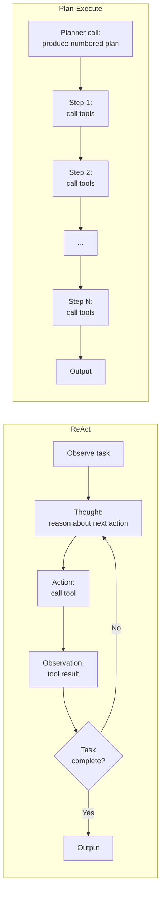

# Planning: ReAct, Plan-and-Execute

> An agent without a plan is a loop with a budget problem.

**Type:** Build
**Languages:** Python
**Prerequisites:** 04-08 (tool use and error recovery), 04-04 (routing), basic Python
**Time:** ~60 min
**Learning Objectives:**
- Explain the difference between ReAct and Plan-and-Execute and when each earns its complexity
- Implement a ReAct loop that extracts and logs "Thought:" before each tool call
- Build a two-phase Plan-and-Execute loop with a planner call and a separate executor loop
- Apply both patterns to a multi-step research task and compare the output quality
- Identify the failure modes each pattern introduces

---

## THE PROBLEM

You give an agent the task: "Research and write a competitive analysis for our product." The agent starts calling tools immediately. First it searches for "competitors." Then it searches for "competitor pricing." Then it searches for "competitor funding." It makes 8 tool calls. By turn 8, the context is filling up and the agent has only covered one competitor out of five you expected. It stops, produces a partial analysis, and reports it as complete.

Nothing went wrong in the tool calls themselves. The tools worked. The agent just had no plan. It operated in pure reaction mode: receive task, call next plausible tool, receive result, call next plausible tool. Without a plan, the agent has no way to know when it is done, no way to detect that it is off-track, and no natural stopping point short of running out of context.

The problem is not unique to research tasks. Any multi-step agent task that touches more than 3 tools needs some form of planning. Without it, the agent's behavior is emergent, unauditable, and context-hungry.

Two patterns address this: ReAct adds lightweight reasoning before each action so the model can self-correct. Plan-and-Execute adds a full upfront plan so the executor knows when it is finished.

---

## THE CONCEPT

### ReAct: Interleaved Reason and Act

ReAct is not a framework feature. It is a prompting convention. You instruct the model to produce a "Thought:" line before each tool call. The thought is not sent to any tool. It is the model's internal reasoning, visible to you as the developer, guiding which tool gets called next.

```
Thought: I need to find the top 3 competitors first before comparing them.
Action: search("top competitors to [product name]")
Observation: [search results]
Thought: I have 3 competitors. Now I need pricing for each. Starting with Competitor A.
Action: search("Competitor A pricing 2024")
Observation: [search results]
...
```

The thought is cheap to generate (it is just text), it costs no extra tool call, and it dramatically improves task coherence. When you log thoughts, you can see exactly where the agent went wrong.

ReAct is simple, emergent, and fragile on complex tasks. If the task has 15 steps and the agent is deep in step 7, it may forget steps 8-15 because they have scrolled out of its "attention." The plan exists only implicitly in the thought stream.

### Plan-and-Execute: Explicit Two-Phase Execution

Plan-and-Execute separates reasoning from acting. Phase 1 is a single LLM call that produces a numbered plan. Phase 2 iterates through the plan steps, calling tools as needed for each step.

```
Phase 1 - Planner call:
  "Given the task, produce a numbered execution plan."
  Output:
    1. Search for the top 5 competitors in the market
    2. For each competitor, retrieve their pricing page
    3. For each competitor, retrieve their key differentiators
    4. Compare differentiators across all 5
    5. Write the analysis

Phase 2 - Executor loop:
  For each step in the plan:
    Call the appropriate tool(s)
    Store the result
    Continue to next step
```

The plan is inspectable before execution. You can reject or modify it. You can resume from any step if the executor fails partway through. You know exactly when execution is complete: when all steps are done.

The cost: a planner call before any work starts, and rigidity when the task requires adapting mid-execution. A plan written before seeing the search results cannot know that Competitor 3 doesn't have a public pricing page.

### Side-by-Side Patterns



### Sample ReAct Transcript (ASCII)

```
Task: Find and compare 3 competitors

Turn 1:
  Thought: I should first identify 3 competitors before doing any comparison.
           I'll use the search tool to find the main players in this space.
  Action: search("top competitors to [product]")
  Observation: [Result: CompA, CompB, CompC are the main competitors]

Turn 2:
  Thought: Good. I have 3 competitors. Now I need key info on each.
           I'll start with CompA's positioning.
  Action: get_webpage("compa.com/about")
  Observation: [Result: CompA focuses on enterprise, pricing from $500/mo]

Turn 3:
  Thought: CompA done. Moving to CompB.
  Action: get_webpage("compb.com/about")
  Observation: [Result: CompB is self-serve, starts at $49/mo]

Turn 4:
  Thought: CompB done. CompC next.
  Action: get_webpage("compc.com/pricing")
  Observation: [Result: CompC pricing not public, contact sales only]

Turn 5:
  Thought: All 3 competitors researched. I have enough to write the comparison.
           No more tool calls needed.
  Action: [none - generate final output]
```

When the agent logs thoughts, you can audit every decision. When it doesn't, the same loop is a black box.

---

## BUILD IT

### Step 1: ReAct in Raw Python

The system prompt is the entire mechanism. It instructs the model to always output a `Thought:` line before choosing a tool. The parser extracts it.

See `code/main.py` for the full implementation.

```python
REACT_SYSTEM_PROMPT = """You are a research agent. You have access to tools to search and retrieve information.

IMPORTANT: Before every tool call, you MUST output a line starting with "Thought:" that explains your reasoning.
Format your response as:
Thought: [your reasoning about what to do next and why]

Then call the appropriate tool. If you have enough information to answer without a tool, output:
Thought: [reasoning]
Then provide your final answer directly.

Be systematic. Work through the task step by step."""
```

The thought parser:

```python
def extract_thought(text: str) -> str | None:
    """Extract the Thought: line from a model response for logging."""
    for line in text.splitlines():
        if line.strip().lower().startswith("thought:"):
            return line.strip()[len("thought:"):].strip()
    return None
```

The ReAct loop:

```python
def react_loop(
    task: str,
    tools: list[dict],
    tool_fn: dict[str, callable],
    client: anthropic.Anthropic,
    max_iterations: int = 10,
) -> str:
    messages = [{"role": "user", "content": task}]
    thoughts = []

    for iteration in range(max_iterations):
        response = client.messages.create(
            model="claude-3-5-haiku-20241022",
            max_tokens=1024,
            system=REACT_SYSTEM_PROMPT,
            tools=tools,
            messages=messages,
        )

        # Log any thoughts before tool calls
        for block in response.content:
            if block.type == "text":
                thought = extract_thought(block.text)
                if thought:
                    thoughts.append(f"[iter {iteration+1}] {thought}")
                    print(f"  Thought: {thought}")

        if response.stop_reason == "end_turn":
            # Final text answer
            final = next(
                (b.text for b in response.content if b.type == "text"), ""
            )
            print(f"\nFinal thoughts logged ({len(thoughts)} total):")
            for t in thoughts:
                print(f"  {t}")
            return final

        if response.stop_reason == "tool_use":
            messages.append({"role": "assistant", "content": response.content})
            tool_results = []
            for block in response.content:
                if block.type == "tool_use":
                    print(f"  Action: {block.name}({block.input})")
                    result = tool_fn[block.name](**block.input)
                    print(f"  Observation: {str(result)[:100]}")
                    tool_results.append({
                        "type": "tool_result",
                        "tool_use_id": block.id,
                        "content": str(result),
                    })
            messages.append({"role": "user", "content": tool_results})

    return "Max iterations reached without completion."
```

### Step 2: Logging Thoughts for Debugging

Every thought is a window into the agent's reasoning at that point. Log them to a structured trace:

```python
@dataclass
class ThoughtTrace:
    iteration: int
    thought: str
    action: str | None
    observation: str | None

# In the loop, append:
trace.append(ThoughtTrace(
    iteration=iteration,
    thought=thought or "",
    action=f"{block.name}({block.input})" if block.type == "tool_use" else None,
    observation=str(result)[:200] if result else None,
))
```

When the agent goes wrong, the trace tells you which thought preceded the bad action. Without thoughts, you only know the action sequence, not why.

> **Real-world check:** Your agent is tasked with researching 5 competitors but only covers 3 before stopping. You need to know if the problem is a missing tool, a reasoning error, or a context window issue. What does the thought log tell you that the tool call log alone cannot?

The thought log shows you the model's intent before each action. If the thought at iteration 7 says "I think I've covered enough competitors" but only 3 were researched, the problem is in the reasoning, not the tools. If the thought says "I should check CompD next" but the following action searches for something unrelated, there's a parsing or instruction-following issue. Without thoughts, you only know 3 tools were called, not why the agent stopped.

---

## USE IT

### Plan-and-Execute as a Contrast

Two calls instead of one interleaved loop:

```python
PLANNER_PROMPT = """You are a planning agent. Given a task, output a numbered execution plan.
Format: output only the numbered steps, one per line. No prose, no explanations.
Example:
1. Search for X
2. Retrieve Y for each result
3. Compare X and Y
4. Write summary"""

EXECUTOR_PROMPT = """You are an execution agent. You will be given one step from a plan.
Complete that step using the available tools. Be thorough and specific."""


def plan_and_execute(
    task: str,
    tools: list[dict],
    tool_fn: dict[str, callable],
    client: anthropic.Anthropic,
) -> dict:
    # Phase 1: generate the plan
    plan_response = client.messages.create(
        model="claude-3-5-haiku-20241022",
        max_tokens=512,
        system=PLANNER_PROMPT,
        messages=[{"role": "user", "content": task}],
    )
    plan_text = plan_response.content[0].text
    steps = [
        line.strip()
        for line in plan_text.splitlines()
        if line.strip() and line.strip()[0].isdigit()
    ]
    print(f"Plan ({len(steps)} steps):")
    for step in steps:
        print(f"  {step}")

    # Phase 2: execute each step
    results = {}
    for i, step in enumerate(steps, start=1):
        print(f"\nExecuting step {i}: {step}")
        step_messages = [{"role": "user", "content": f"Task: {step}\n\nContext from previous steps:\n{format_results(results)}"}]
        step_response = client.messages.create(
            model="claude-3-5-haiku-20241022",
            max_tokens=1024,
            system=EXECUTOR_PROMPT,
            tools=tools,
            messages=step_messages,
        )

        if step_response.stop_reason == "tool_use":
            step_messages.append({"role": "assistant", "content": step_response.content})
            tool_results = []
            for block in step_response.content:
                if block.type == "tool_use":
                    result = tool_fn[block.name](**block.input)
                    tool_results.append({
                        "type": "tool_result",
                        "tool_use_id": block.id,
                        "content": str(result),
                    })
            step_messages.append({"role": "user", "content": tool_results})
            final = client.messages.create(
                model="claude-3-5-haiku-20241022",
                max_tokens=1024,
                system=EXECUTOR_PROMPT,
                messages=step_messages,
            )
            results[f"step_{i}"] = next(
                (b.text for b in final.content if b.type == "text"), ""
            )
        else:
            results[f"step_{i}"] = next(
                (b.text for b in step_response.content if b.type == "text"), ""
            )
        print(f"  Result: {results[f'step_{i}'][:100]}")

    return results


def format_results(results: dict) -> str:
    return "\n".join(f"{k}: {v[:200]}" for k, v in results.items()) if results else "None yet"
```

The key structural difference from ReAct: the plan is decided before any tool runs. You can inspect it, log it, and resume from any step index.

> **Perspective shift:** A teammate says "Plan-and-Execute is strictly better because it is more organized." When is ReAct actually the better choice?

ReAct is better when the task requires adapting based on what each tool returns. If step 3 of a plan says "retrieve CompC pricing page" but that page doesn't exist, the plan-and-execute loop either fails or produces a gap. ReAct's thought-action-observation cycle naturally adapts: the thought after the failed retrieval might say "pricing not available publicly; I'll check news articles instead." For tasks with uncertain intermediate steps, ReAct's in-flight adaptation beats a brittle upfront plan.

---

## SHIP IT

The artifact this lesson produces is a reusable ReAct system prompt and response parser. See `outputs/skill-react-planner.md`.

The prompt instructs the model to output `Thought:` before every action, which gives you a debugging trace for free. The parser extracts thoughts from responses. Use this whenever you need an auditable tool-calling loop and don't need the rigidity of an upfront plan.

---

## EVALUATE IT

**ReAct thought quality:** Run the agent on 5 tasks. For each, score whether the thought before each action correctly predicted what the action would find (0 = prediction unrelated to action, 1 = prediction matched). Target: 70% of thoughts are predictive.

**Plan completeness:** Run the planner on 5 research tasks. For each, count how many plan steps were actually needed versus how many were in the plan. A good planner generates plans that cover all required work without large amounts of unnecessary steps.

**Plan-and-Execute completion rate:** On 10 multi-step tasks, measure what percentage reach the final step without an error forcing a stop. Target: 8/10. Compare to ReAct completion rate on the same tasks.

**Context efficiency:** Log `usage.input_tokens` per completed task for both patterns. ReAct typically uses fewer total tokens on adaptive tasks (it stops when done). Plan-and-Execute typically uses more predictable token counts (the plan bounds the work).

**Thought log utility test:** Introduce a deliberate reasoning error (a bad tool instruction in the system prompt). Run ReAct and Plan-and-Execute. Measure how many minutes it takes to locate the error using only the thought log vs only the tool call log. This is a proxy for debuggability.
