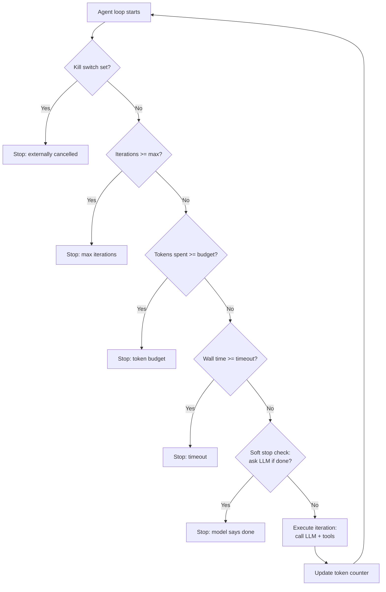

# شروط التوقف (Stopping Conditions)، وحاكمات التكلفة، ومفاتيح الإيقاف (Kill Switches)

> حلقة agent غير محدودة هي خلل (bug) ينتظر كشف حساب بطاقة ائتمان ليفضحه.

**النوع:** بناء
**اللغات:** Python
**المتطلبات:** 04-08 (استخدام الأدوات والتعافي من الأخطاء)، 04-10 (التخطيط)، أساسيات الـ threading في Python
**الوقت:** ~45 دقيقة
**أهداف التعلّم:**
- شرح آليات التوقف الخمس وأي نمط فشل تعالجه كل واحدة
- تطبيق فئة AgentGovernor تغلّف أي حلقة agent
- تتبّع الإنفاق التراكمي للـ tokens عبر التكرارات والتوقف عند ميزانية
- إضافة مفتاح إيقاف threading.Event للإلغاء الخارجي
- تطبيق الحاكم نفسه على حلقة agent غير متزامنة (async) مع معالجة asyncio.CancelledError

---

## المشكلة

يعطي مهندس أقدم في شركة ناشئة الـ agent المهمة: "ابحث في كل شيء عن منافسينا الخمسة واكتب تحليلًا شاملًا." بلا قيود. يبدأ الـ agent بالعمل.

بعد ثلاث وعشرين دقيقة، يتلقّى المهندس إشعار Slack من نظام الفوترة. أجرى الـ agent 340 نداء API وأنفق 18.70$. ولا يزال يعمل. ولم ينتج مُخرَجًا. يظل يجد أشياء جديدة ليتحقق منها: "مدونة منافس واحدة إضافية"، "سجل تغييرات منتج إضافي"، "منشور منتدى إضافي". ليست لديه آلية تخبره أن يتوقف.

هذا ليس فشل نموذج. النموذج يفعل بالضبط ما طُلب منه: أن يكون شاملًا. الفشل هو إغفال هندسي. لم يحدّد المهندس قط ما الذي يبدو عليه "الكافي". أعطى الـ agent مهمة بلا شرط خروج سوى حكم النموذج (اللامتناهي) الخاص بالاكتمال.

كل agent إنتاجي يحتاج شرط توقف واحدًا على الأقل لا يكون "النموذج يقرر أنه انتهى". عمليًا، تحتاج خمسة.

---

## المفهوم

### آليات التوقف الخمس

```
Mechanism            | What it prevents                    | Type
---------------------|-------------------------------------|--------
Max iterations       | Infinite loops, runaway recursion   | Hard stop
Token budget         | Cost overruns, context explosion    | Hard stop
Wall-clock timeout   | Hung tools, slow APIs, hung LLM     | Hard stop
Soft stop (LLM check)| Unnecessary work past good-enough   | Soft stop
Kill switch          | User cancellation, external abort   | External
```

التوقفات الصارمة (hard stops) يفرضها الحاكم بغضّ النظر عمّا يريد النموذج فعله تاليًا. أما التوقفات اللينة (soft stops) فتسأل النموذج ما إن كان عليه المتابعة وتتوقف إن قال لا. ومفتاح الإيقاف يُضبَط من خارج الحلقة، فيمكن أن يطلقه إنسان، أو timeout في عملية أب، أو نظام مراقبة.

### الحاكم كمُغلّف للحلقة



تعمل الفحوص قبل كل تكرار. لا يُنفَّذ أي تكرار دون اجتياز البوابات الخمس كلها.

### جدول استنزاف التكلفة (عيّنة)

```
Turn | Input tokens | Output tokens | Turn cost ($) | Cumulative ($) | Budget left
-----|-------------|---------------|---------------|----------------|------------
1    | 450          | 312           | 0.024         | 0.024          | 0.476
2    | 820          | 445           | 0.039         | 0.063          | 0.437
3    | 1,240        | 523           | 0.055         | 0.118          | 0.382
4    | 1,580        | 398           | 0.061         | 0.179          | 0.321
5    | 2,100        | 612           | 0.083         | 0.262          | 0.238
6    | 2,450        | 701           | 0.097         | 0.359          | 0.141
7    | 2,890        | 534           | 0.104         | 0.463          | 0.037
8    | 3,100        | 602           | 0.113         | 0.576          | -0.076 [STOP]
```

تنمو الـ input tokens لكل دور لأن تاريخ الرسائل يتراكم. بدون فحص ميزانية، تزداد التكلفة لكل دور تزايدًا مطّردًا (monotonically). يبلغ الـ agent ميزانية الـ 0.50$ في الدور 8 ويتوقف قبل إكمال الدور 8 بالكامل.

---

## البناء

### فئة AgentGovernor

يغلّف الحاكم أي دالة حلقة agent. تعيش الفحوص الخمسة كلها في دالة واحدة `should_continue()` تُستدعى في أعلى كل تكرار.

راجع `code/main.py` للتطبيق الكامل.

```python
import threading
import time
from dataclasses import dataclass, field

@dataclass
class GovernorConfig:
    max_iterations: int = 20
    max_tokens: int = 50_000       # total input + output tokens
    max_seconds: float = 120.0     # wall-clock timeout
    token_budget_usd: float = 0.50 # approximate cost ceiling
    soft_stop_every_n: int = 5     # check with LLM every N iterations
    # Haiku pricing (update as needed)
    input_token_price: float = 0.001 / 1000   # per token
    output_token_price: float = 0.005 / 1000  # per token


@dataclass
class GovernorState:
    iterations: int = 0
    total_input_tokens: int = 0
    total_output_tokens: int = 0
    start_time: float = field(default_factory=time.monotonic)
    stop_reason: str | None = None

    def cost_usd(self, cfg: GovernorConfig) -> float:
        return (
            self.total_input_tokens * cfg.input_token_price
            + self.total_output_tokens * cfg.output_token_price
        )

    def elapsed_seconds(self) -> float:
        return time.monotonic() - self.start_time
```

```python
class AgentGovernor:
    def __init__(self, config: GovernorConfig | None = None):
        self.config = config or GovernorConfig()
        self.state = GovernorState()
        self._kill_switch = threading.Event()

    def kill(self) -> None:
        """Set the kill switch from any thread."""
        self._kill_switch.set()

    def record_usage(self, input_tokens: int, output_tokens: int) -> None:
        self.state.total_input_tokens += input_tokens
        self.state.total_output_tokens += output_tokens
        self.state.iterations += 1

    def should_continue(self, context: str = "") -> bool:
        """
        Run all five checks. Returns False (with reason set) if any check fails.
        Call this at the top of each agent loop iteration.
        """
        cfg = self.config
        s = self.state

        if self._kill_switch.is_set():
            s.stop_reason = "kill_switch"
            return False

        if s.iterations >= cfg.max_iterations:
            s.stop_reason = f"max_iterations ({cfg.max_iterations})"
            return False

        total_tokens = s.total_input_tokens + s.total_output_tokens
        if total_tokens >= cfg.max_tokens:
            s.stop_reason = f"max_tokens ({cfg.max_tokens})"
            return False

        if s.cost_usd(cfg) >= cfg.token_budget_usd:
            s.stop_reason = f"token_budget_usd (${cfg.token_budget_usd:.2f})"
            return False

        if s.elapsed_seconds() >= cfg.max_seconds:
            s.stop_reason = f"timeout ({cfg.max_seconds}s)"
            return False

        return True

    def should_soft_stop(
        self,
        context: str,
        client,
    ) -> bool:
        """
        Ask the model whether it has enough to answer.
        Returns True if the model says yes.
        Only called every soft_stop_every_n iterations to keep it cheap.
        """
        if self.state.iterations % self.config.soft_stop_every_n != 0:
            return False
        if self.state.iterations == 0:
            return False

        check_prompt = (
            "Given the work completed so far, do you have enough information "
            "to produce a complete and useful answer? "
            "Reply with exactly one word: YES or NO."
        )
        response = client.messages.create(
            model="claude-3-5-haiku-20241022",
            max_tokens=10,
            system="You are a task completion evaluator. Be conservative; only say YES if the answer would be genuinely complete.",
            messages=[
                {"role": "user", "content": f"Task context:\n{context[:500]}\n\n{check_prompt}"}
            ],
        )
        answer = response.content[0].text.strip().upper()
        # Record these tokens too
        self.record_usage(response.usage.input_tokens, response.usage.output_tokens)

        if answer.startswith("YES"):
            self.state.stop_reason = "soft_stop (model said done)"
            return True
        return False

    def status(self) -> str:
        cfg = self.config
        s = self.state
        return (
            f"iter={s.iterations}/{cfg.max_iterations} | "
            f"tokens={s.total_input_tokens + s.total_output_tokens:,}/{cfg.max_tokens:,} | "
            f"cost=${s.cost_usd(cfg):.4f}/${cfg.token_budget_usd:.2f} | "
            f"elapsed={s.elapsed_seconds():.1f}s/{cfg.max_seconds:.0f}s"
        )
```

### استخدام الحاكم في حلقة agent

```python
def governed_agent_loop(
    task: str,
    tools: list[dict],
    tool_fn: dict[str, callable],
    client,
    config: GovernorConfig | None = None,
) -> tuple[str, GovernorState]:
    governor = AgentGovernor(config)
    messages = [{"role": "user", "content": task}]
    final_answer = ""
    context_summary = task

    while governor.should_continue():
        # Soft stop check (cheap LLM yes/no call every N iterations)
        if governor.should_soft_stop(context_summary, client):
            print(f"  [Governor] Soft stop: {governor.state.stop_reason}")
            break

        response = client.messages.create(
            model="claude-3-5-haiku-20241022",
            max_tokens=1024,
            system="You are a research agent. Use tools to complete the task.",
            tools=tools,
            messages=messages,
        )

        governor.record_usage(
            response.usage.input_tokens,
            response.usage.output_tokens,
        )
        print(f"  [Governor] {governor.status()}")

        if response.stop_reason == "end_turn":
            final_answer = next(
                (b.text for b in response.content if b.type == "text"), ""
            )
            governor.state.stop_reason = "completed"
            break

        if response.stop_reason == "tool_use":
            messages.append({"role": "assistant", "content": response.content})
            tool_results = []
            for block in response.content:
                if block.type == "tool_use":
                    result = tool_fn.get(block.name, lambda **_: "tool not found")(**block.input)
                    tool_results.append({
                        "type": "tool_result",
                        "tool_use_id": block.id,
                        "content": str(result),
                    })
                    context_summary += f"\nTool: {block.name}, Result: {str(result)[:100]}"
            messages.append({"role": "user", "content": tool_results})

    if not governor.state.stop_reason:
        governor.state.stop_reason = "loop_exited"

    if not final_answer:
        final_answer = f"[Stopped: {governor.state.stop_reason}. Partial context collected.]"

    return final_answer, governor.state
```

### عرض توضيحي لمفتاح الإيقاف (متعدد الخيوط/Multi-threaded)

```python
import threading

governor = AgentGovernor(GovernorConfig(max_seconds=300))

# Simulate external cancellation after 5 seconds
def cancel_after(seconds: float) -> None:
    time.sleep(seconds)
    print(f"\n[External] Sending kill signal after {seconds}s")
    governor.kill()

cancel_thread = threading.Thread(target=cancel_after, args=(5.0,), daemon=True)
cancel_thread.start()
# The governor loop will stop at the next iteration after the kill switch is set.
```

> **اختبار من الواقع:** الـ agent لديك يكلّف 18.70$ قبل التوقف. تضيف ميزانية tokens بقيمة 1.00$. في تشغيل الاختبار التالي، يبلغ الـ agent الميزانية في التكرار 6 ويتوقف بمُخرَج جزئي. يقول مدير المنتج لديك "المُخرَج غير مكتمل." كيف تقرّر ما إن كان عليك رفع الميزانية أم تغيير استراتيجية الـ agent؟

انظر إلى جدول استنزاف الـ tokens: ما سرعة إنفاق الـ tokens لكل تكرار، وهل العمل لكل تكرار يتقلّص مع تقدّم المهمة؟ إن كان الـ agent يحرز تقدّمًا فعّالًا و1.00$ ببساطة منخفض جدًا لهذه المهمة، فارفع الميزانية. وإن كان الـ agent يجري نداءات أدوات زائدة أو ينفق معظم الـ tokens على تفكير منخفض القيمة، فأصلح تصميم الـ agent أولًا. ميزانية أعلى على agent مصمَّم بشكل سيّئ تنتج فقط مُخرَجًا جزئيًا أغلى. سجلّ تكلفة الحاكم هو أداة التشخيص.

---

## الاستخدام

### تطبيق الحاكم على حلقة غير متزامنة (Async)

يعمل الحاكم نفسه في الكود غير المتزامن. الفرق الرئيسي: استخدم `asyncio.CancelledError` لمفتاح الإيقاف بدلًا من threading.Event.

```python
import asyncio
import anthropic

async def async_governed_loop(
    task: str,
    client: anthropic.AsyncAnthropic,
    config: GovernorConfig | None = None,
) -> tuple[str, GovernorState]:
    governor = AgentGovernor(config)
    messages = [{"role": "user", "content": task}]
    context_summary = task

    try:
        while governor.should_continue():
            if governor.should_soft_stop(context_summary, client):
                break

            response = await client.messages.create(
                model="claude-3-5-haiku-20241022",
                max_tokens=1024,
                system="You are a research agent.",
                messages=messages,
            )

            governor.record_usage(
                response.usage.input_tokens,
                response.usage.output_tokens,
            )

            if response.stop_reason == "end_turn":
                final = next(
                    (b.text for b in response.content if b.type == "text"), ""
                )
                governor.state.stop_reason = "completed"
                return final, governor.state

            # Handle tool calls...
            messages.append({"role": "assistant", "content": response.content})

    except asyncio.CancelledError:
        governor.state.stop_reason = "async_cancelled"
        return "[Task cancelled externally]", governor.state

    return "[Loop exited]", governor.state


async def demo_with_timeout() -> None:
    client = anthropic.AsyncAnthropic()
    task = asyncio.create_task(
        async_governed_loop("Research competitors", client)
    )
    try:
        result, state = await asyncio.wait_for(task, timeout=30.0)
        print(f"Result: {result[:100]}")
        print(f"Stop reason: {state.stop_reason}")
    except asyncio.TimeoutError:
        task.cancel()
        print("Task cancelled due to timeout.")
```

يتولّى الحاكم فحوص الميزانية الداخلية. ويتولّى `asyncio.wait_for` الـ timeout الخارجي على مستوى المهمة (task level). كلا الطبقتين مطلوب في أنظمة الـ async الإنتاجية.

> **نقلة في المنظور:** يحاجّ زميل في الفريق بأن "اضبط max_iterations=20 فقط وهذا يكفي." ما الذي يلتقطه فحص ميزانية الـ tokens ويفوته max_iterations وحده؟

التكرارات عدّ لتمريرات الحلقة، لا قياس للتكلفة. تكرار واحد يولّد استجابة من 4,000 token تتبعها 3 نداءات أدوات يعيد كلٌّ منها 2,000 token يكلّف أكثر بكثير من تكرار باستجابة من 200 token وبلا نداءات أدوات. agentان بنفس max_iterations قد يكون بينهما فرق تكلفة بمقدار 10 أضعاف اعتمادًا على تعقيد كل دور. يحوّل فحص ميزانية الـ tokens مفهوم "20 تكرارًا" المجرّد إلى سقف تكلفة ملموس مستقرّ عبر مستويات تعقيد المهام المختلفة.

---

## التسليم

المُخرَج الذي يُنتجه هذا الدرس هو فئة `AgentGovernor` قابلة لإعادة الاستخدام مع عتبات إنتاجية افتراضية. راجع `outputs/skill-agent-governor.md`.

استخدم هذا كمُغلّف لأي حلقة agent جديدة. انسخ `GovernorConfig`، واضبط العتبات لتكلفة مهمتك ومدتها المتوقّعة، وغلّف حلقتك بـ `while governor.should_continue()`. الفحوص الخمسة مطبَّقة بالفعل.

---

## التقييم

**الحد الأقصى للتكرارات:** شغّل حلقة agent مضبوطة على max_iterations=5. تحقّق من توقفها عند التكرار 5 بالضبط بغضّ النظر عن اكتمال المهمة. أكّد على `state.iterations == 5` و`state.stop_reason == "max_iterations (5)"`.

**ميزانية الـ tokens:** اضبط ميزانية 0.10$. شغّل مهمة تكلّف عادةً 0.40$. تحقّق من توقّف الحلقة قبل إنفاق 0.11$. أكّد على `state.cost_usd(config) <= 0.11`.

**الـ timeout بالساعة الفعلية:** اضبط timeout مدته 3 ثوانٍ. استخدم أداة وهمية (mock) تنام 0.5 ثانية. تحقّق من توقّف الحلقة قبل 4 ثوانٍ. أكّد على `state.elapsed_seconds() < 4.0`.

**التوقف اللين:** ازرع الـ context بإجابة مكتملة. شغّل فحص التوقف اللين. تحقّق من أن النموذج يعيد YES 8/10 مرات على الأقل في السياقات المكتملة بوضوح. السلبيات الكاذبة (النموذج يقول NO على عمل مكتمل) مكلفة؛ والإيجابيات الكاذبة (النموذج يقول YES مبكرًا جدًا) أخطر.

**مفتاح الإيقاف:** ابدأ حلقة في خيط (thread) خلفي. اضبط مفتاح الإيقاف بعد تكرارين من الخيط الرئيسي. تحقّق من توقّف الحلقة عند حدّ التكرار التالي. أكّد على أن الخيط الخلفي يخرج بنظافة مع `stop_reason == "kill_switch"`.
