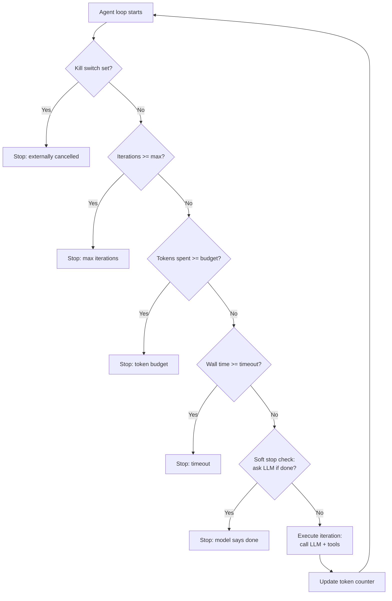

# Stopping Conditions, Cost Governors, Kill Switches

> An unbounded agent loop is a bug waiting for a credit card statement to expose it.

**Type:** Build
**Languages:** Python
**Prerequisites:** 04-08 (tool use and error recovery), 04-10 (planning), Python threading basics
**Time:** ~45 min
**Learning Objectives:**
- Explain the five stopping mechanisms and which failure mode each addresses
- Implement an AgentGovernor class that wraps any agent loop
- Track cumulative token spend across iterations and stop at a budget
- Add a threading.Event kill switch for external cancellation
- Apply the same governor to an async agent loop with asyncio.CancelledError handling

---

## THE PROBLEM

A senior engineer at a startup gives an agent the task: "Research everything about our five competitors and write a comprehensive analysis." No constraints. The agent starts running.

Twenty-three minutes later, the engineer gets a Slack notification from the billing system. The agent has made 340 API calls and spent $18.70. It is still running. It has not produced output. It keeps finding new things to check: "one more competitor's blog," "one more product changelog," "one more forum post." It has no mechanism that tells it to stop.

This is not a model failure. The model is doing exactly what it was asked to do: being thorough. The failure is an engineering omission. The engineer never defined what "enough" looks like. They gave the agent a task with no exit condition other than the model's own (infinite) judgment about completeness.

Every production agent needs at least one stopping condition that is not "the model decides it's done." In practice, you need five.

---

## THE CONCEPT

### Five Stopping Mechanisms

```
Mechanism            | What it prevents                    | Type
---------------------|-------------------------------------|--------
Max iterations       | Infinite loops, runaway recursion   | Hard stop
Token budget         | Cost overruns, context explosion    | Hard stop
Wall-clock timeout   | Hung tools, slow APIs, hung LLM     | Hard stop
Soft stop (LLM check)| Unnecessary work past good-enough   | Soft stop
Kill switch          | User cancellation, external abort   | External
```

Hard stops are enforced by the governor regardless of what the model wants to do next. Soft stops ask the model whether it should continue and stop if it says no. The kill switch is set from outside the loop, so it can be triggered by a human, a timeout in a parent process, or a monitoring system.

### Governor as Loop Wrapper



The checks run before every iteration. Zero iterations execute without passing all five gates.

### Cost Depletion Table (Sample)

```
Turn | Input tokens | Output tokens | Turn cost ($) | Cumulative ($) | Budget left
-----|-------------|---------------|---------------|----------------|------------
1    | 450          | 312           | 0.024         | 0.024          | 0.476
2    | 820          | 445           | 0.039         | 0.063          | 0.437
3    | 1,240        | 523           | 0.055         | 0.118          | 0.382
4    | 1,580        | 398           | 0.061         | 0.179          | 0.321
5    | 2,100        | 612           | 0.083         | 0.262          | 0.238
6    | 2,450        | 701           | 0.097         | 0.359          | 0.141
7    | 2,890        | 534           | 0.104         | 0.463          | 0.037
8    | 3,100        | 602           | 0.113         | 0.576          | -0.076 [STOP]
```

Input tokens grow per turn because the message history accumulates. Without a budget check, the cost per turn increases monotonically. The agent hits the $0.50 budget on turn 8 and stops before completing turn 8 in full.

---

## BUILD IT

### The AgentGovernor Class

The governor wraps any agent loop function. All five checks live in a single `should_continue()` method called at the top of each iteration.

See `code/main.py` for the full implementation.

```python
import threading
import time
from dataclasses import dataclass, field

@dataclass
class GovernorConfig:
    max_iterations: int = 20
    max_tokens: int = 50_000       # total input + output tokens
    max_seconds: float = 120.0     # wall-clock timeout
    token_budget_usd: float = 0.50 # approximate cost ceiling
    soft_stop_every_n: int = 5     # check with LLM every N iterations
    # Haiku pricing (update as needed)
    input_token_price: float = 0.001 / 1000   # per token
    output_token_price: float = 0.005 / 1000  # per token


@dataclass
class GovernorState:
    iterations: int = 0
    total_input_tokens: int = 0
    total_output_tokens: int = 0
    start_time: float = field(default_factory=time.monotonic)
    stop_reason: str | None = None

    def cost_usd(self, cfg: GovernorConfig) -> float:
        return (
            self.total_input_tokens * cfg.input_token_price
            + self.total_output_tokens * cfg.output_token_price
        )

    def elapsed_seconds(self) -> float:
        return time.monotonic() - self.start_time
```

```python
class AgentGovernor:
    def __init__(self, config: GovernorConfig | None = None):
        self.config = config or GovernorConfig()
        self.state = GovernorState()
        self._kill_switch = threading.Event()

    def kill(self) -> None:
        """Set the kill switch from any thread."""
        self._kill_switch.set()

    def record_usage(self, input_tokens: int, output_tokens: int) -> None:
        self.state.total_input_tokens += input_tokens
        self.state.total_output_tokens += output_tokens
        self.state.iterations += 1

    def should_continue(self, context: str = "") -> bool:
        """
        Run all five checks. Returns False (with reason set) if any check fails.
        Call this at the top of each agent loop iteration.
        """
        cfg = self.config
        s = self.state

        if self._kill_switch.is_set():
            s.stop_reason = "kill_switch"
            return False

        if s.iterations >= cfg.max_iterations:
            s.stop_reason = f"max_iterations ({cfg.max_iterations})"
            return False

        total_tokens = s.total_input_tokens + s.total_output_tokens
        if total_tokens >= cfg.max_tokens:
            s.stop_reason = f"max_tokens ({cfg.max_tokens})"
            return False

        if s.cost_usd(cfg) >= cfg.token_budget_usd:
            s.stop_reason = f"token_budget_usd (${cfg.token_budget_usd:.2f})"
            return False

        if s.elapsed_seconds() >= cfg.max_seconds:
            s.stop_reason = f"timeout ({cfg.max_seconds}s)"
            return False

        return True

    def should_soft_stop(
        self,
        context: str,
        client,
    ) -> bool:
        """
        Ask the model whether it has enough to answer.
        Returns True if the model says yes.
        Only called every soft_stop_every_n iterations to keep it cheap.
        """
        if self.state.iterations % self.config.soft_stop_every_n != 0:
            return False
        if self.state.iterations == 0:
            return False

        check_prompt = (
            "Given the work completed so far, do you have enough information "
            "to produce a complete and useful answer? "
            "Reply with exactly one word: YES or NO."
        )
        response = client.messages.create(
            model="claude-3-5-haiku-20241022",
            max_tokens=10,
            system="You are a task completion evaluator. Be conservative; only say YES if the answer would be genuinely complete.",
            messages=[
                {"role": "user", "content": f"Task context:\n{context[:500]}\n\n{check_prompt}"}
            ],
        )
        answer = response.content[0].text.strip().upper()
        # Record these tokens too
        self.record_usage(response.usage.input_tokens, response.usage.output_tokens)

        if answer.startswith("YES"):
            self.state.stop_reason = "soft_stop (model said done)"
            return True
        return False

    def status(self) -> str:
        cfg = self.config
        s = self.state
        return (
            f"iter={s.iterations}/{cfg.max_iterations} | "
            f"tokens={s.total_input_tokens + s.total_output_tokens:,}/{cfg.max_tokens:,} | "
            f"cost=${s.cost_usd(cfg):.4f}/${cfg.token_budget_usd:.2f} | "
            f"elapsed={s.elapsed_seconds():.1f}s/{cfg.max_seconds:.0f}s"
        )
```

### Using the Governor in an Agent Loop

```python
def governed_agent_loop(
    task: str,
    tools: list[dict],
    tool_fn: dict[str, callable],
    client,
    config: GovernorConfig | None = None,
) -> tuple[str, GovernorState]:
    governor = AgentGovernor(config)
    messages = [{"role": "user", "content": task}]
    final_answer = ""
    context_summary = task

    while governor.should_continue():
        # Soft stop check (cheap LLM yes/no call every N iterations)
        if governor.should_soft_stop(context_summary, client):
            print(f"  [Governor] Soft stop: {governor.state.stop_reason}")
            break

        response = client.messages.create(
            model="claude-3-5-haiku-20241022",
            max_tokens=1024,
            system="You are a research agent. Use tools to complete the task.",
            tools=tools,
            messages=messages,
        )

        governor.record_usage(
            response.usage.input_tokens,
            response.usage.output_tokens,
        )
        print(f"  [Governor] {governor.status()}")

        if response.stop_reason == "end_turn":
            final_answer = next(
                (b.text for b in response.content if b.type == "text"), ""
            )
            governor.state.stop_reason = "completed"
            break

        if response.stop_reason == "tool_use":
            messages.append({"role": "assistant", "content": response.content})
            tool_results = []
            for block in response.content:
                if block.type == "tool_use":
                    result = tool_fn.get(block.name, lambda **_: "tool not found")(**block.input)
                    tool_results.append({
                        "type": "tool_result",
                        "tool_use_id": block.id,
                        "content": str(result),
                    })
                    context_summary += f"\nTool: {block.name}, Result: {str(result)[:100]}"
            messages.append({"role": "user", "content": tool_results})

    if not governor.state.stop_reason:
        governor.state.stop_reason = "loop_exited"

    if not final_answer:
        final_answer = f"[Stopped: {governor.state.stop_reason}. Partial context collected.]"

    return final_answer, governor.state
```

### Kill Switch Demo (Multi-threaded)

```python
import threading

governor = AgentGovernor(GovernorConfig(max_seconds=300))

# Simulate external cancellation after 5 seconds
def cancel_after(seconds: float) -> None:
    time.sleep(seconds)
    print(f"\n[External] Sending kill signal after {seconds}s")
    governor.kill()

cancel_thread = threading.Thread(target=cancel_after, args=(5.0,), daemon=True)
cancel_thread.start()
# The governor loop will stop at the next iteration after the kill switch is set.
```

> **Real-world check:** Your agent costs $18.70 before stopping. You add a $1.00 token budget. On the next test run, the agent hits the budget in iteration 6 and stops with partial output. Your PM says "the output is incomplete." How do you decide whether to raise the budget or change the agent's strategy?

Look at the token depletion table: how fast are tokens being spent per iteration, and is the work per iteration shrinking as the task progresses? If the agent is making efficient progress and $1.00 is simply too low for this task, raise the budget. If the agent is making redundant tool calls or spending most tokens on low-value reasoning, fix the agent design first. A higher budget on a badly designed agent just produces more expensive partial output. The governor's cost log is the diagnostic tool.

---

## USE IT

### Applying the Governor to an Async Loop

The same governor works in async code. The main difference: use `asyncio.CancelledError` for the kill switch instead of a threading.Event.

```python
import asyncio
import anthropic

async def async_governed_loop(
    task: str,
    client: anthropic.AsyncAnthropic,
    config: GovernorConfig | None = None,
) -> tuple[str, GovernorState]:
    governor = AgentGovernor(config)
    messages = [{"role": "user", "content": task}]
    context_summary = task

    try:
        while governor.should_continue():
            if governor.should_soft_stop(context_summary, client):
                break

            response = await client.messages.create(
                model="claude-3-5-haiku-20241022",
                max_tokens=1024,
                system="You are a research agent.",
                messages=messages,
            )

            governor.record_usage(
                response.usage.input_tokens,
                response.usage.output_tokens,
            )

            if response.stop_reason == "end_turn":
                final = next(
                    (b.text for b in response.content if b.type == "text"), ""
                )
                governor.state.stop_reason = "completed"
                return final, governor.state

            # Handle tool calls...
            messages.append({"role": "assistant", "content": response.content})

    except asyncio.CancelledError:
        governor.state.stop_reason = "async_cancelled"
        return "[Task cancelled externally]", governor.state

    return "[Loop exited]", governor.state


async def demo_with_timeout() -> None:
    client = anthropic.AsyncAnthropic()
    task = asyncio.create_task(
        async_governed_loop("Research competitors", client)
    )
    try:
        result, state = await asyncio.wait_for(task, timeout=30.0)
        print(f"Result: {result[:100]}")
        print(f"Stop reason: {state.stop_reason}")
    except asyncio.TimeoutError:
        task.cancel()
        print("Task cancelled due to timeout.")
```

The governor handles the internal budget checks. `asyncio.wait_for` handles the external wall-clock timeout at the task level. Both layers are needed in production async systems.

> **Perspective shift:** A teammate argues "just set max_iterations=20 and that's enough." What does the token budget check catch that max_iterations alone misses?

Iterations are a count of loop passes, not a measure of cost. A single iteration that generates a 4,000-token response followed by 3 tool calls returning 2,000 tokens each costs far more than an iteration with a 200-token response and no tool calls. Two agents with the same max_iterations can have a 10x cost difference depending on the complexity of each turn. The token budget check converts the abstract "20 iterations" into a concrete cost ceiling that is stable across different task complexities.

---

## SHIP IT

The artifact this lesson produces is a reusable `AgentGovernor` class with default production thresholds. See `outputs/skill-agent-governor.md`.

Use this as the wrapper for any new agent loop. Copy the `GovernorConfig`, set the thresholds for your task's expected cost and duration, and wrap your loop with `while governor.should_continue()`. The five checks are already implemented.

---

## EVALUATE IT

**Max iterations:** Run an agent loop configured to max_iterations=5. Verify it stops exactly at iteration 5 regardless of whether the task is complete. Assert `state.iterations == 5` and `state.stop_reason == "max_iterations (5)"`.

**Token budget:** Configure a $0.10 budget. Run a task that would normally cost $0.40. Verify the loop stops before spending $0.11. Assert `state.cost_usd(config) <= 0.11`.

**Wall-clock timeout:** Configure a 3-second timeout. Use a mock tool that sleeps for 0.5 seconds. Verify the loop stops before 4 seconds. Assert `state.elapsed_seconds() < 4.0`.

**Soft stop:** Seed the context with a complete answer. Run the soft stop check. Verify the model returns YES at least 8/10 times on clearly-complete contexts. False negatives (model says NO on complete work) are costly; false positives (model says YES too early) are more dangerous.

**Kill switch:** Start a loop in a background thread. Set the kill switch after 2 iterations from the main thread. Verify the loop stops at the next iteration boundary. Assert the background thread exits cleanly with `stop_reason == "kill_switch"`.
