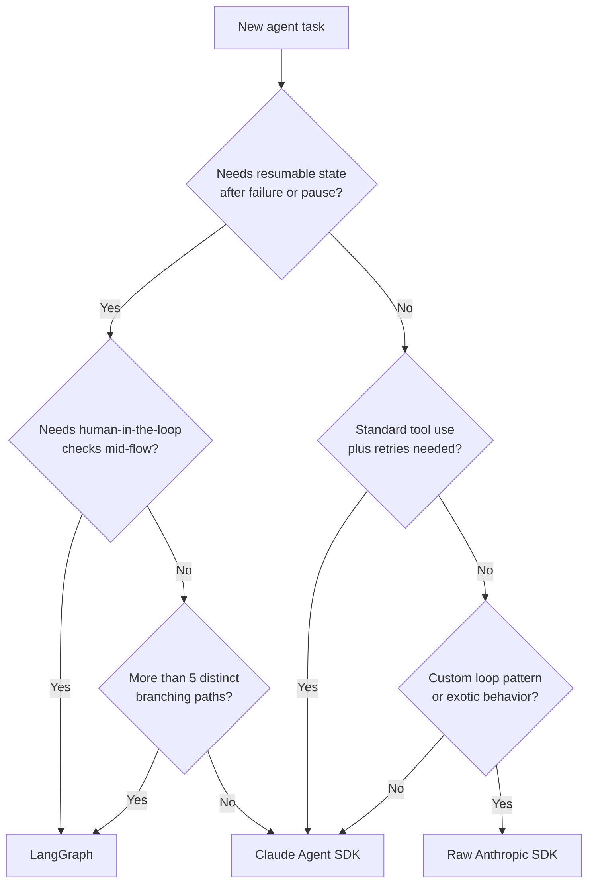

# أطر تطوير الـ Agents (Agent SDKs): مقايضات Claude وOpenAI وLangGraph

> اختر الـ SDK الذي يستحق تعقيده. معظم الـ agents الإنتاجية لا تحتاج المعقّد منها.

**النوع:** تعلّم
**اللغات:** Python
**المتطلبات:** من 04-08 إلى 04-11، إلمام بـ Anthropic SDK
**الوقت:** ~60 دقيقة
**أهداف التعلّم:**
- وصف التجريد (abstraction) الأساسي الذي يقدّمه كل SDK وما الذي يخفيه
- تطبيق حلقة agent ثلاثية الأدوات نفسها في raw SDK، وClaude Agent SDK، وLangGraph
- تحديد معايير القرار التي تشير إلى كل أسلوب
- تطبيق مرجعية القرار (rubric) على مهمة agent جديدة
- شرح لماذا تظهر حالة الـ graph المتشابكة (spaghetti) في LangGraph وكيف تتجنّبها

---

## المشكلة

يختار فريق في شركة ناشئة LangGraph. إطار العمل شائع، والتوثيق شامل، وشهرة الاسم تكسب النقاش الداخلي. يبنون agent دعم العملاء لديهم كـ graph.

بعد ستة أشهر، أصبح الـ graph من 40 عقدة (nodes). وقاموس الحالة (state dict) فيه 23 مفتاحًا. ولا مهندس واحد يفهم المسار الكامل. عندما يظهر خلل، يتتبّع الفريق الحالة عبر الحواف الشرطية (conditional edges)، باحثًا عن المكان الذي ضُبط فيه مفتاح بشكل خاطئ. يستغرق التنقيح يومًا. وتتطلب التغييرات في المسار تحديث طوبولوجيا الـ graph، وschema الحالة، ومنطق التوجيه في آنٍ واحد. إطار العمل الذي كان يُفترض أن يساعد أصبح هو الشيء الذي يجب تنقيحه.

في الجانب الآخر من المدينة، يبني فريق آخر كل شيء بشكل خام. يستخدمون Anthropic SDK مباشرةً مع حلقة while وجدول توزيع أدوات (tool dispatch table). يعمل جيدًا للـ agent الأول. وعندما يحتاجون الـ agent الثاني، يكتشفون أنهم بلا منطق إعادة محاولة (retry)، ولا تجريد للبثّ (streaming)، ولا تحقّق موحّد من الأدوات، ولا آلية تسليم (handoff). يقضون ثلاثة أسابيع في بناء بنية تحتية يقدّمها Claude Agent SDK جاهزةً.

ارتكب الفريقان الخطأ نفسه: اختارا مستوى التجريد قبل فهم ما يحتاجه الـ agent فعليًا.

---

## المفهوم

### الأساليب الثلاثة

```
Approach          | What it provides                    | What you own
------------------|-------------------------------------|----------------------------
Raw Anthropic SDK | API access, type hints              | Everything else
Claude Agent SDK  | Tool validation, retries, handoffs  | Agent logic, tool fns
LangGraph         | Stateful graphs, persistence,       | Graph topology, state
                  | human-in-the-loop checkpoints       | schema, routing logic
```

**Raw Anthropic SDK:** تكتب الحلقة، وتعالج إعادة المحاولة، وتدير قائمة الرسائل، وتتحقّق من مدخلات الأدوات، وتطبّق التسليم (handoffs). تحكّم كامل. صفر تجريدات. الأفضل عندما تحتاج نمط حلقة مخصّصًا، أو تريد فهم كل سطر، أو لديك نمط لا يناسب الـ SDKs الموجودة.

**Claude Agent SDK (أو OpenAI Agents SDK):** يقدّم مشغّلًا (runner) موحّدًا، وإعادة محاولة مدمجة مع تراجع أُسّي (exponential backoff)، وتسجيل أدوات عبر decorator، ودعم بثّ، وتسليمات agent. تعرّف الأدوات وتهيئة الـ agent. ويتولّى الـ SDK ميكانيكا الحلقة. الأفضل لمعظم الـ agents الإنتاجية.

**LangGraph:** يقدّم graphs ذات حالة مع schemas حالة مُنمّطة (typed)، وتوجيهًا شرطيًا بين العقد، ونقاط فحص (checkpointing) مدمجة لاستئناف التشغيلات المنقطعة، وإيقافات human-in-the-loop. كل خطوة عقدة. وكل قرار توجيه حافة (edge). وتُحفظ الحالة في مخزن بين العقد. الأفضل عندما تحتاج: سير عمل طويل الأمد يجب أن يُستأنف بعد الفشل، أو منطق تفرّع (branching) يتباين بشكل كبير حسب الحالة، أو بوابات موافقة بشرية في منتصف المسار.

### شجرة قرار اختيار الـ SDK



### جدول المقارنة (ASCII)

```
Feature                   | Raw SDK   | Agents SDK | LangGraph
--------------------------|-----------|------------|----------
Lines for a 3-tool loop   | ~80       | ~40        | ~120+
Tool registration         | Manual    | @tool dec  | @tool / manual
Input validation          | Manual    | Pydantic   | Pydantic
Retry / backoff           | Manual    | Built-in   | Manual or plugin
Streaming                 | Manual    | Built-in   | Manual
Handoffs                  | Manual    | Built-in   | Via routing
Resumable state           | No        | No         | Yes (checkpoints)
Human-in-the-loop         | Manual    | Manual     | Built-in
Graph topology            | N/A       | N/A        | Required
Debuggability             | High      | Medium     | Low (on complex graphs)
When to use               | Custom    | Most cases | Complex branching,
                          | patterns  |            | long-running, resumable
```

---

## البناء

### حلقة الـ agent ثلاثية الأدوات نفسها، بثلاث طرق

المهمة: agent يستطيع البحث، واسترجاع صفحة ويب، وتلخيص نتيجة. السلوك نفسه، ثلاثة تطبيقات.

#### الأسلوب 1: Raw Anthropic SDK (~80 سطرًا)

راجع `code/main.py` للتطبيق الكامل.

```python
import anthropic

TOOLS = [
    {
        "name": "search",
        "description": "Search for information.",
        "input_schema": {"type": "object", "properties": {"query": {"type": "string"}}, "required": ["query"]},
    },
    {
        "name": "get_webpage",
        "description": "Retrieve webpage content.",
        "input_schema": {"type": "object", "properties": {"url": {"type": "string"}}, "required": ["url"]},
    },
    {
        "name": "summarize",
        "description": "Summarize a block of text.",
        "input_schema": {"type": "object", "properties": {"text": {"type": "string"}}, "required": ["text"]},
    },
]

def raw_sdk_loop(task: str, client: anthropic.Anthropic) -> str:
    messages = [{"role": "user", "content": task}]
    for _ in range(10):
        response = client.messages.create(
            model="claude-3-5-haiku-20241022",
            max_tokens=1024,
            tools=TOOLS,
            messages=messages,
        )
        if response.stop_reason == "end_turn":
            return next(b.text for b in response.content if b.type == "text")
        if response.stop_reason == "tool_use":
            messages.append({"role": "assistant", "content": response.content})
            results = []
            for block in response.content:
                if block.type == "tool_use":
                    result = dispatch_tool(block.name, block.input)
                    results.append({
                        "type": "tool_result",
                        "tool_use_id": block.id,
                        "content": result,
                    })
            messages.append({"role": "user", "content": results})
    return "Max iterations reached."
```

ما الذي تملكه: شرط إنهاء الحلقة، وتوزيع الأدوات، وإدارة قائمة الرسائل، ومنطق إعادة المحاولة (غير مبيّن أعلاه، لكنه مطلوب في الإنتاج).

#### الأسلوب 2: Claude Agent SDK (~40 سطرًا)

يتولّى الـ SDK الحلقة. تعرّف الأدوات والـ agent:

```python
from anthropic.agent import Agent, tool

@tool
def search(query: str) -> str:
    """Search for information."""
    return mock_search(query)

@tool
def get_webpage(url: str) -> str:
    """Retrieve webpage content."""
    return mock_get_webpage(url)

@tool
def summarize(text: str) -> str:
    """Summarize a block of text."""
    return mock_summarize(text)

agent = Agent(
    model="claude-3-5-haiku-20241022",
    tools=[search, get_webpage, summarize],
    system="You are a research agent.",
)

result = agent.run("Research the top widget competitors.")
print(result.final_message)
```

ما يتولّاه الـ SDK: بناء قائمة الرسائل، وتحليل نداء الأداة، وحقن النتيجة، وإعادة المحاولة عند حدود المعدّل (rate limits)، والبثّ إن كان مفعّلًا. وما تتولّاه أنت: تطبيق الأداة، وتهيئة الـ agent، والـ system prompt.

#### الأسلوب 3: LangGraph (~120+ سطرًا)

يتطلب LangGraph schema حالة مُنمّطًا، ودوال عقد، وتوجيه حواف صريحًا:

```python
from typing import TypedDict, Annotated
from langgraph.graph import StateGraph, END
from langgraph.graph.message import add_messages

class AgentState(TypedDict):
    messages: Annotated[list, add_messages]
    tool_results: list[str]
    final_answer: str

def call_llm(state: AgentState) -> dict:
    client = anthropic.Anthropic()
    response = client.messages.create(
        model="claude-3-5-haiku-20241022",
        max_tokens=1024,
        tools=TOOLS,
        messages=state["messages"],
    )
    return {"messages": [{"role": "assistant", "content": response.content}]}

def route_after_llm(state: AgentState) -> str:
    last = state["messages"][-1]
    if any(b.type == "tool_use" for b in last.get("content", [])):
        return "call_tools"
    return END

def call_tools(state: AgentState) -> dict:
    last = state["messages"][-1]
    results = []
    for block in last.get("content", []):
        if block.type == "tool_use":
            result = dispatch_tool(block.name, block.input)
            results.append({"type": "tool_result", "tool_use_id": block.id, "content": result})
    return {"messages": [{"role": "user", "content": results}]}

builder = StateGraph(AgentState)
builder.add_node("call_llm", call_llm)
builder.add_node("call_tools", call_tools)
builder.set_entry_point("call_llm")
builder.add_conditional_edges("call_llm", route_after_llm)
builder.add_edge("call_tools", "call_llm")
graph = builder.compile()

result = graph.invoke({"messages": [{"role": "user", "content": "Research widget competitors."}]})
```

هذا ثلاثة أضعاف الكود لنفس السلوك. لا يؤتي التعقيد ثماره إلا عندما تضيف نقاط الفحص (checkpointing)، أو إيقافات human-in-the-loop، أو تفرّعًا شرطيًا يتباين فعليًا وقت التشغيل.

مقارنة عدد الأسطر:
```
Raw SDK:      ~80 lines
Agents SDK:   ~40 lines
LangGraph:    ~120 lines (basic), ~200+ lines (with state schema, checkpointing)
```

> **اختبار من الواقع:** فريقك يناقش ما إن كان عليه استخدام LangGraph لـ agent دعم عملاء جديد لديه 3 أدوات (البحث في قاعدة المعرفة، البحث عن طلب، إرسال بريد) ومسار خطّي. يقول زميل في الفريق "LangGraph يمنحنا مرونة للتعقيد المستقبلي." ما التكلفة الملموسة لاختيار LangGraph لمسار خطّي بثلاث أدوات اليوم؟

التكلفة ثلاثة أضعاف الكود، وschema حالة مطلوب، وتوجيه حواف صريح لمسار بلا تفرّع، ونموذج تنقيح يتطلب فهم طوبولوجيا الـ graph لتتبّع الأخطاء. "المرونة للتعقيد المستقبلي" فائدة حقيقية، لكنها تُحمّلك ذلك التعقيد الآن. إن بقي المسار خطّيًا، فستصون كل تلك النفقات إلى أجل غير مسمّى. السؤال الصحيح ليس "هل قد نحتاج هذا؟" بل "هل نحتاج هذا اليوم؟" لمسار خطّي بثلاث أدوات، الـ Agents SDK هو الأداة الصحيحة.

---

## الاستخدام

### مرجعية القرار كدالة Python

```python
def choose_sdk(
    needs_resumable_state: bool = False,
    needs_human_in_loop: bool = False,
    branching_paths: int = 1,
    needs_retries: bool = True,
    has_custom_loop_pattern: bool = False,
) -> str:
    """
    Returns the recommended SDK for the given agent characteristics.
    """
    if needs_resumable_state or needs_human_in_loop or branching_paths > 5:
        return "LangGraph"

    if has_custom_loop_pattern:
        return "Raw Anthropic SDK"

    # Default: standard tool use with built-in retries
    return "Claude Agent SDK (or OpenAI Agents SDK)"
```

خريطة خصائص المهمة:

| المهمة | قابلة للاستئناف | Human-in-loop | التفرّع | الموصى به |
|------|-----------|---------------|-----------|-------------|
| روبوت دعم عملاء (3 أدوات) | لا | لا | 1 | Agents SDK |
| خط معالجة مستندات | لا | لا | 2 | Agents SDK |
| سير عمل موافقة (مالية) | نعم | نعم | 3 | LangGraph |
| agent بحثي (تكيّفي) | لا | لا | 3 | Agents SDK أو Raw |
| مهمة خلفية متعددة الأيام | نعم | لا | 2 | LangGraph |
| محادثة بثّ مخصّصة | لا | لا | 1 | Raw SDK |
| تنفيذ طلبات (45+ خطوة) | نعم | نعم | 8 | LangGraph |

> **نقلة في المنظور:** أنت بعد ستة أشهر في تطبيق LangGraph به 30+ عقدة. ينضم مهندس جديد إلى الفريق ويسأل: "لماذا استخدمنا LangGraph هنا؟" ما الإجابة الصادقة التي تميّز حالات استخدام LangGraph المشروعة عن التبنّي المبكّر؟

LangGraph مبرَّر بشكل مشروع عندما تحتاج حالة مع نقاط فحص (checkpointed state) تنجو من إعادة تشغيل العمليات (يجب أن يُستأنف سير العمل بعد الفشل)، أو عندما يجب على البشر الموافقة أو التدخّل في خطوات بعينها، أو عندما يتفرّع منطق التوجيه فعليًا بشكل مختلف لمدخلات مختلفة بطرق تتطلب منطقًا شرطيًا معقّدًا في حلقة بسيطة. ليس مبرَّرًا لمجرّد أن الـ agent "معقّد" بمعنى امتلاكه أدوات كثيرة، أو لأنه قد يحتاج هذه الميزات مستقبلًا، أو لأن الفريق تعلّم LangGraph ويريد استخدامه. الإجابة الصادقة غالبًا هي: "تبنّيناه قبل أن نفهم ما إن كنّا نحتاجه، والآن ندفع ضريبة التعقيد."

---

## التسليم

المُخرَج الذي يُنتجه هذا الدرس هو مرجعية قرار: prompt وجدول يمكنك استخدامهما للتوصية بالـ SDK الصحيح لأي مهمة agent جديدة. راجع `outputs/prompt-sdk-tradeoffs.md`.

استخدم هذا في بداية كل مشروع agent جديد. مُرّ عبر مرجعية القرار قبل كتابة أي كود. الأسئلة الخمسة في المرجعية تستغرق دقيقتين وقد تُوفّر أسابيع من إعادة الهيكلة (refactoring).

---

## التقييم

**تكافؤ الصحة:** شغّل التقييم نفسه المكوّن من 5 مهام على التطبيقات الثلاثة. تحقّق من أن الثلاثة تنتج مُخرَجات مكافئة (نفس نداءات الأدوات، إجابات مكافئة) في كل مهمة. إن تباينت، فحدّد ما إن كان فرقًا في سلوك إطار العمل أم خللًا في التطبيق.

**قياس عدد الأسطر:** عُدّ الأسطر الفعلية من الكود الوظيفي (باستثناء التعليقات والأسطر الفارغة) لكل تطبيق للـ agent نفسه. تحقّق من أن تطبيق الـ Agents SDK أقصر من كلٍّ من Raw وLangGraph لحلقة استدعاء أدوات قياسية.

**زمن التنقيح:** أدخِل خللًا متعمّدًا (أداة تعيد مُخرَجًا خاطئًا) في كل تطبيق. قِس كم يستغرق مطوّر غير مطّلع على الكود لتحديد موقع الخلل. هذا مؤشّر بديل لقابلية التنقيح. الهدف: أخطاء Raw SDK تُكتشَف في أقل من 5 دقائق؛ Agents SDK في أقل من 10 دقائق؛ LangGraph في أقل من 20 دقيقة.

**نفقات إطار العمل (Overhead):** قِس إجمالي زمن الانتظار (latency) (بالساعة الفعلية من إدخال المهمة إلى الإجابة النهائية) لكل تطبيق على المهمة نفسها بالأدوات نفسها. سيُظهر LangGraph نفقات إضافية من إدارة الحالة واجتياز الـ graph. كمِّمها. لمعظم المهام يكون هذا ضئيلًا؛ ولحالات الاستخدام الحسّاسة لزمن الانتظار، يكون مهمًّا.

**معايرة مرجعية القرار:** طبّق المرجعية على 10 مشاريع agent تاريخية من فريقك. لكل مشروع، قارن توصية المرجعية بما بُني فعلًا. حدّد الحالات التي كانت المرجعية ستوصي فيها بأسلوب أبسط، وقدّر تكلفة الصيانة المدفوعة مقابل التعقيد غير الضروري.
