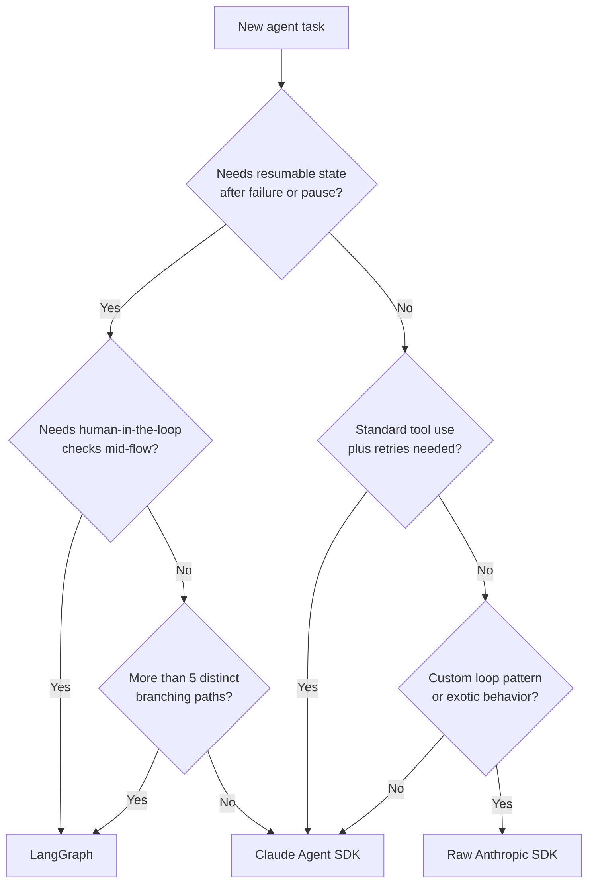

# Agent SDKs: Claude, OpenAI, LangGraph Tradeoffs

> Pick the SDK that earns its complexity. Most production agents don't need the complex one.

**Type:** Learn
**Languages:** Python
**Prerequisites:** 04-08 through 04-11, familiarity with the Anthropic SDK
**Time:** ~60 min
**Learning Objectives:**
- Describe the core abstraction each SDK provides and what it hides
- Implement the same 3-tool agent loop in raw SDK, Claude Agent SDK, and LangGraph
- Identify the decision criteria that point to each approach
- Apply the decision rubric to a new agent task
- Explain why spaghetti graph state appears in LangGraph and how to avoid it

---

## THE PROBLEM

A team at a startup picks LangGraph. The framework is popular, the documentation is comprehensive, and the name-brand recognition wins the internal debate. They build their customer support agent as a graph.

Six months later, the graph has 40 nodes. The state dict has 23 keys. No single engineer understands the full flow. When a bug appears, the team traces state through conditional edges, looking for where a key was set incorrectly. Debugging takes a day. Changes to the flow require updating the graph topology, the state schema, and the routing logic simultaneously. The framework that was supposed to help has become the thing to debug.

Across town, another team builds everything raw. They use the Anthropic SDK directly with a while loop and a tool dispatch table. It works well for the first agent. When they need the second agent, they discover they have no retry logic, no streaming abstraction, no standardized tool validation, and no handoff mechanism. They spend three weeks building infrastructure that the Claude Agent SDK provides out of the box.

Both teams made the same error: they chose the abstraction level before understanding what their agent actually needed.

---

## THE CONCEPT

### Three Approaches

```
Approach          | What it provides                    | What you own
------------------|-------------------------------------|----------------------------
Raw Anthropic SDK | API access, type hints              | Everything else
Claude Agent SDK  | Tool validation, retries, handoffs  | Agent logic, tool fns
LangGraph         | Stateful graphs, persistence,       | Graph topology, state
                  | human-in-the-loop checkpoints       | schema, routing logic
```

**Raw Anthropic SDK:** You write the loop, you handle retries, you manage the message list, you validate tool inputs, you implement handoffs. Total control. Zero abstractions. Best when you need a custom loop pattern, want to understand every line, or have a pattern that doesn't fit existing SDKs.

**Claude Agent SDK (or OpenAI Agents SDK):** Provides a standardized runner, built-in retry with exponential backoff, tool registration via decorator, streaming support, and agent handoffs. You define the tools and the agent configuration. The SDK handles the loop mechanics. Best for most production agents.

**LangGraph:** Provides stateful graphs with typed state schemas, conditional routing between nodes, built-in checkpointing to resume interrupted runs, and human-in-the-loop pauses. Every step is a node. Every routing decision is an edge. State is persisted to a store between nodes. Best when you need: long-running workflows that must resume after failure, branching logic that varies dramatically by state, or human approval gates in the middle of a flow.

### SDK Selection Decision Tree



### Comparison Table (ASCII)

```
Feature                   | Raw SDK   | Agents SDK | LangGraph
--------------------------|-----------|------------|----------
Lines for a 3-tool loop   | ~80       | ~40        | ~120+
Tool registration         | Manual    | @tool dec  | @tool / manual
Input validation          | Manual    | Pydantic   | Pydantic
Retry / backoff           | Manual    | Built-in   | Manual or plugin
Streaming                 | Manual    | Built-in   | Manual
Handoffs                  | Manual    | Built-in   | Via routing
Resumable state           | No        | No         | Yes (checkpoints)
Human-in-the-loop         | Manual    | Manual     | Built-in
Graph topology            | N/A       | N/A        | Required
Debuggability             | High      | Medium     | Low (on complex graphs)
When to use               | Custom    | Most cases | Complex branching,
                          | patterns  |            | long-running, resumable
```

---

## BUILD IT

### The Same 3-Tool Agent Loop, Three Ways

The task: an agent that can search, retrieve a webpage, and summarize a result. Same behavior, three implementations.

#### Approach 1: Raw Anthropic SDK (~80 lines)

See `code/main.py` for the full implementation.

```python
import anthropic

TOOLS = [
    {
        "name": "search",
        "description": "Search for information.",
        "input_schema": {"type": "object", "properties": {"query": {"type": "string"}}, "required": ["query"]},
    },
    {
        "name": "get_webpage",
        "description": "Retrieve webpage content.",
        "input_schema": {"type": "object", "properties": {"url": {"type": "string"}}, "required": ["url"]},
    },
    {
        "name": "summarize",
        "description": "Summarize a block of text.",
        "input_schema": {"type": "object", "properties": {"text": {"type": "string"}}, "required": ["text"]},
    },
]

def raw_sdk_loop(task: str, client: anthropic.Anthropic) -> str:
    messages = [{"role": "user", "content": task}]
    for _ in range(10):
        response = client.messages.create(
            model="claude-3-5-haiku-20241022",
            max_tokens=1024,
            tools=TOOLS,
            messages=messages,
        )
        if response.stop_reason == "end_turn":
            return next(b.text for b in response.content if b.type == "text")
        if response.stop_reason == "tool_use":
            messages.append({"role": "assistant", "content": response.content})
            results = []
            for block in response.content:
                if block.type == "tool_use":
                    result = dispatch_tool(block.name, block.input)
                    results.append({
                        "type": "tool_result",
                        "tool_use_id": block.id,
                        "content": result,
                    })
            messages.append({"role": "user", "content": results})
    return "Max iterations reached."
```

What you own: the loop termination condition, the tool dispatch, the message list management, and the retry logic (not shown above, but needed in production).

#### Approach 2: Claude Agent SDK (~40 lines)

The SDK handles the loop. You define tools and the agent:

```python
from anthropic.agent import Agent, tool

@tool
def search(query: str) -> str:
    """Search for information."""
    return mock_search(query)

@tool
def get_webpage(url: str) -> str:
    """Retrieve webpage content."""
    return mock_get_webpage(url)

@tool
def summarize(text: str) -> str:
    """Summarize a block of text."""
    return mock_summarize(text)

agent = Agent(
    model="claude-3-5-haiku-20241022",
    tools=[search, get_webpage, summarize],
    system="You are a research agent.",
)

result = agent.run("Research the top widget competitors.")
print(result.final_message)
```

The SDK handles: message list construction, tool call parsing, result injection, retry on rate limits, and streaming if enabled. You handle: tool implementation, agent configuration, and system prompt.

#### Approach 3: LangGraph (~120+ lines)

LangGraph requires a typed state schema, node functions, and explicit edge routing:

```python
from typing import TypedDict, Annotated
from langgraph.graph import StateGraph, END
from langgraph.graph.message import add_messages

class AgentState(TypedDict):
    messages: Annotated[list, add_messages]
    tool_results: list[str]
    final_answer: str

def call_llm(state: AgentState) -> dict:
    client = anthropic.Anthropic()
    response = client.messages.create(
        model="claude-3-5-haiku-20241022",
        max_tokens=1024,
        tools=TOOLS,
        messages=state["messages"],
    )
    return {"messages": [{"role": "assistant", "content": response.content}]}

def route_after_llm(state: AgentState) -> str:
    last = state["messages"][-1]
    if any(b.type == "tool_use" for b in last.get("content", [])):
        return "call_tools"
    return END

def call_tools(state: AgentState) -> dict:
    last = state["messages"][-1]
    results = []
    for block in last.get("content", []):
        if block.type == "tool_use":
            result = dispatch_tool(block.name, block.input)
            results.append({"type": "tool_result", "tool_use_id": block.id, "content": result})
    return {"messages": [{"role": "user", "content": results}]}

builder = StateGraph(AgentState)
builder.add_node("call_llm", call_llm)
builder.add_node("call_tools", call_tools)
builder.set_entry_point("call_llm")
builder.add_conditional_edges("call_llm", route_after_llm)
builder.add_edge("call_tools", "call_llm")
graph = builder.compile()

result = graph.invoke({"messages": [{"role": "user", "content": "Research widget competitors."}]})
```

This is 3x the code for the same behavior. The complexity pays off only when you add checkpointing, human-in-the-loop pauses, or conditional branching that genuinely varies at runtime.

Line count comparison:
```
Raw SDK:      ~80 lines
Agents SDK:   ~40 lines
LangGraph:    ~120 lines (basic), ~200+ lines (with state schema, checkpointing)
```

> **Real-world check:** Your team is debating whether to use LangGraph for a new customer support agent that has 3 tools (search KB, look up order, send email) and a linear flow. A teammate says 'LangGraph gives us flexibility for future complexity.' What is the concrete cost of choosing LangGraph for a linear 3-tool flow today?

The cost is triple the code, a required state schema, explicit edge routing for a flow that has no branching, and a debugging model that requires understanding graph topology to trace bugs. "Flexibility for future complexity" is a real benefit, but it front-loads that complexity now. If the flow stays linear, you will maintain all that overhead indefinitely. The correct question is not "might we need this?" but "do we need this today?" For a linear 3-tool flow, the Agents SDK is the right tool.

---

## USE IT

### The Decision Rubric as a Python Function

```python
def choose_sdk(
    needs_resumable_state: bool = False,
    needs_human_in_loop: bool = False,
    branching_paths: int = 1,
    needs_retries: bool = True,
    has_custom_loop_pattern: bool = False,
) -> str:
    """
    Returns the recommended SDK for the given agent characteristics.
    """
    if needs_resumable_state or needs_human_in_loop or branching_paths > 5:
        return "LangGraph"

    if has_custom_loop_pattern:
        return "Raw Anthropic SDK"

    # Default: standard tool use with built-in retries
    return "Claude Agent SDK (or OpenAI Agents SDK)"
```

Task characteristic mapping:

| Task | Resumable | Human-in-loop | Branching | Recommended |
|------|-----------|---------------|-----------|-------------|
| Customer support bot (3 tools) | No | No | 1 | Agents SDK |
| Document processing pipeline | No | No | 2 | Agents SDK |
| Approval workflow (finance) | Yes | Yes | 3 | LangGraph |
| Research agent (adaptive) | No | No | 3 | Agents SDK or Raw |
| Multi-day background job | Yes | No | 2 | LangGraph |
| Custom streaming chat | No | No | 1 | Raw SDK |
| Order fulfillment (45+ steps) | Yes | Yes | 8 | LangGraph |

> **Perspective shift:** You are six months into a LangGraph implementation with 30+ nodes. A new engineer joins the team and asks: "Why did we use LangGraph here?" What is the honest answer that distinguishes legitimate LangGraph use cases from premature adoption?

LangGraph is legitimately justified when you need checkpointed state that survives process restarts (the workflow must resume after failure), when humans must approve or intervene at specific steps, or when the routing logic genuinely branches differently for different inputs in ways that would require complex conditional logic in a simple loop. It is not justified simply because the agent is "complex" in the sense of having many tools, because it might need these features in the future, or because the team learned LangGraph and wants to use it. The honest answer often is: "We adopted it before we understood whether we needed it, and now we're paying the complexity tax."

---

## SHIP IT

The artifact this lesson produces is a decision rubric: a prompt and table you can use to recommend the right SDK for any new agent task. See `outputs/prompt-sdk-tradeoffs.md`.

Use this at the start of every new agent project. Run through the decision rubric before writing any code. The five questions in the rubric take two minutes and can save weeks of refactoring.

---

## EVALUATE IT

**Correctness parity:** Run the same 5-task eval on all three implementations. Verify all three produce equivalent outputs (same tool calls, equivalent answers) on each task. If they diverge, identify whether it is a framework behavior difference or an implementation bug.

**Line count measurement:** Count actual lines of functional code (excluding comments and blank lines) for each implementation of the same agent. Verify the Agents SDK implementation is shorter than both Raw and LangGraph for a standard tool-calling loop.

**Debugging time:** Introduce a deliberate bug (a tool that returns incorrect output) into each implementation. Measure how long it takes a developer unfamiliar with the code to locate the bug. This is a proxy for debuggability. Target: Raw SDK bugs found in under 5 minutes; Agents SDK in under 10 minutes; LangGraph in under 20 minutes.

**Framework overhead:** Measure total latency (wall clock from task input to final answer) for each implementation on the same task with the same tools. LangGraph will show additional overhead from state management and graph traversal. Quantify it. For most tasks this is negligible; for latency-sensitive use cases, it matters.

**Decision rubric calibration:** Apply the rubric to 10 historical agent projects from your team. For each project, compare the rubric's recommendation to what was actually built. Identify cases where the rubric would have recommended a simpler approach and estimate the maintenance cost paid for the unnecessary complexity.
