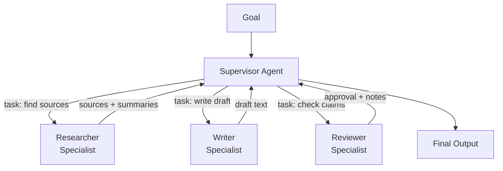

# الأنظمة متعددة الـ Agents (Multi-Agent): المشرف، والتسليمات، ومتى تكون مبالغة

> agent واحد مصمَّم جيدًا يتفوّق على خمسة سيّئي التنسيق.

**النوع:** بناء
**اللغات:** Python
**المتطلبات:** 06-orchestrator-workers، 08-tool-use-and-error-recovery
**الوقت:** ~60 دقيقة
**أهداف التعلّم:**
- تحديد الشروط الثلاثة التي تستحق فيها بنية multi-agent تعقيدها فعليًا
- التمييز بين نمط المشرف-العمّال (supervisor-workers) ونمط التسليم (handoff)
- بناء agent مشرف يوزّع المهام على متخصّصين مُسمّين في Python خام
- تمرير الـ context بنظافة بين نداءات الـ agents دون فقدان الحالة
- إدراك متى يجب التوحيد (consolidate) عودةً إلى agent واحد

---

## الشعار

multi-agent حلٌّ لمجموعة محدّدة من المشاكل. وليس ترقية.

---

## المشكلة

يقرأ فريق عن الأنظمة متعددة الـ agents ويتحمّس. agent دعم العملاء الوحيد لديهم يعمل جيدًا: زمن استجابة ثانيتان، ومعدل حلّ 87%، وأنماط فشل واضحة. يعيدون بناءه كـ "شبكة" من خمسة sub-agents متخصّصة: مصنّف نية (intent classifier)، ومسترجِع معرفة (knowledge retriever)، ومدقّق سياسات (policy checker)، ومُحرّر استجابة (response drafter)، ومراجع نبرة (tone reviewer). كل agent نداء LLM خاص به مع system prompt خاص به.

بعد ستة أسابيع: زمن الانتظار 8 ثوانٍ. والأخطاء تتكاثر عند نقاط التسليم. مدقّق السياسات يتلقّى أحيانًا context جزئيًا من مسترجِع المعرفة. ومراجع النبرة يناقض أحيانًا محرّر الاستجابة. ومعدل الحلّ هبط إلى 79%. الفريق ينقّح خمسة agents بدلًا من واحد.

لم يتحسّن شيء. أضافت البنية نفقات دون أن تضيف قدرة. لم يكن الـ agent الأصلي يصطدم بحدّ context. ولم يكن يؤدي مهامًا تستفيد من التحقّق. ولم يكن يؤدي مهامًا قابلة للتشغيل المتوازي. لقد عمل ببساطة، فجُعِل أكثر تعقيدًا.

تحلّ بنية multi-agent مشاكل حقيقية. لكن المشاكل الحقيقية محدّدة. تطبيق النمط دون تلك المشاكل هو الخطأ الذي يمنعه هذا الدرس.

---

## المفهوم

### متى تستحق multi-agent تعقيدها

ثمة ثلاثة شروط تؤتي فيها بنية multi-agent ثمارها فعليًا. إن لم ينطبق أيٌّ من الثلاثة، فوحّد عودةً إلى agent واحد.

**الشرط 1: المهمة تتجاوز نافذة context واحدة.**
بعض المهام ببساطة أكبر من اللازم: معالجة 300 تذكرة عميل من الأسبوع الماضي، أو تحليل قاعدة كود كاملة، أو تجميع مجموعة بحثية من 50 مستندًا. لا يستطيع agent واحد احتواء المهمة كاملة في context واحد. تستطيع agents متعدّدة العمل على أجزاء بالتوازي أو بالتسلسل، كلٌّ يعمل ضمن حدّ context الخاص به.

**الشرط 2: التحقّق المستقل يحسّن الدقة.**
للمُخرَجات عالية المخاطر (الفرز الطبي، الكود الذاهب إلى الإنتاج، الحسابات المالية)، يلتقط وجود agent ثانٍ يتحقّق من عمل الـ agent الأول أخطاءً لا يستطيع الـ agent الأول التقاطها في مراجعته الذاتية. يحتاج المتحقّق أن يكون مستقلًا: نداء منفصل، لا نفس الـ context يرى مُخرَجه.

**الشرط 3: التوازي بين المتخصّصين يسرّع الأمور فعليًا.**
إن كانت للمهمة مهام فرعية قابلة للفصل بوضوح ولا تعتمد على بعضها، فإن تشغيلها بالتوازي مع متخصّصين يوفّر وقتًا بالساعة الفعلية. اكتب الملخّص البحثي واكتب الإحاطة التنفيذية في آنٍ واحد. التوفير يهمّ فقط إذا كانت النسخة المتسلسلة ستكون بطيئة جدًا.

إن لم تصطدم مهمتك بأحد هذه الثلاثة، فإن agent واحدًا مُصاغًا جيدًا أرخص وأسرع وأسهل في التنقيح.

### النمطان

**المشرف-العمّال (Supervisor-Workers):** يتلقّى agent واحد الهدف ويعمل كموجّه (router). يقرّر أي متخصّص يستدعي، وأي مهمة يعطيه، ويجمّع النتائج. لا يتنسّق المتخصّصون فيما بينهم؛ يتحدّثون فقط إلى المشرف.

**التسليمات (Handoffs):** يُكمل Agent A عمله ويمرّر حزمة context إلى Agent B. ويلتقط Agent B من حيث توقّف Agent A. لا منسّق مركزي؛ الـ agents سلسلة. يعمل جيدًا عندما تكون المهام متسلسلة ولكل خطوة حدّ اكتمال واضح.



المشرف ليس أذكى من المتخصّصين. إنه أضيق: مهمته التوجيه والتجميع، لا العمق.

### مقارنة الأساليب

```
                  Single Agent    Supervisor-Workers    Handoffs
------------------------------------------------------------------
Latency           Lowest          Higher (parallel ok)  Higher (sequential)
Cost              Lowest          Higher (N calls)       Higher (N calls)
Failure surface   One model       N models + routing     N models + context pass
Debug complexity  Low             Medium                 Medium-High
Context sharing   Full            Via supervisor         Via handoff bundle
Best for          Most tasks      Fan-out + synthesis    Sequential pipelines

When justified:   Always start    Parallel specialists   Linear multi-step
                  here            or context overflow    with clear boundaries
```

---

## البناء

### نمط المشرف في Python خام

ابنِ خط إنتاج تدوينة مدونة: باحث، وكاتب، ومراجع، ينسّق بينهم مشرف.

```python
import json
import anthropic

client = anthropic.Anthropic()
MODEL = "claude-3-5-haiku-20241022"

SUPERVISOR_PROMPT = """You are a production supervisor for a blog post pipeline.
You receive a goal and decide which specialist to dispatch next.
Always respond with valid JSON in this exact format:
{"specialist": "researcher" | "writer" | "reviewer", "task": "<specific task string>", "done": false}
When all specialists have run and output is ready, respond with:
{"specialist": null, "task": null, "done": true}
Current pipeline state is provided in the user message."""

SPECIALIST_PROMPTS = {
    "researcher": "You are a research specialist. Given a topic and task, produce 3-5 factual bullet points with supporting context. Be concise and accurate.",
    "writer": "You are a writing specialist. Given research notes and a task, write a focused blog section (150-200 words). Use the research. Do not invent facts.",
    "reviewer": "You are a review specialist. Given a draft and research notes, output a brief assessment: what is strong, what needs fixing (if anything). Be specific.",
}

def call_specialist(specialist_name: str, task: str, context: dict) -> str:
    system = SPECIALIST_PROMPTS[specialist_name]
    user_content = f"Task: {task}\n\nContext:\n{json.dumps(context, indent=2)}"
    response = client.messages.create(
        model=MODEL,
        max_tokens=600,
        system=system,
        messages=[{"role": "user", "content": user_content}],
    )
    return response.content[0].text

def run_supervisor(goal: str, max_steps: int = 6) -> dict:
    pipeline_state = {
        "goal": goal,
        "completed_steps": [],
        "outputs": {},
    }

    for step in range(max_steps):
        # Supervisor decides next action
        supervisor_input = json.dumps(pipeline_state, indent=2)
        response = client.messages.create(
            model=MODEL,
            max_tokens=200,
            system=SUPERVISOR_PROMPT,
            messages=[{"role": "user", "content": supervisor_input}],
        )

        raw = response.content[0].text.strip()
        # Strip markdown code fences if present
        if raw.startswith("```"):
            raw = raw.split("```")[1]
            if raw.startswith("json"):
                raw = raw[4:]
        try:
            decision = json.loads(raw)
        except json.JSONDecodeError:
            print(f"Supervisor returned invalid JSON at step {step}: {raw}")
            break

        if decision.get("done"):
            print(f"Supervisor: pipeline complete after {step} steps.")
            break

        specialist = decision["specialist"]
        task = decision["task"]
        print(f"Step {step + 1}: dispatching to [{specialist}] - {task[:60]}...")

        # Call the specialist with full context
        output = call_specialist(specialist, task, pipeline_state["outputs"])

        # Update state so next supervisor call sees what was produced
        pipeline_state["outputs"][specialist] = output
        pipeline_state["completed_steps"].append({"specialist": specialist, "task": task})

    return pipeline_state

if __name__ == "__main__":
    goal = "Write a blog post section on why multi-agent AI systems fail in production"
    result = run_supervisor(goal)

    print("\n--- PIPELINE OUTPUTS ---")
    for specialist, output in result["outputs"].items():
        print(f"\n[{specialist.upper()}]:\n{output}")
```

قرارات التصميم الأساسية:

**يُمرَّر الـ context دائمًا للأسفل، ولا يُفترَض أبدًا.** يتلقّى كل متخصّص `pipeline_state["outputs"]` كي يرى كل ما أُنتج سابقًا. ملاحظات الباحث متاحة للكاتب. وكلاهما متاح للمراجع.

**المشرف يرى الحالة، لا النصوص الكاملة (transcripts).** تذهب حالة خط الإنتاج الكاملة (الهدف + الخطوات المكتملة + المُخرَجات) إلى المشرف في كل نداء. هذا أرخص من إرسال تاريخ الرسائل الكامل ويركّز المشرف على قرارات التوجيه.

**المشرف يعيد JSON منظّمًا.** هذا يجعل التوزيع حتميًا (deterministic). إن أعاد المشرف نصًا حرًّا، يصبح التحليل (parsing) هشًّا. افرض البنية.

> **اختبار من الواقع:** فريقك يريد إضافة متخصّص رابع: "مدقّق حقائق" (fact-checker) يعمل بعد الكاتب وقبل المراجع. ما التغيير في منطق المشرف الذي يعالج هذا، وما الـ context الذي يحتاجه مدقّق الحقائق ولا يحتاجه المراجع؟

منطق توجيه المشرف يدعم بالفعل أي متخصّص جديد: فقط أضف الـ prompt الجديد إلى `SPECIALIST_PROMPTS` ودع المشرف يقرّر متى يستدعيه. يحتاج مدقّق الحقائق مصادر الباحث ومسوّدة الكاتب (كلاهما في `outputs`). ويحتاج المراجع المسوّدة إضافةً إلى أعلام مدقّق الحقائق (flags). حالة خط الإنتاج تمرّر بالفعل كل المُخرَجات السابقة إلى كل متخصّص، فلا حاجة إلى تغيير بنيوي عدا الـ system prompt الجديد.

---

## الاستخدام

### نمط التسليم (Handoff)

نمط التسليم متسلسل لا محوريّ-وشُعاعي (hub-and-spoke). يتلقّى كل agent حزمة context من الـ agent السابق وينتج حزمة context للتالي.

```python
from dataclasses import dataclass, field

@dataclass
class HandoffBundle:
    goal: str
    stage: str
    outputs: dict = field(default_factory=dict)
    notes: list = field(default_factory=list)

def researcher_agent(bundle: HandoffBundle) -> HandoffBundle:
    response = client.messages.create(
        model=MODEL,
        max_tokens=600,
        system=SPECIALIST_PROMPTS["researcher"],
        messages=[{"role": "user", "content": f"Goal: {bundle.goal}\nTask: Research this topic thoroughly."}],
    )
    bundle.outputs["research"] = response.content[0].text
    bundle.stage = "researched"
    bundle.notes.append("Researcher: complete")
    return bundle

def writer_agent(bundle: HandoffBundle) -> HandoffBundle:
    response = client.messages.create(
        model=MODEL,
        max_tokens=600,
        system=SPECIALIST_PROMPTS["writer"],
        messages=[{
            "role": "user",
            "content": f"Goal: {bundle.goal}\nResearch:\n{bundle.outputs.get('research', '')}\nTask: Write the blog section.",
        }],
    )
    bundle.outputs["draft"] = response.content[0].text
    bundle.stage = "drafted"
    bundle.notes.append("Writer: complete")
    return bundle

def reviewer_agent(bundle: HandoffBundle) -> HandoffBundle:
    response = client.messages.create(
        model=MODEL,
        max_tokens=300,
        system=SPECIALIST_PROMPTS["reviewer"],
        messages=[{
            "role": "user",
            "content": f"Research:\n{bundle.outputs.get('research', '')}\nDraft:\n{bundle.outputs.get('draft', '')}\nTask: Review the draft.",
        }],
    )
    bundle.outputs["review"] = response.content[0].text
    bundle.stage = "reviewed"
    bundle.notes.append("Reviewer: complete")
    return bundle

def run_handoff_pipeline(goal: str) -> HandoffBundle:
    bundle = HandoffBundle(goal=goal, stage="start")
    bundle = researcher_agent(bundle)
    bundle = writer_agent(bundle)
    bundle = reviewer_agent(bundle)
    return bundle
```

قارن الأسلوبين:

```
              Supervisor-Workers         Handoffs
-------------------------------------------------------
Routing       Dynamic (supervisor       Fixed (code defines
              decides at runtime)       the sequence)

Flexibility   High: can skip steps,     Low: sequence is
              retry, reorder            hardcoded

Debuggability Trace the supervisor's    Trace the bundle
              JSON decisions            at each stage

Best for      Non-linear workflows      Linear pipelines
              Variable sequences        with clear stages

Failure mode  Supervisor loops or       Context not passed
              dispatches wrong agent    correctly between stages
```

يضفي OpenAI Agents SDK الطابع الرسمي على نمط التسليم: لكل agent هدف تسليم مُعرَّف ويدير الـ SDK تمرير الـ context. ويضفي LangGraph الطابع الرسمي على نمط المشرف: المشرف عقدة توجّه إلى عقد متخصّصين، مع حواف تحدّد الانتقالات الصالحة. كلاهما يقلّل الكود المتكرّر (boilerplate) لكن الأنماط الأساسية مطابقة لما بنيته هنا.

> **نقلة في المنظور:** يقترح زميل استخدام خط أنابيب من 6 agents لمهمة يكملها حاليًا agent واحد في 3 ثوانٍ. ما الأسئلة الثلاثة التي تطرحها قبل الموافقة على إعادة التصميم؟

أولًا: هل تصطدم المهمة فعلًا بأحد الشروط الثلاثة المبرَّرة (تجاوز الـ context، التحقّق المستقل، التسريع المتوازي)؟ ثانيًا: ما ميزانية زمن الانتظار المتوقّعة، وهل ستتّسع 6 نداءات LLM ضمنها؟ ثالثًا: ماذا يحدث عندما يفشل أحد الـ agents في السلسلة أو يعيد مُخرَجًا غير متوقّع؟ إن لم يستطع زميلك الإجابة عن الثلاثة كلها، فإعادة التصميم سابقة لأوانها.

---

## التسليم

المُخرَج الذي يُنتجه هذا الدرس هو قالب prompt مشرف قابل لإعادة الاستخدام ونمط توزيع متخصّصين. راجع `outputs/skill-multi-agent-supervisor.md`.

النمط: prompt مشرف يقبل حالة خط أنابيب منظّمة بصيغة JSON، ويعيد قرارات توجيه منظّمة بصيغة JSON، وحلقة توزيع متخصّصين تمرّر context تراكميًا بين النداءات. أسقِط هذا في أي خط أنابيب حدّدت فيه أحد الشروط الثلاثة المبرَّرة لبنية multi-agent.

---

## التقييم

لخطوط أنابيب multi-agent طبقتان للتقييم: كل متخصّص على حِدة، وخط الأنابيب ككلّ.

**تقييم المتخصّص.** عامل كل متخصّص كدالة قائمة بذاتها: مدخل ثابت، ومُخرَج متوقّع، ومُقيِّم (scorer). يجب أن ينتج الباحث نقاطًا واقعية (تحقّق بحَكَم LLM: "هل تظهر هذه الادّعاءات في المادة المصدرية؟"). ويجب أن ينتج الكاتب نثرًا متماسكًا يستند إلى البحث. ويجب أن ينتج المراجع تغذية راجعة قابلة للتنفيذ، لا مديحًا غامضًا.

**تقييم خط الأنابيب.** شغّل خط الأنابيب الكامل على 10 أهداف معيارية (benchmark). قِس:
- معدل الاكتمال من الطرف إلى الطرف (هل بلغ المشرف `done: true`؟)
- عدد الخطوات لكل تشغيل (المشرف جيد الأداء ينبغي أن يستخدم 3-4 خطوات، لا 6)
- جودة المُخرَج النهائي (محكوم بـ LLM على مرجعية: الدقة، الاكتمال، قابلية القراءة)
- زمن الانتظار (إجمالي الوقت بالساعة الفعلية، الذي يكشف ما إن كان التوازي يستحق الإضافة)

**إشارة التراجع (Regression).** أهمّ مقياس هو ما إن كان خط أنابيب multi-agent يتفوّق على نداء single-agent المكافئ على المهمة نفسها. إن لم يفعل، فالتعقيد المضاف هدر. اضبط عتبة: يجب أن يسجّل خط الأنابيب 10% على الأقل أعلى من خط الأساس single-agent على مرجعية جودة المُخرَج لتبرير زمن الانتظار والتكلفة المضافين.
