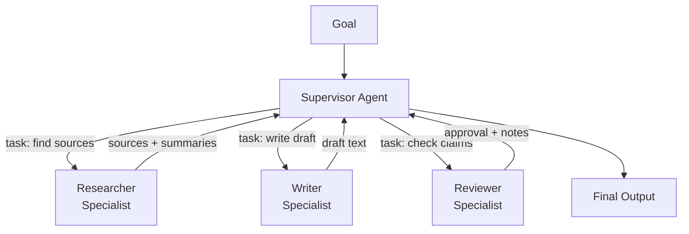

# Multi-Agent: Supervisor, Handoffs, and When It Is Overkill

> One well-designed agent beats five poorly-coordinated ones.

**Type:** Build
**Languages:** Python
**Prerequisites:** 06-orchestrator-workers, 08-tool-use-and-error-recovery
**Time:** ~60 min
**Learning Objectives:**
- Identify the three conditions where multi-agent architecture genuinely earns its complexity
- Distinguish the supervisor-workers pattern from the handoff pattern
- Build a supervisor agent that dispatches to named specialists in raw Python
- Pass context cleanly between agent calls without losing state
- Recognize when to consolidate back to a single agent

---

## MOTTO

Multi-agent is a solution to a specific set of problems. It is not an upgrade.

---

## THE PROBLEM

A team reads about multi-agent systems and gets excited. Their single customer support agent works well: 2-second response time, 87% resolution rate, clear failure modes. They rebuild it as a "network" of five specialized sub-agents: an intent classifier, a knowledge retriever, a policy checker, a response drafter, and a tone reviewer. Each agent is its own LLM call with its own system prompt.

Six weeks later: latency is 8 seconds. Bugs multiply at the handoff points. The policy checker sometimes receives partial context from the knowledge retriever. The tone reviewer occasionally contradicts the response drafter. Resolution rate is down to 79%. The team is debugging five agents instead of one.

Nothing improved. The architecture added overhead without adding capability. The original agent was not hitting a context limit. It was not doing tasks that benefit from verification. It was not doing tasks that could run in parallel. It just worked, and it was made more complicated.

Multi-agent architecture solves real problems. But the real problems are specific. Applying the pattern without those problems is the mistake this lesson prevents.

---

## THE CONCEPT

### When Multi-Agent Earns Its Complexity

There are three conditions where multi-agent architecture genuinely pays off. If none of the three apply, consolidate back to one agent.

**Condition 1: The task exceeds one context window.**
Some tasks are simply too large: process all 300 customer tickets from last week, analyze an entire codebase, synthesize a 50-document research corpus. A single agent cannot hold the full task in one context. Multiple agents can work on chunks in parallel or in sequence, each operating within its context limit.

**Condition 2: Independent verification improves accuracy.**
For high-stakes outputs (medical triage, code going to production, financial calculations), having a second agent verify the first agent's work catches errors the first agent cannot catch in self-review. The verifier needs to be independent: a separate call, not the same context seeing its own output.

**Condition 3: Specialist parallelism genuinely speeds things up.**
If a task has clearly separable sub-tasks that do not depend on each other, running them in parallel with specialists saves wall-clock time. Write the research summary and write the executive briefing simultaneously. The savings only matter if the sequential version would have been too slow.

If your task does not hit one of these three, a single well-prompted agent is cheaper, faster, and easier to debug.

### The Two Patterns

**Supervisor-Workers:** One agent receives the goal and acts as a router. It decides which specialist to call, what task to give them, and synthesizes the results. Specialists do not coordinate with each other; they only talk to the supervisor.

**Handoffs:** Agent A completes its work and passes a context bundle to Agent B. Agent B picks up where Agent A left off. There is no central coordinator; agents are a chain. Works well when tasks are sequential and each step has a clear completion boundary.



The supervisor is not smarter than the specialists. It is narrower: its job is routing and synthesis, not depth.

### Comparing the Approaches

```
                  Single Agent    Supervisor-Workers    Handoffs
------------------------------------------------------------------
Latency           Lowest          Higher (parallel ok)  Higher (sequential)
Cost              Lowest          Higher (N calls)       Higher (N calls)
Failure surface   One model       N models + routing     N models + context pass
Debug complexity  Low             Medium                 Medium-High
Context sharing   Full            Via supervisor         Via handoff bundle
Best for          Most tasks      Fan-out + synthesis    Sequential pipelines

When justified:   Always start    Parallel specialists   Linear multi-step
                  here            or context overflow    with clear boundaries
```

---

## BUILD IT

### Supervisor Pattern in Raw Python

Build a blog post production pipeline: a researcher, a writer, and a reviewer, coordinated by a supervisor.

```python
import json
import anthropic

client = anthropic.Anthropic()
MODEL = "claude-3-5-haiku-20241022"

SUPERVISOR_PROMPT = """You are a production supervisor for a blog post pipeline.
You receive a goal and decide which specialist to dispatch next.
Always respond with valid JSON in this exact format:
{"specialist": "researcher" | "writer" | "reviewer", "task": "<specific task string>", "done": false}
When all specialists have run and output is ready, respond with:
{"specialist": null, "task": null, "done": true}
Current pipeline state is provided in the user message."""

SPECIALIST_PROMPTS = {
    "researcher": "You are a research specialist. Given a topic and task, produce 3-5 factual bullet points with supporting context. Be concise and accurate.",
    "writer": "You are a writing specialist. Given research notes and a task, write a focused blog section (150-200 words). Use the research. Do not invent facts.",
    "reviewer": "You are a review specialist. Given a draft and research notes, output a brief assessment: what is strong, what needs fixing (if anything). Be specific.",
}

def call_specialist(specialist_name: str, task: str, context: dict) -> str:
    system = SPECIALIST_PROMPTS[specialist_name]
    user_content = f"Task: {task}\n\nContext:\n{json.dumps(context, indent=2)}"
    response = client.messages.create(
        model=MODEL,
        max_tokens=600,
        system=system,
        messages=[{"role": "user", "content": user_content}],
    )
    return response.content[0].text

def run_supervisor(goal: str, max_steps: int = 6) -> dict:
    pipeline_state = {
        "goal": goal,
        "completed_steps": [],
        "outputs": {},
    }

    for step in range(max_steps):
        # Supervisor decides next action
        supervisor_input = json.dumps(pipeline_state, indent=2)
        response = client.messages.create(
            model=MODEL,
            max_tokens=200,
            system=SUPERVISOR_PROMPT,
            messages=[{"role": "user", "content": supervisor_input}],
        )

        raw = response.content[0].text.strip()
        # Strip markdown code fences if present
        if raw.startswith("```"):
            raw = raw.split("```")[1]
            if raw.startswith("json"):
                raw = raw[4:]
        try:
            decision = json.loads(raw)
        except json.JSONDecodeError:
            print(f"Supervisor returned invalid JSON at step {step}: {raw}")
            break

        if decision.get("done"):
            print(f"Supervisor: pipeline complete after {step} steps.")
            break

        specialist = decision["specialist"]
        task = decision["task"]
        print(f"Step {step + 1}: dispatching to [{specialist}] - {task[:60]}...")

        # Call the specialist with full context
        output = call_specialist(specialist, task, pipeline_state["outputs"])

        # Update state so next supervisor call sees what was produced
        pipeline_state["outputs"][specialist] = output
        pipeline_state["completed_steps"].append({"specialist": specialist, "task": task})

    return pipeline_state

if __name__ == "__main__":
    goal = "Write a blog post section on why multi-agent AI systems fail in production"
    result = run_supervisor(goal)

    print("\n--- PIPELINE OUTPUTS ---")
    for specialist, output in result["outputs"].items():
        print(f"\n[{specialist.upper()}]:\n{output}")
```

The key design decisions:

**Context is always passed down, never assumed.** Each specialist receives `pipeline_state["outputs"]` so it can see everything previously produced. The researcher's notes are available to the writer. Both are available to the reviewer.

**The supervisor sees state, not transcripts.** The full pipeline state (goal + completed steps + outputs) goes to the supervisor on every call. This is cheaper than sending the full message history and focuses the supervisor on routing decisions.

**The supervisor returns structured JSON.** This makes dispatch deterministic. If the supervisor returns prose, parsing becomes fragile. Enforce structure.

> **Real-world check:** Your team wants to add a fourth specialist: a "fact-checker" that runs after the writer but before the reviewer. What change in the supervisor's logic handles this, and what context does the fact-checker need that the reviewer does not?

The supervisor's routing logic already supports any new specialist: just add the new prompt to `SPECIALIST_PROMPTS` and let the supervisor decide when to call it. The fact-checker needs the researcher's sources and the writer's draft (both in `outputs`). The reviewer needs the draft plus the fact-checker's flags. The pipeline state already passes all prior outputs to every specialist, so no structural change is needed beyond the new system prompt.

---

## USE IT

### The Handoff Pattern

The handoff pattern is sequential rather than hub-and-spoke. Each agent receives a context bundle from the previous agent and produces a context bundle for the next.

```python
from dataclasses import dataclass, field

@dataclass
class HandoffBundle:
    goal: str
    stage: str
    outputs: dict = field(default_factory=dict)
    notes: list = field(default_factory=list)

def researcher_agent(bundle: HandoffBundle) -> HandoffBundle:
    response = client.messages.create(
        model=MODEL,
        max_tokens=600,
        system=SPECIALIST_PROMPTS["researcher"],
        messages=[{"role": "user", "content": f"Goal: {bundle.goal}\nTask: Research this topic thoroughly."}],
    )
    bundle.outputs["research"] = response.content[0].text
    bundle.stage = "researched"
    bundle.notes.append("Researcher: complete")
    return bundle

def writer_agent(bundle: HandoffBundle) -> HandoffBundle:
    response = client.messages.create(
        model=MODEL,
        max_tokens=600,
        system=SPECIALIST_PROMPTS["writer"],
        messages=[{
            "role": "user",
            "content": f"Goal: {bundle.goal}\nResearch:\n{bundle.outputs.get('research', '')}\nTask: Write the blog section.",
        }],
    )
    bundle.outputs["draft"] = response.content[0].text
    bundle.stage = "drafted"
    bundle.notes.append("Writer: complete")
    return bundle

def reviewer_agent(bundle: HandoffBundle) -> HandoffBundle:
    response = client.messages.create(
        model=MODEL,
        max_tokens=300,
        system=SPECIALIST_PROMPTS["reviewer"],
        messages=[{
            "role": "user",
            "content": f"Research:\n{bundle.outputs.get('research', '')}\nDraft:\n{bundle.outputs.get('draft', '')}\nTask: Review the draft.",
        }],
    )
    bundle.outputs["review"] = response.content[0].text
    bundle.stage = "reviewed"
    bundle.notes.append("Reviewer: complete")
    return bundle

def run_handoff_pipeline(goal: str) -> HandoffBundle:
    bundle = HandoffBundle(goal=goal, stage="start")
    bundle = researcher_agent(bundle)
    bundle = writer_agent(bundle)
    bundle = reviewer_agent(bundle)
    return bundle
```

Compare the two approaches:

```
              Supervisor-Workers         Handoffs
-------------------------------------------------------
Routing       Dynamic (supervisor       Fixed (code defines
              decides at runtime)       the sequence)

Flexibility   High: can skip steps,     Low: sequence is
              retry, reorder            hardcoded

Debuggability Trace the supervisor's    Trace the bundle
              JSON decisions            at each stage

Best for      Non-linear workflows      Linear pipelines
              Variable sequences        with clear stages

Failure mode  Supervisor loops or       Context not passed
              dispatches wrong agent    correctly between stages
```

The OpenAI Agents SDK formalizes the handoff pattern: each agent has a defined handoff target and the SDK manages the context passing. LangGraph formalizes the supervisor pattern: the supervisor is a node that routes to specialist nodes, with edges defining valid transitions. Both reduce boilerplate but the underlying patterns are identical to what you built here.

> **Perspective shift:** A colleague proposes using a 6-agent pipeline for a task that currently takes a single agent 3 seconds to complete. What three questions would you ask before agreeing to the redesign?

First: does the task actually hit one of the three justified conditions (context overflow, independent verification, parallel speedup)? Second: what is the expected latency budget, and will 6 LLM calls fit within it? Third: what happens when one agent in the chain fails or returns unexpected output? If your colleague cannot answer all three, the redesign is premature.

---

## SHIP IT

The artifact this lesson produces is a reusable supervisor prompt template and specialist dispatch pattern. See `outputs/skill-multi-agent-supervisor.md`.

The pattern: a supervisor prompt that accepts structured pipeline state as JSON, returns structured routing decisions as JSON, and a specialist dispatch loop that passes cumulative context between calls. Drop this into any pipeline where you have identified one of the three justified conditions for multi-agent architecture.

---

## EVALUATE IT

Multi-agent pipelines have two layers to evaluate: each specialist individually, and the pipeline as a whole.

**Specialist evaluation.** Treat each specialist as a standalone function: fixed input, expected output, scorer. The researcher should produce factual bullet points (check with an LLM judge: "do these claims appear in the source material?"). The writer should produce coherent prose that references the research. The reviewer should produce actionable feedback, not vague praise.

**Pipeline evaluation.** Run the full pipeline on 10 benchmark goals. Measure:
- End-to-end completion rate (did the supervisor reach `done: true`?)
- Step count per run (a well-functioning supervisor should use 3-4 steps, not 6)
- Final output quality (LLM-judged on a rubric: accuracy, completeness, readability)
- Latency (total wall-clock time, which reveals whether parallelism is worth adding)

**Regression signal.** The most important metric is whether the multi-agent pipeline outperforms the equivalent single-agent call on the same task. If it does not, the added complexity is waste. Set a threshold: the pipeline must score at least 10% higher than the single-agent baseline on the output quality rubric to justify the added latency and cost.
